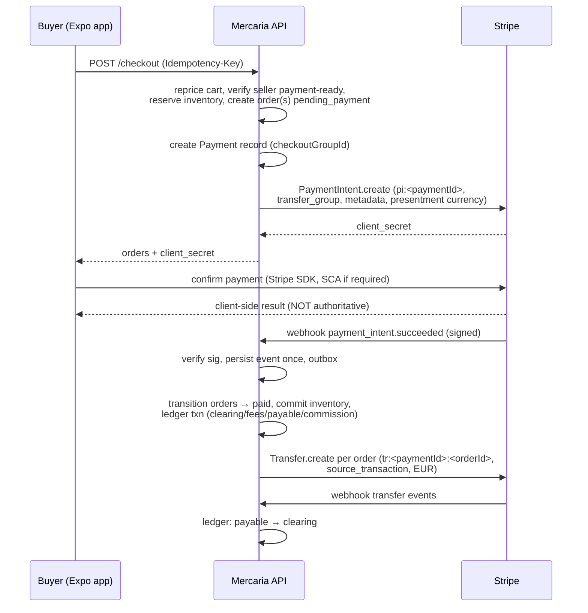

# ADR 0001: Stripe Connect architecture — separate charges and transfers, Mercaria as merchant of record

- **Status:** Accepted
- **Date:** 2026-08-08
- **Issue:** [#43](https://github.com/OxyHQ/Mercaria/issues/43), part of epic [#35](https://github.com/OxyHQ/Mercaria/issues/35)
- **Stripe docs current as of:** 2026-08-08, API release train **Dahlia** (`2026-07-29.dahlia`)

## Context

Mercaria creates **one immutable order per seller** and ties sibling orders of one
cart together with `checkoutGroupId` (`packages/backend/src/services/checkout.service.ts`).
There is no real payment integration: the only path that moves a storefront order
to `paid` today is the dev-only `mockPay` seam (`order.service.ts`, gated by
`config.orders.mockPayEnabled`, off in production), and the only payment
providers in the type system are the literals `'oxy_pay' | 'external'`.

A checkout may span several sellers of two kinds — business **stores** with a
`defaultCurrency`, and **P2P individuals** whose settlement currency is derived
from their listing's native currency. Presentment currency (what the buyer sees)
and shop currency (the seller's settlement basis) are already distinct
(`DualMoney`), and issue #44 removes the remaining mandatory-FAIR settlement.

This ADR decides how that model maps onto Stripe Connect, before any Stripe code
is written. Its decisions bind #44–#50; #51 (Faircoin) is a separate rail that
must coexist behind the same provider interface.

### Stripe facts that force the shape (verified against current docs)

1. **One PaymentIntent cannot fund more than one connected account.**
   `transfer_data.destination` names a single account. Stripe's decision table
   sends multi-vendor carts to *separate charges and transfers*: use it when
   *"You need to transfer funds to multiple connected accounts with a single
   charge. For example, a single cart that contains goods from different
   manufacturers."* ([charges](https://docs.stripe.com/connect/charges),
   [accept-payment](https://docs.stripe.com/connect/marketplace/tasks/accept-payment))
2. Stripe recommends separate charges and transfers *"only when you're
   responsible for negative balances of your connected accounts"* — i.e. it
   forces `controller.losses.payments = application`.
3. Card authorization holds last 2–7 days depending on brand and channel
   ([place-a-hold](https://docs.stripe.com/payments/place-a-hold-on-a-payment-method)).
   A secondhand marketplace whose sellers ship in days cannot ride an
   uncaptured authorization to delivery.
4. Cross-border transfers on the payments balance work only **within**
   {US, CA, UK, EEA, CH}; a 0.25% cross-border payout fee applies, **waived
   inside the EEA and UK↔EEA**
   ([cross-border-payouts](https://docs.stripe.com/connect/cross-border-payouts)).
5. A transfer's currency must match the **charge's balance-transaction
   currency** (the platform settlement currency), and `source_transaction`
   makes the transfer wait for the charge's funds instead of failing on an
   insufficient available balance
   ([separate-charges-and-transfers](https://docs.stripe.com/connect/separate-charges-and-transfers)).
6. Stripe's new-platform guides now default to the **Accounts v2** API, but v2
   cannot manage payout settings and several capabilities remain v1-only, so a
   v2 integration is a two-API integration today
   ([marketplace guide](https://docs.stripe.com/connect/marketplace),
   [migrate-to-controller-properties](https://docs.stripe.com/connect/migrate-to-controller-properties)).

## Decisions

### D1. Merchant of record: Mercaria, in every native flow

Mercaria's platform Stripe account is the merchant of record and settlement
merchant for **all** native payments — business stores and P2P sellers alike.
The buyer's statement shows Mercaria; Mercaria is responsible to the buyer for
refunds and disputes; sellers bear the economic cost through transfer reversals
(D7). We do **not** use `on_behalf_of`: it can name at most one seller (useless
for a mixed cart), and using it forfeits cross-border payout eligibility.

P2P individual sellers cannot reasonably act as settlement merchants; making
responsibility uniform keeps one legal story for the whole marketplace.

### D2. Connected accounts: Accounts v1 + controller properties, Express-shaped

Every payment-eligible seller (store or P2P) gets one connected account created
with explicit **controller properties** (never legacy `type`):

```
controller.losses.payments        = application   # required by D3 (see fact 2)
controller.fees.payer             = application   # Mercaria pays Stripe fees, priced into its commission
controller.requirement_collection = stripe        # Stripe owns KYC collection; Mercaria never stores identity documents
controller.stripe_dashboard.type  = express       # sellers get the Stripe Express dashboard for payouts/statements
capabilities                      = transfers     # the only capability separate charges and transfers requires
```

- `stripe_dashboard.type` is **immutable** — changing it means a new account.
  Express is chosen so sellers self-serve payout details and statements without
  Mercaria building an embedded dashboard at launch.
- `card_payments` is **not** requested: connected accounts never charge cards
  themselves under this model. Requesting it would also couple both
  capabilities' disablement.
- Onboarding uses **Stripe-hosted Account Links** (`type=account_onboarding`,
  `collection_options[fields]=eventually_due` so requirements are collected up
  front and payouts are not interrupted later). Account Links are single-use,
  expire in minutes, and must never be sent over email/chat; the `refresh_url`
  handler mints a fresh link. A `return_url` redirect proves **nothing** — only
  `account.updated` events and reconciliation reads do (issue #46).
  With `requirement_collection=stripe`, `account_update` links are unavailable;
  post-onboarding changes go through the Express dashboard.
- Hosted onboarding is **browser-only** (no embedded webviews): the Expo apps
  must open it in the system browser.
- Accounts **v1** with controller properties, not Accounts v2, despite the new
  default in Stripe's guides (fact 6): v1 is fully supported, the controller
  model is the same, and it avoids straddling two account APIs for payout
  settings. Revisit when v2 reaches parity.

### D3. Charge model: separate charges and transfers, exclusively

No destination charges, no mixed model. The flow for every native checkout:

1. One **PaymentIntent on the platform account** for the whole checkout group
   (D4), `transfer_group = checkoutGroupId`, automatic capture.
2. After the charge succeeds (verified by webhook, never by client callback),
   **one Transfer per seller order**, carrying the same `transfer_group` and
   `source_transaction = <charge id>`, denominated in the platform settlement
   currency (fact 5).
3. Mercaria's commission is **not** an `application_fee_amount` (that mechanism
   does not exist for separate charges); it is the difference between the
   charge and the sum of transfers. The internal ledger (#45) is therefore the
   **sole source of commission truth** — Stripe's `/v1/application_fees`
   reporting is deliberately given up. This is the real cost of multi-seller
   support and it is why the balanced ledger lands before Stripe does.

**Capture is immediate** (fact 3). Escrow-like protection is achieved, if ever,
by **delaying transfers** (funds held on the platform balance), not by delayed
capture. Any such hold must respect fund-holding limits (90 days in most
countries, including all of the EEA). At launch, transfers are created as soon
as the charge's success event is processed — no hold.

**Launch payment methods: cards and card-based wallets (Apple Pay, Google Pay)
only.** Asynchronous methods (SEPA Debit, ACH) are excluded because they can
fail after `source_transaction` transfers were requested, and unlike
destination charges nothing auto-reverses. Adding them later requires gating
transfer creation on `charge.succeeded` of the settled charge.

### D4. One charge per checkout group

A multi-seller checkout creates **one PaymentIntent** covering the group's
grand total in the buyer's presentment currency. Single-seller checkout is the
N=1 case of the same path — there is no second code path.

**Atomicity boundary:** funding is atomic at the group level. Either the whole
group's PaymentIntent succeeds — and every sibling order transitions to `paid`
— or none does. Sibling orders **cannot** have different funding outcomes.
Divergence between siblings begins only after funding: per-order refunds,
cancellations, disputes and transfer reversals (D7) act on one order without
touching its siblings (each order has its own transfer).

If a seller group loses payment eligibility between cart and checkout, the
checkout **refuses that group before any reservation** (the buyer can deselect
it via the existing `sellerKeys` partial-checkout mechanism). If eligibility is
lost after funding but before the transfer executes, the transfer is withheld
and the order enters the operator exception path (#50) — resolved by refund or
by transfer once the account recovers. This is Mercaria's controlled analog of
Stripe's "skipped transfer" behavior on destination charges.

### D5. Who pays what

| Cost | Borne by | Mechanism |
|---|---|---|
| Stripe processing fees | Mercaria | `fees.payer=application`; priced into the commission |
| Currency conversion on charge (presentment → platform settlement) | Mercaria | priced into the commission |
| Currency conversion on transfer/payout (platform → seller settlement) | Seller | Stripe converts at transfer; disclosed in seller terms |
| Refund principal | Seller | transfer reversal per order (D7) |
| Refund of Mercaria's commission share | Mercaria (policy: commission on refunded amount is returned) | ledger movement; no Stripe object involved |
| Dispute amount + dispute fee | Seller (principal), Mercaria (fee, priced into commission) | platform balance is debited; recovered by transfer reversal |
| Negative balances of connected accounts | Mercaria | `losses.payments=application`; mitigated by `debit_negative_balances=true` and Stripe's connected reserves |
| Cross-border payout fee (0.25%, non-EEA) | Seller | disclosed in seller terms |

### D6. Revenue recognition and payable timing

- Mercaria's **commission is recognized** when the charge's success event is
  processed (ledger: commission revenue account), computed per seller order
  from the fee schedule snapshot (#88 will own the schedule; until then the
  rate is a config constant snapshotted onto the order).
- A **merchant receivable becomes payable** when its order is funded
  (ledger: merchant-payable account, per order, in platform settlement
  currency at the captured conversion rate). It is **settled** when the
  Transfer is created — from then on the money is on the seller's Stripe
  balance and payout timing is between the seller and Stripe (Express
  dashboard). Stripe payout failures surface as lifecycle records (#49) but do
  not reopen the receivable.

### D7. Refunds, disputes, reversals, failed payouts

- **Refunds** (partial or full) act on **one seller order**: a Stripe Refund on
  the group's charge for that order's amount share, paired with a **transfer
  reversal** on that order's transfer for the proportional seller-side amount.
  The existing refund domain (per-line quantities, no-double-restock,
  `refunds:write`) stays authoritative for *what* is refundable; Stripe records
  the money movement. A reversal can fail if the seller's balance is
  insufficient and no reserve covers it — that failure enters the operator
  exception path; the buyer refund is **not** blocked on it (Mercaria eats the
  gap and recovers via `debit_negative_balances` / future transfers).
- **Cross-currency asymmetry is expected:** Stripe refunds convert at the
  refund-time rate and the original conversion fee is not returned. The ledger
  records the refund legs at their own captured amounts — never derived from
  the charge legs.
- **Disputes** debit the platform balance (amount + fee). The affected order's
  transfer is reversed to recover the principal from the seller. A lost
  dispute stays a seller-side loss; a won dispute reverses the recovery.
  Dispute lifecycle records link order → dispute → ledger entries (#49).
  Provider disputes are **not** CrowdSource moderation and never touch it.
- **Failed payouts** are between the seller and Stripe (Express), but Mercaria
  ingests `payout.failed` (Connect-scope webhook) to show payout health in the
  dashboard and to correlate seller support requests (#49, #50).

### D8. Currencies and countries at launch

- **Presentment / charge currencies:** EUR and USD. The charge is created in
  the buyer's presentment currency; Stripe converts non-EUR charges into the
  platform settlement currency at charge time.
- **Platform settlement currency: EUR** (platform account country: **Spain** —
  operational assumption, confirm the legal entity before live mode).
- **Transfers are denominated in EUR** (fact 5). A seller order whose shop
  currency is not EUR has its net converted **once**, at charge-success
  processing time, with a captured `FxRateSnapshot` (provider, rate, asOf) —
  #44's rate-snapshot contract. Stripe then converts EUR → the seller's
  settlement currency at transfer/payout per its published rates.
- **Seller countries:** EEA at launch (Spain first). The eligible-country list
  is configuration, constrained by the {US, CA, UK, EEA, CH} transfer-region
  rule; onboarding refuses countries outside the configured set.
- **Minimum charge amounts** are enforced by Stripe against the **settlement**
  currency after conversion (0.50 EUR equivalent); checkout surfaces this as a
  product constraint, not a Stripe error.
- **FAIR is not routable through Stripe.** A FAIR-denominated listing is
  purchasable only through an explicitly eligible rail (#51); catalog/display
  FAIR values are unaffected (#44).

### D9. P2P sellers vs business stores

Same connected-account shape, same charge model, different framing:

| | Store | P2P seller |
|---|---|---|
| Stripe `business_type` | `company` (or `individual` for sole traders — Stripe collects it) | `individual` |
| Provider-account owner (#46) | `ownerType: 'store'`, store id | `ownerType: 'user'`, Oxy user id |
| Who may onboard | store member with `store:manage` | the seller themself |
| Readiness gate | per store | per seller profile |
| Settlement basis (shop currency) | `Store.defaultCurrency` | listing's native currency |

Payment readiness (account exists ∧ `charges_enabled` irrelevant here ∧
`payouts_enabled` ∧ `transfers` capability `active` ∧ no `past_due`
requirements) gates **checkout group construction** — an unready seller's
group is refused at checkout, and new native orders stop immediately when
readiness is lost (D4). Catalog visibility is **not** gated by payment
readiness; external-connector stores keep working without any Stripe account.

### D10. Taxes, invoices, receipts, reporting

- Sellers remain responsible for their own tax obligations. The existing
  `TaxRate`-per-jurisdiction engine keeps computing order tax lines; Stripe
  Tax is **not** adopted at launch.
- The buyer receives Stripe's receipt for the charge (Mercaria-branded, as
  MoR) plus Mercaria's own order confirmation.
- Mercaria's commission invoices to sellers (a legal requirement in the EU)
  are a **follow-up product surface**; the ledger provides the amounts. Until
  it ships, commission totals are visible in the seller dashboard.
- Regulatory reporting tied to payments (e.g. DAC7 marketplace reporting in
  the EU) is Mercaria's obligation as platform; the provider-account record
  plus order/ledger history must be sufficient to produce it. Stripe's KYC
  data stays in Stripe (`requirement_collection=stripe`).

### D11. Idempotency mapping

One table, from the existing checkout inward. Stripe idempotency keys are
always derived from **Mercaria durable ids**, never from request-scoped
randomness:

| Layer | Key | Where |
|---|---|---|
| Checkout | `Idempotency-Key` header → Redis claim + per-order `idempotencyKey = <key>:<sellerKey>` (existing) | `checkout.service.ts` |
| Payment record (#45) | one per checkout group; unique on `checkoutGroupId` for native payments | payment domain |
| PaymentIntent create | Stripe idempotency key `pi:<paymentId>`; `metadata: {checkoutGroupId, paymentId, orderIds}` | provider adapter |
| Transfer create | Stripe idempotency key `tr:<paymentId>:<orderId>`; `transfer_group = checkoutGroupId`; `metadata: {orderId, paymentId}` | provider adapter |
| Refund create | Stripe idempotency key `re:<refundId>` | provider adapter |
| Transfer reversal | Stripe idempotency key `trr:<refundId>:<orderId>` (disputes: `trr:dispute:<disputeId>:<orderId>`) | provider adapter |
| Webhook events | unique on `(stripeAccountId, eventId)`, persisted before processing (#48) | event store |

Stripe object ids (`pi_…`, `py_…`, `tr_…`, `re_…`) are stored on Mercaria
records but are **never** Mercaria primary keys (#45 invariant).

### D12. Payments outside Mercaria

Orders imported from Shopify/WooCommerce keep `payment.provider: 'external'`
and never enter the Stripe flow. In the #45 domain they become explicit
external payment records: visible, linked to their order, carrying the source
platform's amounts verbatim, and producing **no cash ledger entries** (no
Mercaria money moved). Nothing in this ADR changes connector import.

## Ledger representability (gate for #45)

Every money movement above maps to balanced entries — accounts named per #45
(buyer funds/clearing, provider clearing, merchant payable, commission
revenue, processor expense, refunds, disputes, reserves):

| Event | Debit | Credit |
|---|---|---|
| Charge succeeded (gross G, Stripe fee F, commission C, per-order net Nᵢ) | provider clearing (G−F), processor expense (F) | merchant payable (ΣNᵢ, per order), commission revenue (C) |
| Transfer created (order i) | merchant payable (Nᵢ) | provider clearing (Nᵢ) |
| Refund (order i, amount R, commission share c) | merchant payable ↺ via reversal (R−c), commission revenue (c) | provider clearing (R) |
| Transfer reversal received | provider clearing | merchant payable |
| Dispute created (amount D, fee f) | disputes (D), processor expense (f) | provider clearing (D+f) |
| Dispute won | provider clearing | disputes |
| External order | *(no entries — memo only)* | |

Cross-currency movements always pass through a captured rate snapshot and book
both legs in their own currencies; the ledger balances **per currency** (#45).

## Sequence diagrams

### 1. Single-seller native checkout (N=1 of the group path)



### 2. Multi-seller native checkout

```mermaid
sequenceDiagram
    participant B as Buyer
    participant API as Mercaria API
    participant S as Stripe
    B->>API: POST /checkout (sellerKeys ⊆ cart)
    API->>API: group by seller; refuse any group not payment-ready
    API->>API: reserve ALL groups (all-or-nothing),<br/>create one order per seller + one Payment record
    API->>S: ONE PaymentIntent.create (group grand total,<br/>transfer_group = checkoutGroupId)
    S-->>B: (via API) client_secret — buyer authorizes ONCE
    S->>API: payment_intent.succeeded
    API->>API: ALL sibling orders → paid atomically w.r.t. funding;<br/>one balanced ledger txn, per-order payable lines
    loop per seller order i
        API->>S: Transfer.create (Nᵢ, source_transaction, tr:<paymentId>:<orderIdᵢ>)
    end
    Note over API,S: a failed/withheld transfer is an operator exception —<br/>it never un-pays the order or blocks siblings
```

### 3. Authorization and delayed capture — **not selected**

Immediate capture is decided in D3: card authorization windows (2–7 days) are
shorter than realistic secondhand fulfilment, and holds-until-shipment would
make every slow seller a silent payment failure. Escrow semantics, if ever
wanted, will be built as **delayed transfers** on the platform balance, which
needs no new Stripe objects and respects the 90-day EEA holding limit. No
diagram: the flow does not exist in this architecture.

### 4. Partial refund

```mermaid
sequenceDiagram
    participant M as Merchant (dashboard)
    participant API as Mercaria API
    participant S as Stripe
    M->>API: POST …/orders/:id/refunds (refunds:write, idempotencyKey)
    API->>API: validate per-line quantities (existing refund domain),<br/>create Refund record + provider operation (pending)
    API->>S: Refund.create on group charge (re:<refundId>, amount share)
    API->>S: Transfer.reversal on order's transfer (trr:<refundId>:<orderId>)
    S->>API: webhook charge.refund.updated / transfer reversal
    API->>API: mark refund succeeded, restock lines (once),<br/>order → partially_refunded, ledger entries
    Note over API,S: reversal failure (insufficient seller balance) →<br/>operator exception; buyer refund NOT blocked
```

### 5. Dispute and transfer reversal

```mermaid
sequenceDiagram
    participant S as Stripe
    participant API as Mercaria API
    participant Op as Operator
    S->>API: webhook charge.dispute.created (platform debited: amount+fee)
    API->>API: dispute lifecycle record, link order via metadata,<br/>ledger: disputes / processor expense
    API->>Op: alert with correlation ids (#50)
    Op->>S: submit evidence (Stripe dashboard)
    S->>API: webhook charge.dispute.closed (won | lost)
    alt won
        API->>API: ledger: reverse dispute entries<br/>(seller's transfer was never touched)
    else lost
        API->>S: Transfer.reversal on affected order (recover principal from seller)
        API->>API: loss stays seller-side; order refunded state per outcome
    end
```

*Corrected 2026-08-08 during #49: recovery runs on `lost`, not at dispute
open. Reversing at open would take a seller's money for a dispute they may
win, and re-transferring on a win is a second transfer for an order —
forbidden by `UNIQUE(transfers.payment_id, order_id)`, the constraint that
stops a settlement retry from paying twice. D7's liability assignment is
unchanged; only the timing moved.*

### 6. Seller loses readiness after prior activation

```mermaid
sequenceDiagram
    participant S as Stripe
    participant API as Mercaria API
    participant Sel as Seller (dashboard)
    participant B as Buyer
    S->>API: webhook account.updated (Connect scope:<br/>requirements.past_due ≠ ∅, payouts_enabled=false)
    API->>API: provider-account record → restricted;<br/>readiness revoked (CAS on account version)
    B->>API: POST /checkout including that seller
    API-->>B: group refused — seller not payment-ready<br/>(deselectable via sellerKeys)
    Sel->>API: GET payment status → action required + reasons (safe subset)
    Sel->>API: POST resume-onboarding
    API->>S: AccountLink.create (account_onboarding, refresh/return URLs)
    Sel->>S: completes requirements (hosted, system browser)
    S->>API: account.updated (requirements clear)
    API->>API: readiness restored; periodic reconciliation (#50)<br/>converges if any webhook was missed
```

## Operational requirements

### Stripe configuration

- **API version pinned in code** (SDK constant, not env): `2026-07-29.dahlia`.
  Webhook endpoints are created with the same explicit version; upgrades are a
  deliberate PR that re-verifies event fixtures (#48), never an account-default
  drift.
- **Two webhook endpoints** (#48):
  - *Platform scope* (`connect=false`): `payment_intent.succeeded`,
    `payment_intent.payment_failed`, `payment_intent.processing`,
    `payment_intent.canceled`, `charge.succeeded`, `charge.updated`,
    `charge.refunded`, `charge.refund.updated`, `charge.dispute.created`,
    `charge.dispute.updated`, `charge.dispute.closed`, `transfer.created`,
    `transfer.updated`, `transfer.reversed`.
  - *Connect scope* (`connect=true`): `account.updated`,
    `account.application.deauthorized`, `account.external_account.updated`,
    `payout.paid`, `payout.failed`.
  - Both verify signatures over the **raw body** (mounted before
    `express.json()`, same invariant as the CrowdSource webhook) and **filter
    on `livemode`** — production URLs receive test events too.
- **Platform payout schedule:** manual or delayed on the platform account, so
  automatic payouts cannot race transfers (mitigated anyway by
  `source_transaction`, but defense in depth).
- **Connected account defaults:** `debit_negative_balances = true`.

### Environment (names final; validation follows the `CROWDSOURCE_ENABLED` pattern — a half-configured integration stays OFF and logs once at boot)

```
STRIPE_ENABLED=false
STRIPE_SECRET_KEY=                       # platform secret key (sk_test_/sk_live_)
STRIPE_WEBHOOK_SECRET=                   # platform-scope endpoint
STRIPE_WEBHOOK_SECRET_PREVIOUS=          # rotation window
STRIPE_CONNECT_WEBHOOK_SECRET=           # connect-scope endpoint
STRIPE_CONNECT_WEBHOOK_SECRET_PREVIOUS=  # rotation window
STRIPE_SELLER_COUNTRIES=ES,…             # allow-list within {US,CA,UK,EEA,CH}
EXPO_PUBLIC_STRIPE_PUBLISHABLE_KEY=      # per app, client side
```

`STRIPE_ENABLED=true` requires the secret key **and both** webhook secrets.
There is no `STRIPE_ACCOUNT_ID`-style variable: the platform account is implied
by the key, and connected-account ids live only in provider-account records.

### Security, compliance, failure-mode owners

| Concern | Owner | Mechanism |
|---|---|---|
| Card data | Stripe | Stripe SDK / Payment Element only; card data never touches Mercaria servers or logs (PCI SAQ-A) |
| Seller KYC data | Stripe | `requirement_collection=stripe`, hosted onboarding; Mercaria stores only summarized requirement state |
| Webhook authenticity | Backend (#48) | raw-body signature verification, dual-secret rotation, livemode filter, `(account, eventId)` dedupe |
| Client-asserted payment state | Backend | forbidden — order `paid` only from verified events; client callbacks are UX-only |
| Account takeover of onboarding | Backend (#46) | ownership + `store:manage` checks before AccountLink creation; one owner ↔ one account; links never leave the app |
| Negative balances / fraud loss | Mercaria ops | `losses.payments=application`, reserves policy, `debit_negative_balances`, reconciliation alerts (#50) |
| Secrets | Infra | GitHub repo secrets → SSM `/oxy/mercaria/*` (existing pipeline); never placeholders |
| Discrepancy detection | Backend + ops (#50) | reconciliation jobs vs Stripe state, balanced-ledger invariant, dead-letter replay |

## Consequences

- The internal ledger (#45) is **load-bearing from day one** — it is the only
  place commissions exist. It must land before any Stripe charge is created.
- Giving up `application_fee_amount` reporting is accepted; Sigma/Dashboard
  fee reports are unavailable and all financial reporting is Mercaria-side.
- One PaymentIntent per group means one statement line and one SCA challenge
  for the buyer — and a single refund surface (the group charge) that every
  per-order refund draws from. The per-order share math lives in Mercaria and
  is snapshotted, never recomputed from live data.
- `losses.payments=application` puts real credit risk on Mercaria. The
  mitigations are readiness gating (D9), reserves, `debit_negative_balances`,
  and reconciliation — and they are why #46/#48/#50 are not optional polish.
- Everything provider-specific stays behind the #45 `PaymentProvider`
  interface; #51's Faircoin adapter plugs into the same seams (group-level
  payment, per-order settlement records) without Stripe leaking into the
  domain.

## Open items (tracked, not blocking)

1. Confirm the platform legal entity and Stripe account country (assumed
   Spain/EUR) before live mode.
2. The two cross-border doc statements (destination charges requiring
   `on_behalf_of` cross-region vs cross-border payouts supporting flows
   without it) don't constrain this architecture (we use neither), but
   re-verify the transfer-region rule for any non-EEA seller cohort before
   enabling it (`STRIPE_SELLER_COUNTRIES`).
3. Stripe's *funds segregation* preview (protected holds before transfer)
   would simplify delayed-transfer escrow if it ships — watch, don't build on.
4. Commission invoicing to sellers (EU requirement) — follow-up product issue.
