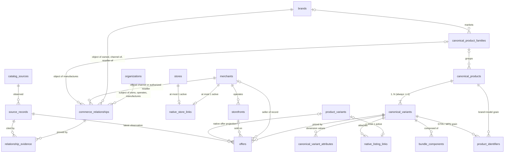

# ADR 0002: Canonical commerce graph — entities, identities and relationship boundaries

- **Status:** Accepted
- **Date:** 2026-08-09
- **Issue:** [#52](https://github.com/OxyHQ/Mercaria/issues/52), part of epic [#36](https://github.com/OxyHQ/Mercaria/issues/36)
- **Binds:** #53–#61, and the external-catalog epic issues (#62–#69) where they touch these tables

## Context

Mercaria's catalogue today is **listing-first**: a `listings` row is a seller's
own item, its identity is the seller's identity, and "brand" is the free-text
`listings.vendor` column. That model cannot answer the questions epic #36 exists
to answer — *which product is this listing an instance of, who sells it
elsewhere and for how much, which store is actually Apple* — because it has no
entity for a product independent of a seller, no entity for a seller independent
of a Mercaria account, and no way to state a verified relationship at all.

This ADR defines the canonical commerce graph before any of it is implemented.
It decides entity boundaries, identity rules, PostgreSQL table shapes, the
provenance model, the migration path, and the protocol under which #53–#58 can
be built by parallel agents without colliding.

The persistence baseline is fixed and non-negotiable: **PostgreSQL is
Mercaria's only runtime database, and Drizzle schemas plus generated migrations
own relational persistence** (`packages/backend/src/db/schema/`, conventions in
`db/schema/CONVENTIONS.md`). MongoDB/Mongoose was removed from the runtime
(PR #136) and the production database dropped on 2026-08-08. Nothing in this
ADR proposes Mongo as a store, a compatibility layer or a migration target, and
nothing may reintroduce it.

The constraints the current system imposes, verified against the schema:

1. `listings`, `product_variants`, `stores`, `orders` are **live tables with
   production data**. `order_items.listing_id` / `variant_id` are already
   deliberate no-FK historical snapshots (`db/schema/orders.ts`); placed orders
   are immutable and stay that way.
2. Connector provenance already exists at the listing grain
   (`listings.source_*`, `listing_external_refs`, `connections` in
   `db/schema/connectors.ts`). The graph's provenance model must compose with
   it, not duplicate it.
3. Every buyer/seller/`oxy_user_id` is a **foreign service's primary key**
   (Oxy owns identity) and carries no FK — the `deferredForeignKeys.ts`
   ledgers classify every such column, and `schema-conventions.test.ts` fails
   an unclassified one.
4. Migrations are generated by `bun run db:generate` (drizzle-kit) into
   `packages/backend/drizzle/` with a shared `meta/_journal.json` and
   cumulative `meta/NNNN_snapshot.json` chain, applied ONLY by
   `src/db/migrate.ts` with a mandatory `-- oxy:deploy-phase=pre|post` marker
   per file. This mechanism is what the parallel-agent protocol (D25) is
   grounded in.

What each downstream issue takes from here: #53 organizations/brands with
aliases and provenance; #54 merchants/storefronts with native `Store` linkage;
#55 verified relationships with evidence; #56 the product identity hierarchy
and identifiers; #57 the unified offer model; #58 deterministic matching with
explainable confidence; #59 review/merge/split/correction tooling; #60 the
flag-gated native backfill; #61 the query benchmark that decides indexing,
denormalization and projection boundaries. None of them may invent a schema or
cardinality decision that belongs in this document; if one is missing, this
ADR is amended first.

## Entity glossary

Names are refined from the issue where a refinement removes a real confusion;
the semantic distinctions are preserved exactly.

| Issue entity | Table(s) | DTO (`@mercaria/shared-types`) | One-line meaning |
|---|---|---|---|
| Organization | `organizations` | `Organization` | A legal/operating entity that can own brands, operate merchants and manufacture — Apple Inc., Amazon.com Inc. |
| Brand | `brands` | `Brand` | A consumer-facing mark products are marketed under — Apple, Nike. Never a seller, never a legal entity. |
| BrandRelationship | `commerce_relationships` | `CommerceRelationship` | A typed, temporal, evidence-backed fact between graph entities (owns, operates, official channel, authorized reseller, manufactures). Renamed: the same shape carries merchant- and manufacturing-scoped kinds, so "Brand" was too narrow. |
| Merchant | `merchants` | `Merchant` | A commercial actor that sells — the canonical seller identity, native or external, claimed or discovered. |
| Storefront | `storefronts` | `Storefront` | One named sales channel a merchant operates — a domain, a country site, a marketplace presence. |
| NativeStoreLink | `native_store_links` | `NativeStoreLink` | The verified 1:1 join between a canonical `Merchant` and a native `stores` row. |
| ProductFamily | `canonical_product_families` | `ProductFamily` | A brand's product line grouping comparable products — iPhone, Galaxy S. |
| Product | `canonical_products` | `CanonicalProduct` | A specific model as marketed and compared — iPhone 16 Pro. Prefixed `canonical_` in SQL and the DTO because the native tables already use the bare word (`product_variants` belongs to `listings`). |
| CanonicalVariant | `canonical_variants` | `CanonicalVariant` | One exact purchasable configuration — the grain a GTIN identifies and an offer prices. |
| ProductIdentifier | `product_identifiers` | `ProductIdentifier` | One externally minted identifier (GTIN family, MPN, brand+model) bound to a canonical product or variant, with status and correction history. |
| Alias | `<entity>_aliases` (one table per canonical entity type, one shared shape) | `CanonicalAlias` | An alternate or historical name that resolves to a canonical entity — search input, never identity. |
| Offer | `offers` | `Offer` | One seller/channel offering one exact canonical variant under specific commercial terms at a point in time. |
| NativeListingLink | `native_listing_links` | `NativeListingLink` | The attachment of one native `product_variants` row to one canonical variant. |
| SourceRecord | `catalog_sources` + `source_records` | `CatalogSource`, `SourceRecord` | The registry of places facts come from, and one observed external object from one of them (payload, hash, observation time). |
| RelationshipEvidence | `relationship_evidence` | `RelationshipEvidence` | One piece of proof attached to a relationship — the only path to `verified`. |

Supporting tables bound here so nobody re-derives them:
`canonical_variant_attributes` (dimension name/value pairs),
`bundle_components` (bundle variant → component variants),
`<entity>_source_links` (source record → canonical entity, per entity type),
`catalog_revisions` (the append-only merge/split/correction ledger, #59).

Two pre-existing DTOs are **not** these entities and must not be conflated:
`ProductSummary` and `MerchantSummary` in `shared-types/src/product.ts` are
home-feed card projections of native listings and stores. #70–#73 will re-home
them; until then they keep their names and nothing imports them as canonical
types.

> **Amendment, 2026-08-16 (#36/#38).** The re-homing above was performed.
> `MerchantSummary` is now **`StoreSummary`** and `toMerchantSummary` is
> `toStoreSummary`; `ProductSummary` keeps its name. The replacement is not
> written anywhere above, so it was derived from this glossary: the `Merchant`
> row reserves the bare word for the canonical seller identity, D4 names the
> native side "the existing native `Store`", and the `Product` row states the
> tie-break — the side that does NOT own the bare word is the side that moves.
> For products that was the canonical side (`CanonicalProduct`), which is why
> `ProductSummary` is already unambiguous; for merchants the canonical side
> holds `Merchant`, so the native store card moved instead. The decision above
> is unchanged; only the pending action it named is now done.
>
> The WIRE contract was deliberately left alone: `MerchantFeedSection` still
> discriminates on `kind: 'merchants'` with a `merchants` field, because shipped
> clients read those strings while a type name is compile-time only.

## The graph at a glance



`stores` and `product_variants` in the diagram are the **existing native
tables** — the graph attaches to them, never absorbs them. Every canonical
entity additionally has its `<entity>_aliases` and `<entity>_source_links`
child tables (omitted above for legibility; one shared column shape, D16/D19).

Cardinalities in words:

- Organization —< Brand: **via relationship rows only** (M:N over time; at most
  one *current verified* owner per brand, enforced by a partial unique).
- Brand —< ProductFamily: 0..1 brand per family (nullable FK; a generic family
  has none). Family —< Product: 0..1 family per product. Product —<
  CanonicalVariant: **1..N, never 0** (D13). Variant —< Offer: 0..N.
- Merchant —< Storefront: 1..N (a storefront cannot exist without its
  merchant). Merchant ↔ native Store: ≤1 active link on each side.
- Native `product_variants` ↔ CanonicalVariant: ≤1 active link per native
  variant; a canonical variant collects many native variants.
- SourceRecord —< canonical entities: only through `<entity>_source_links` /
  evidence / offers — never by a canonical row owning a source id (D19).

## Decisions — identity boundaries

Each of the twelve is a boundary implementation agents must not blur. Each
carries a worked example and what it forbids.

### D1. Organization versus brand

An **organization** is the accountable actor: it can own, operate, manufacture,
be verified against a legal register. A **brand** is a mark: products are
marketed under it, and it can change hands. They are separate tables because
the relationship is many-to-many **over time** — acquisitions move brands
between organizations without either side changing identity.

*Worked example:* Apple Inc. is an `organizations` row. Apple is a `brands`
row. The connection is one `commerce_relationships` row of kind
`organization_owns_brand`, verified with evidence (D17). When Unilever enters
the graph it is ONE organization row owning dozens of brand rows; when a brand
is sold, the old ownership row gets `valid_to` stamped and a new row opens —
neither the organization nor the brand row is edited.

*Forbids:* a `company` column on `brands`; a single "company/brand" table;
inferring the owning organization from name equality between an organization
and a brand ("Apple" the brand does not imply "Apple Inc." without an evidence
row).

### D2. Brand versus product family

A **brand** never contains products directly. A **product family** is the line
under a brand that groups comparable products for navigation and comparison —
the thing a shopper means by "iPhone" when they have not yet chosen a model.

*Worked example:* brand Apple markets families iPhone, iPad, MacBook. Family
iPhone groups products iPhone 16, iPhone 16 Pro, iPhone 16 Pro Max. "iPhone" is
never a `brands` row, and brand pages (#72) navigate brand → family → product,
never brand → product.

*Forbids:* treating a product line as a brand; hanging products off `brands`
with no family; fabricating a family for a generic product (a family-less
product carries `family_id NULL` — honest absence, not an invented container).

### D3. Merchant versus storefront

A **merchant** is the commercial actor — one identity however many channels it
sells through. A **storefront** is one named channel that merchant operates: a
domain, a country site, a marketplace presence. Offers are made *by* a merchant
*on* a storefront (D8).

*Worked example:* Apple Store is ONE `merchants` row. Apple Store Spain
(`apple.com/es`), Apple Store France and Apple's Amazon presence are three
`storefronts` rows, all `merchant_id` → Apple Store. Prices differ per
storefront; the seller is the same actor.

*Forbids:* minting a new merchant per country site; storing territory on the
merchant (it belongs to the storefront and to relationship scope); a storefront
without a merchant (`storefronts.merchant_id` is NOT NULL).

### D4. Merchant/storefront versus the existing native `Store`

The native `stores` table stays exactly what it is: the **operational** seller
account — members, permissions, inventory, connectors, payments. `merchants` is
the **canonical identity** layer above it. The two meet ONLY through
`native_store_links`, at most one active link on each side, so one real-world
seller resolves to one merchant whether encountered natively or externally
(#84's requirement, stated here as cardinality).

*Worked example:* Mercaria Store X (a native `stores` row) is claimed by the
company that also runs `example-shop.com` (a discovered external merchant).
After #83's verification, both resolve to ONE `merchants` row: the native store
via its `native_store_links` row, the external channel as a `storefronts` row
of the same merchant. Store X keeps its members, its Stripe account and its
listings untouched.

*Forbids:* adding canonical-graph columns to `stores`; giving `merchants`
operational behaviour (permissions, payouts, inventory); two merchant rows for
one claimed seller; deleting or rewriting a `stores` row because a merchant
appeared.

### D5. Canonical product versus canonical variant

A **product** is the model as marketed and compared. A **variant** is one exact
purchasable configuration — the grain a GTIN identifies, an offer prices, and a
buyer receives. Comparison happens at the product page; commerce happens at the
variant.

*Worked example:* iPhone 16 Pro is a `canonical_products` row. iPhone 16 Pro
256 GB Black Titanium (EU model) is a `canonical_variants` row with attribute
rows `storage=256GB`, `color=Black Titanium`, `region=EU` and its own GTIN.
"iPhone 16 Pro from 1,199 €" is a product-level aggregate over variant-level
offers.

*Forbids:* offers or GTINs attached at the product grain; variants that differ
only in seller (that is an offer, not a variant); products with zero variants
(D13).

### D6. Canonical product/variant versus native `Listing`

A **listing** is one seller's own sellable item: their price, their photos,
their stock, their words. A **canonical product/variant** is the shared
identity many listings can point at. The pointer is `native_listing_links`, at
the native-variant grain, and it is an *attachment*, never a migration: the
listing remains the operational record and the seller's property.

*Worked example:* forty P2P listings of used iPhone 16 Pro 256 GB and three
store listings of the new one all link to the SAME `canonical_variants` row.
Each keeps its own price, condition, photos and inventory. The product page
(#71) aggregates them as offers; deleting the canonical link never touches the
listing.

*Forbids:* merging listings into canonical rows; canonical rows holding stock
or a price of their own; **converting an external offer into a native
`listings` row because Mercaria knows about it** (the issue's explicit
prohibition — an external product exists in Mercaria only as canonical entities
plus offers, never as a listing nobody authored).

### D7. Canonical variant versus merchant offer

A **variant** is *what*; an **offer** is *who sells it, where, for how much,
right now*: one seller/channel × one exact canonical variant × commercial terms
× a point in time. Everything commercial and volatile (price, availability,
condition, URL) is offer state, never variant state.

*Worked example:* one variant, four offers: Apple Store Spain 1,199 € in stock
(external, official); Amazon 1,149 € (external); Seller Y on Amazon 1,120 €
(marketplace, D8); a P2P seller's used one at 780 € (native). Same variant row,
four `offers` rows with four sellers and four prices.

*Forbids:* price or availability columns on `canonical_variants`; one offer row
shared by two sellers; an offer pointing at a product instead of a variant.

### D8. Seller-of-record versus marketplace/platform

Every offer names its **seller of record** (`offers.merchant_id`) and the
**channel** it is sold on (`offers.storefront_id`). A *marketplace* offer is an
offer whose storefront is operated by a DIFFERENT merchant than its seller of
record. That fact is **derived from the two foreign keys, never stored** — a
stored `is_marketplace` flag would be a second representation of one fact, and
two representations can disagree (the same reasoning that keeps a `direction`
column out of the ledger).

*Worked example:* Amazon first-party: merchant Amazon Retail, storefront
`amazon.es` (operated by Amazon Retail) — operator = seller, a direct offer.
Seller Y: merchant Seller Y, storefront `amazon.es` — operator ≠ seller, a
marketplace offer, and Seller Y is the seller of record for warranty and
comparison labels (#74).

*Forbids:* an `is_marketplace` column; attributing a marketplace offer to the
platform merchant; a marketplace "seller" modelled as a storefront of the
platform.

### D9. Discovered external merchant versus claimed/verified merchant

A merchant discovered from a source is a **full graph citizen** — offers
attach, pages render (#73) — but it is *unclaimed*: nobody may act as it and it
gets no native checkout. Claiming (#83) moves ONE stored verdict,
`merchants.claim_state ∈ {unclaimed, claim_pending, claimed}`, following the
payments precedent that a gate reads one stored verdict rather than re-deriving
a conjunction (`provider_accounts.onboarding_state`). There is deliberately no
`is_verified` boolean beside it.

*Worked example:* the crawler/feed discovers `example-shop.com` → an unclaimed
`merchants` row with source links. Its owner claims it via domain verification
(#83): `claim_state` becomes `claimed`, `claimed_by_oxy_user_id` records who,
and a `native_store_links` row (D4) may then join it to their native store
(#84). Nothing about its offers changes.

*Forbids:* claiming by name similarity; unclaimed merchants receiving native
checkout or asserting relationships (D17 authority matrix); a second boolean
that can disagree with `claim_state`.

### D10. Official store/channel relationship versus ordinary reseller

Selling a brand's products requires **no relationship at all** — an ordinary
reseller is simply a merchant with offers, and absence of a relationship row is
the normal state. `merchant_official_channel_for_brand` and
`merchant_authorized_reseller_for_brand` are *positive, evidence-verified
claims* that surface as badges and navigation (#72, #74). **Official/authorized
status is NEVER inferred from name or domain matching** — a merchant named
"Apple Store Madrid" with domain `apple-store-madrid.example` gets nothing; a
name/domain similarity may at most create an `asserted` row routed to #59
review.

*Worked example:* Apple Store — official direct channel for Apple (evidence:
control of `apple.com` proven via #83's domain mechanism plus the operator's
verification). MediaMarkt — authorized reseller (evidence: the brand's
published authorized-reseller list, URL + content hash in the evidence row).
RandomShop sells iPhones with no relationship row: its offers appear, labelled
as neither.

*Forbids:* verification without at least one `relationship_evidence` row
(service-enforced and test-pinned, D17); badges derived from name/domain
equality; treating "no relationship" as a violation.

### D11. Manufacturer relationship versus brand ownership

`organization_manufactures` (scoped to a product family) and
`organization_owns_brand` are different kinds with different subjects of proof,
and neither implies the other.

*Worked example:* Foxconn manufactures iPhones: a `commerce_relationships` row
kind `organization_manufactures` from organization Foxconn to family iPhone.
Foxconn owns no Apple brand and no such ownership row exists. Conversely Apple
Inc. owns the brand whether or not it manufactures anything.

*Forbids:* deriving ownership from manufacturing or vice versa; a
`manufacturer` column on products (it is a relationship with evidence and
temporal scope, not an attribute).

### D12. Historical alias/identifier versus canonical identity

The canonical row is the identity; everything else that ever named it is a
pointer. Aliases (former names, localized names, common misspellings) resolve
*to* an entity and are search input, never identity. After a merge, the losing
row survives as a tombstone (`status='merged'`, `merged_into_id`) and its slug
is never reused; a retired identifier keeps its row with a non-active status.
Resolution follows `merged_into_id` — flattened on write so chains do not grow
(D16).

*Worked example:* two brand rows "Rayban" and "Ray-Ban" are merged by #59.
"Ray-Ban" wins; "Rayban" becomes a tombstone pointing at it, its aliases and
source links are repointed, and an alias row `former_name: "Rayban"` is minted
so search still finds it. An old URL `/brands/rayban` answers with the winner.

*Forbids:* deleting merged rows; reusing a merged row's slug; resolving an
alias to more than one entity; identifiers edited in place (corrections append,
D14).

## The merchant-and-storefront identity table

The issue's scenario table, with the explicit representation of each row —
including the marketplace-only generic product and the native Mercaria store:

| Real-world thing | Canonical representation |
|---|---|
| Apple Inc. | One `organizations` row. |
| Apple | One `brands` row + a verified `commerce_relationships` row `organization_owns_brand` (Apple Inc. → Apple) with evidence. |
| Apple Store | One `merchants` row + verified relationships `organization_operates_merchant` (Apple Inc. → Apple Store) and `merchant_official_channel_for_brand` (Apple Store → Apple). |
| Apple Store Spain | One `storefronts` row (`merchant_id` = Apple Store, territory `ES`, domain `apple.com/es`). A channel, never a second merchant. |
| Amazon | THREE rows for three roles, none inferred from the others: `organizations` "Amazon.com, Inc."; `merchants` "Amazon" (the first-party seller of record); `storefronts` `amazon.es` (operated by merchant Amazon). Marketplace-ness is not a property of any of them — it is derived per offer (D8). |
| Seller Y on Amazon | Its own `merchants` row (discovered, `claim_state='unclaimed'`), whose offers carry `merchant_id` = Seller Y and `storefront_id` = `amazon.es`. Seller of record ≠ storefront operator IS the marketplace fact. |
| Mercaria Store X | The existing native `stores` row, untouched, + one `merchants` row + one verified `native_store_links` row joining them. Its listings' variants attach to canonical variants via `native_listing_links`, and its sales appear as **native** offers. |
| A marketplace-only generic product (unbranded USB-C cable) | One `canonical_products` row with `family_id NULL` (and therefore no brand) + exactly one default `canonical_variants` row. Offers attach normally. No brand or family is fabricated. |
| A P2P seller | **No merchant row.** Their listing's native offer derives its seller from the listing's owner (`ownerType='user'`). Merchants exist for commercial actors, not for every account that sells a used phone. |

## Decisions — product identity

### D13. Hierarchy and cardinality: ProductFamily → Product → CanonicalVariant

- `canonical_product_families.brand_id` → `brands`, **nullable** (generic
  families and orphaned lines exist honestly).
- `canonical_products.family_id` → `canonical_product_families`, **nullable**
  (a one-off product needs no line).
- `canonical_variants.product_id` → `canonical_products`, **NOT NULL**.
- **Every product has at least one variant, always.** A product with no
  meaningful variants gets exactly ONE default variant (zero attribute rows) —
  mirroring the native catalogue's `'Default Title'` variant pattern
  (`db/schema/catalog.ts`). This gives the whole system ONE attachment grain:
  offers, GTINs and native links always target a `canonical_variants` row,
  and no code path ever branches on "product without variants". The ≥1
  invariant is enforced by the write service (creation mints product + default
  variant in one transaction) and pinned by test — a CHECK cannot express a
  cross-table existence rule.

*Forbids:* offers/identifiers/links attached at product or family grain; a
second attachment code path for simple products; auto-minting families.

### D14. Identifiers: schemes, normalization, grain, collisions, corrections

One table, `product_identifiers`, one row per identifier assertion:

- **Grain:** `product_id` and `variant_id` are both nullable FKs with a CHECK
  that exactly one is set. The scheme decides the legal grain: the GTIN family
  and MPN bind to a **variant** (each identifies an exact trade item /
  manufacturer part); `brand_model` binds to a **product**.
- **Schemes:** `scheme` records what was observed — `gtin8`, `upc` (GTIN-12),
  `ean` (GTIN-13), `gtin14`, `isbn10`, `isbn13`, `mpn`, `brand_model`. The
  whole GTIN family (ISBNs included — an ISBN-13 *is* an EAN in the 978/979
  range) is additionally normalized into `canonical_scheme='gtin'` +
  `canonical_value` (zero-padded GTIN-14 digits, check digit validated;
  ISBN-10 converted to ISBN-13 first). `raw_value` is stored verbatim beside
  the normalization, so a correction can always see what the source actually
  said.
- **Uniqueness is the collision gate:** a partial unique index on
  `(canonical_scheme, canonical_value) WHERE status = 'active'` — one ACTIVE
  canonical owner per GTIN. MPN and brand_model get **no** database
  uniqueness: MPNs collide across brands legitimately, and brand agreement is
  a cross-table fact the matcher (#58) checks, not a constraint.
- **Collisions:** when ingestion asserts a GTIN whose active row points at a
  different variant, the incoming assertion is written `status='disputed'`
  and routed to #59 review. **The newcomer never steals the identifier**, and
  nothing auto-resolves a dispute.
- **Corrections append, never edit:** fixing a wrong identifier retires the
  old row (`status='corrected'`, revision entry in `catalog_revisions`) and
  inserts a new one. `raw_value`/`canonical_value` are immutable after insert.
- **Merchant SKUs and marketplace ids (ASIN etc.) are NOT product
  identifiers.** A SKU is source-scoped — it identifies a row in one
  merchant's system, not a product in the world — and lives on offers and
  `source_records`, never in this table. An ASIN is Amazon's key and stays on
  the source record. This is a hard rule: `product_identifiers` holds only
  identifiers whose scope is the world (GS1, ISBN agencies) or the brand
  (MPN, brand+model).

### D15. Variant dimensions, no-variant products, bundles, multipacks, regional models

- **Dimensions** are open-set per category, so they are child rows —
  `canonical_variant_attributes {variant_id, dimension, value, position}`,
  the same shape as the native `product_variant_option_values`. Bound
  dimension names for the launch set: `size`, `color`, `storage`,
  `pack_count`, `region` (#94 owns the full normalized attribute/unit
  taxonomy; until it lands, dimensions are free text normalized lowercase).
- **No-variant products:** one default variant, zero attribute rows (D13).
- **Multipacks** are variants of the SAME product with a `pack_count`
  dimension and their **own GTIN** (a 6-pack has a different GTIN than the
  single — reality already models this correctly; follow it).
- **Bundles** (heterogeneous: console + game) are their own
  `canonical_products` row whose variant carries `bundle_components` rows
  `{bundle_variant_id, component_variant_id, quantity}`. A bundle is a
  product because it is bought, priced and identified (often with its own
  GTIN) as one thing; components are recorded so #96-style comparison can
  decompose it. Component FKs are RESTRICT — a variant referenced by a bundle
  cannot vanish.
- **Regional models:** a spec-differing regional model (dual-SIM China
  iPhone) is a **distinct variant** with a `region` dimension and its own
  identifiers. A pure renaming across regions (same trade item, different
  marketing name) is ONE product/variant plus a localized **alias** — the
  discriminator is whether the trade item differs, i.e. whether GS1 minted a
  different GTIN.

### D16. Aliases, merges, redirects, and how history is represented

- **Aliases:** one table per canonical entity type
  (`organization_aliases`, `brand_aliases`, `merchant_aliases`,
  `storefront_aliases`, `canonical_product_family_aliases`,
  `canonical_product_aliases`), all built from ONE `aliasColumns()` helper in
  `db/schema/canonicalSupport.ts` (the `money()`/`dualMoney()` precedent:
  state the shape once). Columns: `alias`, `normalized_alias`
  (`GENERATED ALWAYS AS (lower(btrim(alias))) STORED` — both functions are
  IMMUTABLE), `kind ∈ {name_variant, former_name, localized_name,
  marketing_name, misspelling}`, `language` (nullable BCP-47),
  `source_record_id` (nullable FK), `created_by_oxy_user_id` (no FK,
  ledgered). Unique on `(entity_id, normalized_alias)`; trigram GIN on
  `normalized_alias` (D21). Per-entity tables rather than one polymorphic
  table so every alias row has a REAL foreign key and each issue owns its own
  files (D25) — the same reasoning that split the alias search from a
  `jsonb` blob.
- **Merges:** an operator merge (only #59's tooling performs one) is a single
  transaction: repoint the loser's children (aliases, source links,
  identifiers, offers, native links, relationship endpoints) to the winner;
  stamp the loser `status='merged'`, `merged_into_id = winner`; mint a
  `former_name` alias from the loser's name; write one `catalog_revisions`
  row. `merged_into_id` always points at the FINAL winner — on merging into
  an already-merged row, the chain is flattened at write time, so resolution
  is one hop. Re-running a merge is a no-op (the loser is already `merged`).
- **Splits** are the inverse shape (#59): a new entity is minted, the
  children an operator selects are repointed, and the revision row records
  which went where.
- **History is `catalog_revisions`**, append-only:
  `{id, entity_type, entity_id, action ∈ {create, update, merge, split,
  correct, verify, revoke, redirect}, actor_kind ∈ {operator, ingestion,
  backfill}, actor_oxy_user_id?, source_record_id?, before jsonb, after
  jsonb, note, created_at}`. `entity_id` deliberately has **no FK** (it spans
  entity types and must survive tombstones) and is registered in the
  permanent no-FK ledger with this reason. The `before`/`after` snapshots are
  legitimately `jsonb`: a revision is source-shaped by nature — it must
  capture whatever the entity looked like, including fields a later schema
  removed.
- **Manual corrections never destroy source history:** an operator override
  updates the canonical field, records the change in `catalog_revisions`, and
  adds the field name to the entity's `pinned_fields text[]` — the
  `listings.overriddenFields` precedent — which ingestion respects on every
  subsequent apply. The source records that asserted the old value remain
  untouched and queryable.

## Decisions — relationships and evidence

### D17. One relationship shape, evidence-gated verification, explicit authority

`commerce_relationships` is ONE table with typed kinds and real foreign keys:

- **Endpoints** are four nullable FK columns — `organization_id`, `brand_id`,
  `merchant_id`, `product_family_id` — with a per-kind CHECK on exactly which
  pair is set (the `orders` pattern: nullable FK columns + CHECK, chosen over
  a polymorphic `{type, id}` pair precisely because every endpoint's key
  space lives in THIS database, so real FKs are available; contrast
  `provider_accounts`, whose polymorphic owner is half Oxy-owned).
- **Kinds** (closed set, `text` + CHECK from one tuple):
  `organization_owns_brand`, `organization_operates_merchant`,
  `organization_manufactures` (org → product family),
  `merchant_official_channel_for_brand`,
  `merchant_authorized_reseller_for_brand`. Structural facts are NOT kinds:
  *storefront belongs to merchant* is `storefronts.merchant_id`, *brand
  markets family* is `canonical_product_families.brand_id`, *native store
  represents merchant* is `native_store_links` — containment is an FK,
  assertable/temporal facts are relationship rows.
- **Directionality** is fixed per kind (subject → object as named above);
  there are no inverse rows — the inverse reading is a query, so the two
  directions cannot disagree.
- **Market/territory scope:** `territories text[]` of ISO 3166-1 alpha-2
  codes, `'{}'` meaning worldwide, element-CHECKed by containment.
- **Temporal validity:** `valid_from timestamptz NOT NULL`, `valid_to`
  nullable (NULL = current). At most one OPEN row per (kind, endpoint pair):
  partial unique WHERE `valid_to IS NULL`. History is closed rows. An
  exclusion constraint over `tstzrange` is deliberately NOT used: corrections
  legitimately backdate ranges, and #59's tooling validates overlaps with
  context a constraint cannot have.
- **Verification status** is one stored verdict:
  `status ∈ {asserted, verified, rejected, revoked}`. Nothing re-derives it
  and no boolean sits beside it. **`verified` requires at least one
  `relationship_evidence` row** — enforced in the verification service and
  pinned by a test (cross-table requiredness is not expressible as a CHECK;
  stating where the enforcement lives is part of the decision). Name/domain
  similarity can produce `asserted`, never `verified` (D10).
- **Evidence** rows: `{id, relationship_id FK, kind ∈ {domain_control,
  platform_verification, legal_register, brand_statement, operator_attestation,
  source_document}, url?, oxy_file_id? (no FK — Oxy owns files), sha256?,
  source_record_id? FK, collected_by_oxy_user_id? (no FK), collected_at,
  note}`. A `brand_statement` (e.g. a published authorized-reseller list)
  carries the URL AND the content hash, so the claim survives the page
  changing.
- **Confidence:** `confidence double precision` CHECK 0–1, **NULL for
  deterministic or human assertions** — a number appears only on imported /
  machine-matched rows, and #58 defines how it is computed and explained.
  Confidence never substitutes for evidence: a 0.99 row is still `asserted`.
- **Who may assert/change** (the authority matrix):

  | Actor | May |
  |---|---|
  | Ingestion (any `catalog_sources` row) | create `asserted` rows and links with confidence and provenance; never touch `verified` |
  | A claimed merchant (D9) | assert facts about ITSELF — its storefronts, its aliases; request verification with evidence; never self-verify, never assert for a brand or another merchant |
  | Deterministic platform verification (#83 domain control) | auto-verify the merchant claim it proves, writing its own evidence row |
  | Catalog operator (`CATALOG_OPERATOR_OXY_USER_IDS`, the interim allow-list following `PAYMENT_OPERATOR_OXY_USER_IDS`) | verify / reject / revoke with evidence; merge / split / correct via #59 |

- **Revocation/correction history:** a revocation stamps `status='revoked'` +
  `valid_to`, keeps every evidence row, and writes a `catalog_revisions`
  entry; a correction closes the old row and opens a new one linked by
  `superseded_by_id` (self-FK). Rows are never deleted and never edited into
  a different meaning.

*Forbids:* verified-by-similarity; a `ready`/`is_official` boolean beside
`status`; evidence stored as a jsonb blob (each proof is a typed row);
deleting relationship or evidence rows.

## Decisions — offers

### D18. One offer meaning, one comparison model, no pretended checkout parity

The canonical meaning (from the issue, binding): **an offer is one
seller/channel offering one exact canonical variant under specific commercial
terms at a point in time.**

- **Attachment:** `offers.canonical_variant_id` NOT NULL — always the variant
  grain (D13).
- **Kinds** (stored, closed set): `native`, `external`, `affiliate`,
  `informational`. The issue's six cases map: a *native listing offer* is
  `native`; an *external retailer offer* is `external` with storefront
  operator = seller; a *marketplace seller offer* is `external`/`affiliate`
  with operator ≠ seller (**derived, never stored** — D8); an *informational
  unavailable offer* is `informational` (no purchase path at all); an
  *affiliate/referral destination* is `affiliate` (outbound via #67's
  redirect with attribution); the *future `mercaria_retail` supplier-backed
  offer* has its semantics reserved here — Mercaria as seller of record,
  native checkout, supplier-fulfilled — and its enum value arrives with epic
  #116's own migration, exactly as the `stripe` provider id landed with the
  code that could write it, not in advance.
- **Per-kind shape (CHECKed):**
  - `native` ⇒ `product_variant_id` NOT NULL, `merchant_id`, `storefront_id`,
    `source_record_id`, `url` all NULL. The seller is derived from the
    listing's owner through the native variant — a P2P user or a store —
    which is what lets P2P sellers exist without merchant rows (D9).
  - `external` ⇒ `merchant_id`, `source_record_id`, `url` NOT NULL;
    `product_variant_id` NULL. `affiliate` ⇒ the same, with the URL being
    the affiliate destination. `informational` ⇒ `merchant_id`,
    `source_record_id` NOT NULL; `url` NULL — a recorded price point with no
    way to buy.
- **The shared comparison model** is the column set every kind fills:
  canonical variant, seller identity, `price` (a single native-currency
  `Money` pair — nullable as a pair for `informational` unknowns),
  `availability ∈ {in_stock, out_of_stock, preorder, unavailable, unknown}`,
  `condition` (the existing `ListingCondition` values plus `unknown`; #90
  widens this with its own migration), `observed_at`, `stale_at`. That is
  what #71's product page and #74's ranking read, uniformly.
- **Checkout semantics are structural, not a flag.** Only `native` offers
  reach checkout, because only they join to a native `product_variants` row —
  and cart/checkout continue to operate on `product_variants` directly,
  unchanged. External/affiliate offers expose only an outbound URL;
  `informational` exposes nothing. There is no `checkoutable` column to
  drift, and **no code path creates a `listings` row from an offer** (D6).
- **Offer currency is the documented CHECK exception #3.** External platforms
  report currencies outside `ALL_CURRENCY_CODES` (Mercaria's presentment
  set), so `offers.price_currency` carries a shape CHECK
  (`~ '^[A-Z]{3,4}$'`) but NOT the tuple CHECK — the
  `connections.shop_currency` / `provider_accounts.default_currency`
  precedent, named in the convention gate's `EXEMPT` set. Display of an
  unconvertible currency shows the native amount verbatim; `FxContext` fails
  closed rather than guessing.
- **Native offers are a projection, and the authority is the variant.** The
  native offer row duplicates the native variant's price for the comparison
  surface, maintained by the same `catalog-write` chokepoint that already
  maintains `syncListingFacets` — a stale native offer can mis-display but
  can never mis-charge, because checkout never reads offers.
- **Uniqueness of ACTIVE offers:** for `native`, partial unique on
  `(product_variant_id)` WHERE kind='native' AND status='active'. For the
  rest, one active offer per `(canonical_variant_id, merchant_id,
  storefront_id, condition)` with NULLS-NOT-DISTINCT semantics, implemented
  as paired partial unique indexes (storefront NULL / NOT NULL).
- **Lifecycle:** `status ∈ {active, retired}` plus `stale_at`. "Stale" is
  `active AND stale_at < now()` — derived, not a third status that could
  disagree. Refresh/expiry sweeps and catalog-health operations belong to
  #68; price HISTORY is #78's own table — `offers` holds current state only.

*Forbids:* converting external offers to listings; storing marketplace-ness;
provider/marketplace object ids as Mercaria keys (they live on
`source_records`); offers priced at product grain; a checkout path that reads
anything but native `product_variants`.

## Decisions — provenance

### D19. SourceRecord, and how sources reference canonical entities without circular ownership

Two tables:

- **`catalog_sources`** — the registry of places facts come from:
  `{id, kind ∈ {connector, feed, marketplace_api, affiliate_network,
  operator, backfill}, name, connection_id? FK → connections (when the source
  IS an existing connector connection), may_display boolean NOT NULL,
  may_store boolean NOT NULL, attribution_required boolean NOT NULL,
  rights_note}`. Rights live at the source grain because they are properties
  of the agreement with the source, not of one observation. **Operator entry
  and the backfill are themselves sources**, so provenance is uniform: every
  imported or minted fact traces to a `catalog_sources` row, with no "no
  source" special case.
- **`source_records`** — one observed external object:
  `{id, source_id FK NOT NULL RESTRICT, external_type ∈ {product, offer,
  merchant, brand, category, relationship}, external_id, observed_at NOT
  NULL, stale_at?, content_hash NOT NULL (sha256 of the normalized payload),
  payload jsonb}`. Unique on `(source_id, external_type, external_id,
  content_hash)` — a re-delivery of identical content converges to a no-op
  (`ON CONFLICT DO NOTHING`), changed content is a NEW row, and the sequence
  of rows IS the observation history. `payload` is the canonical legitimate
  `jsonb`: it is source-shaped by definition, and projecting it into columns
  would drop whatever the source adds next (the
  `moderation_outboxes.payload` reasoning). It is stored under the source's
  `may_store` right and redaction rules #62 defines.

**The link direction is the anti-circularity rule:** source records reference
canonical entities **only through link tables downstream of both** —
`<entity>_source_links {entity_id FK CASCADE, source_record_id FK RESTRICT,
method ∈ {deterministic_identifier, connector_declared, operator, heuristic},
match_rule (the explainable rule id #58 defines), confidence? (0–1, NULL for
deterministic/human), status ∈ {active, superseded, rejected},
decided_by_oxy_user_id?, created_at}` — one link table per canonical entity
type, one shared `sourceLinkColumns()` helper (the alias-table pattern, D16).
Canonical rows own NOTHING about sources — no `source_record_id` column on
`brands` or `canonical_products` — and source records own nothing about
canonical entities. Either side can be written, merged or superseded without
touching the other; the link row is where matching decisions live, get
confidence, and get reviewed (#59). (`offers.source_record_id` is not an
ownership exception: an offer IS the canonicalized form of one source fact,
so it carries its latest observation directly, like `listings.source_*`
already does at the native grain.)

The eight provenance questions, answered by columns just named: *which source*
(`source_records.source_id`), *which record* (the `source_records` row and its
`external_id`), *when observed* (`observed_at`), *when stale*
(`stale_at`, swept by #68), *what transformation/matching*
(`<entity>_source_links.method` + `match_rule`), *what confidence or
deterministic evidence* (`confidence`, NULL meaning deterministic/human; or a
`relationship_evidence` row), *what display/storage rights*
(`catalog_sources.may_display` / `may_store` / `attribution_required`),
*operator corrected?* (`catalog_revisions` + `pinned_fields`, D16 — with
source history intact).

## Decisions — PostgreSQL modeling

### D20. Table boundaries, primary keys, foreign keys, deletion, uniques, temporal storage, JSONB

- **Primary keys:** `generatedId()` from `@oxyhq/db` (uuid v7 text,
  application-generated) on every table, per `CONVENTIONS.md`. **No provider,
  marketplace or source id is ever a Mercaria primary key** — external keys
  are plain indexed columns on `source_records` (the payments invariant,
  applied to the catalogue).
- **Normalized tables + explicit FKs** for every queried, constrained or
  audited relationship — every FK named in this ADR is a real
  `.references()` with an explicit `ON DELETE`. The global deletion rule:
  **canonical graph rows are never hard-deleted by production flows** —
  retirement and merge are status transitions (D12/D16) — so FKs *within* the
  graph are `RESTRICT`, and `CASCADE` is reserved for pure child annotations
  that are meaningless without their parent (aliases, attributes, source
  links, bundle attribute rows). Audit rows (`relationship_evidence`,
  `catalog_revisions`) are RESTRICT even though they are children: evidence
  must be able to block a delete, not vanish with it. The two deliberate
  CASCADEs from the native side: `native_listing_links.product_variant_id`
  and `offers.product_variant_id` cascade from `product_variants`, because a
  seller deleting their listing is an existing, legitimate flow that must not
  be blocked by the graph — the canonical variant and its other offers are
  untouched, and order history never referenced offers at all.
- **Unique / partial unique constraints**, the load-bearing set: entity
  `slug` unique per table (never reused — tombstones keep theirs);
  `(canonical_scheme, canonical_value) WHERE status='active'` on
  `product_identifiers` (D14); ≤1 active `native_store_links` per store AND
  per merchant (paired partial uniques, D4); ≤1 active `native_listing_links`
  per native variant (D6); the active-offer uniques (D18); ≤1 OPEN
  relationship row per (kind, endpoints) and ≤1 current VERIFIED
  `organization_owns_brand` per brand (D17); `(entity_id, normalized_alias)`
  per alias table (D16); the `source_records` content-hash unique (D19).
  Sparse-unique columns follow the standing rule: **written NULL, never
  `''`**.
- **Temporal relationship/evidence storage** is `valid_from`/`valid_to`
  `timestamptz` pairs with the partial-unique-open-row rule (D17) — plain
  columns, not ranges, because every read is either "current" (an indexable
  `valid_to IS NULL`) or "as of" (a btree range scan), and `@oxyhq/db`'s
  `timestamptz()` keeps the `mode: 'date'` / millisecond-truncation
  conventions.
- **JSONB boundary:** exactly three jsonb columns in the whole graph, each
  earning its place in the CONVENTIONS register: `source_records.payload`
  (source-shaped by definition), `catalog_revisions.before`/`after`
  (must capture shapes later schemas removed). **Queried identity and
  relationship facts are never jsonb** — identifiers, territories,
  dimensions, evidence and rights are all real columns or child tables, per
  the issue's baseline rule 5.
- **Closed value sets** are `text({ enum })` + an explicit CHECK rendered
  from the same shared-types tuple (`checkOneOf`) — never a pg enum, and
  never a bare `text({ enum })`, which emits no DDL. New tuples
  (`RELATIONSHIP_KINDS`, `OFFER_KINDS`, `IDENTIFIER_SCHEMES`,
  `CLAIM_STATES`, …) live in `@mercaria/shared-types` and are imported by
  the schema, like `ALL_LISTING_STATUSES`.
- **Foreign-service id columns** (`claimed_by_oxy_user_id`,
  `collected_by_oxy_user_id`, `decided_by_oxy_user_id`,
  `created_by_oxy_user_id`, `catalog_revisions.entity_id` and
  `.actor_oxy_user_id`) carry no FK and each issue registers its own in the
  `deferredForeignKeys.ts` ledgers, where the convention gate requires them.
- **Protected columns:** none — the graph holds public commercial facts. If a
  source's contract ever makes a payload confidential, that lands in the
  registry with its own decision, not silently.

### D21. Search and indexing: Postgres first, benchmarked before anything external

- **`pg_trgm` joins `postgis` in `migrate.ts`'s `REQUIRED_EXTENSIONS`** — an
  extension precondition of the migrator, not a numbered migration, so
  renumbering cannot break it. Unlike PostGIS, `pg_trgm` is a *trusted*
  extension, so the application role can create it without the RDS master
  user; the runbook note is one line, not a provisioning step.
- **Names:** every canonical entity's `name` gets a generated
  `search_vector tsvector` using the **`'simple'` configuration** — proper
  nouns must not be English-stemmed ("Nike" is not a verb) — with a GIN
  index; listing prose keeps its existing `'english'` vector untouched. The
  two-argument literal-config form is mandatory (the one-argument form is
  STABLE and refused in a generated column).
- **Aliases:** trigram GIN (`gin_trgm_ops`) on the generated
  `normalized_alias` (D16) for typo-tolerant lookup; identifier lookup is an
  exact btree on `(canonical_scheme, canonical_value)`. Fuzzy name search
  UNIONs the entity's own name against its alias table — a generated column
  cannot read another table, so the vector never pretends to include aliases.
- **Accent folding:** `unaccent()` is STABLE (dictionary-dependent) and
  cannot sit in a generated column. If #61's benchmarks show accent-blind
  search matters for Spanish-market names, the fix is a narrowed IMMUTABLE
  wrapper function — the `mercaria_immutable_array_to_string` precedent —
  not a volatility assertion.
- **No external search engine, no denormalized search projection, in
  #53–#60.** #61 benchmarks the real queries (product page assembly, brand
  page, offer comparison, fuzzy name/alias search, identifier lookup) against
  realistic row counts and DECIDES: which composite indexes, which
  denormalized projections (if any), and whether any external engine earns a
  proposal. Until #61 reports numbers, adding a search dependency is
  forbidden — the issue's baseline rule 6, made binding.

### D22. Transactional and idempotent graph writes and ingestion

- **One source observation applies in one `db.transaction`:** upsert the
  `source_records` row (content-hash `ON CONFLICT DO NOTHING` — the
  idempotency claim, in the moderation-event pattern where the empty
  RETURNING set IS the "already applied" answer), then entity upserts, link
  writes and revision rows in the same transaction. A replayed delivery, a
  retried job or a re-run backfill batch converges to a genuine no-op — no
  tuple churn, no `updated_at` movement — which is the property the
  moderation outbox's `ON CONFLICT (id) DO NOTHING` gate already pins, and
  the same realdb test shape applies here.
- **Deterministic convergence keys, not deterministic uuids:** re-runs
  converge on the natural uniques named in D20 (content hash, active-link
  partial uniques, identifier uniqueness, slug), so the backfill and
  ingestion are re-runnable without minting duplicates. Where a service must
  "claim" work, it uses the established lease shape
  (`FOR UPDATE SKIP LOCKED` with an owner check) — #62's ingestion loop
  inherits it from the moderation/payment outboxes rather than inventing a
  scheduler.
- **Operator mutations (merge/split/verify/correct) are single
  transactions** writing the entity change and its `catalog_revisions` row
  together, idempotent by status guard (a re-issued merge sees
  `status='merged'` and no-ops).
- **Conditional writes stay one statement** (`UPDATE … WHERE id = $1 AND
  status = $2 RETURNING`), per the CONVENTIONS concurrency rules — claim
  state and relationship status transitions are CAS-shaped exactly like the
  order status machine.

## Decisions — migration and rollout

### D23. Staged migration and backfill (binds #60)

Production has live PostgreSQL data; no phase assumes a zero-data destructive
cut, and any such shortcut must be re-verified at implementation time, not
assumed from this document.

1. **Phase 0 — tables land** (#53–#57): additive `pre` migrations only.
   Nothing reads or writes the graph; every current listing-first read is
   byte-identical. This phase is complete when the schema batch is merged and
   migrated, with zero rows.
2. **Phase 1 — deterministic backfill** (#60, flag-gated loop, re-runnable):
   every active native `stores` row mints a merchant + a `native_store_links`
   row (`verified` — the store owner's authenticated ownership IS the
   evidence, recorded as such); `listings.vendor` strings become **brand
   candidates routed to #59 review, never auto-minted brands**; native
   variants with a `barcode` that GTIN-validates get identifier-matched to
   canonical variants deterministically; unmatched STORE listings mint
   provisional canonical products/variants (`status='provisional'`, a
   backfill source link); unmatched P2P listings stay unattached — they
   continue to be served listing-first, and #58's matcher plus #59 review
   attach them over time. **Ambiguity is routed to #59, never guessed** —
   the deterministic rule set is: exact GTIN, exact
   `(connection, external_id)` connector identity, nothing else.
3. **Phase 2 — native offers materialize** (#60): attached native variants
   get their `native` offer projection rows, maintained thereafter by the
   `catalog-write` chokepoint (D18).
4. **Phase 3 — shadow reads** (#60/#70/#71): canonical read paths run behind
   flags in `shadow` mode — compute both answers, serve the legacy one, log
   divergence — producing the measured-parity evidence, not an assertion of
   it.
5. **Phase 4 — cutover per surface**: flags to `on` surface by surface, each
   revertible by flag alone because Phase 0–3 removed nothing.
6. **Orders, refunds and payments are untouched at every phase.**
   `order_items.listing_id`/`variant_id` remain the no-FK historical
   snapshots they already are; no backfill writes to any order, refund,
   payment or ledger table, and placed-order snapshots stay immutable. The
   graph adds NOTHING to `orders` — an order references what was bought via
   its existing snapshot, and canonical attribution of historical orders is
   a read-time join through `native_listing_links`, never a write.

### D24. Feature flags, rollback, and legacy retirement

- Environment (names final; the `CROWDSOURCE_ENABLED` validation pattern — a
  half-configured integration stays off and logs once at boot):

  ```
  CANONICAL_GRAPH_ENABLED=false     # gates the backfill/materialization LOOPS — never the tables
  CANONICAL_READS=off               # off | shadow | on — the read-mode vocabulary (#60/#70 add per-surface overrides)
  CATALOG_OPERATOR_OXY_USER_IDS=    # interim operator allow-list for #59 tooling (payments precedent; empty = tooling not mounted)
  ```

  Gate the loop, never the durable record: rows written while a flag is off
  stay valid when it turns on.
- **Rollback is a flag flip**, at every phase, because every migration in
  this epic is additive (`pre`) and no legacy read path is removed while any
  flag exists. There is deliberately no "down migration" story: the tables
  are cheap to leave and expensive to drop wrongly.
- **Legacy catalog fields (`listings.vendor`, `listings.product_type`
  free-text, and the feed DTOs' `brand: string`) are retired only after
  measured parity** — Phase 3's divergence logs at agreed thresholds, per
  surface — **and by a separate, explicit `post`-phase migration outside
  this epic's batch.** Nothing in #53–#61 drops or renames an existing
  column. The retirement migration names its evidence in its own PR.

## Decisions — parallel-agent schema and migration protocol

### D25. File ownership, barrel discipline, journal integration, FK contract

**(a) Per-issue file ownership.** Each issue creates and owns its files;
no issue edits another's:

| Issue | Owns (under `packages/backend/src/db/schema/`) | Tables |
|---|---|---|
| #53 | `canonicalSupport.ts` (the `aliasColumns()`, `sourceLinkColumns()`, `canonicalLifecycleColumns()` helpers), `provenance.ts`, `organizations.ts` | `catalog_sources`, `source_records`; `organizations`, `brands` + their aliases/source links |
| #54 | `merchants.ts` | `merchants`, `storefronts`, `native_store_links` + aliases/source links |
| #56 | `canonicalCatalog.ts` | `canonical_product_families`, `canonical_products`, `canonical_variants`, `canonical_variant_attributes`, `bundle_components`, `product_identifiers` + aliases/source links |
| #55 | `relationships.ts` | `commerce_relationships`, `relationship_evidence` |
| #57 | `offers.ts` | `offers`, `native_listing_links` |
| #58 | `matching.ts` (if it needs candidate/queue tables beyond writing `*_source_links`) | its own |
| #59 | `catalogRevisions.ts` | `catalog_revisions` + its review-queue tables |
| #60 | no schema files — backfill services, flags, parity tooling | none |
| #61 | index/projection migrations only, each justified by a benchmark number | none new |

DTO files in `packages/shared-types/src/` follow the same ownership
(`organization.ts`, `merchant.ts`, `canonical-product.ts`, `offer.ts`,
`provenance.ts`, `relationship.ts`), one export line each in its `index.ts`.

**(b) Shared-file discipline.** The ONLY edits an issue makes outside its own
files: one appended `export * from './<file>'` line at the END of
`db/schema/index.ts` (and the shared-types barrel); its own entries appended
to the `deferredForeignKeys.ts` ledgers; its own rows in gate calibration
constants (the barrel's table-count floor). All are append-only additions —
adjacent-line git conflicts at worst, resolved by keeping both sides. Anything
else an issue thinks it needs in a shared file is an ADR amendment first.

**(c) The Drizzle journal rule — regenerate at integration, bound.** The
mechanism, from the real setup: `bun run db:generate` writes
`drizzle/NNNN_<tag>.sql` plus an `idx` entry in `drizzle/meta/_journal.json`
plus a **cumulative** `meta/NNNN_snapshot.json`. Two branches generating from
the same base both mint idx 11 — and worse than the textual journal conflict,
each snapshot is missing the sibling's tables, so a hand-merged journal makes
the NEXT generate diff against a lying snapshot and emit duplicate CREATEs.
Of the issue's two permitted protocols, this ADR binds **regenerate at
integration** (rejecting "one migration owner per batch": it serializes every
schema PR through one agent and yields one all-or-nothing mega-migration):

1. Exactly **one generated migration per issue PR**, marker
   `-- oxy:deploy-phase=pre` (the whole batch is additive; a `post` migration
   has no place in it).
2. On a branch, generate freely — the realdb suite needs the SQL — but treat
   the generated artefacts as provisional.
3. At integration, after rebasing onto `main`: if `main`'s journal advanced,
   **delete your own generated `.sql`, your `_journal.json` entry and your
   `NNNN_snapshot.json`, re-run `bun run db:generate`, re-apply the phase
   marker, re-run the backend realdb suite.** Never hand-edit the journal or
   a snapshot.
4. `main`'s journal therefore advances strictly linearly; no two merged PRs
   ever share an idx or a snapshot lineage.
5. Integration ORDER for the batch, from FK dependencies: **#53 → #54 → #56 →
   #55 → #57**, then #58/#59 in any order. (#55 follows #56 because
   `commerce_relationships.product_family_id` needs
   `canonical_product_families` to exist.)

**(d) The cross-issue foreign-key contract.** Agreed here so no implementing
agent invents one. Direction reads left → right (`.references()` target);
ON DELETE per D20:

| FK column → target | ON DELETE | Owner |
|---|---|---|
| `source_records.source_id` → `catalog_sources.id` | restrict | #53 |
| `catalog_sources.connection_id` → `connections.id` (nullable) | restrict | #53 |
| `<entity>_aliases.<entity>_id` → its entity | cascade | per owner |
| `<entity>_source_links.<entity>_id` → its entity | cascade | per owner |
| `<entity>_source_links.source_record_id` → `source_records.id` | restrict | per owner |
| `<entity>.merged_into_id` → same table `.id` (self) | restrict | per owner |
| `storefronts.merchant_id` → `merchants.id` (NOT NULL) | restrict | #54 |
| `native_store_links.merchant_id` → `merchants.id` | restrict | #54 |
| `native_store_links.store_id` → `stores.id` | restrict | #54 |
| `canonical_product_families.brand_id` → `brands.id` (nullable) | restrict | #56 |
| `canonical_products.family_id` → `canonical_product_families.id` (nullable) | restrict | #56 |
| `canonical_variants.product_id` → `canonical_products.id` (NOT NULL) | restrict | #56 |
| `canonical_variant_attributes.variant_id` → `canonical_variants.id` | cascade | #56 |
| `product_identifiers.product_id` / `.variant_id` → their tables (CHECK: exactly one) | cascade | #56 |
| `bundle_components.bundle_variant_id` → `canonical_variants.id` | cascade | #56 |
| `bundle_components.component_variant_id` → `canonical_variants.id` | restrict | #56 |
| `commerce_relationships.organization_id` / `.brand_id` / `.merchant_id` / `.product_family_id` → their tables (per-kind CHECK) | restrict | #55 |
| `commerce_relationships.superseded_by_id` → self | restrict | #55 |
| `relationship_evidence.relationship_id` → `commerce_relationships.id` | restrict | #55 |
| `relationship_evidence.source_record_id` → `source_records.id` (nullable) | restrict | #55 |
| `offers.canonical_variant_id` → `canonical_variants.id` (NOT NULL) | restrict | #57 |
| `offers.merchant_id` → `merchants.id` (nullable per kind) | restrict | #57 |
| `offers.storefront_id` → `storefronts.id` (nullable) | restrict | #57 |
| `offers.product_variant_id` → `product_variants.id` (nullable per kind) | cascade | #57 |
| `offers.source_record_id` → `source_records.id` (nullable per kind) | restrict | #57 |
| `native_listing_links.product_variant_id` → `product_variants.id` | cascade | #57 |
| `native_listing_links.canonical_variant_id` → `canonical_variants.id` | restrict | #57 |

No-FK columns each owner must ledger in `deferredForeignKeys.ts`:
`merchants.claimed_by_oxy_user_id`, every `*_by_oxy_user_id` on evidence /
links / aliases / revisions, and `catalog_revisions.entity_id` (spans entity
types; must survive tombstones).

## Consequences

- The graph is **additive scaffolding around a live system**: nothing native
  is renamed, moved or re-keyed, so every phase is individually shippable and
  individually revertible by flag. The cost is duplication-by-projection in
  exactly one place (native offers, D18), accepted because checkout authority
  never moves.
- Evidence-gated relationships mean brand/official pages are only as rich as
  the evidence collected — pages will show fewer badges than a
  name-matching heuristic would fake. That is the point.
- Per-entity alias and source-link tables trade table count for real foreign
  keys and conflict-free parallel ownership. The shared column helpers keep
  the shape stated once; the convention gates keep the copies honest.
- #58 gets clean seams (link tables with `method`/`match_rule`/`confidence`),
  #59 gets a complete audit substrate (`catalog_revisions`, disputes,
  provisional entities, review routing), #61 gets a schema with deliberately
  *unoptimized* read paths and the authority to add indexes and projections
  with numbers attached.
- The `mercaria_retail` offer kind, the #90 condition taxonomy, the #94
  attribute taxonomy and the #62 ingestion framework each arrive through
  their own issues with their own migrations, against seams this ADR fixed —
  none of them needs to re-litigate a boundary here.

## Acceptance criteria of #52, answered

| # | Criterion | Where it is satisfied |
|---|---|---|
| 1 | Brand, organization, merchant, storefront, native Store, product, variant, listing and offer cannot be confused | Entity glossary; D1–D8 (each boundary with a worked example and explicit forbids) |
| 2 | Apple / Apple Store / Amazon / marketplace-seller scenarios have explicit representations | "The merchant-and-storefront identity table" (plus the generic product and native store rows the issue requires) |
| 3 | Official/authorized relationships require evidence rather than names alone | D10, D17 (evidence-gated `verified`, authority matrix, name/domain similarity capped at `asserted`) |
| 4 | Product identifiers and collision/correction behavior are defined | D14 (schemes, normalization, grain, the active-owner partial unique, dispute routing, append-only corrections); D16 (aliases/redirects after merges) |
| 5 | External and native offers share a comparison model without pretending to share checkout semantics | D18 (shared column set; checkout structural via native `product_variants` only; external-offer-never-a-listing in D6/D18) |
| 6 | PostgreSQL/Drizzle is the only runtime persistence assumption | Context (baseline), D20–D22; no Mongo appears anywhere as store, layer or target |
| 7 | Backfill preserves immutable orders and current commerce behavior | D23 (Phases 0–4 plus the orders invariant; orders/refunds/payments untouched; listing-first reads intact until per-surface flag cutover) |
| 8 | #53–#61 can proceed without inventing schema/cardinality decisions | Glossary + cardinalities; D13–D22; D25(a) ownership map; D25(d) FK contract |
| 9 | Parallel schema work has an explicit migration-integration protocol | D25(b)–(c): regenerate-at-integration bound (owner-per-batch explicitly rejected), journal/snapshot mechanics stated, integration order fixed |
| 10 | No MongoDB/Mongoose implementation path remains | Context; every mechanism named (drizzle tables, CHECKs, partial uniques, `db.transaction`, `migrate.ts` phases) is PostgreSQL-native |
