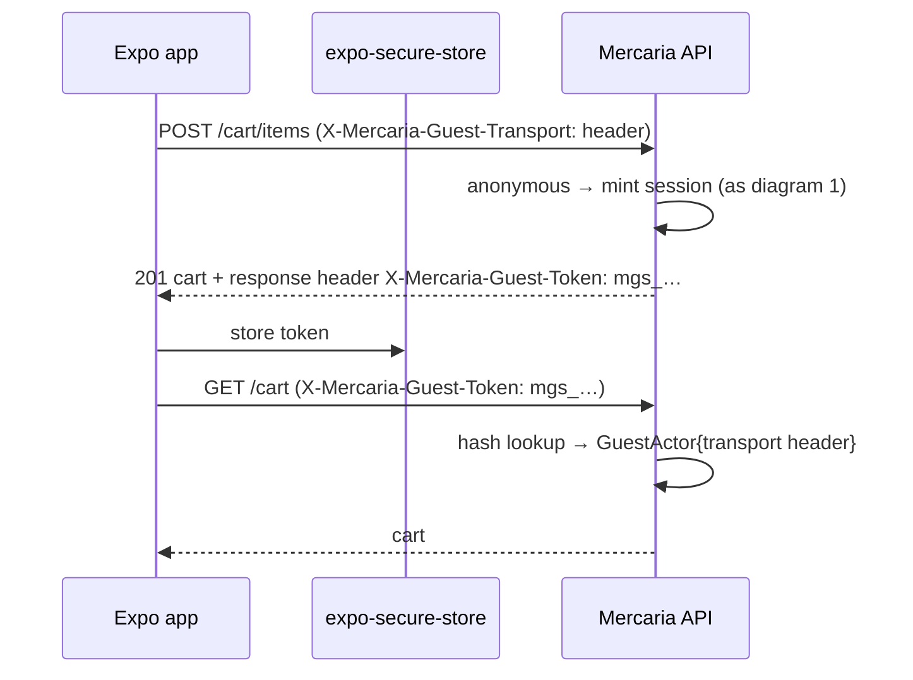
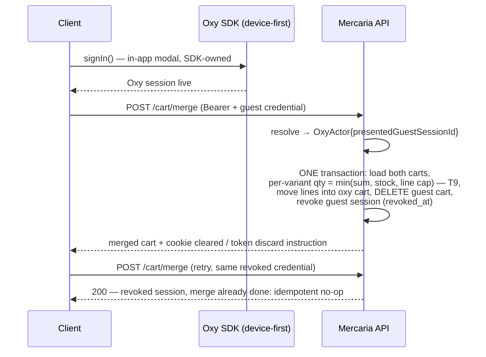
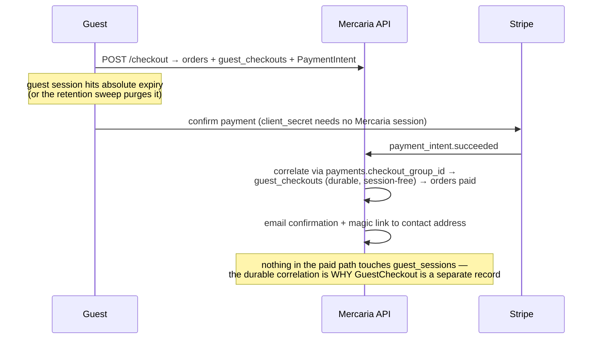
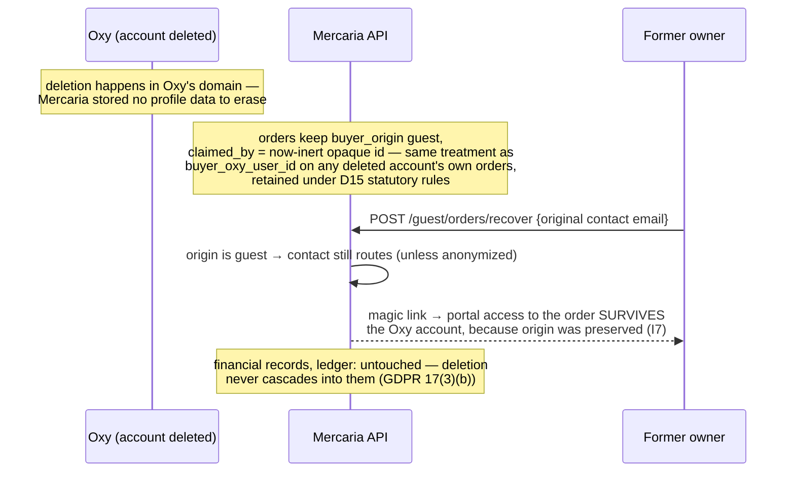

# ADR 0003: CommerceActor, guest identity, order access and privacy boundaries

- **Status:** Accepted
- **Date:** 2026-08-09
- **Issue:** [#102](https://github.com/OxyHQ/Mercaria/issues/102), part of epic [#101](https://github.com/OxyHQ/Mercaria/issues/101)
- **Binds:** #103–#112. #114 (Stripe guest checkout) amends this ADR for
  provider-identity mapping and inherits the identities defined here.

## Context

Every buyer-side path in this backend uses `oxyUserId` as both the
authentication identity and the commerce ownership key, and the coupling is in
the schema, not just the services:

- `carts.oxy_user_id` is `NOT NULL` with the unique index
  `carts_oxy_user_id_key` — exactly one cart per Oxy account, and no way to
  represent a cart owned by anyone else (`db/schema/buyers.ts`).
- `addresses.oxy_user_id` is `NOT NULL`, with
  `addresses_oxy_user_id_default_created_at_idx` and the partial unique
  `addresses_oxy_user_id_default_key` resolving "the user's default".
- `orders.buyer_oxy_user_id` is `NOT NULL`, read through
  `orders_buyer_created_at_idx` by `order.service.listOrdersForBuyer`,
  `getOrderForBuyer` and `cancelByBuyer`, all of which take an `oxyUserId`
  parameter and filter on it.
- `customers.oxy_user_id` (nullable, partial unique
  `customers_store_id_oxy_user_id_key`) is upserted on `paid` — guarded today
  by `if (order.buyerOxyUserId)` in `order.service.ts`.
- Checkout idempotency is keyed on the user twice: the Redis fast-path claim
  `checkout:<oxyUserId>:<idempotencyKey>` and the durable sparse-unique
  `orders_idempotency_key_key` (`checkout.service.ts`).
- The route mounts are unconditional: `routes/cart.ts`, `routes/checkout.ts`,
  `routes/orders.ts` and `routes/addresses.ts` all open with
  `router.use(authenticateToken)` (the `createOxyAuthMiddleware` instance from
  `middleware/auth.ts`), so an unauthenticated buyer cannot reach a single
  commerce endpoint.

One precedent in this codebase shows exactly what happens when a foreign key
space is smuggled into that column instead of modeled: connector-imported
orders write `buyerOxyUserId = 'ext:<provider>:<externalId>'`
(`connector-sync.service.ts`) — a synthetic identifier wearing an Oxy id's
column, distinguishable only by a string prefix nothing enforces. Guest
checkout done the same way (a fake id per guest, or worse a synthetic Oxy
account) would repeat that mistake at authorization-relevant scale. This ADR
refuses it: **no synthetic Oxy users, ever** — Oxy owns identity, and a
Mercaria-minted identifier must be structurally incapable of appearing where
an Oxy id is expected.

Two ecosystem rules frame the design. First, the Oxy session model is
device-first and **zero-cookie**: Oxy identity has exactly one transport, the
SDK's `{deviceId, deviceSecret}` mint, and Mercaria must not add a second one.
Second, a guest is by definition someone with **no Oxy session** — so the
guest credential is not Oxy identity and is not governed by that rule; it is
Mercaria's own first-party domain state, like any other server-set state on
`api.mercaria.co`. D9 justifies the cookie explicitly rather than by
omission.

The child issues implement this ADR: #103 (guest sessions + actor resolver),
#104 (cart ownership + merge), #105 (inline contact/destination in checkout),
#106 (guest buyers on orders), #107 (Stripe guest checkout — with #114),
#108 (order portal + magic links), #109 (claiming), #110 (guest
cancellations/returns/support), #111 (retention, abuse controls, analytics,
rollout), #112 (P2P gate). They must be implementable from this document
without inventing security or ownership semantics.

## Decisions

Numbered to match #102's decision list one-to-one.

### D1. `CommerceActor` — the exact shape

One discriminated union, defined once in
`packages/backend/src/services/commerce-actor.ts`, resolved once per request
in `middleware/commerce-actor.ts`, and consumed by cart, checkout and
actor-aware rate limiting:

```ts
export type OxyActor = {
  readonly kind: 'oxy';
  /** The verified Oxy account id from `createOxyAuthMiddleware`. */
  readonly oxyUserId: string;
  /**
   * A VALID guest credential presented alongside Oxy auth. Carried so the two
   * explicit endpoints that need it — cart merge (#104) and claim (#109) —
   * can prove possession. No other code may read it (D2).
   */
  readonly presentedGuestSessionId?: string;
};

export type GuestActor = {
  readonly kind: 'guest';
  /** The `guest_sessions` row id — never the token. */
  readonly guestSessionId: string;
  /** Which transport carried the credential; decides how a rotation returns (D9). */
  readonly transport: 'cookie' | 'header';
};

export type AnonymousActor = { readonly kind: 'anonymous' };

export type CommerceActor = OxyActor | GuestActor | AnonymousActor;
```

**There is deliberately no common `id` field.** A shared `actor.id` would be
the exact aliasing this ADR exists to prevent: code that forgets which kind it
holds compiles anyway and passes a guest id where an Oxy id is expected. With
no common field, every consumer must `switch` on `kind`, and the compiler
enforces invariant I1 at every call site.

Rate limiting keys off the actor, not the transport:

```ts
export function actorRateKey(actor: CommerceActor, clientIp: string): string {
  switch (actor.kind) {
    case 'oxy':       return `oxy:${actor.oxyUserId}`;
    case 'guest':     return `guest:${actor.guestSessionId}`;
    case 'anonymous': return `ip:${clientIp}`;
  }
}
```

Limiters follow the existing `'rl:<scope>:'` unique-prefix convention. The
checkout Redis idempotency claim becomes
`checkout:<actorRateKey>:<idempotencyKey>`; for Oxy buyers that changes the
key shape (`checkout:oxy:<id>:…` where it was `checkout:<id>:…`), which is
safe because the claim is TTL-bounded and the durable
`orders_idempotency_key_key` layer converges any replay that straddles the
deploy.

### D2. Resolution precedence when both credentials are present

**Oxy wins.** The resolver runs the existing `optionalAuth`
(`createOptionalOxyAuth`) first; if it attaches a verified user, the actor is
`kind: 'oxy'` — the guest credential, if also present and valid, is surfaced
only as `presentedGuestSessionId` and is otherwise inert. Cart reads, checkout
and every other path act on the Oxy identity. Nothing merges, links or claims
implicitly: the ONLY consumers of `presentedGuestSessionId` are the explicit
cart-merge endpoint (#104) and the claim endpoint (#109), both of which
re-verify possession at their own boundary.

Two refusals are part of the precedence and are binding:

- **A failed Oxy credential is a 401, never a downgrade.** An `Authorization`
  header that fails verification does not fall through to the guest cookie —
  a silently expired Oxy session degrading to a guest actor would split one
  person across two carts with no visible error. Absence of the header is
  what makes guest resolution reachable.
- **An invalid guest credential resolves as if absent** (anonymous, or plain
  Oxy). It is not an error — expiry and revocation are normal — but a request
  authenticated only by an invalid guest token gets no session auto-minted on
  reads (D3), so a revoked token cannot be used to farm fresh sessions.

### D3. `GuestSession` — the persisted identity and token design

Table `guest_sessions` (drizzle, `db/schema/guests.ts`; uuid v7
`generatedId()` primary key like every other table):

| Column | Type | Notes |
|---|---|---|
| `id` | text PK | uuid v7. The AUDIT handle and the `carts` owner key — never the credential. |
| `token_hash` | text NOT NULL | SHA-256 hex of the token. Unique `guest_sessions_token_hash_key`. |
| `previous_token_hash` | text | Rotation grace — the dual-secret window pattern `STRIPE_WEBHOOK_SECRET_PREVIOUS` already uses. |
| `previous_token_expires_at` | timestamptz | Grace deadline for the previous hash (60 s). |
| `created_at` / `last_seen_at` | timestamptz NOT NULL | `last_seen_at` written at ≥60 s granularity to bound write amplification. |
| `expires_at` | timestamptz NOT NULL | ABSOLUTE deadline (90 days). Idle expiry (30 days from `last_seen_at`) is enforced by the resolver; only the absolute one is a column, so the two cannot disagree. |
| `revoked_at` | timestamptz | Set by merge (D-merge in #104), by "secure my access" (T-model), or by an operator. |

**Token:** `mgs_` + base64url of 32 CSPRNG bytes (~43 chars). The server
stores **only the SHA-256**; the plaintext exists in the issuance response and
the client's storage, nowhere else — not in logs, not in error messages, not
in analytics. Lookup is by hash equality on the unique index; no constant-time
ceremony is needed because the preimage has 256 bits of entropy (contrast
D12, where low-entropy emails get an HMAC precisely because plain hashing
would be dictionary-attackable).

**Scope is structural, not a column.** `mgs_` tokens resolve only in the
commerce-session resolver; portal tokens (`mgp_`, D5) only in the portal
resolver; the two tables share nothing. A `scope` column beside that would be
a second representation of one fact — the same reason `provider_accounts` has
no `ready` boolean beside `onboarding_state`.

**Issuance is lazy and write-triggered.** No row is created for browsing;
the first guest WRITE (add-to-cart) mints the session, rate-limited per IP
(`rl:guest-issue:` bucket). This is the primary anti-farming control (T10):
an anonymous crawler generates zero rows.

**Rotation** replaces `token_hash` in place, parking the old hash in
`previous_token_hash` with a 60-second grace so a burst of in-flight requests
does not race the swap. Rotation fires on: email-verified privilege elevation
(a `magic_link` exchange presented by the same session), every 7 days of
activity, and operator action. Sign-in does not rotate — it **revokes**, in
the merge transaction (#104), because the session's purpose is over.

### D4. `GuestCheckout` — durable correlation and the contact snapshot

Table `guest_checkouts` — one row per guest checkout GROUP, created in the
same transaction as the group's orders:

| Column | Type | Notes |
|---|---|---|
| `id` | text PK | uuid v7. What `orders.buyer_guest_checkout_id` references. |
| `checkout_group_id` | text NOT NULL | Unique `guest_checkouts_checkout_group_id_key` — one contact snapshot per group, shared by sibling orders, never copied per order (two copies of one fact can disagree). |
| `guest_session_id` | text NOT NULL | CORRELATION with **no foreign key** — sessions are purged on retention (D11) and the checkout must survive them, the same rule every payment↔commerce link in this schema follows. |
| `email_ciphertext` | text | AES-256-GCM under `GUEST_PII_ENCRYPTION_KEY`, key-id prefixed (`v1:`) for rotation. NULL only after anonymization. |
| `email_hash` | text | HMAC-SHA-256 of the normalized email under `GUEST_EMAIL_HASH_KEY` (D12). Index `guest_checkouts_email_hash_idx` (non-unique — one inbox, many checkouts). |
| `email_redacted` | text NOT NULL | `j***@example.com` — the support-surface display form (T15). |
| `locale` | text | For transactional email language. |
| `anonymized_at` | timestamptz | D15. |
| `created_at` | timestamptz NOT NULL | |

This row is why the flow survives session expiry (diagram 6): the payment
correlates through `payments.checkout_group_id` → `guest_checkouts` →
contact, with no session in the chain. It is the identity **#114 inherits**:
a provider-side customer object for a guest payment maps to a
`guest_checkouts` row — never to a session, never to an email, and never
shared across guests by card fingerprint (T13).

**Immutability:** a trigger refuses `UPDATE` of `checkout_group_id` and
`guest_session_id` outright, and permits the contact columns to change only
to NULL (the anonymization transition, D15) — the same
enforce-it-in-the-database posture as the ledger's UPDATE/DELETE trigger.

### D5. `GuestOrderAccessGrant` — scoped portal access and the magic-link exchange

Table `guest_order_access_grants`, covering both the short-lived exchange
token that travels by email and the durable portal credential:

| Column | Type | Notes |
|---|---|---|
| `id` | text PK | uuid v7. |
| `checkout_group_id` | text NOT NULL | **The scope.** Every portal query joins through it; there is no grant to "an email's orders" (T7, T11). Index `guest_order_access_grants_group_idx`. |
| `token_hash` | text NOT NULL | Unique `guest_order_access_grants_token_hash_key`. |
| `purpose` | text NOT NULL | CHECK `'exchange' \| 'portal'`. |
| `created_via` | text NOT NULL | CHECK `'post_checkout' \| 'magic_link'`. |
| `email_verified` | boolean NOT NULL | `true` iff the chain includes a consumed magic link (proof of inbox possession). Gates mutations (D17). |
| `expires_at` | timestamptz NOT NULL | Exchange: 15 minutes. Portal: 30 days. |
| `consumed_at` | timestamptz | Exchange rows only — single use. |
| `revoked_at` / `last_used_at` / `created_at` | timestamptz | |

Token prefixes `mgx_` (exchange) and `mgp_` (portal), same 32-byte CSPRNG +
SHA-256 storage as D3.

**The flow is two tokens by design** (T4): the emailed link carries only the
single-use, 15-minute `mgx_` token — **in the URL fragment**, so it never
reaches server logs, proxies or `Referer` headers; the SPA reads the fragment
and POSTs it. The exchange consumes it atomically
(`UPDATE … SET consumed_at = now() WHERE token_hash = $1 AND consumed_at IS
NULL AND revoked_at IS NULL AND expires_at > now() RETURNING …` — the empty
vs one-row result IS the already-used answer, the moderation-event claim
pattern) and mints a `portal` grant delivered per D9's transport contract
(`__Host-mercaria_portal` cookie on web, `mgp_` token in the response for
native). The portal URL after exchange carries no credential at all.

**The happy path also goes through a grant.** Checkout completion mints a
`post_checkout` portal grant (`email_verified = false`) to the session that
placed the order. This keeps invariant I3 literal — the cart session token
NEVER authorizes an order read, even one second after checkout; a separate,
scoped, expiring credential does.

### D6. `OrderBuyer` — origin preserved, claim recorded separately

Additive columns on `orders`:

| Column | Type | Notes |
|---|---|---|
| `buyer_origin` | text NOT NULL DEFAULT `'oxy'` | CHECK `'oxy' \| 'guest' \| 'external'`. **Immutable after insert** (trigger). |
| `buyer_guest_checkout_id` | text | FK → `guest_checkouts.id` `ON DELETE RESTRICT` (both Mercaria-owned tables, so a real FK is allowed — unlike any Oxy id). Set iff `buyer_origin = 'guest'`. Partial index `orders_buyer_guest_checkout_id_idx`. |
| `claimed_by_oxy_user_id` | text | The LATER Oxy owner of a guest-origin order. No FK — an Oxy id, foreign service's key. Partial index `orders_claimed_by_created_at_idx` on `(claimed_by_oxy_user_id, created_at DESC) WHERE claimed_by_oxy_user_id IS NOT NULL`. |
| `claimed_at` | timestamptz | Present exactly with `claimed_by_oxy_user_id`. |

`buyer_oxy_user_id` — the existing column — becomes **nullable** and keeps
its exact meaning for `'oxy'` orders: the ORIGIN owner. It is not renamed, not
dropped, and its index `orders_buyer_created_at_idx` keeps serving every
existing read (D7).

`'external'` exists because the column is already polymorphic in disguise:
connector imports store `ext:<provider>:<externalId>` in it today. The new
value states honestly what those rows are; their buyer identity is the
`source_connection_id` + `source_external_id` columns that already exist.

The CHECK, `orders_buyer_identity_check` (added `NOT VALID`, validated in
M4):

```sql
(buyer_origin = 'oxy'
   AND buyer_oxy_user_id IS NOT NULL
   AND buyer_guest_checkout_id IS NULL
   AND claimed_by_oxy_user_id IS NULL AND claimed_at IS NULL)
OR (buyer_origin = 'guest'
   AND buyer_guest_checkout_id IS NOT NULL
   AND buyer_oxy_user_id IS NULL
   AND num_nonnulls(claimed_by_oxy_user_id, claimed_at) IN (0, 2))
OR (buyer_origin = 'external'
   AND buyer_guest_checkout_id IS NULL
   AND claimed_by_oxy_user_id IS NULL AND claimed_at IS NULL)
```

(`'external'` leaves `buyer_oxy_user_id` unconstrained: legacy rows keep
their `ext:` value as provenance; new imports stop writing it in M9.)

**Claiming never rewrites origin** (I7). A trigger refuses any `UPDATE` of
`buyer_origin`, `buyer_guest_checkout_id`, or a set `buyer_oxy_user_id`, and
permits the claim pair only NULL→value (the claim) and value→NULL (an
audited operator unclaim) — never value→value. A mis-claim is corrected by
unclaim + re-claim, two audited steps, not by editing history.

`order_status_history` gains `actor_kind` (CHECK
`'oxy' | 'guest' | 'system' | 'operator'`) and `actor_guest_session_id`;
`by_oxy_user_id` stays Oxy-only (D16).

### D7. How existing `buyerOxyUserId` reads and indexes migrate

**Nothing that works today changes its data.** The full staging is the
Migration section; the binding read-model decisions:

- **Buyer order lists** (`order.service.listOrdersForBuyer`,
  `getOrderForBuyer`, `cancelByBuyer`): the predicate becomes
  `buyer_oxy_user_id = $1 OR claimed_by_oxy_user_id = $1`, executed as a
  UNION of two indexed scans (`orders_buyer_created_at_idx` +
  `orders_claimed_by_created_at_idx`). Until any claim exists it degenerates
  to today's plan exactly.
- **Reports** (`report.service`) and **store stats** group by store and sum
  the shop side — no buyer key in any of those queries; unaffected.
- **Notifications:** `notifications.oxy_user_id` is `NOT NULL` and stays so.
  Guest orders produce **transactional email only** (to the
  `guest_checkouts` contact) — no notification row, no push. In-app
  notification for a guest order begins only after a claim, addressed to
  `claimed_by_oxy_user_id`.
- **Customer upsert on paid:** already guarded by
  `if (order.buyerOxyUserId)` in `order.service.ts` — a guest order's NULL
  skips it with no code change. M3 makes the guard explicit on
  `buyer_origin` so the skip is a decision, not an accident. Guest orders
  create **no `customers` row** at launch (D13).
- **Refunds/moderation:** `refunds` carries no buyer column; moderation
  enforcement acts on listings/orders by id. Both unaffected.
- **Reviews:** `review.service`'s verified-purchase check
  (`order.buyerOxyUserId === authorOxyUserId`) extends to
  `OR claimed_by_oxy_user_id = authorOxyUserId` — a claimed purchase is a
  verified purchase (#109). Guests themselves cannot review (reviews require
  Oxy auth; unchanged).
- **Connector imports and POS:** connector orders become
  `buyer_origin = 'external'` (backfilled by `source_connection_id IS NOT
  NULL`, M4); POS/draft orders keep resolving a real Oxy id
  (`customer?.oxyUserId ?? actorOxyUserId`, `draft-order.service.ts`) and
  stay `'oxy'`. Neither path issues guest credentials.
- **Payments:** `order-linkage.ts` (the ONE seam onto orders) widens its
  projection's `buyerOxyUserId` to `string | null`; the operator trace's
  five handles (order number, order id, checkout group, payment id, provider
  object id) already exclude buyer identity, so nothing else moves.

### D8. Cart ownership: separate owner columns, not a polymorphic pair

`carts` gains `guest_session_id`; `oxy_user_id` drops `NOT NULL`:

```
oxy_user_id       text NULL   -- Oxy account id, no FK (foreign service's key)
guest_session_id  text NULL   -- FK -> guest_sessions.id ON DELETE CASCADE
CHECK carts_owner_exclusivity_check: num_nonnulls(oxy_user_id, guest_session_id) = 1
UNIQUE carts_oxy_user_id_key       ON (oxy_user_id)      WHERE oxy_user_id IS NOT NULL
UNIQUE carts_guest_session_id_key  ON (guest_session_id) WHERE guest_session_id IS NOT NULL
```

The alternative — one polymorphic `owner_type + owner_id` pair, as
`provider_accounts` uses — is rejected for a structural reason, not taste:
**the two owner id spaces need different referential treatment and one column
cannot carry half a foreign key.** An Oxy id must NOT have an FK (Oxy owns
identity; every such column in this schema says so), while `guest_session_id`
MUST have one: `ON DELETE CASCADE` is what makes retention correct by
construction — purging an expired session deletes its cart and, through the
existing `cart_items` cascade, its lines, with no sweep code to keep honest.
`provider_accounts` chose the single pair because its owner feeds a derived
Stripe idempotency key; no such derivation exists here, and `orders` already
uses exactly this two-column-plus-exclusivity-CHECK shape for its seller side
(`orders_seller_exclusivity_check`). Exactly-one-owner is enforced by the
CHECK; one-cart-per-owner by the two partial uniques.

Guest presentment currency is not persisted (no `user_preferences` row for
guests): the client sends it per request, falling back to FAIR — the same
fallback an Oxy user without preferences gets.

### D9. One server contract for web cookies and native secure storage

The credential is ONE opaque bearer token with one lifecycle; only the
carriage differs.

- **Web:** `__Host-mercaria_guest` (session) and `__Host-mercaria_portal`
  (portal grant) — `HttpOnly; Secure; SameSite=Lax; Path=/`, set only by the
  server on the API origin. The `__Host-` prefix forbids a `Domain`
  attribute, so a subdomain can never plant or shadow the cookie (T1). The
  storefront calls with `credentials: 'include'`; `mercaria.co` →
  `api.mercaria.co` is same-site, so `Lax` passes it, and the existing
  `PRODUCTION_ORIGINS` CORS allowlist in `app.ts` already names every
  legitimate origin. The token never appears in a response body for
  cookie-transport clients.
- **Native:** the token is returned once in the response header
  `X-Mercaria-Guest-Token`, stored in `expo-secure-store`, and presented as
  the request header `X-Mercaria-Guest-Token`. A client declares header
  transport with `X-Mercaria-Guest-Transport: header` on the issuing write;
  absent means cookie.
- **One resolver.** The server reads the header first, else the cookie, and
  from there the path is identical: hash, unique-index lookup, expiry/
  revocation/rotation-grace checks. Rotation answers in kind — `Set-Cookie`
  for cookie transport, response `X-Mercaria-Guest-Token` for header
  transport — which is why `GuestActor` carries `transport`.

**Why a cookie does not violate the Oxy zero-cookie rule:** that rule
abolished cookies as the OXY IDENTITY transport — the ecosystem session, SSO
bounces, refresh-token families. This credential names no Oxy identity,
never touches `auth.oxy.so`, is scoped to Mercaria's own API host, and
exists precisely for the person who HAS no Oxy session. It is Mercaria
domain state. The moment the person signs in, D2's precedence makes the Oxy
SDK's device-first session the identity and the guest cookie is revoked at
merge.

### D10. CSRF model for web guest writes: Origin verification

**The control is strict `Origin` verification against `PRODUCTION_ORIGINS`,
with `SameSite=Lax` as defense in depth.** Every state-changing request
authenticated by a guest cookie must carry an `Origin` (or, absent that,
`Referer`) header whose origin is in the allowlist; a cookie-authenticated
write with neither header is refused 403. Native traffic is untouched: it
authenticates by custom header, which a cross-site attacker cannot attach —
a custom header forces a CORS preflight, and the existing CORS layer refuses
the origin.

Double-submit is rejected, deliberately: it needs a second, JS-readable
cookie plus an echo field — two more moving parts and a second authority to
keep consistent — and its classic failure mode (sibling-subdomain cookie
injection) is only closed by `__Host-` prefixes, which we require anyway.
Origin verification reuses the ONE origin authority the backend already
maintains for CORS; there is nothing new to drift.

### D11. Retention classes — per record type, never one blanket TTL

| Class | Records | Live window | Purge |
|---|---|---|---|
| **Commerce session** | `guest_sessions` + guest-owned `carts`/`cart_items` (via cascade) | 30 days idle, 90 days absolute (`GUEST_SESSION_IDLE_DAYS` / `GUEST_SESSION_ABSOLUTE_DAYS`) | Hard `DELETE` by the retention sweep 7 days after expiry or revocation; the FK cascade deletes the cart, so purge correctness is schema, not sweep code. |
| **Checkout correlation + contact** | `guest_checkouts` | As long as its orders — the statutory commercial/tax retention of the platform legal entity (Spain per ADR 0001 D8: six years, Código de Comercio art. 30) | Never swept. Contact ciphertext deletable EARLIER on a verified deletion request (D15) — the row and its hash-free skeleton persist for order integrity. |
| **Order access** | `guest_order_access_grants` | Exchange: 15 min single-use. Portal: 30 days (`GUEST_PORTAL_GRANT_DAYS`), re-mintable via magic link indefinitely while the order is retained | Exchange rows purged 24 h after expiry; portal rows 90 days after expiry/revocation (kept that long as the audit trail of who could access what). |
| **Financial records** | `orders`, `order_items`, `refunds`, `payments`, ledger | Statutory retention; the ledger is permanent and carries no PII by construction | Never touched by any guest sweep. Post-statutory anonymization is an operator-run job, not automation (D15). |
| **Audit** | `order_status_history` (+ `actor_kind`, `actor_guest_session_id`) | Lifetime of the order | Session PURGE does not touch it — `actor_guest_session_id` is a plain text id, valid as correlation after the session row is gone. |

The sweep (`startGuestRetentionSweep`) runs on every ECS task with the same
leased, bounded, resumable shape as the reconciliation sweeps — claims via
`FOR UPDATE SKIP LOCKED`, so N tasks share it and a dead task's lease is
reclaimed.

### D12. Email normalization, encryption, hashing and lookup

- **Normalization, for hashing only:** trim → Unicode NFC → lowercase the
  ENTIRE address. Nothing else — no plus-tag stripping, no Gmail
  dot-folding: those are mailbox-owner semantics, and folding them would
  merge addresses their owner deliberately keeps distinct. The stored
  ciphertext preserves the address exactly as typed (it is what transactional
  mail is sent to).
- **Encryption:** AES-256-GCM under `GUEST_PII_ENCRYPTION_KEY`, ciphertext
  prefixed with a key id (`v1:`) so rotation is re-encryption at read, not a
  flag day.
- **Hashing:** HMAC-SHA-256 under the SEPARATE `GUEST_EMAIL_HASH_KEY` —
  keyed, unlike the token hashes, because an email has dictionary-scale
  entropy and a plain hash column would be offline-reversible the day the
  table leaks. Two keys, because the hash key must be usable by the lookup
  path without ever being able to decrypt.
- **Lookup rules:** `email_hash` serves exactly two purposes — routing a
  magic-link request to its checkouts, and abuse velocity counting (T5,
  T10). It is NEVER an authorization input (I2, I4), never a join key to
  Oxy accounts, and never leaves the backend. Plaintext email is never
  indexed, never logged; support surfaces see `email_redacted` (T15).
  All three columns join `db/protectedColumns.ts` beside `customers.email`.

### D13. What sellers receive, and what stays Mercaria-only

Sellers receive, per order they fulfil: the shipping snapshot the order
already carries (`shipping_address_*` columns: recipient name, address,
optional phone), the chosen method, the lines, and a buyer display label —
the Oxy handle for `'oxy'` orders, the literal string `Guest` for guest
orders. That is the whole list.

Mercaria-only, structurally: the contact email (any form — plaintext, hash,
redacted), `guest_session_id`, `buyer_guest_checkout_id`, claim status and
`claimed_by_oxy_user_id`, IP addresses, and any cross-order correlation. The
seller order projection simply has no fields for them (the
"names every field explicitly" rule from the payment status projection), so
seller APIs cannot enumerate or correlate a guest's purchases (I11) — there
is no identifier in the response to correlate BY, and no seller-facing
filter accepts an email. Guest orders create no `customers` row at launch
(D7), so the CRM surface cannot leak contact either. Buyer contact for
transactional messages goes through Mercaria's own relay (#110), never to
the seller raw.

### D14. Claiming: both sides proven, conflicts explicit

A claim moves a guest checkout GROUP into an Oxy account's order list. It
requires, in one request:

1. **Possession of the order:** a live, `email_verified = true` portal grant
   for the group (D5 — i.e. the claimer got a magic link at the contact
   inbox), or the live guest session that placed it presented as
   `presentedGuestSessionId` PLUS a completed magic-link exchange. Email
   verification is always in the chain: session possession alone is a
   device, not a person.
2. **The claiming identity:** a verified Oxy session (`kind: 'oxy'`).

An email address matching an Oxy account's email is worth exactly nothing
(I6): no code path queries orders by `email_hash` to attach them, and the
claim service is the only writer of `claimed_by_oxy_user_id`.

**Mechanics:** one transaction stamps `claimed_by_oxy_user_id` + `claimed_at`
on every order of the group (NULL→value, the only transition the D6 trigger
permits), appends `order_status_history` rows (`actor_kind: 'oxy'`), and
revokes the group's outstanding portal grants — after a claim, order access
is the Oxy account, not the emailed link.

**Conflicts:** already claimed by the SAME account → 200, idempotent
convergence. Claimed by a DIFFERENT account → 409, no overwrite (the trigger
forbids value→value regardless); the resolution path is an audited operator
unclaim (D6), never a stronger claim. A group can never be split — the claim
is group-atomic by construction.

### D15. Deletion, anonymization and legal retention after payment

Three regimes, and the boundary between them is the payment:

- **Pre-payment guest data** (session, cart, an unpaid checkout's contact):
  deletable outright. The retention sweep already deletes it on schedule;
  a verified deletion request just does it now.
- **Post-payment, within statutory retention:** a deletion request —
  verified by magic link, the same inbox-possession proof as portal access —
  revokes all sessions and grants, deletes the guest cart, and **anonymizes
  the contact**: `email_ciphertext → NULL`, `email_hash → NULL`,
  `email_redacted → 'deleted'`, `anonymized_at = now()` (the one UPDATE the
  D4 trigger permits). The orders, their shipping snapshots, refunds,
  payments and ledger entries are RETAINED: GDPR Art. 17(3)(b) — a legal
  obligation (tax/commercial record-keeping) — overrides erasure for
  exactly these records and no others. The shipping address snapshot is part
  of the invoice-grade record and stays with it.
- **Post-statutory:** an operator-run anonymization job (not automation —
  the same "nothing auto-rewrites financial history" posture as
  reconciliation) clears shipping snapshots and any residual contact from
  aged orders. The ledger is never touched; it contains amounts and opaque
  ids only.

Erasure requests arriving through Oxy (an Oxy account deletion) affect
guest-origin orders only in that `claimed_by_oxy_user_id` becomes an inert
opaque id — the same treatment `buyer_oxy_user_id` already gets for a deleted
Oxy account's own orders (diagram 11). Mercaria stores no Oxy profile data to
erase; identity was always read live from Oxy.

### D16. Guest actors in audit trails

`order_status_history` (and every audit row the guest domain writes) records:

- `actor_kind`: `'oxy' | 'guest' | 'system' | 'operator'`;
- `by_oxy_user_id`: set ONLY when the kind is `oxy`/`operator` — a guest id
  never enters this column (I1 applies to audit rows too);
- `actor_guest_session_id`: the `guest_sessions` ROW ID when the kind is
  `guest` — the row id is the audit handle, and the credential (the token)
  appears in no audit row, no log line and no error message, ever.

A CHECK ties the columns to the kind. The row id stays meaningful after the
session row is purged (it is correlation text, not an FK — D11), so the
trail outlives the credential without extending its life.

### D17. Guest operations before and after email verification

Verification is inbox possession, proven by a consumed magic-link exchange
(D5). The line between the two states is **prospective vs retrospective**:

| Before verification | After verification (`email_verified = true` grant) |
|---|---|
| Browse; cart reads and writes; apply discount codes | Everything on the left, plus: |
| Checkout, including payment — payment is deliberately NOT gated on verification (an email typo is answered by the confirmation email not arriving, and the post-checkout grant still tracks the order from the same device) | Full order detail in the portal from any device |
| Order STATUS tracking via the `post_checkout` grant, same device | Cancellation and return requests (#110) |
| Request a magic link (always answered 202 — T5) | Support threads tied to the order (#110) |
| | Claiming into an Oxy account (D14) |
| | Data deletion requests (D15) |
| | "Secure my access" revocation (T-model, diagram 10) |

The rationale: pre-verification operations are ones whose worst abuse is
bounded by the actor's own money and rate limits; every retrospective read
of PII and every mutation of a placed order requires proof that the actor
controls the contact inbox the order names.

### D18. P2P is excluded at launch

Guest checkout serves **store sellers only**. A checkout group whose seller
is `sellerType: 'user'` is refused for a guest actor at group construction —
the same seam, and the same refusal shape, as the payment-readiness gate in
`services/payments/provider-account.service.ts` (deselectable via the
existing `sellerKeys` partial-checkout mechanism). Enforced server-side, not
by hiding UI.

Why: (1) **Fraud shape.** Stolen-card + colluding "seller" cash-out is the
canonical marketplace mule pattern, and an unauthenticated buyer against an
individual payout account is its cheapest configuration; stores clear KYC
with real business surface area and continuing inventory, raising the cost.
(2) **Dispute asymmetry.** ADR 0001 D1 makes Mercaria merchant of record and
D7 recovers losses from the seller — recovery against a P2P individual's
balance is the weakest link, and guest buyers raise dispute rates
everywhere they exist. (3) **Two-sided reachability.** P2P conflict
resolution (returns negotiation, CrowdSource reporting) presumes both
parties are identity-anchored; a guest buyer is reachable only through an
inbox that may be stale by day three.

**Evidence that changes it** (#112 owns the gate and the evaluation): a
guest-store cohort, at volume, showing dispute + chargeback rates within
agreed bounds of the authenticated cohort; refund-recovery failure rate on
P2P (authenticated) low enough that adding guest exposure is tolerable; and
support volume per guest order at parity. The gate is a config flag whose
flip is a decision recorded on #112, not a code change.

## The twelve invariants, and what enforces each

| # | Invariant | Mechanism |
|---|---|---|
| I1 | A guest id is never accepted where an Oxy user id is expected | No common `id` field on `CommerceActor` (D1) — consumers must switch on `kind`; guest ids live only in guest-named columns (`guest_session_id`, `buyer_guest_checkout_id`, `actor_guest_session_id`); `by_oxy_user_id` is written only for `oxy`/`operator` kinds (D16); `orders_buyer_identity_check` forbids a guest order carrying `buyer_oxy_user_id`. |
| I2 | Email, phone, IP, card fingerprint and device characteristics are not authorization credentials | Every authorization path takes a `CommerceActor` or a grant row and nothing else; `email_hash`'s two permitted uses are routing and rate-limiting (D12); the payment trace's `.strict()` five-handle rule already excludes them; #114 is bound by T13's provider-grouping boundary. |
| I3 | The cart token cannot serve as permanent paid-order access | Structural scoping (D3): `mgs_` tokens resolve only in the commerce resolver; order reads require a `guest_order_access_grants` row — even the happy path mints one (`post_checkout`, D5); grants expire (30 d) and are revocable. |
| I4 | Order number plus email cannot authorize an order read or mutation | No endpoint accepts that pair as a credential; the magic-link request treats them as a routing hint and always answers 202 (T5); order numbers are printed, sequential and assumed public (T6). |
| I5 | Tokens are high-entropy, stored only as hashes, scoped, expiring and revocable | 32-byte CSPRNG, SHA-256-only storage, unique hash indexes (D3, D5); scope by table + resolver + prefix; `expires_at` NOT NULL everywhere; `revoked_at` everywhere; rotation with a 60 s dual-hash grace (D3). |
| I6 | An authenticated Oxy account does not acquire guest orders merely because an email matches | The claim service is the ONLY writer of `claimed_by_oxy_user_id` and requires the D14 two-sided proof; no code path joins orders to Oxy accounts via `email_hash`; the D6 trigger blocks any other write route at the database. |
| I7 | Claiming preserves `origin: guest` and records the later owner separately | Separate columns (`buyer_origin` vs `claimed_by_oxy_user_id`); the immutability trigger refuses UPDATE of `buyer_origin`/`buyer_guest_checkout_id` and value→value claim changes (D6). |
| I8 | Existing immutable order item, price, address and payment snapshots remain unchanged | The migration is purely additive on `orders` (M1): no existing column is dropped, renamed or rewritten; `order_items`, address snapshot columns and payment pointer columns are untouched by every stage. |
| I9 | Guest and authenticated checkout invoke the same business services after actor resolution | One `checkout.service.checkout(actor, …)`, one `cart.service`, no `guest-*.service` fork (M6); pinned by tests that drive both actor kinds through the same function and assert a single code path. |
| I10 | Provider payment state remains authoritative through verified events | Unchanged from ADR 0001 / #48: `paid` moves only on verified webhook events; guest checkout returns `{paymentId, clientSecret, …}` exactly as #47 does, and `checkoutSchema` stays `.strict()`. This ADR adds no client-asserted state. |
| I11 | Seller APIs cannot enumerate or correlate unrelated guest purchases | The seller projection carries no guest identifier of any kind (D13) — nothing to correlate by; no seller-facing filter accepts email or hash; guest orders create no `customers` row. |
| I12 | Analytics receives only a pseudonymous actor or checkout dimension required for the documented metric | Analytics events carry `actor_kind` and, only where a documented funnel metric requires continuity, the opaque session/checkout row id; never email, hash, IP or token (#111 documents each metric's dimension before it ships). |

## Sequence diagrams

### 1. First guest add-to-cart on web

```mermaid
sequenceDiagram
    participant B as Browser (mercaria.co)
    participant API as Mercaria API
    B->>API: POST /cart/items (no credential, Origin mercaria.co)
    API->>API: resolve → anonymous; write op + GUEST_COMMERCE_ENABLED
    API->>API: rate-check rl:guest-issue:ip; mint 32B token,<br/>INSERT guest_sessions (sha256), INSERT cart (guest_session_id), line
    API-->>B: 201 cart + Set-Cookie __Host-mercaria_guest<br/>(HttpOnly, Secure, SameSite=Lax) — token never in body
    B->>API: GET /cart (cookie)
    API->>API: hash lookup → GuestActor{transport cookie}
    API-->>B: cart
```

### 2. First guest add-to-cart on native



### 3. Guest signs in before checkout; carts merge



### 4. Guest single-seller Stripe checkout

```mermaid
sequenceDiagram
    participant G as Guest client
    participant API as Mercaria API
    participant S as Stripe
    G->>API: POST /checkout {contact.email, destination, Idempotency-Key}<br/>(guest credential; Origin-checked if cookie)
    API->>API: D18 gate — refuse sellerType user groups for a guest;<br/>readiness gate, reprice, reserve
    API->>API: ONE txn: guest_checkouts (email ciphertext+HMAC),<br/>orders buyer_origin guest + buyer_guest_checkout_id,<br/>payment record (checkout_group_id)
    API->>S: PaymentIntent.create (ADR 0001 D3/D4, unchanged)
    API-->>G: {paymentId, clientSecret, amount}
    G->>S: confirm (Stripe SDK; SCA if required)
    S->>API: payment_intent.succeeded (signed, raw body)
    API->>API: orders → paid; mint post_checkout portal grant;<br/>confirmation email with magic link (verification path)
    G->>API: GET /guest/orders/:groupId (portal credential)
    API-->>G: order status
```

### 5. Guest multi-seller Stripe checkout

```mermaid
sequenceDiagram
    participant G as Guest client
    participant API as Mercaria API
    participant S as Stripe
    G->>API: POST /checkout (sellerKeys ⊆ cart)
    API->>API: group by seller; refuse P2P groups (D18)<br/>and not-payment-ready groups — both deselectable
    API->>API: reserve ALL groups; ONE guest_checkouts row for the GROUP;<br/>one order per seller, all buyer_guest_checkout_id → that row
    API->>S: ONE PaymentIntent (group grand total, transfer_group)
    S->>API: payment_intent.succeeded
    API->>API: ALL siblings → paid atomically w.r.t. funding (ADR 0001 D4);<br/>ONE portal grant scoped to the group covers every sibling
    Note over API: contact lives once on the group —<br/>sibling orders share it, no per-order copy
```

### 6. Payment succeeds after cart-session expiry



### 7. Magic-link request, exchange, scoped portal session

```mermaid
sequenceDiagram
    participant U as Guest (any device)
    participant API as Mercaria API
    participant M as Inbox
    U->>API: POST /guest/orders/recover {email, orderNumber?}
    API-->>U: 202 — always, match or not (T5)
    API->>API: HMAC(email) → guest_checkouts rows (hint narrows);<br/>INSERT exchange grant (15 min, single-use) per group
    API->>M: link …/portal#mgx_… (token in FRAGMENT — no logs, no Referer)
    U->>API: POST /guest/orders/exchange {token} (SPA read the fragment)
    API->>API: atomic consume: UPDATE … WHERE consumed_at IS NULL RETURNING;<br/>empty result = already used → 401
    API->>API: INSERT portal grant (30 d, email_verified true,<br/>scope checkout_group_id)
    API-->>U: Set-Cookie __Host-mercaria_portal (or header token)
    U->>API: GET /guest/orders/:groupId — every query joins through grant scope
```

### 8. Guest claims a checkout group into Oxy

```mermaid
sequenceDiagram
    participant U as User (now has Oxy session)
    participant API as Mercaria API
    U->>API: POST /guest/orders/:groupId/claim<br/>(Bearer + email_verified portal credential)
    API->>API: verify BOTH: OxyActor AND live verified grant for the group
    alt group unclaimed
        API->>API: ONE txn: claimed_by + claimed_at on every sibling<br/>(NULL→value, the only transition the trigger allows);<br/>status history actor_kind oxy; revoke group's portal grants
        API-->>U: 200 — orders now in GET /orders via claimed_by predicate
    else claimed by SAME account
        API-->>U: 200 — idempotent convergence
    else claimed by DIFFERENT account
        API-->>U: 409 — no overwrite; operator unclaim is the only path
    end
    Note over API: buyer_origin stays guest forever (I7)
```

### 9. Guest requests cancellation or return

```mermaid
sequenceDiagram
    participant U as Guest
    participant API as Mercaria API
    U->>API: POST /guest/orders/:orderId/cancel (portal credential)
    API->>API: grant is email_verified? (D17 — mutations need inbox proof);<br/>order ∈ grant's checkout_group_id?
    API->>API: SAME order.service transition rules as any buyer (I9):<br/>moderationHold refusal, status reachability, refund domain untouched
    API->>API: status history {actor_kind guest, actor_guest_session_id}
    API-->>U: order cancelled / return opened (#110 flow)
    Note over API: refund money movement follows #49 unchanged —<br/>guest changes WHO asked, never what moves
```

### 10. Token theft, revocation and recovery

```mermaid
sequenceDiagram
    participant T as Thief (stolen portal cookie)
    participant V as Victim
    participant API as Mercaria API
    T->>API: GET /guest/orders/:groupId (stolen credential)
    API-->>T: order detail — scope-bounded: ONE group, read + D17 mutations only
    V->>API: POST /guest/orders/recover {email} → new magic link
    V->>API: exchange → fresh portal grant
    V->>API: POST /guest/orders/:groupId/secure-access
    API->>API: revoke ALL grants for the group except the presenting one;<br/>revoke correlated guest sessions
    T->>API: GET /guest/orders/:groupId
    API-->>T: 401 — revoked_at set
    Note over API,V: blast radius was one group's data for the grant's<br/>remaining lifetime — never payment credentials, never other orders
```

### 11. Oxy account deletion after a guest-origin purchase was claimed



### 12. Existing authenticated order read during compatibility migration

```mermaid
sequenceDiagram
    participant App as Storefront (signed in)
    participant API as Mercaria API (mid-migration, M2–M7)
    App->>API: GET /orders (Bearer — route still authenticateToken)
    API->>API: OxyActor; predicate buyer_oxy_user_id = X<br/>OR claimed_by_oxy_user_id = X
    API->>API: plan: orders_buyer_created_at_idx scan ∪<br/>orders_claimed_by_created_at_idx scan (empty until claims exist —<br/>degenerates to today's exact plan)
    API-->>App: same wire format, same rows — backfilled legacy rows are<br/>buyer_origin oxy and satisfy the same predicate
    Note over API: no read ever needed the compatibility WINDOW to behave<br/>differently — additive columns + a widened predicate, no dual store
```

## Threat model

| # | Threat | Controls |
|---|---|---|
| T1 | Session fixation | Tokens are issued ONLY by the server on a write (D3) — no endpoint accepts a client-proposed token or reads one from a URL; `__Host-` forbids `Domain`, so no subdomain can plant a cookie; rotation on privilege elevation; sign-in revokes rather than upgrades the guest session (D2/D3). |
| T2 | Cookie theft and replay | `HttpOnly; Secure; __Host-` (no JS read, no non-TLS send, no subdomain shadowing); 30-day idle / 90-day absolute expiry; rotation every 7 active days; revocation via "secure my access" (diagram 10); scope bounds the prize — a cart token gets a cart, a portal token gets one group (I3). IP/device binding is deliberately NOT used (mobile network churn would log guests out at random; and I2 forbids device traits as credentials). |
| T3 | CSRF | D10: strict Origin allowlist verification on every cookie-authenticated write, `SameSite=Lax` in depth; native header transport forces CORS preflight, refused by the existing allowlist. |
| T4 | Magic-link leakage (logs, referrers, previews) | Exchange token rides the URL FRAGMENT (never in server logs, proxy logs or `Referer`); 15-minute single-use with atomic consumption — an email-scanner prefetch that somehow executed the SPA burns the link visibly, it cannot silently share it; the durable credential is minted only at exchange and never appears in any URL (D5). |
| T5 | Email enumeration | `POST /guest/orders/recover` answers 202 identically for match and non-match; work happens async (enqueue-then-send) so timing does not distinguish; rate limits per `email_hash` and per IP (D12's two permitted hash uses). |
| T6 | Order-number guessing | Order numbers (`MRC-000123`, sequential, printed) are treated as PUBLIC and are never an access factor (I4); portal reads authorize by grant scope only; the recover endpoint uses the number as a narrowing hint, never a proof. |
| T7 | Cross-tenant order access | Grants are scoped to ONE `checkout_group_id` and every portal query joins through the grant (D5); seller surfaces keep store-authz; the operator surface keeps its allowlist + append-only audit (#50 pattern). |
| T8 | Duplicate checkout and payment replay | Unchanged four-layer stack: Redis claim (now actor-keyed, D1), durable `orders_idempotency_key_key`, `payments_checkout_group_id_key`, provider idempotency keys (ADR 0001 D11). Guests get the same guarantees because they run the same code (I9). |
| T9 | Cart-merge quantity amplification | Merge computes per-variant `min(guestQty + oxyQty, live stock, line cap)` and runs ONCE in a transaction that deletes the guest cart and revokes the session — a replayed merge finds a revoked session and no-ops (diagram 3); `cart_items_quantity_check` and the checkout repricing are the backstops. |
| T10 | Guest-session farming and database abuse | Lazy issuance — browsing creates NO row (D3); per-IP issuance rate limit; idle+absolute expiry with hard-delete sweep and FK-cascade cleanup (D11); anonymous rate limiting by IP (`actorRateKey`). |
| T11 | Shared email addresses | Email is never identity (I2/I6): each grant scopes to one group, so inbox co-users see only groups whose links the inbox received — the irreducible residual of every magic-link scheme, bounded by grant expiry, "secure my access" revocation, and claiming (which revokes emailed access entirely, D14). |
| T12 | Recycled email addresses | Grants expire in 30 days and recovery mints access only to checkouts whose stored HMAC matches — a recycled address reaches old orders only within retention and only until anonymization; claiming requires the verified-grant + Oxy pair, so a recycled inbox cannot CLAIM into a new Oxy account without also… receiving the mail, which is the T11 residual, not a new one; dormant-order recovery beyond that is a support path with operator audit (T15). |
| T13 | Shared cards and Stripe guest-customer grouping | Bound here, implemented in #114: card fingerprints are never a Mercaria identity or correlation input (I2); any provider-side Customer object for a guest maps to ONE `guest_checkouts` row — provider grouping by fingerprint must never feed Mercaria authorization, linking, or cross-guest correlation. #114 chooses the provider objects within this boundary. |
| T14 | Native deep-link interception | Magic links are HTTPS universal/app links (verified association), never a custom scheme a rogue app can register; the fragment-carried token is single-use and 15-minute; the durable credential lands in `expo-secure-store`, not in any URL (D5/D9). |
| T15 | Support-agent overreach | Support surfaces show `email_redacted` only; full decrypt is a named operator action, allow-listed (the `PAYMENT_OPERATOR_OXY_USER_IDS` pattern) and appended to an audit row with actor and reason (the `payment_repairs` shape); support can trigger a magic-link RE-SEND to the stored contact but can never read or reroute it to another address. |
| T16 | Seller misuse of buyer contact data | Sellers never receive email/phone/any guest identifier (D13) — the projection has no field to misuse; buyer messaging goes through Mercaria's relay (#110); the shipping snapshot on the order is the fulfilment minimum and is already there for authenticated buyers. |

## Migration plan

Ten stages, additive-first, in `@oxyhq/db` deploy-phase discipline
(`-- oxy:deploy-phase=pre|post`, applied only by `db/migrate.ts`). Real
column and index names throughout; every stage leaves the previous image
correct.

1. **M1 — Additive DDL (pre).** Create `guest_sessions`, `guest_checkouts`,
   `guest_order_access_grants` with their indexes and triggers. On `orders`:
   add `buyer_origin text NOT NULL DEFAULT 'oxy'` (PG fast-default fills
   every existing row without a rewrite), `buyer_guest_checkout_id`,
   `claimed_by_oxy_user_id`, `claimed_at`; add
   `orders_buyer_identity_check` **NOT VALID** (existing `ext:` rows violate
   the final shape until M4); `ALTER COLUMN buyer_oxy_user_id DROP NOT NULL`
   — safe in pre: the serving image always writes it, so no NULL can exist
   before new code does. On `carts`: add `guest_session_id` (FK, cascade),
   `ALTER COLUMN oxy_user_id DROP NOT NULL`, add
   `carts_owner_exclusivity_check` NOT VALID. On `order_status_history`:
   add `actor_kind`, `actor_guest_session_id`.
2. **M2 — Compatibility reads.** No reader changes behavior:
   `findOrdersPage({buyerOxyUserId})` still scans
   `orders_buyer_created_at_idx`; `findCartByUser` still resolves through
   `carts_oxy_user_id_key`. New repository functions
   (`findCartByOwner(actor)`, `findOrdersForBuyerOrClaimant`) land BESIDE
   them, exercised only by tests. The legacy read path is the compatibility
   read — the columns it reads never move.
3. **M3 — Dual writes.** Writers stamp the new columns explicitly:
   `checkout.service` writes `buyer_origin: 'oxy'` for authenticated
   checkouts; `connector-sync.service` writes `buyer_origin: 'external'`
   (still writing its legacy `ext:` value into `buyer_oxy_user_id` for now);
   `draft-order.service` stamps `'oxy'`; status-history writers stamp
   `actor_kind` (`'oxy'` / `'system'`). The `order.service.transition('paid')`
   customer-upsert guard becomes explicit on `buyer_origin = 'oxy'` rather
   than incidental on `buyerOxyUserId` truthiness.
4. **M4 — Backfill and validation.** Batched
   `UPDATE orders SET buyer_origin = 'external' WHERE source_connection_id
   IS NOT NULL AND buyer_origin = 'oxy'` (keyed batches, 5 000 rows);
   backfill `order_status_history.actor_kind` (`'oxy'` where
   `by_oxy_user_id IS NOT NULL`, else `'system'`). Verify with the
   discriminating counts — `SELECT count(*) FROM orders WHERE buyer_origin =
   'oxy' AND buyer_oxy_user_id LIKE 'ext:%'` must be 0 — then
   `VALIDATE CONSTRAINT orders_buyer_identity_check` and
   `carts_owner_exclusivity_check`.
5. **M5 — Index creation and verification (pre).** New partial uniques and
   indexes: `carts_guest_session_id_key`, replace the full
   `carts_oxy_user_id_key` with the partial of the same name (create the
   partial under a temp name, drop the old, rename),
   `orders_claimed_by_created_at_idx`, `orders_buyer_guest_checkout_id_idx`.
   At current production scale (the Postgres cutover was 2026-08-08; the
   tables are days old) plain `CREATE INDEX` inside the migration
   transaction is acceptable; the `CONCURRENTLY` discipline is noted for
   when it no longer is. Verification is a gate test asserting the index set
   against `pg_indexes`, plus `EXPLAIN` on the buyer-list predicate showing
   both partial scans.
6. **M6 — Actor-aware services.** `cart.service` and `checkout.service`
   signatures move from `oxyUserId: string` to `actor: CommerceActor`; the
   Redis idempotency key adopts `actorRateKey` (D1); `order.service` buyer
   reads adopt the claim-aware predicate (D7). Same functions, no fork —
   pinned by the I9 tests. Portal read/mutation services land keyed on
   grant scope (#108/#110).
7. **M7 — Route migration.** `routes/cart.ts` and `routes/checkout.ts` swap
   `router.use(authenticateToken)` for `optionalAuth` + the actor resolver.
   `routes/orders.ts` and `routes/addresses.ts` KEEP mandatory
   `authenticateToken` — guest order access is the separate portal router
   (grant-authenticated), and saved addresses stay Oxy-only (guests use
   inline destinations, #105).
8. **M8 — Feature-flagged guest issuance.** `GUEST_COMMERCE_ENABLED=false`
   default. The flag gates ISSUANCE of new sessions and guest checkout —
   never the durable records: existing portal grants and magic-link recovery
   for already-placed guest orders keep working with the flag off ("gate the
   loop, never the durable record"). Enabling requires BOTH
   `GUEST_PII_ENCRYPTION_KEY` and `GUEST_EMAIL_HASH_KEY` (the
   `CROWDSOURCE_ENABLED` half-configuration rule in `config/index.ts`).
   Staging first, then production, with #111's abuse dashboards watching
   issuance rate and session-per-IP distributions.
9. **M9 — Compatibility retirement (post).** No column is dropped — every
   legacy column is the live origin-owner data. What retires: the temp-name
   index shuffle's leftovers; the M2 legacy-only read paths (clean cut once
   M6 is the only caller); `connector-sync` stops writing `ext:` values into
   `buyer_oxy_user_id` for NEW imports (`buyer_origin='external'` +
   `source_*` columns are the identity; legacy rows keep theirs as
   provenance); `order_status_history.actor_kind` gets `SET NOT NULL`;
   drizzle's `buyerOxyUserId` type flips to nullable, and `tsc` across the
   monorepo (CI typechecks all three apps) surfaces every consumer that
   assumed `string`.
10. **M10 — Rollback without losing guest orders.** Rollback is **image-level
    and flag-level, never schema-level** once any guest order exists — the
    forbidden move is reverting M1, which would drop guest tables and
    columns. Through M7: revert the image; new columns are inert
    (`buyer_origin` defaults, nullable columns unwritten). After M8 with
    live guest orders: first `GUEST_COMMERCE_ENABLED=false` (stops new
    issuance and guest checkout; portal grants keep serving placed orders);
    an image rollback to any ≥M6 build keeps full guest behavior for
    existing orders. A rollback below M6 leaves guest orders invisible to
    BUYER surfaces but intact and fulfillable — seller/admin queries key on
    `store_id`/`seller_oxy_user_id`, which guest orders carry like any
    other; payment, refund and webhook processing key on
    `checkout_group_id`/`payment_id`, no buyer identity in the chain. No
    guest order is ever deleted by any rollback path.

## Environment

Validation follows the `CROWDSOURCE_ENABLED` pattern: a half-configured
integration stays OFF and logs once at boot.

```
GUEST_COMMERCE_ENABLED=false
GUEST_PII_ENCRYPTION_KEY=        # AES-256-GCM; ciphertexts carry a key id (v1:) for rotation
GUEST_EMAIL_HASH_KEY=            # HMAC-SHA-256; SEPARATE from the encryption key by design (D12)
GUEST_SESSION_IDLE_DAYS=30
GUEST_SESSION_ABSOLUTE_DAYS=90
GUEST_PORTAL_GRANT_DAYS=30
GUEST_MAGIC_LINK_MINUTES=15
GUEST_MAGIC_LINK_BASE_URL=       # https universal-link base for portal exchange (T14)
```

`GUEST_COMMERCE_ENABLED=true` requires both keys. There is no
`GUEST_TOKEN_PEPPER` and none should be added: the token hashes are keyless
SHA-256 on purpose (256-bit random preimages need no key, and a pepper would
make every stored hash unverifiable the day the pepper rotates), while the
email hash is keyed for the opposite entropy reason — D12 states both.

## Consequences

- **Cart, checkout and rate limiting stop knowing what an "Oxy user" is** —
  they know a `CommerceActor`. That is the whole point, and it is also why
  I9 is cheap to keep: there is nothing guest-shaped to fork.
- The `ext:` id smuggling in `buyer_oxy_user_id` is now named
  (`buyer_origin='external'`) and stops growing at M9 — a debt this ADR
  retires rather than extends.
- Guest orders create no `customers` row and no in-app notifications at
  launch; store CRM sees guests only as fulfilment. Loosening that is a
  consent feature, not a schema change.
- Sessions purge hard, and everything downstream survives it by
  construction: contact lives on `guest_checkouts`, audit rows carry
  correlation text, and the paid path never touches `guest_sessions`
  (diagram 6). There is no "keep sessions forever just in case" pressure
  anywhere in the design.
- #114 inherits firm ground: the provider side attaches to
  `guest_checkouts` (per checkout group), fingerprint grouping is walled off
  from identity (T13), and nothing in the payment domain learns a new buyer
  concept.
- The cost accepted: one more credential system (tables, sweeps, a resolver)
  in Mercaria, justified because the alternative — synthetic Oxy identities —
  would put unowned accounts inside the ecosystem's identity domain, where
  every future Oxy feature would have to step around them.

## Acceptance criteria of #102, answered

1. **One persisted design, no unresolved alternatives.** Every decision D1–
   D18 binds a single choice; the two places an alternative is named (cart
   ownership polymorphic pair, double-submit CSRF) name it to reject it with
   the structural reason.
2. **Maps to PostgreSQL + Drizzle and the compatibility runtime.** All new
   tables/columns are drizzle definitions in `db/schema/` under
   `CONVENTIONS.md` rules (uuid v7 `generatedId()`, `text` + CHECK, no pg
   enums, deploy-phase markers); the compatibility runtime is M2's untouched
   legacy reads over untouched legacy columns — no dual store, no shadow
   schema.
3. **Every authorization path has a named actor or scoped grant.** Cart and
   checkout: `CommerceActor` (D1). Payment: unchanged verified-event
   authority (I10). Order reads/mutations: `OxyActor` via the D7 predicate,
   or a `guest_order_access_grants` row scoped to one checkout group (D5,
   D17). Refunds: seller-side unchanged; guest-initiated requests ride the
   verified grant (#110). Operator paths: the existing allowlist + audit.
4. **No Mercaria password accounts, no synthetic Oxy identities.** The guest
   credential is a random bearer token; no password, no username, no Oxy
   account is created at any step, and the Context section binds the refusal.
5. **Retention by class.** Five classes with distinct windows and purge
   semantics (D11); deletion vs legal retention resolved per regime (D15).
6. **Indexes, uniqueness and rotation explicit.** Every new unique/partial
   index is named in D3–D6 and M5; token rotation is the dual-hash 60-second
   grace with three named triggers (D3); grant expiry/consumption columns and
   their atomic-claim semantics are in D5.
7. **Child issues need not invent semantics.** #103–#112 each appear at the
   decision that binds them; the two seams left open are marked as theirs
   (#114: provider objects within T13's boundary; #112: the P2P evidence
   gate with its criteria named in D18).
8. **Security and privacy review before guest credentials leave tests.**
   Procedural, and binding: M8 requires a completed security review
   (`security-reviewer` pass over #103/#104/#108 at minimum) and a privacy
   review of D11–D15 recorded on #111 BEFORE `GUEST_COMMERCE_ENABLED=true`
   in any non-test environment. The flag's half-configuration rule makes an
   unreviewed accidental enablement fail closed at boot.
