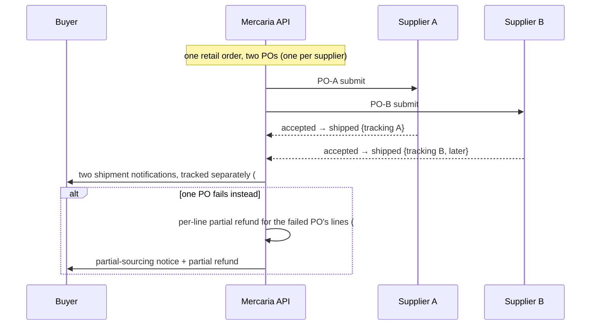
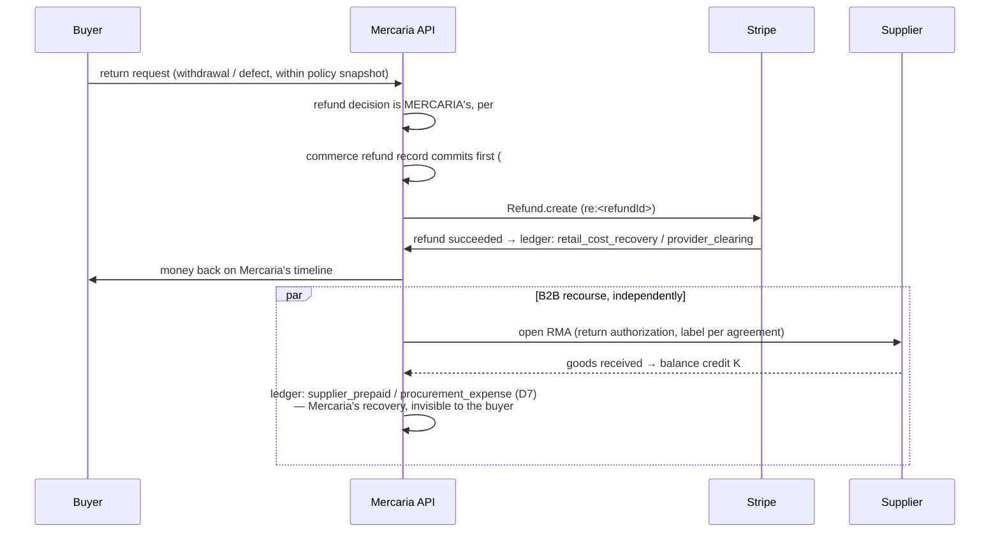
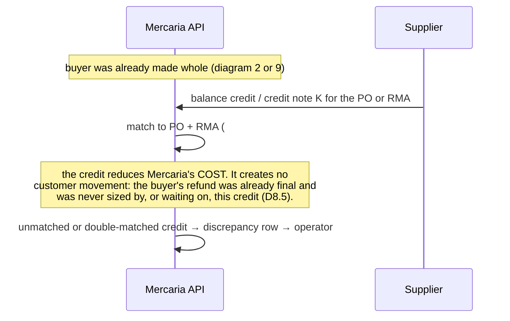
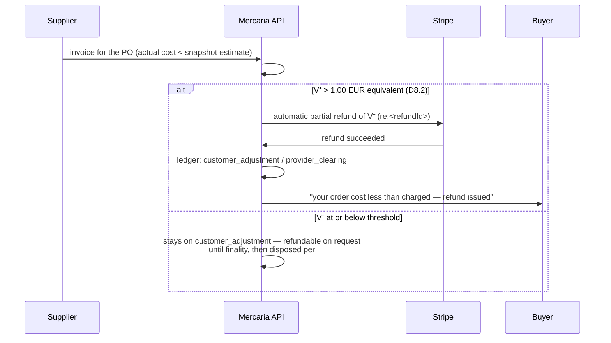

# ADR 0004: Mercaria retail and dropship — commercial roles, zero-markup cost recovery, and Stripe capture boundaries

- **Status:** Accepted
- **Date:** 2026-08-09
- **Issue:** [#117](https://github.com/OxyHQ/Mercaria/issues/117), part of epic [#116](https://github.com/OxyHQ/Mercaria/issues/116)
- **Stripe docs current as of:** 2026-08-09, API release train **Dahlia** (`2026-07-29.dahlia`, unchanged from ADR 0001)

## Context

Mercaria today sells in two modes. **Connected marketplace**: the seller is a
connected merchant, funded under ADR 0001's separate charges and transfers,
with Mercaria's commission living only in the balanced ledger. **External
referral**: no Mercaria order and no Mercaria payment — an outbound link on
which Mercaria may earn affiliate commission. This ADR adds a third,
**`mercaria_retail`**: products Mercaria itself sells to the customer and
procures, per order, from an external B2B supplier who ships directly to the
buyer.

The mode exists to widen the catalogue, not to earn item margin. The binding
commercial policy — set by #117, not invented here — is **zero markup**: the
customer pays exactly what the order costs Mercaria, nothing more, with
planned item profit of zero. That policy is what most of this ADR's structure
defends, because "zero profit" is only true if the pricing formula, the
Stripe sequence, the supplier-payment path and the ledger all make it
*provable* rather than intended.

This ADR does not reopen anything ADR 0001 decided. Merchant of record,
separate charges and transfers, one PaymentIntent per checkout group,
immediate capture, the internal ledger as commission truth, EUR platform
settlement and EEA sellers all stand. It binds the implementation issues of
epic #116 — #118 (suppliers, supply agreements, procurement offers, purchase
orders), #120 (zero-margin landed cost and cost-only pricing policies), #121
(resale authorization, product compliance and market eligibility gates), #122
(live supplier stock, shipping, quote and reservation preflight), #123
(native checkout and Stripe payments for retail fulfilment), #124 (idempotent
supplier adapters and PurchaseOrder orchestration), #125 (first supplier
adapter and bounded pilot), #126 (supplier-fulfilled order, shipment,
tracking and communication flows), #127 (retail cancellations, returns,
warranties, supplier RMAs and refunds), #128 (retail procurement ledger,
supplier invoice reconciliation and zero-profit variance handling) and #129
(transparent offer, checkout and order UX) — so that none of them has to
invent payment, responsibility or pricing semantics.

This ADR covers **Stripe fiat retail checkout only**. It designs no FairCoin
payment. FairCoin is not a payment method in this roadmap; if it is
introduced it arrives through OxyPay — the Oxy gateway that accepts FairCoin
— under its own initiative and its own ADR (D11).

### The three commercial modes, side by side

```text
external_referral
  No Mercaria order or payment
  Mercaria may earn affiliate commission

connected_marketplace
  Seller is the connected merchant
  Stripe Connect separate charges and transfers under #43 (ADR 0001)
  Mercaria may earn marketplace fee under #88

mercaria_retail
  Seller is Mercaria
  Supplier cost is procurement / COGS
  No connected-seller transfer by default
  Zero markup and zero intended item profit
```

A supplier that later becomes a connected Mercaria merchant may participate
in both models, but **each offer and each order chooses exactly one
commercial role before checkout** and the role is immutable afterwards (D1).

### Stripe facts that force the shape (verified against current docs, 2026-08-09)

1. **Card authorization windows are days, not weeks, and vary by brand,
   channel and transaction classification.** Card-not-present: Visa 7 days
   for customer-initiated transactions but **5 days (exactly 4 days 18
   hours) for merchant-initiated**; Mastercard/Amex/Discover 7 days.
   Card-present: Visa 5 days, Mastercard/Amex/Discover **2 days**. Stripe
   and the network classify CIT vs MIT from signals of cardholder
   participation, **not** from API parameters — the window a given
   authorization actually gets is not fully under Mercaria's control
   ([place-a-hold](https://docs.stripe.com/payments/place-a-hold-on-a-payment-method)).
2. **Uncaptured authorizations die silently into `canceled`**: if the
   authorization expires before capture, funds are released and the
   PaymentIntent status becomes `canceled` (same source).
3. **Manual capture is not supported by every payment method.** Cards,
   Affirm, Afterpay, Cash App Pay, Klarna and PayPal support it — each with
   a *different* window (Klarna: midnight of the 28th day; PayPal: 10 days,
   auto-extended to 20; Cash App Pay: 7 days). ACH, iDEAL and SEPA Direct
   Debit do **not**. A single PaymentIntent offering both capturable and
   non-capturable methods requires per-method
   `payment_method_options[…][capture_method]` forks (same source).
4. **One capture per authorization.** A partial capture releases the
   remainder immediately; a second capture for the difference is not
   possible for most payments (multicapture is a gated eligibility program).
   Partial procurement outcomes therefore cannot be expressed as a series of
   captures (same source).
5. **Extended authorization and `capture_method=automatic_delayed` are
   gated programs** — extended holds are eligibility-restricted, and
   automatic delayed capture is a **private preview**. Neither is a
   foundation a launch may build on (same source).
6. **Amount and idempotency**: Stripe's guidance is to create the
   PaymentIntent when the amount is known, keyed idempotently on the
   cart/session identity, and to treat webhooks — never client callbacks —
   as the authority on outcome
   ([payment-intents](https://docs.stripe.com/payments/payment-intents)).

### What already exists and is reused, not rebuilt

The payment domain of ADR 0001 is complete in both directions (#45–#50):
the balanced per-currency ledger with its single writer and trigger
enforcement, the payment outbox (deterministic ids, leased claims, visible
dead-letter), the Stripe event ingress with `(account, eventId)` dedupe, the
refund domain (commerce record commits before the rail is called; restock
exactly once; a failed rail never blocks the buyer), dispute lifecycle, the
reconciliation sweeps and the operator repair surface. **Every recovery this
ADR needs is an application of that machinery, and any design that would
have required new money-movement primitives was rejected for exactly that
reason.**

## Decisions

### D1. `mercaria_retail` is a commercial role, never a payment provider

`PAYMENT_PROVIDER_IDS` in `@mercaria/shared-types` stays exactly
`external | manual_pos | mock | stripe`. A retail order's payment rows are
`provider: 'stripe'`, indistinguishable at the payment layer from a
marketplace charge — because at the payment layer they *are* the same thing:
a card charge Mercaria captured as merchant of record.

The role lives on the **offer and the order**, not on the payment:

- Offers (#118) and orders carry `commercialRole:
  'connected_marketplace' | 'mercaria_retail'` — a closed set (`text` +
  CHECK per `db/schema/CONVENTIONS.md`), chosen **before checkout** and
  immutable afterwards. Existing orders backfill `connected_marketplace`.
  `external_referral` never creates an order, so it does not appear in the
  order-side set.
- A retail order's seller is Mercaria itself: #118 widens
  `Order.sellerType` with **`platform`** (both `storeId` and
  `sellerOxyUserId` NULL, enforced by extending the existing XOR CHECK), and
  `sellerType = 'platform'` ⇔ `commercialRole = 'mercaria_retail'`, also a
  CHECK.
- **No connected-seller transfer exists for a retail order, by
  construction**: transfer creation iterates seller orders with a
  provider-account owner, and `platform` has none. There is no
  `provider_accounts` row for Mercaria on its own rail, and creating one is
  forbidden.
- Suppliers are **not** payment counterparties of the customer rail. #118's
  `Supplier` / `SupplyAgreement` / `PurchaseOrder` models and #124's
  adapters form a **procurement domain** beside the payment domain, with its
  own seam. No supplier type appears in `PAYMENT_PROVIDER_IDS`, ever.

**Prohibited:** a `mercaria_retail` (or any supplier-named) value in
`PAYMENT_PROVIDER_IDS`; inferring the commercial role from the payment
provider or vice versa; a retail order pointing at a connected account.

### D2. Commercial and legal roles

Numbered as in #117 §"Commercial roles to decide"; each is binding.

1. **Mercaria is the named seller to the customer and the merchant of
   record.** The customer's contract of sale is with Mercaria (the platform
   legal entity of ADR 0001 D8 — Spain, confirm before live mode, an open
   item shared with ADR 0001). The buyer's card statement shows Mercaria.
   Mercaria answers to the buyer for everything (item 6).
2. **The supplier is a wholesaler / dropship fulfilment partner, never a
   customer-facing seller.** It sells goods to *Mercaria* (B2B) and performs
   fulfilment to the buyer's address as Mercaria's subcontractor. It has no
   contract with the buyer, no storefront presence, and no connected
   account by virtue of this role.
3. **Mercaria issues the customer receipt and, where required, the customer
   invoice** — its own order confirmation plus the Stripe-branded MoR
   receipt, exactly as ADR 0001 D10, with destination-appropriate VAT.
   The supplier must ship **without** its own invoice or pricing in the
   parcel (a "blind dropship" clause in the supply agreement, verified per
   supplier by #118 and gated by #121).
4. **The supplier invoices Mercaria** for goods, mandatory handling,
   shipping and applicable B2B taxes — one invoice line set traceable to
   one PurchaseOrder (#128 reconciles them one-to-one). Cross-border EU
   supplies use reverse charge per the supplier's and Mercaria's VAT
   registrations.
5. **Mercaria owns the cost-only pricing rule and the customer-facing
   terms.** The formula (D3) and its policy versions (#120) are Mercaria's;
   no supplier sets, sees or approves a customer price. Customer terms
   (withdrawal, guarantee, returns) are Mercaria's documents, snapshotted
   per order (D9.7).
6. **Mercaria owns customer service, cancellation, statutory withdrawal,
   returns, warranty, product defects, recalls and chargebacks** — the
   entire customer relationship. Supplier RMA, credit and recall logistics
   are Mercaria↔supplier B2B flows (#127) that never gate the customer's
   rights or refund timeline. In the launch market this means the EU 14-day
   withdrawal right and Spain's three-year legal conformity guarantee
   (LGDCU as amended by RDL 7/2021) are Mercaria's to honour, whatever the
   supply agreement says about recourse.
7. **The supplier receives fulfilment data only, for fulfilment only**:
   recipient name, shipping address, phone number where the carrier
   requires it, the line items and the selected shipping service. It never
   receives the buyer's email (a Mercaria-owned relay address per order is
   provided where the supplier's system demands one), payment details, Oxy
   identity, or order history. Purpose limitation, no-marketing and
   deletion-after-retention clauses are mandatory in every supply agreement
   (D10).
8. **Disclosure**: customer-facing terms and the offer UX (#129) disclose
   that the item is fulfilled by a third-party partner from the partner's
   stock. The supplier's *identity* is disclosed where law requires it —
   product-safety traceability under GPSR (manufacturer/importer identity
   on the listing where applicable, #121), customs/transport documents, and
   any lawful customer demand — and is otherwise not marketed. Mercaria
   remains the seller in every disclosure.
9. **Launch countries, entity, tax registrations**: platform entity Spain
   (ADR 0001 D8), buyers in the EU, suppliers shipping **from within the EU
   customs territory** only — so no customs duties, no import VAT at the
   buyer, no IOSS at launch. Mercaria charges destination VAT under the EU
   OSS regime through the existing `TaxRate` engine. Mercaria is **not** an
   importer of record at launch; any supplier shipping from outside the EU
   is ineligible (#121 gate). Extending beyond the EU is a new decision
   with its own tax review, not a configuration change.
10. **Why an affiliate relationship, a public API or a consumer retail
    account is insufficient authority for resale**: an affiliate agreement
    grants *linking and commission* rights, not the right to resell or to
    place orders for third parties; a public retail API's terms typically
    prohibit commercial resale and automated purchasing for others; and a
    consumer retail account transacts under consumer terms — quantity caps,
    personal-use clauses, no B2B invoice (so no input-VAT deduction and a
    broken warranty chain), no product-safety traceability obligations
    accepted by the counterparty, and terminable without notice.
    `mercaria_retail` therefore requires a **written supply agreement**
    that grants resale and direct-to-customer fulfilment under Mercaria's
    checkout (#118 models it; #121 refuses eligibility without it; item 4
    of the compliance review in D12 verifies the clause). A source that
    cannot sign one is `external_referral` material, not a supplier.

### D3. The cost-only formula, its components and its prohibitions

The formula, verbatim from #117 and binding:

```text
customer amount
  = authoritative supplier acquisition cost
  + unavoidable directly attributable fulfilment costs
  + legally applicable customer taxes / duties
  + only other actual order-specific costs approved by policy

planned Mercaria item profit = 0
markup = 0
margin target = 0
```

**Allowed cost components** — a closed, enumerated set, each requiring
evidence (a supplier quote line, a carrier tariff, a provider balance
transaction, or an invoice line #128 can reconcile):

1. **Supplier item cost**, per the authoritative preflight quote (#122).
2. **Mandatory supplier handling/packaging fees** stated on the quote.
3. **Destination-specific shipping** actually charged by the supplier or
   carrier for this order.
4. **Actual attributable FX cost**, where lawful to pass through — the
   measurable conversion cost on this order's supplier settlement, captured
   as an `FxRateSnapshot`, never a padded "FX buffer".
5. **Actual attributable payment-processing cost**, where lawful to pass
   through — estimated at charge from the provider's published pricing,
   trued up against the charge's real balance-transaction fee at
   reconciliation (D8.7).
6. **Legally applicable customer taxes/duties** — destination VAT at
   launch; customs duties are structurally zero at launch (D2.9).
7. **Other actual order-specific costs approved by a written pricing-policy
   version** (#120) — each one named, evidenced and versioned before it may
   appear in any quote.

**Prohibited, explicitly and mechanically** (#120 must refuse these at
policy validation, and the ledger proof in D7 makes a violation visible):

- percentage markup of any kind;
- fixed per-order or per-item profit;
- minimum gross-profit requirements;
- general platform-overhead allocation (hosting, staff, support desks);
- risk, support, returns or chargeback **reserves added to price** — these
  are real costs (D12.5) and they are funded outside the customer amount;
- referral expense or any affiliate economics;
- upward psychological price rounding — rounding exists only to the
  presentment currency's minor unit, half-even (the existing pricing-engine
  convention), and any rounding residue is **variance** (D8), never kept.

**An unknown direct cost is never zero.** If the preflight (#122) cannot
produce an authoritative quote for every applicable component, checkout
**refuses the line** (fail closed). A retail offer with an unquotable cost
is not purchasable, in the same way an unready seller's group is refused
under ADR 0001 D9.

**Post-lock increases**: once the customer total is locked (D4's freeze), a
cost increase discovered **before** charge requires an explicit new customer
acceptance of a revised total (a fresh quote and a fresh checkout — never a
mutation of a confirmed intent). Discovered **after** charge, Mercaria
absorbs it: within the absorption cap (default **10% of the order total or
25 EUR equivalent, whichever is greater**, operator-configurable per
policy version) Mercaria procures at the higher cost and eats the
difference; beyond the cap Mercaria may decline to procure and issue a
**full compensating refund** — the customer is made whole and is never
surcharged. Both branches are diagrammed (diagrams 3 and 14).

### D4. Stripe sequence: immediate capture, procurement after funding, idempotent compensating refund

Of #117's three options, this ADR selects **option 2**: **immediate capture,
then supplier order creation, with an idempotent compensating refund if
procurement fails.** Option 1 (manual authorization, capture after supplier
acceptance) is rejected. Option 3 (another sequence) offers nothing the
verified facts support: automatic delayed capture is a private preview
(fact 5) and cannot anchor a launch.

**Why option 1 loses, on evidence rather than taste:**

1. **The authorization window is too short and not under Mercaria's
   control.** 2–7 days depending on brand, channel and a CIT/MIT
   classification Stripe derives from participation signals, not API flags
   (fact 1). Supplier acceptance plus operator exception handling does not
   reliably fit inside the *minimum* of that range, and an expired
   authorization silently becomes `canceled` (fact 2) — turning every slow
   supplier into a lost, already-promised order. ADR 0001 rejected delayed
   capture for marketplace fulfilment on the same clock; retail procurement
   is not faster.
2. **It breaks the one-PaymentIntent-per-group invariant on mixed carts.**
   ADR 0001 D4 mandates one PaymentIntent for the whole checkout group.
   `capture_method` is set per intent (per-method forks change *which
   methods* capture manually, not *which orders*): a cart holding a
   marketplace order and a retail order would need the marketplace share
   captured immediately (D3 of ADR 0001) and the retail share held — and
   one capture per authorization (fact 4) makes "capture the marketplace
   share now, the retail share later" impossible. Manual capture would
   force either two intents per cart (reopening ADR 0001 D4) or delayed
   capture for marketplace orders (reopening ADR 0001 D3).
3. **Partial procurement cannot be expressed as captures.** One capture,
   remainder released (fact 4). A three-supplier retail order with one
   failed supplier needs "capture two thirds now and the rest never" — an
   exact description of a partial capture — but then a *second* supplier
   failure has no second capture to shrink. Refunds compose; captures do
   not.
4. **It narrows payment methods and forks the integration.** Manual capture
   excludes or complicates methods per fact 3; ADR 0001's launch set
   (cards + card wallets) all capture immediately today through one code
   path.
5. **It buys almost nothing.** The only gain is avoiding a refund when
   procurement fails. Refunds are a built, tested, idempotent path
   (#49) with per-line partials — whereas expiring authorizations,
   capture-window monitoring and per-brand clocks are all new machinery
   with silent failure modes.

**The selected sequence** (diagram 1 shows it end to end):

1. **Quote and freeze.** Checkout preflight (#122) obtains an authoritative
   supplier quote (stock, cost components, shipping, acceptance-deadline
   and reservation capability), and #120's policy composes the cost-only
   customer amount (D3). The result is a **`CostQuoteSnapshot`** pinned to
   the order: every component, its evidence reference, the quote id, the
   quote TTL, the FX snapshots, and the policy/compliance versions (D9.7).
   The snapshot is content-hashed; the PaymentIntent amount is computed
   from the snapshot and nothing else, and the intent's amount is **never
   updated after confirmation begins**.
2. **Checkout, unchanged.** One PaymentIntent per checkout group, immediate
   capture, `pi:<paymentId>` idempotency, webhook-only truth — ADR 0001
   D3/D4/D11 verbatim. Retail contributes one order to the group (D5).
3. **Funding.** `payment_intent.succeeded` → orders `paid`, ledger booked
   (retail rows per D7). The customer's money is now fully captured and the
   customer amount can never rise again.
4. **Procurement.** The paid transition of a retail order enqueues
   `procurement_requested` payment-outbox rows — deterministic id
   `po:<orderId>:<supplierId>` — from which #124 creates one PurchaseOrder
   per supplier and submits it through the supplier adapter, idempotent on
   the PurchaseOrder id. The supplier accepts, rejects, or times out
   against the snapshotted acceptance deadline.
5. **Recovery is a refund, never a new primitive.** Any procurement failure
   (rejection, stock-out, timeout, over-cap cost increase, partial failure)
   resolves through the **existing refund domain**: a compensating refund —
   full or per-line partial — created idempotently from the failure event
   id, committed commerce-first (#49), executed via `re:<refundId>`. The
   order (or the affected lines) cancels; the customer is notified (#126).

**The fifteen concerns of #117, answered:**

1. **Authorization-window expiry and unsupported methods.** No
   authorization is ever held, so no window exists to expire and no
   method's capture support matters. The launch method set stays ADR
   0001's (cards + card-based wallets), one code path, immediate capture.
   The verified windows (facts 1–3) are recorded above as the reason this
   is not revisited casually.
2. **SCA / 3DS and return flows.** Unchanged from ADR 0001: one intent,
   one SCA challenge, outcome learned from the signed webhook only. A
   supplier quote may expire while the buyer sits inside a 3DS challenge;
   the charge still completes at the frozen amount (the intent is never
   mutated after confirmation starts), and procurement then runs against
   the frozen snapshot — if the supplier no longer honours it, that is
   concern 6's path, never a price change. Diagram 4.
3. **Guest-session loss after authorization.** Payment truth is
   webhook-driven, so losing the browser session between SCA redirect and
   return loses nothing: the charge lands, procurement proceeds with no
   customer action required, and the guest regains access to the order
   through #101's guest order access (signed, order-scoped). Retail adds
   no new session dependency and no new auth surface.
4. **Suppliers that cannot reserve inventory.** The quote records its
   reservation strength (`none | soft | hard`) in the snapshot. A
   non-reserving supplier widens the window in which capture succeeds but
   procurement fails — an accepted, bounded risk of this sequence, priced
   at zero (reserves in price are prohibited) and paid for by the
   compensating-refund path, which is identical for all three strengths.
   One code path serves every supplier; #122 merely shrinks the window
   where the supplier allows it.
5. **Supplier timeout.** Every PurchaseOrder carries an acceptance
   deadline from the supply agreement (policy default **48 hours**),
   snapshotted at checkout. On expiry #124 cancels the PO and triggers the
   compensating refund for the affected lines automatically; the customer
   is notified (#126). Late acceptance after that is concern 9.
6. **Cost or shipping changes between cart and procurement.** Before
   charge: re-quote and explicit customer acceptance of a new total, or no
   sale. After charge: Mercaria absorbs within the cap, or cancels the
   affected lines with a full refund beyond it (D3). The charged amount
   never increases, in any branch. Diagrams 3 and 14.
7. **Multi-supplier retail checkout.** One retail order per checkout group
   (Mercaria is one seller — D5), one PurchaseOrder per supplier under it,
   procurement independent per PO, failures resolved per line with partial
   refunds. Funding stays atomic at the group level (ADR 0001 D4).
8. **Mixed connected-marketplace and Mercaria-retail checkout.** One
   group, one PaymentIntent, one SCA challenge. Marketplace sibling orders
   transfer per ADR 0001 D3; the retail order's share **never enters
   transfer creation or commission arithmetic** — `settlement-shares.ts`'s
   allocation runs over all orders so the split is exact, but the retail
   share stays on the platform balance and books to retail accounts (D7).
   Marketplace commission remains "charge minus the sum of seller nets"
   *over marketplace orders only*; the retail share is excluded from that
   residual by construction. Diagram 6.
9. **Late supplier acceptance after cancellation or refund.** PO
   cancellation is a first-class idempotent adapter operation. An
   acceptance arriving after Mercaria cancelled or refunded is answered
   with a cancellation request; if the supplier already shipped, #127's
   return-to-supplier RMA runs, and an unrecoverable cost books as an
   absorbed loss (D7). The buyer is never re-charged and a refunded order
   is never un-refunded — there is no code path that could, because the
   refund is a committed commerce record. Diagram not required by #117's
   list but covered inside diagrams 2 and 9's machinery.
10. **Duplicate Stripe events and supplier callbacks.** Stripe: the
    existing `(stripeAccountId, eventId)` unique claim and
    status-reachability re-read (#48). Supplier callbacks: #124 must give
    every supplier event a deterministic id and claim it through a
    Postgres-backed `INSERT … ON CONFLICT DO NOTHING … RETURNING` store —
    the moderation-event pattern, required because Mercaria runs several
    ECS tasks. Duplicate checkout submission: the existing
    `Idempotency-Key` claim plus the one-payment-per-group partial unique
    index. Duplicate PO submission: adapter idempotency on the
    PurchaseOrder id. Diagram 5.
11. **Partial procurement failure.** Failed lines cancel with a per-line
    compensating partial refund (the refund domain already speaks per-line
    quantities); fulfilled lines proceed; the order lands in the existing
    `partially_refunded` vocabulary. The refund is created idempotently
    from the PO-failure event id, so a re-delivered failure converges.
    Diagram 7 (split shipment) and 2 (failure) together cover it.
12. **Refund, dispute and chargeback funding.** There is no connected
    seller to reverse: refunds, disputes and chargebacks on retail orders
    are funded **entirely from the platform balance**. Recovery from the
    supplier (RMA credit, claims for supplier fault) is a separate B2B
    flow (#127, #128) that never gates the customer's money or timeline.
    Dispute fees are Mercaria's expense. This risk is real and is
    deliberately **not** priced into the customer amount (D3); it is
    covered by D12.5's insurance/loss budget. Diagrams 9, 10, 11.
13. **Feature rollback with pending operations.** `MERCARIA_RETAIL_ENABLED`
    gates **entry only** — offer visibility and new retail checkouts. It
    never gates the outbox, PO orchestration, refunds or reconciliation
    (the durable record and its loops keep draining; the payments rule
    "gate the loop, never the durable record" applies with entry as the
    gated thing). Rollback: disable the flag; in-flight POs finish or
    cancel; the operator may bulk-cancel unaccepted POs, which triggers the
    standard compensating refunds; accepted POs fulfil to completion. No
    retail table is dropped and no migration reversed while any retail
    order or PO is non-final. Diagram 12.
14. **Provider-neutral records without OxyPay/FairCoin code.** No new
    provider id (D1); the procurement domain never imports a Stripe module
    (the supplier seam is beside, not inside, `PaymentProvider`); no type,
    column, flag, mock or test names OxyPay or FairCoin (D11). A future
    rail plugs into the same seams a marketplace payment uses, exactly as
    ADR 0001's last consequence already states.
15. **Cost freeze and margin-free reconciliation.** The `CostQuoteSnapshot`
    is frozen and hash-pinned **before** the PaymentIntent is created; the
    charged amount is a pure function of it. Reconciliation (#128)
    compares actuals per component against the snapshot; every variance
    resolves under D8 into a customer adjustment or an absorbed cost — the
    ledger structure of D7 leaves **no account in which a retail margin
    could accumulate**, which is what "reconciled without recognizing a
    margin" means mechanically.

**Pinned assumptions** (as #117 requires): Stripe API `2026-07-29.dahlia`
(code constant, per ADR 0001); launch methods cards + card-based wallets;
launch market EEA buyers / Spain entity / EUR platform settlement (ADR 0001
D8); authorization-window and manual-capture facts verified 2026-08-09
against the two Stripe pages cited above. Any change to these re-opens D4's
rejection reasoning, not silently.

### D5. Checkout composition: one retail order per group, one PurchaseOrder per supplier

- A checkout group's retail lines form **one retail order** with
  `sellerType: 'platform'` — "one immutable order per seller" holds
  literally, Mercaria being one seller. Marketplace lines keep forming one
  order per connected seller, unchanged.
- Under the retail order, #118/#124 create **one PurchaseOrder per
  supplier**. The PO — not the order — carries procurement state, supplier
  references, the drawn cost and the shipment set. Split shipments and
  per-line cancellation resolve at the PO/line grain (D9.6).
- **Local inventory is not reserved for retail lines.** There is no
  `InventoryLevel` for supplier stock and no reservation row; availability
  is the preflight's answer (#122) bounded by the quote TTL. The
  reservation step of checkout is a structural no-op for retail lines, and
  the oversell risk this leaves is exactly the procurement-failure risk D4
  already prices at "compensating refund". Listing `status` remains the
  catalogue/moderation lever, unchanged.
- Mixed groups (marketplace + retail) change nothing about funding
  atomicity: the whole group's PaymentIntent succeeds or none of it does
  (ADR 0001 D4). Divergence begins after funding, per order — and for the
  retail order, per PO.
- The retail order's **shop currency is the platform settlement currency**
  (EUR, ADR 0001 D8): Mercaria is the seller, so its accounting side and
  the platform side coincide. Presentment stays the buyer's choice;
  `DualMoney` carries both, unchanged.

### D6. Supplier payment: prefunded balance, B2B procurement, never Connect transfers

Numbered as in #117 §"Supplier payment decision".

1. **The launch mechanism is a prefunded supplier balance.** Mercaria
   deposits funds with the supplier ahead of demand (SEPA credit transfer
   from Mercaria's operating bank account); PurchaseOrders draw against
   the balance. A pilot supplier (#125) must support balance or
   equivalent deposit accounting; top-ups are operator-initiated with a
   low-balance alert threshold per supplier.
2. **A supplier-charged business card is rejected at launch.** Card
   credentials held at N supplier portals, per-transaction FX and
   surcharges, and weak duplicate control make it strictly worse than a
   balance. If a later supplier genuinely requires cards, that is a
   dedicated virtual-card program with single-use, PO-bound numbers under
   its own review — not a stored corporate card.
3. **Invoice terms (net-N, settled by SEPA credit transfer) are the one
   sanctioned alternative**, available only where the supply agreement
   grants credit terms. Nothing else — no wallets, no crypto, no
   marketplace gift balances — is an approved B2B mechanism.
4. **When payment occurs:** a balance draw happens at **supplier
   acceptance** of the PO, never at submission — a rejected or expired PO
   must cost nothing. Under invoice terms, payment follows the reconciled
   invoice (#128), not the PO. Prefund top-ups are demand-driven treasury
   operations, not per-order events.
5. **Credential and instrument security:** supplier API keys and portal
   credentials live in SSM under `/oxy/mercaria/suppliers/*` through the
   existing GitHub-secrets pipeline (never placeholders); no card PANs are
   stored anywhere in Mercaria; bank transfers are initiated from the
   banking side under dual control, outside the application — the app
   records treasury movements, it does not execute them. Adapter
   credentials are per-supplier and least-privilege.
6. **Duplicate supplier-charge detection:** every draw carries the
   PurchaseOrder id as its external reference; the adapter is idempotent
   on it; and #128's reconciliation matches supplier statement lines to
   POs **one-to-one**, raising a discrepancy row (the #50 pattern) for any
   unmatched or double-matched draw. A duplicate that slips a supplier's
   own dedupe is therefore caught by the statement, not by hope.
7. **Supplier refunds and credits** (RMA outcomes, rejected-PO reversals,
   goodwill credits) arrive as balance credits or credit notes, are
   matched to their PO and RMA, and book per D7. They are **never netted
   against a customer's refund rights**: the customer's refund executes on
   Mercaria's decision and timeline regardless of whether the supplier has
   credited Mercaria (D8.5, diagram 11).
8. **Why Stripe Connect transfers are not used for suppliers:** a Transfer
   moves marketplace settlement money from the platform's Stripe balance
   to a *connected account* of a party selling on the platform. The
   supplier is not selling on the platform (D2.2); onboarding it to
   Connect would misstate the relationship to Stripe, create a false
   `merchant_payable`, entangle B2B procurement with the customer rail's
   balance and its reversal/dispute machinery, and put consumer-rail KYC
   around a wholesale counterparty. Procurement is Mercaria **buying** —
   an accounts-payable problem — and it stays on bank rails.

### D7. Ledger: procurement accounts and the zero-profit proof

The ledger rules of #45 are unchanged and non-negotiable: one writer,
per-currency zero-sum, positive is a debit, trigger-enforced immutability,
corrections are reversing transactions. Retail adds **accounts and
transaction kinds, never mechanisms**.

**New ledger accounts** — added to `LEDGER_ACCOUNTS` by #128 *together with*
the code that writes them and the migration widening the CHECK (the
closed-set rule in `payment.ts`), named here bindingly:

| Account | Normal side | What a movement means |
|---|---|---|
| `supplier_prepaid` | debit | Mercaria's money on deposit with a supplier grew (top-up, credit) or shrank (PO draw) |
| `platform_funds` | credit | Mercaria's own out-of-band cash entered or left the payment domain (prefund top-ups, direct fulfilment costs) |
| `procurement_expense` | debit | goods/fulfilment cost was incurred for a retail order (COGS) |
| `retail_cost_recovery` | credit | a customer paid Mercaria's costs back (the retail counterpart of revenue — bounded by cost, by construction) |
| `customer_adjustment` | credit | a positive variance is owed back to a buyer and not yet refunded |

`supplier_prepaid` and `customer_adjustment` are carried per owner
(supplier id; buyer/order), the way `merchant_payable` names its seller.

**Retail ledger representability** (the gate for #128, in ADR 0001's
format):

| Event | Debit | Credit |
|---|---|---|
| Prefund top-up (T) | supplier_prepaid (T) | platform_funds (T) |
| Retail charge succeeded (gross G, provider fee F) | provider_clearing (G−F), processor_expense (F) | retail_cost_recovery (G) |
| PO draw at supplier acceptance (cost S) | procurement_expense (S) | supplier_prepaid (S) |
| Attributable fulfilment cost paid directly (L) | procurement_expense (L) | platform_funds (L) |
| Positive variance recognized (V⁺) | retail_cost_recovery (V⁺) | customer_adjustment (V⁺) |
| Customer adjustment refunded | customer_adjustment (V⁺) | provider_clearing (V⁺) |
| Compensating refund (procurement failed, amount R) | retail_cost_recovery (R) | provider_clearing (R) |
| Supplier credit / RMA reversal (K) | supplier_prepaid (K) | procurement_expense (K) |
| Chargeback on a retail order (amount D, fee f) | disputes (D), processor_expense (f) | provider_clearing (D+f) |

New `LedgerTransactionKind` values (same closed-set rule, landed by #128):
`prefund_top_up`, `procurement_settled`, `retail_variance`,
`supplier_credit`. Retail charges and refunds reuse `charge_succeeded` and
`refund` — they are the same physical events.

**The zero-planned-profit proof, as queries, not intentions:**

1. **No commission**: no `commission_revenue` entry may reference a retail
   order, ever. Commission computation refuses `mercaria_retail` orders
   outright (a pinned test in #123, per acceptance criterion 12).
2. **Recovery is bounded by cost**: for every retail order at its finality
   point (D8.6), net `retail_cost_recovery` (credits minus variance
   extractions and refunds) is **≤** the order's attributable debits to
   `procurement_expense` + `processor_expense`. Equality is the fully
   recovered case; strict inequality is Mercaria absorbing a loss. It can
   never exceed cost, because the excess was extracted to
   `customer_adjustment` before finality — that extraction is what #128's
   variance handling *is*.
3. **Temporary variance is classified, not hidden**: before finality, an
   order's open recovery balance is reported as **unsettled cost
   adjustment** — reports must never present `retail_cost_recovery` (or
   any derived figure) as margin, and retail gross is reported as
   cost-recovery turnover, separate from marketplace GMV and commission
   (D9.10).

Note on Stripe's fee in a full compensating refund: the charge booked
`processor_expense (F)`; Stripe does not return F on refund; after the full
refund the platform is out exactly F, already visible in
`processor_expense`. Nothing needs re-booking, and the customer got 100%
back — the absorbed fee is D8.7's case (b).

### D8. Cost variance and the customer adjustment rule

Numbered as in #117 §"Cost variance and customer adjustment decision".

1. **The four amount classes.** *Quoted*: the supplier preflight quote's
   components, valid for the quote TTL. *Guaranteed*: the customer amount
   at charge — frozen, and it may never increase thereafter, in any
   branch, for any reason. *Provisional*: components estimated at charge
   pending actuals (the payment-processing fee estimate, the FX estimate).
   *Actual*: the supplier invoice lines, the charge's real
   balance-transaction fee, the realized FX and fulfilment costs. The
   snapshot records which class each component was in at charge.
2. **Rounding tolerance:** the only permitted rounding is to the
   presentment currency's minor unit, half-even, per component and once at
   the total (the existing pricing-engine reconciliation). The materiality
   threshold for *automatic* adjustment is **1.00 EUR equivalent per
   order**; it bounds automation, never classification — sub-threshold
   variance is still variance (item 3).
3. **Positive variance is the customer's, structurally.** When actuals
   land below the guaranteed amount, the difference is extracted to
   `customer_adjustment` (D7) — above the threshold it auto-refunds
   through the standard refund path under #128; at or below it, it remains
   on `customer_adjustment`, refundable on request until finality, then
   disposed by #128's adjustment policy. **In no branch does any of it
   reach `commission_revenue` or any revenue figure** — there is no
   account for it to land in as revenue (D7's proof 2). Diagram 13.
4. **Negative variance is absorbed, never charged later.** When actuals
   land above the guaranteed amount, Mercaria's costs simply exceed its
   recovery — visible in the ledger as proof-2's strict inequality. There
   is no surcharge mechanism, no follow-up invoice, no "price correction"
   path; nothing in #123–#128 may build one. Beyond the absorption cap and
   *before procurement*, the escape is cancel-and-refund (D3); after
   procurement, absorption is unconditional. Diagram 14.
5. **Supplier credits are separate from customer rights.** A supplier
   credit after a return, RMA or claim books `supplier_prepaid` /
   `procurement_expense` (D7) on Mercaria's side of the wall. The
   customer's refund was decided and executed on Mercaria's timeline under
   #127's policy — never contingent on, sized by, or delayed for the
   supplier credit. Diagram 11.
6. **The finality point** closing an order's cost reconciliation is the
   **latest** of: the supplier invoice for its POs settled and reconciled;
   the return/withdrawal window of the order's policy snapshot expired or
   its returns resolved; and any open dispute closed — bounded at **180
   days after delivery** as an operational ceiling. After finality:
   recovery is closed at ≤ cost, sub-threshold adjustments are disposed
   per #128's policy, and late supplier-side movements book against
   procurement accounts only, never reopening the customer side.
7. **Non-refundable Stripe fees** are handled by cause: (a) as a *cost
   component* (D3.5), the fee charged to the customer is trued to the
   actual balance-transaction fee — any over-estimate is positive variance
   (item 3), and the estimate is never padded; (b) on a **full refund for
   procurement failure**, the customer receives 100% of the guaranteed
   amount back and Mercaria absorbs the unreturned fee (already booked as
   `processor_expense`, see D7's note); (c) on customer-initiated returns,
   fee treatment follows the order's snapshotted returns policy — and
   whatever that policy says, a retained fee may never exceed the actual
   fee, because retention beyond cost has no account to sit in.
8. **The ledger proof** is D7's: no commission entry, recovery bounded by
   cost at finality, open balances classified as unsettled cost
   adjustment. #128 must land these as executable checks (a reconciliation
   sweep kind plus pinned tests), not documentation.

### D9. Customer and order semantics

Numbered as in #117 §"Customer and order semantics".

1. **"Confirmed" means supplier-accepted.** Customer-facing copy may call
   an order *confirmed* only after every PO under it is accepted. Between
   charge and acceptance the truthful state is "payment received — we are
   confirming availability with our fulfilment partner", and #129's UX
   must show exactly that, not "confirmed".
2. **Statuses.** The order keeps the existing vocabulary —
   `pending_payment → paid → processing → shipped → delivered`, with
   `cancelled` / `refunded` / `partially_refunded` as exits. One retail
   binding: a retail order enters `processing` **only** on PO acceptance
   (all POs accepted, or the failed ones already resolved per-line).
   Procurement detail lives on the PurchaseOrder state machine (#118/#124):
   `draft → submitted → accepted → shipped → delivered`, exits
   `rejected | expired | cancelled`, with `cancel_requested` as the overlay
   between a cancellation ask and the supplier's answer:

   ```mermaid
   stateDiagram-v2
       [*] --> draft
       draft --> submitted: adapter submit (idempotent on PO id)
       submitted --> accepted: supplier accepts before deadline
       submitted --> rejected: supplier rejects / stock gone
       submitted --> expired: acceptance deadline passes
       submitted --> cancel_requested: customer cancels
       accepted --> shipped: supplier ships (per-shipment)
       accepted --> cancel_requested: cancellation attempt
       cancel_requested --> cancelled: supplier confirms cancel
       cancel_requested --> accepted: too late — RMA path (#127)
       shipped --> delivered
       rejected --> [*]
       expired --> [*]
       cancelled --> [*]
       delivered --> [*]
   ```

   The retail overlay on the order's own lifecycle — same vocabulary,
   one added constraint:

   ```mermaid
   stateDiagram-v2
       [*] --> pending_payment
       pending_payment --> paid: payment_intent.succeeded (webhook)
       pending_payment --> cancelled: reservation sweep / payment failed
       paid --> processing: ALL POs accepted (retail-only constraint)
       paid --> cancelled: procurement failed → compensating refund
       paid --> partially_refunded: partial procurement failure
       processing --> shipped: first shipment (per PO)
       shipped --> delivered
       processing --> partially_refunded: partial cancellation
       delivered --> refunded: return accepted (#127)
       delivered --> partially_refunded: partial return
       partially_refunded --> refunded
       cancelled --> [*]
       refunded --> [*]
       delivered --> [*]
   ```

3. **Local inventory is not reserved** for retail lines (D5): no
   `InventoryLevel`, no reservation rows; "in stock" on a retail offer
   means "the supplier preflight said so within the quote TTL", and #129's
   UX words availability accordingly. The residual oversell risk resolves
   as procurement failure → refund, never as a backorder the customer
   didn't choose.
4. **Procurement-failure communication** (#126): automatic, prompt, and
   honest — the item could not be sourced, the refund (full or of the
   affected lines) is already initiated, funds timeline included. No dark
   patterns: no "delayed" euphemism for a failed order, no store-credit
   substitution for a money refund.
5. **No silent substitution, ever.** A substitute (different variant,
   model-year, colour, equivalent brand) requires a **new explicit
   customer acceptance** of the concrete substitute at a cost-only price —
   the default on any mismatch is refuse-and-refund. #124 must treat a
   supplier's "shipped an equivalent" as a non-conforming fulfilment
   (#127 RMA), not a success.
6. **Split shipments and partial cancellations** resolve at the
   PO/shipment/line grain: each PO ships independently (diagram 7), each
   shipment is tracked separately (#126), and a partial cancellation
   cancels lines with a per-line partial refund, landing the order in the
   existing `partially_refunded` vocabulary.
7. **Snapshots.** A retail order pins, immutably and content-hashed:
   the listing price snapshot; the full `CostQuoteSnapshot` (every
   component with its evidence reference, supplier quote id, TTL,
   reservation strength, acceptance deadline, FX snapshots); the pricing
   policy version (#120); the compliance/eligibility verdict and version
   (#121); the customer terms version; and the supply agreement id and
   version. Nothing the checkout composed may vary between two readings —
   the moderation-envelope determinism rule, applied to money.
8. **Guest order access** is #101's, applied unchanged: signed,
   order-scoped access for tracking, cancellation and refunds; account
   claiming later. Retail introduces no additional identity surface and no
   supplier-facing customer credential.
9. **Shipping promises**: Mercaria owns the customer-facing delivery
   promise, derived from the supplier quote's stated service and transit
   range, snapshotted on the order. The supplier's carrier performs
   carriage for supplier-shipped parcels. Moovo's responsibilities are not
   duplicated: no shipping zones or rates are built (the standing rule);
   the existing `order.shipping` seam records the promise and the actuals,
   and Moovo integration remains its own concern.
10. **Operator and accounting distinctness.** `commercialRole` filters
    every operator list, trace and report. Retail money is structurally
    distinct in the ledger (D7's accounts); reports present retail as
    cost-recovery turnover, never blended into marketplace GMV or
    commission. The payment trace (#50) shows the same five handles —
    retail adds PO ids *within* an order's trace, not a new entry point.
11. **No retail-margin revenue event exists for referral logic to
    consume.** Retail orders emit no commission event and no margin
    event; referral/affiliate accounting keys on commission events, so a
    retail order is invisible to it by construction — and referral expense
    is a prohibited price component (D3), so referral logic cannot alter
    the customer cost from the other side either. `external_referral`
    remains a different mode with no Mercaria order at all.

### D10. Security and privacy boundaries

| Concern | Owner | Mechanism |
|---|---|---|
| Card data | Stripe | unchanged from ADR 0001 — SDK/Element only, PCI SAQ-A; suppliers never see any payment detail |
| Customer PII to suppliers | Backend (#124) | fulfilment-only projection (D2.7): name, address, carrier phone, lines, service; per-order relay email where demanded; explicit allow-list projection, never a spread of the order |
| Supplier credentials | Infra + backend | SSM `/oxy/mercaria/suppliers/*`, per-supplier, least-privilege; no PANs anywhere (D6.5) |
| Supplier callbacks | Backend (#124) | signature or shared-secret verification per adapter; raw-body mount if a signature scheme requires it (the standing webhook invariant); deterministic event ids + Postgres-backed dedupe claim |
| Bank movements | Treasury (human) | initiated bank-side under dual control; the app records, never executes (D6.5) |
| Cost snapshot integrity | Backend (#120/#122) | `CostQuoteSnapshot` content-hashed at freeze; the charged amount is a function of the hash-pinned snapshot; reconciliation compares against the same snapshot |
| Supplier data retention | Backend + contract | purpose limitation and deletion clauses in every supply agreement; fulfilment data shared per order, not by feed |
| Mass assignment / IDOR | Backend | PO and supplier records are server-composed; no client-supplied supplier ids on checkout beyond the offer's own binding; `.strict()` schemas (existing convention) |
| Payloads | Backend | supplier payloads redacted by allow-list before storage/logs — `services/payments/redact.ts`'s rule, applied to the procurement domain |

### D11. OxyPay and FairCoin: the non-implementation boundary

Numbered as in #117 §"OxyPay and FairCoin boundary", and consistent with
the decided boundary already recorded across the payment domain (commit
`ab50d17`):

1. **FairCoin is not an implemented payment method in this initiative** —
   it is not a payment method in this roadmap at all.
2. **If FairCoin is introduced, it arrives through OxyPay** — the Oxy
   gateway that accepts FairCoin — under its own initiative and its own
   ADR.
3. **Nothing is created here that anticipates it**: no OxyPay/FairCoin
   adapter, mock, feature flag, wallet, quote surface, refund path or
   checkout option, no provider id, no column, no contract test.
4. **No fiat/FairCoin automatic conversion is designed.** FAIR remains a
   catalog/display currency per the existing multi-currency rules; nothing
   in retail pricing converts to or settles in it.
5. **OxyPay's existence or availability cannot affect** Stripe
   eligibility, supplier selection, the customer's cost-only amount,
   organic ranking, or referral behaviour — there is no code point at
   which it could, and none may be added.
6. **A future OxyPay initiative defines its own behaviour** behind the
   same `PaymentProvider` seam every rail uses, adding its own provider id
   with its own migration, per the closed-set rule.
7. **Existing Stripe history is immutable** — ledger entries, payments,
   events and reconciliation records are append-only today and stay so; a
   future rail changes nothing retroactively.
8. **#51 is closed `not planned` and is not a dependency** of this ADR or
   of any #116 child issue.

### D12. Compliance and provider review — launch gates

Numbered as in #117 §"Compliance and provider review". Each is a **gate on
#125's pilot going live**, with an owner; none is satisfied by this
document existing.

1. **Stripe account disclosure**: the live platform account's business
   profile must accurately disclose Mercaria's physical-goods models —
   marketplace *and* first-party retail with third-party fulfilment —
   before the first live retail charge. Owner: operations, verified in the
   Stripe dashboard, recorded in the launch checklist (`docs/payments.md`
   §Production-readiness gains a retail section under #123).
2. **Launch-market review**: Spain/EU consumer law is reviewed and
   reflected in the customer terms — 14-day withdrawal (Directive
   2011/83/EU), Spain's three-year legal conformity guarantee (RDL
   7/2021), GPSR (EU) 2023/988 traceability and safety duties, and OSS
   VAT treatment of Mercaria's own cross-border B2C sales. DAC7 concerns
   marketplace third-party sellers and does not attach to Mercaria's
   first-party retail sales.
3. **Recorded exclusions at launch**: no supplier shipping from outside
   the EU customs territory (D2.9); no asynchronous payment methods
   (inherited from ADR 0001 D3); no category requiring authorized-dealer
   status, age gating, or product-type registrations Mercaria does not
   hold — the concrete category list is #121's gate data, and an
   unevaluated category is ineligible by default (fail closed).
4. **Supplier contract verification**: every supply agreement must grant
   resale and direct-to-customer (blind dropship) fulfilment under
   Mercaria's checkout (D2.10); #118 records the verdict on the agreement
   record and #121 refuses offers on agreements without it.
5. **Insurance and loss funding**: product-liability insurance covering
   first-party resale, and an explicit chargeback/procurement-failure loss
   budget, must exist before launch — and are **prohibited from entering
   the customer amount** (D3). Identifying the need without padding the
   price is the entire point of this item.

### D13. Migration and rollback

- **Additive migrations only** for the retail domain (`pre` phase per the
  standing deploy convention): the role/sellerType widening (#118), the
  procurement tables (#118/#124), the ledger accounts and kinds (#128).
  Existing orders backfill `commercialRole: 'connected_marketplace'` in
  the same migration that adds the column.
- **`MERCARIA_RETAIL_ENABLED=false` is the shipped default.** The flag
  gates offer visibility and checkout entry for retail lines only (D4
  concern 13). Half-configured is off: enabling requires at least one
  eligible supplier adapter configured and the D12 gates recorded, else
  boot logs once and stays off — the `CROWDSOURCE_ENABLED` validation
  pattern.
- **Rollback** is the flag plus the runbook of concern 13: entry closes
  immediately; durable records drain through the existing outbox, refund
  and reconciliation machinery; the operator may bulk-cancel unaccepted
  POs (automatic refunds); accepted POs fulfil. No table drop, no
  migration reversal, no data deletion while any retail order or PO is
  non-final. A permanent exit later is a `post`-phase cleanup **after**
  the last retail order reaches finality (D8.6).
- **No dual-write, no shadow mode**: retail is new surface area, not a
  port; `observe`-style modes are unnecessary because disabled means
  nothing enters.

## Responsibility matrix

| Responsibility | Customer-facing owner | Counterparty / recourse | Where |
|---|---|---|---|
| Contract of sale, receipt/invoice | Mercaria (MoR, named seller) | — | D2.1, D2.3 |
| Goods supply, B2B invoice | — | Supplier → Mercaria | D2.4 |
| Cost-only price and customer terms | Mercaria | — | D2.5, D3 |
| Fulfilment execution (pick/pack/ship) | Mercaria (accountable) | Supplier (performs) | D2.2 |
| Delivery promise | Mercaria | Supplier quote informs it | D9.9 |
| Customer service, cancellation, withdrawal | Mercaria | supplier RMA recourse (#127) | D2.6 |
| Returns, warranty (3y ES), defects, recalls | Mercaria | supplier RMA/claims (#127) | D2.6 |
| Refund funding | Mercaria (platform balance) | supplier credits, separately | D4.12, D8.5 |
| Disputes and chargebacks (amount + fee) | Mercaria | supplier claims where at fault | D4.12 |
| Supplier payment and credit reconciliation | — | Mercaria treasury + #128 | D6 |
| Customer data protection toward supplier | Mercaria | contract clauses (D2.7) | D10 |
| Tax on the consumer sale (VAT/OSS) | Mercaria | — | D2.9 |
| Tax on the B2B supply | — | Supplier (reverse charge as applicable) | D2.4 |

## Failure matrix

| Failure | Detected by | Recovery | Customer outcome | Cost borne by |
|---|---|---|---|---|
| Supplier rejects / stock gone after charge | adapter response / callback | compensating refund (full or per-line), order/lines cancelled | full money back, notified | Mercaria absorbs the Stripe fee |
| Supplier timeout | acceptance deadline sweep (#124) | auto-cancel PO + refund | same as above | Mercaria |
| Cost increase after charge, ≤ cap | supplier response vs snapshot | procure anyway, absorb | unaffected | Mercaria |
| Cost increase after charge, > cap | same | cancel lines + full refund | full money back, notified | Mercaria (fee) |
| Partial procurement failure | per-PO outcomes | per-line partial refund; rest fulfils | partial refund + partial delivery | Mercaria (fee share) |
| Late acceptance after cancel/refund | adapter dedupe + PO state | cancel request; else RMA return-to-supplier | unchanged (already refunded) | Mercaria if unrecoverable |
| Duplicate supplier callback | deterministic event id claim | no-op (idempotent) | none | — |
| Duplicate checkout submission | Idempotency-Key + unique payment/group | converges to one payment | none | — |
| Guest session lost mid-SCA | webhook-driven truth | none needed; #101 access | order proceeds normally | — |
| Quote expires during 3DS | frozen snapshot | procure on snapshot; else refund path | price never changes | Mercaria if cost moved |
| Chargeback after supplier settlement | dispute webhook (#49) | platform-funded; supplier claim separately | per dispute outcome | Mercaria |
| Supplier credit after buyer already refunded | #128 reconciliation | book credit to procurement side | unchanged | — (Mercaria recovers) |
| Positive cost variance | #128 invoice reconciliation | customer adjustment / auto-refund | money back (never kept) | — |
| Negative cost variance | same | absorbed (ledger-visible loss) | unaffected, never surcharged | Mercaria |
| Rollback with pending POs | operator runbook | flag off; drain; bulk-cancel unaccepted | fulfilment or refund, nothing stranded | Mercaria |

## Sequence diagrams

Participants: **B** buyer, **API** Mercaria API, **S** Stripe, **SUP**
supplier (via #124 adapter), **OP** operator. Every diagram assumes
webhook-verified truth and the outbox between API-internal steps.

### 1. Single supplier, card authorization and successful procurement

```mermaid
sequenceDiagram
    participant B as Buyer
    participant API as Mercaria API
    participant S as Stripe
    participant SUP as Supplier
    B->>API: POST /checkout (retail line, Idempotency-Key)
    API->>SUP: preflight quote (stock, cost, shipping, deadline)
    SUP-->>API: quote {components, TTL, reservation strength}
    API->>API: compose cost-only amount (#120), freeze CostQuoteSnapshot (hash),<br/>create retail order pending_payment (sellerType platform)
    API->>S: PaymentIntent.create (pi:<paymentId>, immediate capture)
    S-->>B: (via API) client_secret — card authorized AND captured
    S->>API: webhook payment_intent.succeeded (signed, deduped)
    API->>API: order → paid; ledger: clearing/fee → retail_cost_recovery;<br/>outbox procurement_requested (po:<orderId>:<supplierId>)
    API->>SUP: submit PurchaseOrder (idempotent on PO id)
    SUP-->>API: accepted (before deadline)
    API->>API: PO accepted → draw prefunded balance;<br/>ledger: procurement_expense / supplier_prepaid;<br/>order → processing ("confirmed" to the buyer)
    SUP->>API: shipped {tracking}
    API->>B: confirmation, then tracking (#126)
```

### 2. Supplier rejects or stock disappears

```mermaid
sequenceDiagram
    participant B as Buyer
    participant API as Mercaria API
    participant S as Stripe
    participant SUP as Supplier
    Note over API: order already paid (captured)
    API->>SUP: submit PurchaseOrder
    SUP-->>API: rejected — out of stock
    API->>API: PO → rejected; no balance draw occurred;<br/>compensating refund created idempotently from failure event,<br/>commerce record first (#49), order → cancelled
    API->>S: Refund.create (re:<refundId>, full amount)
    S->>API: webhook refund succeeded
    API->>API: ledger: retail_cost_recovery / provider_clearing;<br/>Stripe fee stays absorbed in processor_expense
    API->>B: sourcing failed — full refund initiated, funds ETA (#126)
```

### 3. Supplier cost increases before acceptance

```mermaid
sequenceDiagram
    participant B as Buyer
    participant API as Mercaria API
    participant SUP as Supplier
    Note over API: order paid; guaranteed amount frozen
    API->>SUP: submit PurchaseOrder (at snapshot cost S)
    SUP-->>API: conditional accept — cost now S′ > S
    alt S′ − S within absorption cap (D3)
        API->>SUP: accept at S′
        API->>API: draw S′; ledger books actual cost;<br/>negative variance absorbed (recovery < cost, D8.4)
        Note over API,B: buyer sees nothing — price never moves
    else beyond cap
        API->>SUP: decline / cancel PO
        API->>API: compensating full refund, order → cancelled
        API->>B: could not source at the promised total — full refund
    end
```

### 4. Stripe authentication returns after quote expiry

```mermaid
sequenceDiagram
    participant B as Buyer
    participant API as Mercaria API
    participant S as Stripe
    participant SUP as Supplier
    B->>S: confirm payment → 3DS challenge (bank app / redirect)
    Note over B,S: buyer is slow; supplier quote TTL expires meanwhile
    B->>S: completes authentication
    S->>API: payment_intent.succeeded (amount = frozen snapshot amount,<br/>never mutated after confirmation began)
    API->>API: order → paid at the guaranteed amount
    API->>SUP: submit PurchaseOrder against the frozen snapshot
    alt supplier honours the expired quote
        SUP-->>API: accepted — normal flow (diagram 1)
    else supplier re-prices or refuses
        Note over API: concern 6 path — absorb within cap,<br/>or cancel + full refund (diagram 3). The buyer's<br/>charge NEVER changes after authentication returns.
    end
```

### 5. Duplicate checkout and supplier submission

```mermaid
sequenceDiagram
    participant B as Buyer
    participant API as Mercaria API
    participant S as Stripe
    participant SUP as Supplier
    B->>API: POST /checkout (Idempotency-Key K) — network retry sends it twice
    API->>API: second request converges on the claim for K;<br/>one payment per checkout group (partial unique index)
    API->>S: ONE PaymentIntent (pi:<paymentId> — Stripe dedupes the create)
    S->>API: payment_intent.succeeded delivered twice
    API->>API: (account, eventId) claim — second delivery no-ops
    API->>SUP: PurchaseOrder submitted; outbox retry submits again
    SUP-->>API: adapter idempotent on PO id — one PO exists
    SUP->>API: "accepted" callback delivered twice
    API->>API: deterministic supplier-event id claimed in Postgres<br/>(INSERT … ON CONFLICT DO NOTHING … RETURNING) — one apply
```

### 6. Mixed marketplace and Mercaria-retail checkout

```mermaid
sequenceDiagram
    participant B as Buyer
    participant API as Mercaria API
    participant S as Stripe
    participant SUP as Supplier
    B->>API: POST /checkout (marketplace seller lines + retail lines)
    API->>API: one order per connected seller + ONE retail order (platform);<br/>readiness gate for sellers; preflight + snapshot for retail
    API->>S: ONE PaymentIntent (group grand total, transfer_group)
    S->>API: payment_intent.succeeded
    API->>API: ALL sibling orders → paid atomically w.r.t. funding (ADR 0001 D4);<br/>ledger: marketplace legs (payable, commission) + retail legs<br/>(retail_cost_recovery) in one balanced transaction
    loop per marketplace seller order
        API->>S: Transfer.create (ADR 0001 D3)
    end
    Note over API,S: NO transfer for the retail order — its share stays on the<br/>platform balance and is excluded from commission arithmetic
    API->>SUP: PurchaseOrder(s) for the retail order only
```

### 7. Split shipment



### 8. Customer cancellation before supplier acceptance

```mermaid
sequenceDiagram
    participant B as Buyer
    participant API as Mercaria API
    participant S as Stripe
    participant SUP as Supplier
    B->>API: cancel order (or #101 guest access cancel)
    API->>API: PO state submitted → cancel_requested
    API->>SUP: cancel PurchaseOrder (idempotent)
    alt supplier confirms cancel (not yet accepted/shipped)
        SUP-->>API: cancelled
        API->>API: no balance draw; full compensating refund; order → cancelled
        API->>S: Refund.create (re:<refundId>)
        API->>B: cancelled — full refund initiated
    else supplier already accepted
        SUP-->>API: too late — accepted
        Note over API: proceed to RMA path (#127, diagram 9)<br/>or fulfil if the buyer withdraws the cancellation
    end
```

### 9. Return, supplier RMA and customer refund



### 10. Chargeback after supplier settlement

```mermaid
sequenceDiagram
    participant S as Stripe
    participant API as Mercaria API
    participant SUP as Supplier
    participant OP as Operator
    Note over API,SUP: PO drawn and shipped; supplier is settled
    S->>API: charge.dispute.created (platform debited: amount + fee)
    API->>API: dispute record, link order via metadata (#49);<br/>ledger: disputes / processor_expense — platform-funded,<br/>NO transfer reversal exists (no connected seller)
    API->>OP: alert with correlation ids (#50)
    OP->>S: submit evidence (fulfilment proof, tracking, terms)
    S->>API: charge.dispute.closed (won | lost)
    alt won
        API->>API: ledger: reverse dispute entries
    else lost
        API->>API: loss stays on Mercaria; if supplier fault,<br/>a B2B claim runs separately (#127/#128) — never against the buyer
    end
```

### 11. Supplier refund/credit after Mercaria already refunded the buyer



### 12. Feature rollback with paid unfulfilled orders

```mermaid
sequenceDiagram
    participant OP as Operator
    participant API as Mercaria API
    participant SUP as Supplier
    participant B as Buyer
    OP->>API: MERCARIA_RETAIL_ENABLED=false (deploy)
    API->>API: retail offers hidden; new retail checkouts refuse —<br/>ENTRY is gated; outbox, POs, refunds, reconciliation keep draining
    par in-flight POs
        SUP-->>API: accepted POs fulfil to completion → buyers receive goods
    and unaccepted POs
        OP->>API: bulk-cancel unaccepted POs (runbook)
        API->>SUP: cancel each (idempotent)
        API->>B: compensating refunds via the standard path
    end
    Note over API: no table dropped, no migration reversed, nothing<br/>deleted while any retail order or PO is non-final (D13)
```

### 13. Final cost reconciles below charged amount → customer adjustment



### 14. Final cost reconciles above charged amount → Mercaria absorbs

```mermaid
sequenceDiagram
    participant SUP as Supplier
    participant API as Mercaria API
    participant B as Buyer
    SUP->>API: invoice for the PO (actual cost > snapshot estimate)
    API->>API: #128 reconciles: procurement_expense exceeds the order's<br/>retail_cost_recovery — the shortfall IS the absorbed loss,<br/>visible as D7 proof-2's strict inequality
    Note over API,B: NOTHING flows toward the buyer: no surcharge,<br/>no follow-up invoice, no "price correction" — no such<br/>mechanism exists to invoke (D8.4)
    API->>API: order closes at finality with recovery < cost;<br/>if systematic for a supplier, that is a QUOTING defect —<br/>fix the preflight/policy (#120/#122), never the charged buyer
```

## Consequences

- **Zero markup is a system property, not a pricing setting.** The formula
  (D3), the freeze (D4.15), the account structure (D7) and the variance
  rule (D8) each independently prevent margin from appearing; breaking the
  policy requires visibly changing this ADR, not quietly changing a
  constant.
- **Mercaria carries real, unpriced risk**: absorbed cost increases,
  non-refundable fees on failed procurement, platform-funded chargebacks.
  That is the deliberate cost of the zero-markup promise, funded by
  D12.5's instruments — and it is why the compliance gates and the
  bounded pilot (#125) are not optional.
- **The refund path is load-bearing** the way the ledger was for ADR 0001:
  every procurement failure resolves through it, so #127's surfaces and
  #49's machinery are on the retail critical path from the first order.
- **A single retail order per group** keeps every ADR 0001 invariant
  intact (one intent, atomic funding, per-order divergence after), at the
  price of PO-grain bookkeeping under one order — which #118/#124 own.
- **Suppliers stay off the customer rail entirely** (bank-settled B2B),
  so no supplier outage, credit dispute or contract exit can ever touch a
  customer's money in flight.
- Everything provider-specific continues to live behind the existing
  seams; the procurement domain adds its own beside them. A future rail —
  see the OxyPay boundary (D11) — plugs in without either domain leaking.

## Acceptance criteria of #117, answered

1. *Roles never interchangeable* — D1 (role is a closed, immutable column;
   sellerType `platform` ⇔ retail), D2 (each role's duties named); the
   responsibility matrix separates Mercaria, connected merchant, affiliate
   destination and supplier per row.
2. *One exact Stripe sequence* — D4: immediate capture, procurement after
   funding, idempotent compensating refund; option 1 rejected on verified
   Stripe facts, option 3 rejected as preview-dependent.
3. *One exact cost-only formula, no profit/margin/markup* — D3: the
   formula verbatim, seven allowed components, seven explicit
   prohibitions, unknown-cost fail-closed.
4. *Supplier acceptance and Stripe success cannot create contradictory
   customer state without recovery* — D4's sequence makes funding precede
   procurement, so the only divergence is "paid but unprocured", whose
   recovery is the always-available compensating refund (diagrams 2, 3,
   5, 8); the outbox and #128's reconciliation are the convergence paths.
5. *Multi-supplier and mixed-mode explicit* — D5, D4 concerns 7–8,
   diagrams 6 and 7.
6. *Supplier payment, duplicate charges and credits explicit* — D6 (all
   eight items), diagram 11, the failure matrix rows.
7. *Cancellation, refund, warranty, dispute, chargeback responsibility
   assigned* — D2.6, D4.12, the responsibility matrix, diagrams 8–10.
8. *Positive variance cannot become revenue; negative cannot be silently
   charged* — D8.3/D8.4, enforced structurally by D7 (no account to hold
   retail margin; no surcharge mechanism exists), diagrams 13 and 14.
9. *Implementation issues can proceed without inventing semantics* — every
   #116 child is bound by name: #118 (D1, D2.10, D5, D9.2), #120 (D3,
   D8.1), #121 (D2.8–9, D12.3–4), #122 (D4 step 1, D9.3), #123 (D4, D5,
   D7 proof 1), #124 (D4 steps 4–5, D6.6, D10), #125 (D12 gates), #126
   (D9.4, D9.6), #127 (D2.6, D8.5, diagrams 8–11), #128 (D7, D8), #129
   (D9.1, D9.3, D2.8).
10. *Stripe, security, finance and operational review approve the bounded
    design* — the bounds are D12's five gates plus D13's flag-off default;
    acceptance of this ADR records design approval, and the D12 gates keep
    launch approval a separate, evidenced step.
11. *No OxyPay or FairCoin implementation plan* — D11; the words appear in
    this document only as prohibitions.
12. *Referral logic has no retail-margin base and cannot alter customer
    cost* — D9.11 plus D3's prohibition of referral expense as a
    component; commission computation refuses retail orders (D7 proof 1).

## Non-goals

Verbatim scope exclusions, per #117:

1. Implementing OxyPay.
2. Implementing a FairCoin provider.
3. Designing FairCoin wallet, quote, confirmation or refund behavior.
4. Automatically converting fiat and FairCoin.
5. Selecting referral-program commission rules (#88 and the referral
   initiative own their economics; this ADR only walls them off from
   retail pricing).
6. Creating profit from `mercaria_retail` item sales — not deferred,
   **excluded**: the design makes it structurally impossible rather than
   merely unplanned.

## Open items (tracked, not blocking)

1. Platform legal entity confirmation (shared with ADR 0001 open item 1)
   — the D2.9 launch-market conclusions assume Spain.
2. The absorption cap default (10% / 25 EUR) and the supplier acceptance
   deadline default (48h) are policy constants for #120/#118 to carry as
   versioned configuration; the values here are launch defaults, not
   architecture.
3. The customer-adjustment disposal policy for sub-threshold amounts at
   finality (D8.3) is #128's to define — bounded here only by "never
   revenue".
4. Whether a supplier that becomes a connected merchant may serve both
   roles on one catalogue item simultaneously is deliberately left to
   #118's offer model, under D1's rule that each offer picks exactly one
   role.
