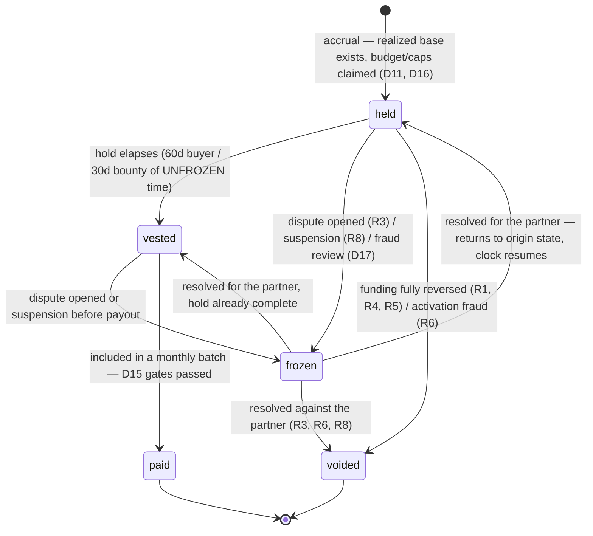

# ADR 0005: Referral program — attribution, commission bases, participant roles and payout model

- **Status:** Accepted
- **Date:** 2026-08-09
- **Issue:** [#141](https://github.com/OxyHQ/Mercaria/issues/141), part of epic [#140](https://github.com/OxyHQ/Mercaria/issues/140)

## Context

Mercaria wants people to bring people: buyers who bring buyers, and partners who
bring merchants. This ADR selects the launch referral model and binds
attribution, funding, reward timing, reversals, payout responsibility, privacy
and abuse boundaries — **without changing buyer prices, merchant fees or organic
ranking** — so that #142–#149 can implement it without inventing business rules.

Everything here is a decision about an economy that must sit ON TOP of systems
that already exist and already carry invariants. Those invariants are not up for
renegotiation by a marketing program, and they force most of the shape below.

### The facts that force the shape (all verified in-repo)

1. **Mercaria's commission exists nowhere except the ledger.** ADR 0001 D3 gave
   up `application_fee_amount`: the commission is the charge minus the sellers'
   nets, recorded only in `ledger_transactions`/`ledger_entries`
   (`docs/payments.md` §"Why the ledger is load-bearing on day one"). Any reward
   defined as "a share of commission" can therefore only be computed FROM ledger
   facts — an order total, a cart subtotal or a client-reported amount is not
   commission and never approximates it.
2. **Commission is recognized at charge success and returned pro-rata on
   refund** (ADR 0001 D5/D6). The realized commission of an order MOVES after
   recognition — every refund shrinks it. A reward computed from it must
   therefore be adjustable-downward until it vests, and clawable after, which is
   why holds and an append-only reversal history are structural here, not
   policy garnish.
3. **The platform settlement currency is EUR** (ADR 0001 D8), and the charge is
   booked in the currency the money landed in (#47). Commission postings are
   EUR, so commission-share rewards inherit EUR with no FX decision to make.
4. **`mercaria_retail` is a zero-markup channel by construction** (#116, #120:
   zero-margin landed-cost, cost-only pricing, zero intended item profit).
   There is no margin to share; a referral program that "shares" retail margin
   would be inventing money or silently raising the customer's price.
5. **Positive cost variance under #128 is reserved for customer adjustment.**
   It is the customer's money awaiting return, not a revenue pool.
6. **Guest identity is checkout-scoped** (#101/#102), and claiming a guest
   purchase into an Oxy account is explicit — never inferred from an email
   match (#109). A referral program gets no exemption from that boundary.
7. **Partner payout machinery already exists.** #46 built provider accounts
   with `UNIQUE(provider, owner_type, owner_id)`, Stripe-owned KYC
   (`requirement_collection = stripe`), and a single stored readiness verdict.
   Referral payouts reuse it rather than growing a second onboarding.
8. **Affiliate commission (#67) and Pro subscription revenue (#89) do not exist
   yet.** A funding-source id the database accepts but no code can produce is
   the same trap `PAYMENT_PROVIDER_IDS` documents
   (`packages/shared-types/src/payment.ts`): a row nothing can ever reconcile.
   Those bases are DEFINED here and their ids are added by the issues that ship
   the revenue, with their own migrations — the FairCoin/OxyPay precedent.

This ADR binds #142 (models), #143 (attribution flows), #144 (versioned rules),
#145 (earnings ledger), #146 (payout), #147 (dashboards), #148 (fraud/privacy),
#149 (pilots). It writes no code.

---

## The funding boundary (binding)

A referral reward may be funded ONLY from a source in the table below. The set
is CLOSED: `REFERRAL_FUNDING_SOURCE_IDS` in `@mercaria/shared-types` is declared
as a readonly tuple plus its union (the `PAYMENT_PROVIDER_IDS` pattern), every
reward row names its source `NOT NULL` against a CHECK on that tuple, and a
source id is added only together with the code that can realize its base and the
migration widening the CHECK — never in advance (fact 8).

| Source id | Base — realized eligible Mercaria funding | Status at launch |
|---|---|---|
| `connected_marketplace` | Mercaria's immutable marketplace commission **actually earned** under #88 on the referred order — the `commission_revenue` postings, net of commission returned on refunds. Never gross buyer spend. | **Live** |
| `fixed_budget` | An explicit, separately approved marketing budget allocation, drawn down atomically per accrual. | **Live** |
| `affiliate` | **Reconciled** affiliate commission under #67 — commission the network has confirmed, never a click estimate. | Defined, **deferred** until #67 ships |
| `subscription` | Eligible **recognized** Mercaria Pro subscription revenue under #89 — never a booking, never an unexpired-refund-window payment counted twice. | Defined, **deferred** until #89 ships |
| `mercaria_retail` | **INELIGIBLE** — zero-profit channel (#116/#120). Not a source id at all: a value nothing may write. | Excluded forever absent a superseding ADR |

`mercaria_retail` is excluded twice, deliberately. Structurally, a retail order
produces no commission, so a commission-share adapter would already return zero.
And by name, so that if the retail channel ever grows a fee or a commission-like
posting, it still cannot silently become fundable — eligibility is a decision
made here, not a side effect of what happens to be posted.

### Never fund a referral reward from (eight prohibitions, each with its enforcement)

| # | Never from | What enforces it |
|---|---|---|
| 1 | Supplier acquisition cost | Retail procurement amounts (#118/#128) are not readable by any adapter — the closed source set has no retail id. |
| 2 | Supplier shipping/handling | Same closed set; shipping is additionally an order snapshot, never a revenue posting. |
| 3 | Customer tax/duty | The commission base under #88 **must exclude tax and duty lines** — this ADR binds #88 to that. Tax lines are the accounting and refund basis (`pricing.service`), never Mercaria revenue. |
| 4 | Direct payment/FX cost inside cost-only retail pricing | Retail is ineligible entirely; cost-only components are the customer's cost, not Mercaria's income. |
| 5 | Positive cost variance awaiting customer adjustment (#128) | Isolation rule I5 below: variance is reserved for the customer; it is not a source id and no adapter may read the procurement ledger. |
| 6 | Customer refund/credit | A refund only ever REDUCES a realized base (fact 2). Adjustments driven by refunds are monotonic downward; no code path may construct funding from a refund record. |
| 7 | A new markup added to a dropship order | #120's zero-markup policy; isolation rule I4 — the referral domain has no write path into any pricing policy. |
| 8 | Paid ranking | Mercaria has no paid ranking (#74's transparent eligibility/labels). If one is ever introduced, its revenue is not a referral source without a superseding ADR — and referral spend never buys ranking (isolation rule I1). |

**The one narrow retail allowance**, stated exactly as bounded by #141: a fixed
acquisition bounty may be associated with a conversion whose order happens to be
`mercaria_retail`, ONLY when it is funded from `fixed_budget` (a separately
budgeted marketing expense) and the customer amount is untouched. The launch
program does not use this allowance — a retail first order accrues nothing (its
commission base is zero, recorded honestly as `zero_base`, D16) — but a later
program version may use it without a new ADR, because the boundary already
admits it.

---

## Decisions

Numbered D1–D20, in the order #141 requires them.

### D1. Launch subject: a bounded combination — buyer referral plus merchant referral

Launch with exactly two reward subjects:

- **Buyer referral** — an enrolled partner refers a new buyer; the reward is a
  **percentage share of Mercaria's realized commission** on that buyer's first
  qualifying paid native order (`connected_marketplace` source).
- **Merchant referral** — an enrolled partner refers a new merchant; the reward
  is a **fixed acquisition bounty** from a separately approved budget
  (`fixed_budget` source), accrued at merchant activation.

Affiliate-traffic rewards (#67) and subscription-revenue rewards (#89) are
**not launched**: their bases are defined in the funding table above and their
reversal semantics in R4/R5 below, so the systems can adopt them without a new
ADR — but no id, no adapter and no rule may exist before the revenue does
(fact 8).

Why this pair: both bases are **realized, ledger-verifiable Mercaria funding
that exists today** (facts 1, 7). Commission-share cannot lose money by
construction (the reward is a bounded fraction of income actually earned);
the merchant bounty is the one case where spending ahead of revenue is
deliberate, so it is the one that carries an explicit budget rather than a
revenue share. One percentage program and one fixed program also exercises both
reward shapes (D10) before either generalizes.

### D2. Who can become a partner

A partner is an **authenticated Oxy account or a Mercaria store**, explicitly
enrolled, with the program terms accepted at enrollment. Mirroring
`provider_accounts`, the partner owner is ONE polymorphic pair
(`ownerType: 'user' | 'store'`, `ownerId`), `UNIQUE(owner_type, owner_id)` —
one partner record per owner, ever. For a store partner, enrollment and payout
configuration require `store:manage` (the same bar as payment onboarding, and
for the same reason: it is the one permission an `admin` does not hold).

Guests can never be partners: a partner must be payable, and payable requires
KYC (D15), which requires a durable authenticated identity. An owner under
moderation enforcement or program suspension (D18) cannot enroll. Enrollment is
free and self-serve; no follower counts, no application review at launch —
fraud controls (D17), caps (D16) and the vesting machine are the defense, not
gatekeeping at the door.

### D3. Codes, links and campaigns: ownership and uniqueness

- A **code** belongs to exactly one partner, forever. Codes are globally unique
  **case-insensitively** (`UNIQUE(lower(code))`), stored normalized. A code is
  never transferred, never reassigned and never reissued: retiring a code stops
  it attributing but keeps its row and its reservation permanently — an
  attribution recorded against it must stay explicable, and a recycled code
  would let a new owner inherit another partner's history.
- A **link** wraps a code (`mercaria.co/r/<code>`); following one mints a
  **click id** — unguessable, single-purpose, bound to its code and timestamp,
  expiring with the attribution window. Click ids are attribution evidence and
  nothing else (identity boundary A1).
- A **campaign** is an operator-created grouping owned by one program, carrying
  the budget (for `fixed_budget`) and the caps (D16). A code belongs to at most
  one campaign. Campaigns never own attribution — the partner does; a campaign
  reassignment cannot move an attribution that already exists (they are
  immutable, #142).

### D4. Attribution window and touch rule: last-touch, 30 days

**Last valid touch wins**, with a **30-day window** for buyer referral. For
merchant referral: 30 days touch → merchant signup, then **90 days** signup →
activation (the bounty needs the longer runway because activation includes
Stripe onboarding and a first sale, D11).

Last-touch, for three reasons. First, it is the only rule under which **a code
explicitly entered at checkout always wins** — code entry is itself a touch and
is by construction the latest; first-touch would override the buyer's explicit
statement of who sent them with a stale click. Second, it is deterministic from
first-party records alone: "the most recent valid touch in window" needs no
weighting model and produces one answer. Third, affiliate-network reconciliation
under #67 is last-click; adopting the same rule now means the deferred
`affiliate` source will not need a second attribution semantics. Ties cannot
occur (touches are totally ordered by recorded time; equal timestamps resolve by
touch id — arbitrary but deterministic and pinned).

A touch is one of exactly: a click id resolution, a code entered in-app, a code
entered at checkout. Nothing else — no view-through, no impression attribution.

### D5. Cross-device behavior and limits

**The only cross-device carrier is the authenticated Oxy session.** A touch
recorded on device A attributes a conversion on device B only when the same Oxy
account was authenticated for both events. Guest touches never cross devices:
they live in the checkout scope of the device that recorded them (D6). There is
no probabilistic matching, no fingerprint joining, no IP correlation —
boundary A2 makes those non-identities, so cross-device recovery through them
is unrepresentable, not merely forbidden.

The accepted cost is stated so nobody "fixes" it later: a guest who clicks on
their phone and buys on their laptop without re-entering the code is a **lost
attribution, by design**. The recovery path is the product one — the code is
enterable at checkout — never an identity one.

### D6. Guest attribution: checkout-scoped, expiring, no hidden profile

A guest touch is stored against the **checkout-scoped id from #101/#102**, with
a lifetime of `min(scope lifetime, attribution window)`. At conversion (order
placed), the attribution is pinned to the **order** as an immutable record
(#142) — so the scope's later expiry erases the *evidence trail's live end*,
never an earned attribution. The scope id never becomes a durable profile:
nothing joins scopes to each other, to contact data or to later scopes
(boundary A3/A4). When a guest later claims the purchase into an Oxy account
(#109), the claim moves the ORDER; the attribution neither moves, changes,
duplicates, nor retroactively creates attributions for the account's other
history.

### D7. Self-referral: refused, on first-party identity only

An attribution is refused at evaluation time when the referred subject resolves
— by Mercaria/Oxy first-party facts alone — to the partner themself:

- buyer referral: the converting Oxy account IS the code owner, or holds any
  membership (owner/admin/staff) in the owning store partner;
- merchant referral: the referred merchant is the partner, or a store the
  partner's account holds membership in.

Deliberately nothing else. Shared card, shared address, shared IP or shared
device are **fraud signals** (D17) that freeze and route to manual review —
they are never attribution rules, because boundary A2 forbids them being
identity and because an automated rule built on them punishes households and
shared computers deterministically. Refusal on identity is deterministic and
final; suspicion on signals is reviewable.

### D8. Circular referral: permitted, with one hard exclusion and no chains

- A merchant may refer buyers, and a buyer may refer a merchant. Reciprocal
  pairs (A referred B, B referred A) are permitted; each attribution is
  evaluated independently and neither validates the other.
- **The hard exclusion:** a partner earns NO buyer-referral reward on an order
  where the partner (or a store they hold membership in) is the **seller**.
  A commission-share on your own sale is a hidden fee rebate — it changes the
  merchant's effective fee because a referral exists, which isolation rule I3
  forbids. This is refused at accrual, on the same first-party membership facts
  as D7.
- **No chains, no cascade.** Only the directly attributed partner earns.
  A referred partner's later referrals earn for THEM, nothing flows upstream.
  Multi-level structures are out of scope of this ADR and, given their
  regulatory character, would require a superseding ADR — not a rule version.

### D9. Eligible funding sources and revenue-base definitions

Decided in **"The funding boundary"** above (the closed source table, the eight
prohibitions, the retail allowance) and **"The reward-base contract"** below
(the adapter that turns a source into a realized base). Summarized: launch
sources are `connected_marketplace` and `fixed_budget`; `affiliate` and
`subscription` are defined and deferred; `mercaria_retail` is ineligible by
name and by structure.

### D10. Reward shape: percentage of realized base, or fixed from budget — never both on one reward

- `connected_marketplace` (and, when they arrive, `affiliate` and
  `subscription`) rewards are a **percentage of the realized base**, with the
  rate on the versioned rule (D19), structurally bounded: the rate is
  `> 0 and ≤ 100%` (CHECKed), and a reward can never exceed the realized base
  it draws on. Pilot default: **20%**, with an absolute per-conversion cap
  (pilot default **EUR 50**).
- `fixed_budget` rewards are a **fixed amount** on the versioned rule, drawn
  from the campaign budget by an atomic claim (D16). Pilot default: **EUR 50**
  per activated merchant.
- One reward row has exactly one shape, named by its source. There is no
  hybrid "percentage with a floor" — a floor above the realized base is money
  from nowhere, which is the whole class of bug the funding boundary exists to
  make unrepresentable.

All reward amounts are EUR at launch (fact 3), bounded by the same limits every
Mercaria amount obeys (`assertSafeMoneyAmount` at construction, the ledger's
own int8 bound at posting).

### D11. Reward eligibility time (accrual)

| Subject | Accrues when | Why this moment |
|---|---|---|
| Buyer referral | The **payment-success processing** of the referred buyer's first qualifying order books its commission postings | This is the moment the base first EXISTS (fact 1). Click, signup and order placement precede any Mercaria income; delivery and refund-window expiry are later than needed because the hold (D12) already covers the mutable period. |
| Merchant referral | **Merchant activation**: the referred merchant's provider account reaches the ready `onboarding_state` (#46's single verdict) AND their first paid **native** order's commission postings exist | Both conjuncts are ledger/domain facts, not self-reported ones. Readiness alone is Stripe onboarding completed with zero sales — bots can do that; a first commissioned sale is real marketplace activity. |

"Qualifying order" is structural: an order whose funding produced
`commission_revenue` postings. No commission ⇒ no base ⇒ nothing accrues
(recorded as `zero_base`, D16) — which by itself excludes `external`,
`manual_pos` and `mercaria_retail` orders without a single special case.
The referred buyer must be **new**: an Oxy account with no prior paid native
Mercaria order, or a guest checkout scope (new by construction; the repeat-abuse
this admits is bounded by first-order-only scope and D17 velocity thresholds).
Launch scope is deliberately the **first qualifying order only**; widening to an
N-day earning window is a rule-version change, not an ADR change.

### D12. Hold period

- Buyer referral: **60 days** from accrual.
- Merchant bounty: **30 days** from accrual.

The buyer hold covers the overwhelming mass of refunds and the near-in dispute
window; it deliberately does NOT try to cover the full ~120-day card-dispute
tail, because a four-month hold would make the program feel broken to every
honest partner in order to avoid a clawback path the ledger needs anyway (R7 —
a reversal after payment must be handleable regardless of hold length, so
stretching the hold buys less than it costs). The bounty hold is shorter because
its funding is budget, not order revenue — the only reversal that reaches it is
fraud invalidation (R6), which the freeze mechanism covers beyond any fixed
window. A freeze (R3/R8) **stops the hold clock**; vesting requires 60 (or 30)
elapsed *unfrozen* days. Hold lengths live on the versioned rule (D19) and are
pinned per attribution like every other rule term.

### D13. Reversal policy

Decided as a deterministic state machine in **"Reversals"** below: eight named
cases, one outcome each, history append-only, reversals as explicit records.

### D14. Minimum payout, cadence, rails

- **Minimum payout: EUR 25.** Balances below it roll forward. On voluntary
  program exit or non-fraud termination, the final vested balance is paid in
  the next batch regardless of the minimum.
- **Cadence: monthly batches**, operator-visible, each batch a durable record
  (#145). No self-serve "pay me now".
- **Rail: Stripe Connect transfers to a payment-ready connected account —
  the only launch rail.** A partner onboards through exactly the #46 machinery
  (`provider_accounts`; a partner who is already a payment-ready seller reuses
  the SAME account — `UNIQUE(provider, owner_type, owner_id)` guarantees one
  account per owner, so a referral payout can never mint a second). No manual
  bank transfers, no gift cards, no store credit at launch: a second rail is a
  second KYC story, a second reconciliation story and a second fraud surface,
  and store credit in particular would let referral economics leak into
  pricing (I2).

Payout ownership: **Mercaria pays**, from the platform balance
(`provider_clearing`), as its own marketing/commission expense. No seller and
no supplier ever funds a referral payout.

### D15. Tax, KYC and compliance gates — all BEFORE payout, none before accrual

A partner's rewards accrue and vest on the machine's clock regardless of
paperwork. **Payout inclusion** requires, per batch:

1. **KYC:** the partner's connected account is payment-ready (#46's verdict —
   Stripe owns identity collection via `requirement_collection = stripe`;
   Mercaria stores none of it, exactly as ADR 0001 D2).
2. **Tax data:** the partner has completed Mercaria's tax questionnaire
   (residency, and business/VAT status for invoicing). Mercaria issues an
   annual earnings statement per partner; partners are responsible for their
   own income tax. Whether partner compensation falls under a platform
   reporting regime (DAC7 analog) is confirmed with the legal entity before
   live payouts — open item 1.
3. **Standing:** the partner is not suspended (D18) and holds no unresolved
   fraud review.

A partner failing a gate is **skipped, not voided**: the balance stays payable
and enters the next batch that passes. Gating accrual on paperwork would punish
the referral for the partner's pending form; gating payout is the boundary with
teeth and no collateral damage.

### D16. Budgets and caps

- Every `fixed_budget` campaign carries an explicit `budget_minor`. An accrual
  **claims budget atomically** (a compare-and-swap `WHERE remaining >= amount`,
  the `$inc`-guard discipline at the campaign grain); exhausted budget refuses
  the accrual and records the evaluation outcome `budget_exhausted`.
- Commission-share rewards carry per-conversion caps (D10) plus a per-partner,
  per-period accrual cap on the rule version (pilot default: EUR 500/month) and
  a program-level monthly ceiling that, when reached, stops NEW accruals.
- **Exhaustion is prospective, never retroactive:** it stops new accruals; it
  never voids or shrinks a reward that already accrued. An attribution whose
  accrual was refused earned nothing — there is no reward row to rewrite —
  and the refusal is recorded (`zero_base` / `budget_exhausted` /
  `cap_reached`), because a partner-support question deserves an answer and an
  effect that did not happen must be distinguishable from one that silently
  vanished.

### D17. Fraud thresholds and manual review

Thresholds live on the program version (concrete pilot values are #148's, with
these pilot defaults): touches per code per day (500), conversions per code per
day (20), referred-cohort refund rate (>30% over trailing 30 days) and
referred-cohort dispute rate (>2%) — breach **freezes** the affected rewards
(state machine below) and opens a manual review in the operator surface
(#147/#148).

The binding rules, independent of any threshold value:

- **Signals freeze; only first-party identity evidence voids.** Payment-domain
  outcomes (dispute records, refund records, Stripe Radar verdicts on the
  charge) and velocity anomalies may freeze and route to review. A VOID
  requires the deterministic identity facts of D7/D8 or a confirmed reversal of
  the funding itself (R-cases). No reward is ever voided by a statistical
  score.
- **Fraud evaluation reads Mercaria's own commerce facts** — orders, refunds,
  disputes, memberships, velocities. It never builds or consults a device or
  contact fingerprint (boundary A2); HTTP-edge rate limiting is abuse control
  on requests and contributes nothing to attribution or identity.
- Every review outcome is an append-only record with an actor and a reason —
  the `payment_repairs` discipline, ported.

### D18. Suspension and termination

- **Partner suspension** (fraud review, terms breach): new accrual stops
  immediately; held rewards → `frozen` (clock stopped); vested-unpaid rewards
  are withheld from batches. Outcomes: cleared ⇒ everything resumes where it
  stopped; confirmed fraud ⇒ held AND vested-unpaid rewards are voided with
  explicit reversal records, enrollment is terminated, and paid rewards are
  clawed back per R7.
- **Program termination** (business decision, no fraud): no new touches, no new
  attributions, no new accruals — prospective only. Existing held/vested
  rewards run their ordinary lifecycle to payout, including the final
  sub-minimum batch (D14). Obligations already earned are honored; the program
  ending is not a reversal case.
- Both act by **gating loops and gates, never records**: attribution capture
  off, accrual evaluator off, batch inclusion filtered. Nothing durable is
  deleted or rewritten — the same rule the moderation and payment outboxes
  already live by.

### D19. Historical immutability: the rule version is pinned at ATTRIBUTION

Rules are immutable versions (#144): rate, shape, caps, window, hold length,
qualifying-order definition. **The attribution row pins the rule version at the
moment the attribution is created**, and everything later — accrual amount,
hold length, vesting — is computed under the pinned version. A rule change
creates a new version that applies only to attributions created after it.

At attribution and not at vesting, for three reasons. The partner's promotional
effort happened under the terms advertised when it happened — pinning later
would let Mercaria change the price of work already done. Pinning at the
earliest durable moment gives the longest immutability span, which is what
"rule changes cannot rewrite historical rewards" (#141 acceptance 6) actually
asks for. And vesting-time pinning has a concrete failure: an operator edits
the rate between a referred purchase and its vest, and an already-accrued
amount silently changes — precisely the rewriting the append-only discipline
exists to prevent.

The honest boundary of the pin, stated so it cannot be argued around later:
the pinned version governs **how much is earned and on what terms, once
earned**. Whether the program is still funding NEW earnings — budget
exhaustion, caps, suspension, termination — is evaluated at accrual time,
prospectively (D16/D18). No accrued reward is ever altered by either mechanism;
an attribution that never accrues has nothing to rewrite.

### D20. Organic-ranking isolation

Decided in **"Ranking and pricing isolation"** below: five bindings, each with
its enforcement point.

---

## The reward-base contract

Every eligible source has ONE adapter, and the adapter's contract is the same
sentence for all of them: **return the realized eligible Mercaria funding for
this conversion, in the ledger's own currency — never gross buyer spend, never
a customer-side amount, never an estimate.**

```text
connected_marketplace
  base = Mercaria commission actually earned under #88 on the referred order:
         the commission_revenue postings for that order, minus commission
         returned on its refunds, read from ledger_transactions/ledger_entries.
         NOT the order total. NOT the cart subtotal. NOT the fee schedule
         applied to anything client-side.

affiliate            (deferred until #67)
  base = affiliate commission the network has RECONCILED for the redirect.
         NOT clicks, NOT pending estimates.

subscription         (deferred until #89)
  base = recognized eligible Pro subscription revenue for the referred
         merchant's period. NOT bookings.

fixed_budget
  base = the explicit campaign budget allocation claimed for this accrual.

mercaria_retail
  base = INELIGIBLE (zero-profit channel; #116/#120). No adapter exists and
         none may be written.
```

Binding consequences:

- **A rule must never compute a percentage of supplier cost or of gross basket
  value when the funding source is Mercaria revenue.** The adapter is the only
  base computation; rules receive a base, they never receive an order.
- The adapter reads **ledger and reconciled facts only**. If the base cannot be
  read (postings absent, reconciliation pending), the accrual is retried later
  — never estimated, the same fail-closed posture as `fx.service.convert`.
- Adapters are versioned WITH the rule version they serve (D19): a base
  definition change is a new rule version, so an old attribution's base is
  computed the way it was promised.

---

## Reversals: eight cases, one deterministic outcome each

History is **append-only**. A reversal, an adjustment and a clawback are each
explicit records naming their cause; nothing is ever deleted or edited in
place. The numbered cases below are #141's, verbatim.

| # | Case | Outcome |
|---|---|---|
| R1 | Purchase refunded in full before vesting | Reward `held → voided`, with a reversal record naming the refund. The funding ceased to exist; so does the reward. |
| R2 | Partial refund | A **negative adjustment record** against the same reward: net = pinned rate × realized base after the refund (commission returned per ADR 0001 D5). State unchanged; net monotonically decreases; a base reaching zero voids the reward. After payout, the delta becomes a clawback (R7). |
| R3 | Chargeback / dispute | Reward (`held` or `vested`-unpaid) → `frozen`; the hold clock stops. Dispute **lost** ⇒ `voided` (or clawback if paid). Dispute **won** ⇒ returns to its prior state, clock resuming where it stopped. Inquiries that move no money (the #49 discrimination — empty balance movements, not status strings) freeze nothing. |
| R4 | Affiliate commission rejected/reversed (deferred source) | The adapter emits the base change; the reward follows R1/R2 mechanics identically — a rejected commission is a base reduced to zero. |
| R5 | Merchant subscription refunded (deferred source) | Same: recognized revenue reversed ⇒ base reduced ⇒ R1/R2 mechanics. |
| R6 | Merchant activation invalidated for fraud | Bounty `held/frozen → voided` with a reversal record naming the finding; if paid, R7. The campaign budget claim is released back by the same record. An ordinary refund of the activating order is **not** invalidation — the bounty was funded by budget, not by that order's commission; only a fraud finding reverses it. |
| R7 | Reward already paid before reversal | The payout is **never un-paid** and the paid record never rewritten. A **clawback record** debits the partner's payable balance, which may go negative; future accruals offset it first. Recovery beyond offset is an explicit operator action (which MAY use a rail transfer reversal where the rail permits) — never automatic, always recorded, the `payment_repairs` shape. |
| R8 | Partner suspended during hold | Rewards → `frozen`, clock stopped (D18). Cleared ⇒ resume where stopped. Confirmed fraud ⇒ `voided` with reversal records; paid rewards follow R7. |

### The reward state machine

One machine for both subjects. The rule version was pinned at attribution
(D19), before this machine begins; amount changes (R2) are adjustment records,
not states.



- `frozen` records its origin state and returns to it; freezing is a pause,
  never a shortcut to void.
- `paid` is terminal **for the reward row**. R7 clawbacks are partner-balance
  records, not state transitions — which is what keeps "was this paid" a fact
  that can never flicker.
- Every transition is an appended event with cause and actor; the current state
  is derivable and stored, but the event history is the authority.

---

## Ledger representability (gate for #145)

Referral money books in the **same** `ledger_transactions`/`ledger_entries`
through the **same** single writer (`insertLedgerTransaction`), under the same
three-layer balance enforcement (repository refusal, the UPDATE/DELETE
trigger, the randomized property tests) and the same sign convention: positive
is a debit, negative is a credit, zero per currency. A parallel referral ledger
would split `provider_clearing` across two books the moment a payout moved real
platform money — one ledger, two new accounts:

| Account | Normal balance | What it holds |
|---|---|---|
| `referral_expense` | debit | The cost of the program — commission shared and bounties granted |
| `referral_payable` | credit | What Mercaria owes a partner (per owner, like `merchant_payable`); may go negative after R7 |

| Event | Debit | Credit |
|---|---|---|
| Reward accrued (W) | referral_expense (W) | referral_payable (W, per partner) |
| Partial-refund adjustment (d) — R2 | referral_payable (d) | referral_expense (d) |
| Reward voided (remaining net W′) — R1/R3–R6/R8 | referral_payable (W′) | referral_expense (W′) |
| Payout batch (vested sum P) — D14 | referral_payable (P) | provider_clearing (P) |
| Clawback after paid (C) — R7 | referral_payable (C) | referral_expense (C) |
| Recovery received (V) — R7 | provider_clearing (V) | referral_payable (V) |

State-only transitions (`frozen`, `vested`) book nothing: no money moved.
Corrections are reversing transactions — there is no `reverseTransaction(id)`
helper here for the same reason there is none in the payment domain. The
reward row's net amount (its own append-only adjustments) and the ledger's
`referral_payable` must agree, and #145 must pin that agreement with a
reconciliation sweep in the #50 mold — the payment domain already proved that
"two stores that must agree" without a sweep is a discrepancy nobody notices.

The referral domain's async work (accrual evaluation, batch construction,
notifications) uses the **payment outbox pattern unchanged**: deterministic
ids so a repeat converges, the row is the job, `FOR UPDATE SKIP LOCKED` leases
with an owner check, capped backoff, visible `dead_letter` — and the loop is
gated, never the durable record.

---

## Attribution identity boundaries

The five boundaries of #141, restated as bindings. A1–A5 are cited by decision
sections above; they are the privacy contract #143 and #148 implement.

- **A1. Codes and click ids are attribution evidence, never credentials.**
  Possession of a code or click id authenticates nothing, authorizes nothing
  and redeems nothing by itself. They never grant order access (the guest order
  portal #108 is untouched), never identify a person, and appear in no auth
  decision. Enforcement: the attribution resolver's input type admits only
  `{touch evidence, oxyUserId | checkoutScopeId}` — a credential-shaped use has
  no seam to enter through.
- **A2. Email, card fingerprint, Stripe Customer, Link identity, IP and device
  fingerprint are NOT Mercaria referral identity.** None of them may appear in
  an attribution input, a self-referral rule, a cross-device join or a partner
  projection. Card-side identifiers stay inside the payment domain behind the
  provider seam (they already never leave it — ADR 0001's SAQ-A posture);
  attribution code has no import path to them. Fraud signals may reference
  payment-domain OUTCOMES (a dispute happened) but never payment-domain
  identifiers.
- **A3. Oxy identity associates a conversion only after valid authentication,
  and never retroactively merges unrelated guest histories from contact
  matches.** The #109 rule, restated for referrals: an email match is not a
  join. A claim moves one order's ownership; it creates no attribution, voids
  no attribution and links no scopes.
- **A4. Guest conversion uses checkout-scoped ids from #101 without creating a
  durable hidden profile.** D6 is the mechanism: scope-bound touches, window-
  capped lifetime, attribution pinned to the order at conversion, nothing
  outliving its purpose.
- **A5. Partner-visible data is aggregated and minimized, and can never expose
  buyer personal data.** The partner projection is an explicit allow-list in
  the #46 style — every field named, nothing passed through: per-period counts
  (touches, conversions), and per-reward `{day-granularity date, state, net
  amount, source, campaign}`. It carries **no** buyer name, contact, order id,
  order contents, address, or free text, in any form, at any aggregation
  level. Operator surfaces see more; partners never do.

---

## Ranking and pricing isolation

The five rules of #141, restated as bindings, each with its enforcement point.
Collectively they say one thing: **referral economics are invisible to every
price a customer pays, every fee a merchant pays and every ranking a shopper
sees.**

- **I1. Referral reward, partner tier, campaign and commission amount cannot
  enter organic ranking.** Enforcement: discovery and ranking (#70, #74) take
  typed inputs that contain no referral field, and the referral domain
  (`services/referrals/`, #142's tables) exports nothing to them. Ranking
  changes that would add such an input are refused at review by this ADR —
  #74's transparent-labels contract would also surface the attempt, since an
  input that cannot be labeled honestly cannot be added at all.
- **I2. Referred buyers see the same item price.** The pricing engine's
  signature takes no referral input, and a referral creates no `Discount`.
  A buyer promotion for referred buyers, if a program wants one, is a
  **separate, explicit Discount** through the existing discount domain, visible
  as such at checkout — priced transparency, not referral seepage.
- **I3. A merchant's marketplace fee cannot silently increase because a
  referral exists.** The #88 fee snapshot is computed with no referral input —
  this ADR binds #88 to that, alongside the tax exclusion (prohibition 3). The
  buyer-referral reward comes out of **Mercaria's share after the fee
  schedule**, never added to it; and D8's hard exclusion stops the mirror-image
  leak (a seller rebating their own fee through a self-attributed code).
- **I4. `mercaria_retail` customer cost cannot increase by one minor unit to
  fund referral economics.** Retail pricing policy (#120) takes no referral
  input, and the funding table makes retail ineligible — there is no reward to
  fund, so there is no pressure path to the price.
- **I5. Positive cost variance from #128 is reserved for customer adjustment
  and cannot be consumed by referral payout.** The variance lives in the
  procurement/retail domain; no referral adapter may read the procurement
  ledger (the closed source set has no id that could), and #128's own
  adjustment flow remains the variance's only consumer.

---

## Fraud controls, disclosures

D7 (identity-based refusal), D17 (thresholds, freeze-vs-void), D18
(suspension) and R6–R8 are the control set. What remains binding beyond them:

- **Every enforcement action is an append-only record with actor and reason**,
  reviewable in the operator surface (#147); refusals included. The
  `payment_repairs` discipline, ported to a marketing program.
- **Disclosure is a program term** (#148): partners must disclose their
  relationship where consumer law requires it, and the referred buyer sees at
  checkout that a code was applied. A program that hides itself from the people
  inside it is a dark pattern; this one does not.
- **The moderation system stays separate.** Referral fraud enforcement acts on
  referral records (freeze, void, terminate enrollment). It never suspends an
  Oxy account, never touches listings, and never imports CrowdSource — the
  same separation disputes already observe.

---

## Rollout and rollback

Three phases, gated, in the pattern this repo already trusts
(`CROWDSOURCE_ENFORCEMENT_MODE`'s observe-first discipline):

1. **Shadow.** Attribution capture and accrual evaluation run and RECORD
   against real traffic; the state machine runs; **no payout batches are
   constructed**. This proves attribution volume, base computation and the
   ledger postings against reality with zero money at risk.
2. **Bounded pilot (#149).** Payouts on, for enrolled pilot cohorts, under
   tight D16 caps and an explicit program budget ceiling. Measured economics —
   cost per activated merchant, commission shared per retained buyer,
   referred-cohort refund/dispute rates against baseline — decide widening.
3. **General availability.** Caps loosened by rule VERSION (D19), so the pilot
   terms remain exactly what pilot partners were paid under.

**Rollback at any phase gates loops and gates, never records:** stop touch
capture, stop the accrual evaluator, stop batch construction. Attributions,
rewards, ledger entries and event history remain, immutable and explicable.
Vested obligations already earned are honored per D18's termination rule.
There is no migration to reverse and no record to delete — which is what makes
rollback an operational act instead of an amnesty.

### Environment

Configuration names come from the packages when #142–#148 land, not from this
table (the repo's standing rule). This ADR binds only the gating shape:

```
REFERRALS_ENABLED=false     # master gate: mounts the surfaces, runs the loops
```

plus the loop tunables the outbox pattern always carries. `REFERRALS_ENABLED`
follows the `CROWDSOURCE_ENABLED` validation pattern: a half-configured
program stays OFF and logs once at boot. The gate stops loops and surfaces —
never the durable records already written.

---

## Consequences

- **The referral program cannot lose money it did not first earn**, with one
  deliberate exception: the merchant bounty, which is why the bounty is the
  only budgeted source and the only one with a hard global ceiling.
- Reusing the payment ledger and the #46 payout machinery means #145 and #146
  are integration work, not invention — and it means referral money inherits
  every invariant the payment domain already enforces, including the ones
  nobody remembers to re-state (the trigger, the single writer, the
  per-currency zero).
- Two stores must agree (reward net vs `referral_payable`), so #145 ships a
  reconciliation sweep with the program, not after the first discrepancy.
- Last-touch plus explicit-code-wins means partner marketing collapses to one
  honest sentence: "the last code the buyer used is the one that counts."
- The deferred sources (`affiliate`, `subscription`) have their bases, their
  reversal semantics and their adapter contract already decided; #67 and #89
  adopt them by adding an id, an adapter and a migration — no new ADR, no new
  semantics.
- The accepted losses are named: cross-device guest attribution (D5), the
  dispute tail beyond the hold (D12, covered by clawback), and zero reward on
  retail first orders (funding boundary). Each is a decision, not an oversight;
  "fixing" any of them means amending this ADR, not patching around it.

---

## What each child issue inherits

| Issue | Inherits from this ADR |
|---|---|
| #142 models | D2 (partner owner shape), D3 (code/link/campaign uniqueness and immutability), D19 (rule-version pin on the attribution row), immutable attribution records |
| #143 flows | D4–D6 (window, last-touch, cross-device, guest scope), A1–A4 |
| #144 rules | D9–D11, D19, the reward-base contract, the closed source set |
| #145 ledger | The two accounts, the posting table, the state machine, the outbox pattern, the reconciliation sweep, append-only reversal records |
| #146 payout | D14–D15 (rail, minimum, cadence, gates), reuse of `provider_accounts` |
| #147 dashboards | A5 (the partner projection allow-list), the operator review surface |
| #148 fraud/privacy | D7, D17, D18, R6–R8, disclosures, freeze-vs-void |
| #149 pilots | The pilot defaults (rates, caps, holds), the three rollout phases, the measured-economics gate |

---

## Acceptance criteria of #141, answered

1. **Every possible reward has one named funding source.** A reward row's
   source is `NOT NULL` against the closed `REFERRAL_FUNDING_SOURCE_IDS`
   CHECK; the adapters are the only base computation; a source id exists only
   with the code that realizes it. There is no unnamed path to a reward.
2. **Zero-profit retail is explicitly excluded as a margin/revenue base.**
   The funding table names `mercaria_retail` INELIGIBLE by decision, on top of
   the structural zero-commission exclusion; prohibitions 1–4 close the
   supplier-cost variants; I4 closes the price side.
3. **Attribution can be implemented without fingerprinting people.** The touch
   set is closed (D4), inputs are typed to code/click id/Oxy id/checkout scope
   (A1–A2), cross-device exists only through authentication (D5), and the lost
   cases are accepted by name rather than recovered by correlation.
4. **Guest/Oxy behavior is explicit.** D6 and A3–A4: scope-bound touches,
   order-pinned attributions, claims that move orders and nothing else.
5. **Refund/dispute/reversal cases are deterministic.** R1–R8 each name one
   outcome; the state machine has no discretionary transition; freeze pauses,
   only identity or reversed funding voids.
6. **Rule changes cannot rewrite historical rewards.** D19 pins the version at
   attribution; amounts change only by append-only adjustment records driven
   by base changes; the ledger's trigger forbids UPDATE/DELETE outright.
7. **Payout ownership and compliance gates are assigned.** Mercaria pays, from
   the platform balance, over Stripe Connect only (D14); KYC is Stripe's, tax
   data and standing are Mercaria's, all gate payout and none gate accrual
   (D15).
8. **Organic ranking and buyer prices are isolated from referral economics.**
   I1–I5, each with an enforcement point; D8's seller-side exclusion and the
   #88 bindings close the two indirect leaks (fee rebate, fee increase).
9. **#142–#149 can implement the selected model without inventing missing
   business rules.** The inheritance table above maps every child to its
   decided inputs; where a number is a pilot default rather than a binding
   (rates, caps, thresholds), the ADR says so and names which issue owns
   tuning it.

## Open items (tracked, not blocking)

1. Confirm with the legal entity, before live payouts, whether partner
   compensation falls under a platform tax-reporting regime (DAC7 analog for
   service compensation) and whether EU self-billing invoices are required for
   partner commissions — the same class of item as ADR 0001's commission
   invoicing, and likely resolved together with it.
2. When #88 lands, verify its fee-base definition excludes tax/duty lines
   (prohibition 3) and takes no referral input (I3) — both are bindings this
   ADR places on it.
3. When #67/#89 ship, their `affiliate`/`subscription` source adoption should
   cite this ADR's base and reversal semantics in their PRs, so the "no id
   before the revenue" rule is visibly honored rather than rediscovered.
4. Revisit the buyer-referral scope (first order only) after the pilot
   measures retention economics; widening to an earning window is a rule
   version, but the decision deserves pilot data first.
