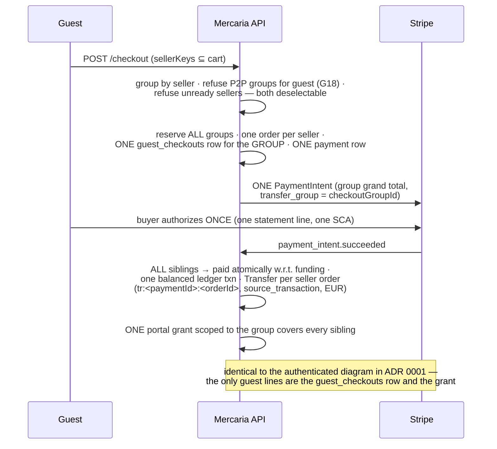
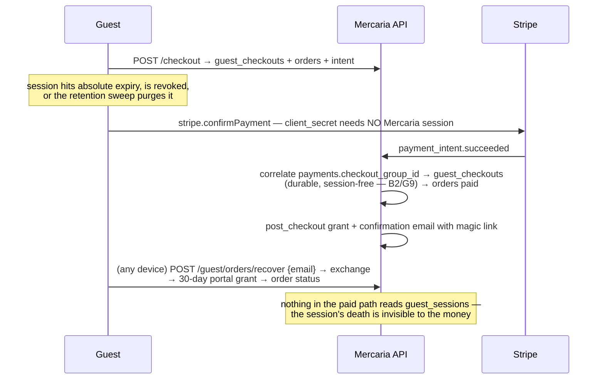
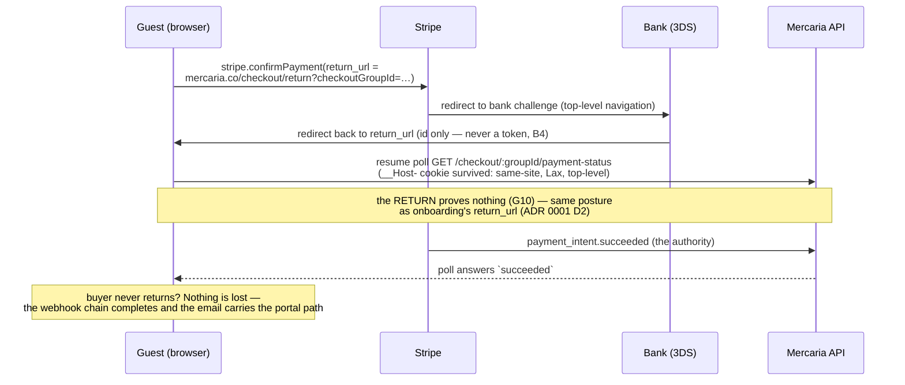
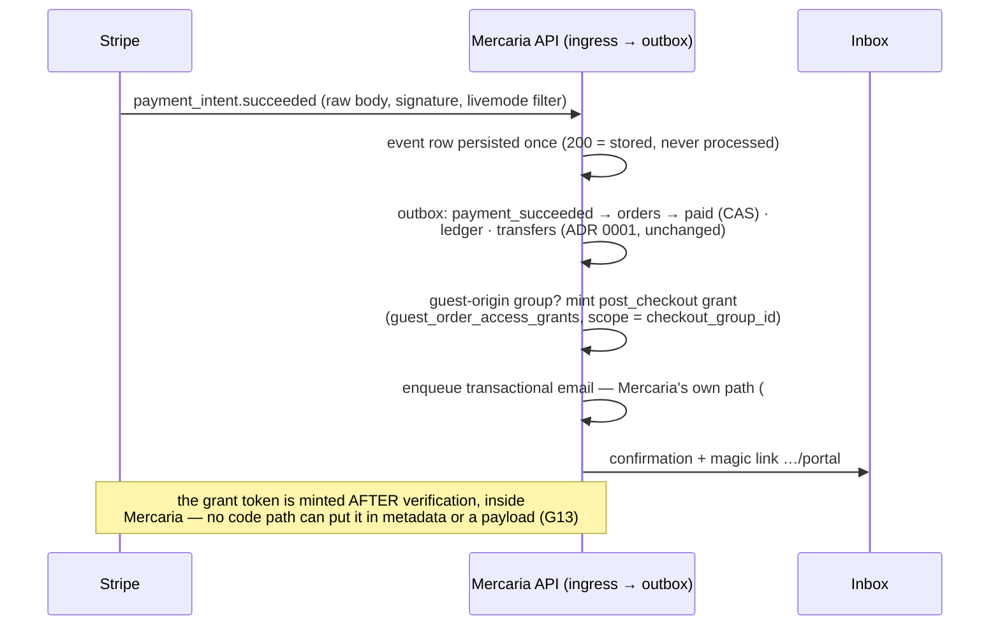
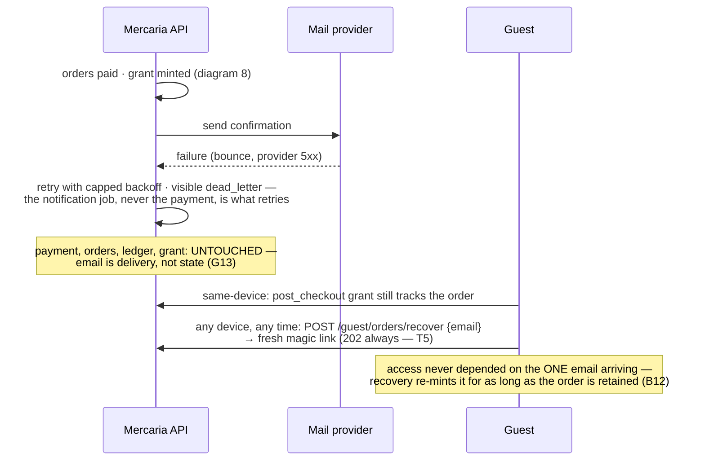
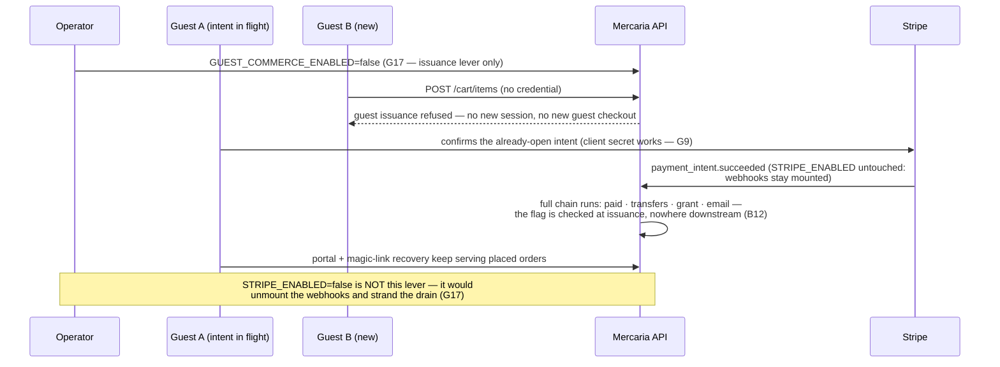

# ADR 0006: Stripe guest checkout and provider-identity boundaries

- **Status:** Accepted
- **Date:** 2026-08-09
- **Issue:** [#114](https://github.com/OxyHQ/Mercaria/issues/114), part of epic
  [#101](https://github.com/OxyHQ/Mercaria/issues/101) and epic
  [#35](https://github.com/OxyHQ/Mercaria/issues/35)
- **Extends:** [ADR 0001](0001-stripe-connect-architecture.md) — inherits
  **D1–D12 unchanged** (merchant of record, separate charges and transfers, one
  PaymentIntent per checkout group, immediate capture, the ledger as commission
  truth, EUR platform settlement, EEA sellers, cards + card-based wallets,
  the D11 idempotency scheme). Nothing here reopens any of them.
- **Inherits identities from:** [ADR 0003](0003-commerce-actor-guest-identity.md)
  (#102) — `CommerceActor`, `GuestSession`, `GuestCheckout`,
  `GuestOrderAccessGrant`, `OrderBuyer` and the twelve invariants I1–I12 are
  **used, never redefined**. Where this document says "session", "checkout
  correlation", "grant" or "claim", it means exactly ADR 0003's objects.
- **Stripe docs verified:** 2026-08-09, against the API version pinned in code:
  `STRIPE_API_VERSION = '2026-07-29.dahlia'`
  (`packages/backend/src/services/payments/stripe/client.ts` — a code constant,
  deliberately not an env var, per ADR 0001).

## Context

ADR 0001 decided how Mercaria's multi-seller commerce model maps onto Stripe
Connect, and #46–#50 built it whole: onboarding and readiness, the event
ingress, the adapter that charges and settles, refunds and disputes,
reconciliation. Every one of those paths assumed the buyer is an authenticated
Oxy account, because at the time there was no other kind.

ADR 0003 then introduced guest commerce: a `CommerceActor` union
(`oxy | guest | anonymous`) with **no common id field**, a purgeable
`GuestSession` that authenticates pre-purchase state only, a durable
`GuestCheckout` row correlating a checkout group to its contact, a scoped
`GuestOrderAccessGrant` for post-purchase access (magic link → 30-day
group-scoped portal grant), and orders that carry an immutable `buyer_origin`
plus a separate `claimed_by_oxy_user_id`. ADR 0003's T13 explicitly left one
seam open for this document: *which Stripe objects a guest payment uses, within
the boundary that provider grouping never feeds Mercaria identity*.

This ADR closes that seam. It answers #114's eighteen questions: the exact
client integration for guest web and native checkout, the Stripe Customer and
payment-method-saving policy, what enters Stripe metadata, how idempotency and
recovery survive session loss, how a mid-payment sign-in converges, and why no
provider-side identity signal can ever authorize, merge, recover or claim a
Mercaria order. It changes **no money movement**: after actor resolution, a
guest payment is byte-for-byte the payment ADR 0001 defined.

## Stripe facts verified for this amendment

Checked 2026-08-09 against the sources #114 names, on the Dahlia release train
the code pins. Each fact below carries the decision that rests on it.

1. **Customer-less payments are grouped by Stripe as "guest customers", and
   that grouping is read-only.** "Stripe automatically groups guest customers
   in the Dashboard based on them having used the same card, email, or phone to
   make payments"; "We use credit card number as the unique identifier to group
   credit card payments"; "Guest customers are a read-only grouping for
   completed transactions. Stripe doesn't save payment methods for guest
   customers, so you can't initiate new charges against them"; "We only create
   guest customers for payments that aren't associated with a specific
   customer." Stripe's own example is two spouses sharing a card being shown as
   ONE guest customer — which is exactly why this grouping must never feed
   Mercaria identity (G4, G16, B5, B6).
   ([guest-customers](https://docs.stripe.com/payments/checkout/guest-customers))
2. **The Payment Intents API remains the supported path for a platform that
   owns its own checkout.** Stripe now recommends Checkout Sessions for most
   integrations, and describes Payment Intents as "a lower-level API that
   models only the payment step. You pass in a final amount and build all
   checkout logic yourself … Use Payment Intents only if you want to deeply own
   your checkout state" — which is precisely Mercaria's shape (G2). The Payment
   Element combines with the Express Checkout Element on one page: "wallet
   payment methods such as Apple Pay and Google Pay are only displayed in the
   Express Checkout Element to avoid duplication."
   ([payment-element](https://docs.stripe.com/payments/payment-element))
3. **Link authenticates by email, inside Stripe.** "Link authenticates a
   customer by using their email address"; the recommended integration passes a
   known email via `defaultValues`; "You can't remove the Link legal agreement
   because it's required to ensure compliance." Link enrollment and its saved
   details live in the buyer's Link account with Stripe — not in a merchant
   Customer object (G15).
   ([add-link-elements-integration](https://docs.stripe.com/payments/link/add-link-elements-integration))
4. **The Express Checkout Element is the one-click wallet surface.** It
   presents Link, Apple Pay, Google Pay, PayPal, Klarna and Amazon Pay buttons,
   shows only methods that are "active, supported, and set up", requires domain
   registration for wallets, can collect shipping ("To collect shipping
   information, you must pass options when creating the Express Checkout
   Element"), and exposes `availablepaymentmethodschange` to detect an empty
   button row. Link is **not supported in in-app webviews** (G2, G12, G14).
   ([express-checkout-element](https://docs.stripe.com/elements/express-checkout-element))
5. **PaymentSheet is Stripe's recommended in-app surface, on the official iOS,
   Android and React Native SDKs.** "This integration displays payment methods,
   collects payment information, and completes payment all in a single prebuilt
   sheet. We recommend using this UI to take payments in your app for most
   users." It runs on a PaymentIntent client secret; the "Save my info"
   checkbox and saved-method UI exist only when the sheet is configured with a
   Customer (and CustomerSession) — configure none and no save surface renders
   (G3, G5). ([mobile](https://docs.stripe.com/payments/mobile))
6. **The marketplace configuration ADR 0001 chose is still the documented
   one:** platform as merchant of record, Stripe-handled onboarding, Express
   dashboards, "you control paying out funds to connected accounts using
   destination charges or separate charges and transfers". The guide now
   defaults to Accounts v2; ADR 0001 D2's decision to stay on Accounts v1 with
   controller properties is recorded there and unchanged here.
   ([connect/marketplace](https://docs.stripe.com/connect/marketplace))

## Inherited unchanged vs newly added

| Source | Decision | Status here |
|---|---|---|
| ADR 0001 D1 | Mercaria is merchant of record for every native payment | **Inherited unchanged** — buyer origin is invisible to MoR responsibility |
| ADR 0001 D2 | Accounts v1 + controller properties, Express-shaped, hosted onboarding | **Inherited unchanged** — guests are buyers; nothing seller-side moves |
| ADR 0001 D3 | Separate charges and transfers, exclusively; immediate capture; cards + card-based wallets | **Inherited unchanged** |
| ADR 0001 D4 | One PaymentIntent per checkout group; group-atomic funding | **Inherited unchanged** — G1 confirms guests ride the same intent |
| ADR 0001 D5 | Cost allocation (fees, conversion, refund principal, disputes) | **Inherited unchanged** — B11 forbids origin-dependent fees |
| ADR 0001 D6 | Revenue recognition and payable timing | **Inherited unchanged** |
| ADR 0001 D7 | Refunds, disputes, reversals, failed payouts | **Inherited unchanged** — G-flows only change WHO may ask (#110) |
| ADR 0001 D8 | EUR/USD presentment, EUR platform settlement, EEA sellers | **Inherited unchanged** — G14 composes with it, narrows nothing |
| ADR 0001 D9 | P2P sellers vs stores: same account shape, readiness gates checkout | **Inherited unchanged** — G18 keeps guests store-only per ADR 0003 D18 |
| ADR 0001 D10 | Taxes, invoices, receipts, reporting | **Inherited unchanged** |
| ADR 0001 D11 | Idempotency: Stripe keys derived from Mercaria durable ids | **Inherited unchanged** — G8 maps the guest layers ABOVE it |
| ADR 0001 D12 | External/connector payments never enter the Stripe flow | **Inherited unchanged** |
| ADR 0003 D1–D18, I1–I12, T1–T16 | Actor model, tokens, grants, claim, retention, threat model | **Inherited as identities** — this ADR adds provider mapping only |
| **This ADR** | G1–G18 below | **Newly added** |

## Decisions

Numbered G1–G18, one-to-one with #114's decision list.

### G1. One payment architecture — actor resolution is the ONLY fork

Authenticated and guest-origin native payments use the **exact same**
PaymentIntent, charge, transfer, fee, refund, dispute and ledger architecture
from ADR 0001, after Mercaria resolves the buyer actor. The fork lives entirely
in `middleware/commerce-actor.ts` and the checkout entry (`checkout.service`
taking a `CommerceActor`, ADR 0003 I9); by the time
`services/payments/checkout-payment.service.ts` runs, there is no guest-shaped
anything:

- `openCheckoutPayment` derives the amount from the group's ORDERS and the
  Stripe idempotency key from the payment row (`pi:<paymentId>`) — neither
  input mentions a buyer. The adapter's `CreatePaymentRequest`
  (`stripe/stripe-provider.ts`) carries payment id, group id, amount, order ids
  and metadata; it has **no buyer parameter to widen**.
- `payments.buyer_oxy_user_id` is already optional
  (`db/payments/paymentRepository.ts`); a guest group's payment simply omits
  it. Correlation runs `payments.checkout_group_id` → `guest_checkouts` —
  ADR 0003 D4's durable, session-free chain.
- `order-linkage.ts` stays the one seam onto orders; ADR 0003 D7 already
  widened its projection's `buyerOxyUserId` to `string | null`.
- The event ingress, `settlement-shares.ts`, the transfer loop, the refund
  execution, the reconciliation sweeps and the ledger postings contain no actor
  concept today and gain none.

**Enforcement:** the I9 tests drive both actor kinds through the one
`checkout.service.checkout(actor, …)` path; the payment domain's suites run
identically for a group with `buyer_oxy_user_id` NULL. Any PR introducing a
`guest-*.service` fork in `services/payments/` is wrong by construction.

### G2. Guest web checkout: Payment Element + Express Checkout Element over the existing PaymentIntent handoff

The selected web integration is the **Payment Element and the Express Checkout
Element on one Elements instance**, initialized with the same
`{clientSecret, publishableKey}` handoff `POST /checkout` already returns
(#47's contract, unchanged), and one confirmation path
(`elements.submit()` → `stripe.confirmPayment`) for both surfaces.

- **Not Checkout Sessions**, although Stripe now recommends it for most
  integrations (fact 2): Checkout Sessions models line items, tax, discounts
  and shipping — the checkout state Mercaria's pricing engine, discount and
  tax domains, multi-seller grouping and `DualMoney` snapshots already own.
  Adopting it would create a second pricing authority and re-plumb the #47/#48
  contract for zero buyer-visible gain. Stripe's own criterion — "use Payment
  Intents only if you want to deeply own your checkout state" — describes this
  backend exactly.
- **Not hosted Stripe Checkout** for the same reason, plus the storefront keeps
  its own checkout UI on `mercaria.co`.
- The Express Checkout Element renders the wallet buttons; the Payment Element
  keeps the card form. Wallets appear only in the ECE ("to avoid duplication",
  fact 2), and `availablepaymentmethodschange` hides the ECE container when no
  wallet is available, leaving the card form alone — no dead space, no
  double-render.
- `payment_method_types` stays the adapter's explicit `['card']` constant
  (`PAYMENT_METHOD_TYPES`, `stripe-provider.ts`) — ADR 0001 D3's launch set.
  Apple Pay and Google Pay are card-based wallets inside that set. The ECE
  therefore shows Apple Pay / Google Pay only; PayPal, Klarna and Amazon Pay
  are not activated (D3 excludes them and their dashboard toggles stay off).
- The same surfaces serve authenticated buyers. There is ONE
  `CardPaymentStep.tsx`; the guest difference is which credential authenticated
  the `POST /checkout` that produced the client secret — invisible to Stripe.js.

### G3. Guest native checkout: official Stripe React Native SDK, PaymentSheet

iOS and Android guest checkout uses **`@stripe/stripe-react-native`
PaymentSheet** — the repo's existing native surface
(`CardPaymentStep.native.tsx`, docs/payments.md §"Client integration") — over
the identical client secret, with **no customer configuration** for guest
actors (none is configured for Oxy actors today either). Stripe's own
recommendation for in-app payments is this sheet (fact 5).

- Apple Pay / Google Pay ride inside PaymentSheet under the existing
  `merchantIdentifier` config-plugin setup; no guest-specific wallet work.
- Link is unavailable in webviews (fact 4) and is not configured in the native
  sheet at launch; native guests pay by card or device wallet.
- Flow Controller and the embedded Mobile Payment Element are deliberately not
  adopted: they buy layout flexibility this checkout does not need at the cost
  of Mercaria owning confirmation timing.

### G4. No persistent Stripe Customer for guests, by default and by policy

A guest payment creates **no Stripe Customer**. The adapter's
`PaymentIntent.create` passes no `customer` today (verified in
`stripe-provider.ts` — amount, currency, capture method, method types,
transfer group, metadata, nothing else) and this ADR makes that a decision
rather than an omission. Customer-less payments land in Stripe's read-only
guest-customer dashboard grouping (fact 1), which Mercaria treats as B5 states:
Stripe's operational behavior, not identity.

A Customer may be created **only for a named requirement** — a Stripe
capability that structurally requires one (for example: a future consented
save-after-claim flow, or a payment method type that mandates a Customer). No
such requirement exists at launch. If one arrives, the binding rules are:

- one Customer maps to exactly **one `guest_checkouts` row** (ADR 0003 T13 and
  D4) — never to a `GuestSession`, never to an email, never shared across
  guests because Stripe fingerprint-grouped them;
- its id is stored as a plain indexed column on the payment-domain record that
  needed it, **never a Mercaria primary key** (ADR 0001 D11 posture) and never
  in any buyer-facing projection;
- creating it is a new decision recorded on the issue that needs it, with its
  own migration — not a default anyone flips.

### G5. No payment-method saving for guests — there is no one to consent

**No guest payment method is ever saved.** `setup_future_usage` is never set
(the adapter does not pass it), no `SetupIntent` exists in this codebase, and
neither client surface can offer saving: the Payment Element's save flows and
PaymentSheet's "Save my info" checkbox exist only when a Customer (and
CustomerSession) is configured (fact 5), and G4 configures none.

The reason is consent, not thrift: saving requires an account context in which
the same person can later see, use and delete the stored method. A
`GuestSession` is a purgeable device credential (30/90-day expiry, ADR 0003
D3/D11) — storage outliving the credential that authorized it would be
consentless retention. If saving is ever offered, it is offered to an **Oxy
actor after a #109 claim**, under its own explicit consent surface, as the G4
named-requirement path — never mid-guest-checkout.

Link's own storage is not a Mercaria save (G15): a buyer who enrolls with Link
stores their details **with Stripe, in their Link account, under Link's terms**
— Mercaria holds no handle to it and books nothing about it.

### G6. Who owns which data

| Data | Owner / collector | Where it lives | Connected account sees |
|---|---|---|---|
| Contact email | **Mercaria** (checkout form, #105) | `guest_checkouts` ciphertext + HMAC + redacted form (ADR 0003 D4/D12) | Never (ADR 0003 D13) |
| Shipping destination | **Mercaria** (inline destination, #105) | Immutable order `shipping_address_*` snapshot | The fulfilment snapshot only |
| Billing details for the payment method | **Stripe** (Element / sheet) | Stripe's payment method object; never Mercaria servers or logs (PCI SAQ-A, ADR 0001) | Never |
| Card / wallet credentials | **Stripe** | Stripe only | Never |
| Amounts, currencies, fee snapshot | **Mercaria** | `DualMoney` order columns, `payments.platform_*`, ledger | Its own order's lines and net |
| Wallet-provided contact/shipping | **Not used at launch** (G12) | — | — |

Immutable snapshots retained: the order's line, price, address and totals
snapshots (ADR 0003 I8), the `guest_checkouts` contact (anonymizable to NULL,
D15), the payment's platform conversion snapshot, and the #88 fee snapshot.
Connected accounts receive nothing new: under separate charges and transfers
the connected account sees a **Transfer**, not the buyer or the charge, and
Mercaria's seller projection has no guest fields to leak (ADR 0003 D13).

### G7. Stripe metadata: three stable Mercaria ids and a count — never a token, never a person

The PaymentIntent metadata is built in exactly one place
(`buildPaymentMetadata`, `checkout-payment.service.ts`) and carries, for a
guest-origin group:

```
paymentId        — the correlation the webhook resolver reads (the ONLY load-bearing key)
checkoutGroupId  — the group, = transfer_group
guestCheckoutId  — NEW: the guest_checkouts row id, guest-origin payments only
orderCount       — so a dropped orderIds list is distinguishable from N=1
orderIds         — sorted, only when it fits Stripe's 500-char value limit
```

Transfers keep `{orderId, paymentId}` (ADR 0001 D11). What may NEVER enter
metadata, on any object, in any form:

- guest session tokens, magic-link tokens, portal tokens — or their hashes;
- `guest_sessions.id` (the session is pre-purchase identity, B1, and is
  purgeable — a purged id in immutable provider metadata is a dangling
  correlate);
- email in any form (plaintext, HMAC, redacted);
- Oxy user ids (true today — the metadata has no buyer field for either actor).

**Enforcement:** metadata is composed only from the function's typed input
(server-issued ids); plaintext tokens exist only in issuance responses and
never reach the payment domain (ADR 0003 D3 — resolvers hold row ids);
`guestCheckoutId` is deterministic on replay because `guest_checkouts` is
UNIQUE per `checkout_group_id`, so a converging retry composes byte-identical
metadata and the reused idempotency key stays valid.

### G8. Idempotency: the guest layers sit ABOVE ADR 0001 D11, which is unchanged

| Layer | Key | Guest specifics |
|---|---|---|
| Redis fast-path claim | `checkout:<actorRateKey>:<Idempotency-Key>` | `actorRateKey` = `guest:<guestSessionId>` (ADR 0003 D1). The ROW id, not the token — **stable across token rotation**, which swaps hashes in place and keeps the id (D3). |
| Durable order claim | `orders_idempotency_key_key` on `<key>:<sellerKey>` | Actor-independent — a retry after expiry, rotation, revocation or even a sign-in converges on the winner's group. |
| Guest correlation | `guest_checkouts_checkout_group_id_key` | One `GuestCheckout` per group, created in the orders' transaction (ADR 0003 D4) — a replay reads, never re-creates. |
| Payment record | `UNIQUE(payments.checkout_group_id)` | Unchanged (#45). |
| PaymentIntent | Stripe key `pi:<paymentId>` | Unchanged (ADR 0001 D11); once the intent id is recorded it is READ, not re-created (24 h Stripe key expiry is irrelevant thereafter). |
| Transfers / refunds / reversals | `tr:` / `re:` / `trr:` keys | Unchanged. |

The chain's property — every key derived from the layer above, none from
request randomness — is what makes every guest failure mode (lost cookie,
rotated token, app restart, sign-in) a **convergence**, not a duplicate charge.
The client-supplied `Idempotency-Key` and the guest credential are different
things and never mix: the credential authenticates, the key deduplicates.

### G9. Recovery after session loss: the payment never needed the session

The confirm path holds no Mercaria credential: the `client_secret` is the
client material for the intent, and the webhook is the authority. After
`POST /checkout` commits `guest_checkouts` + orders + the payment row, **every
subsequent step survives the session's death** (expiry, rotation gone wrong,
revocation, app restart, browser loss):

- Payment success correlates `payments.checkout_group_id` → `guest_checkouts`
  → contact — no session in the chain (ADR 0003 diagram 6, D4's reason for
  existing).
- Post-success access is #108's portal: the `post_checkout` grant minted at
  `paid` serves the placing device; the magic-link path
  (`POST /guest/orders/recover`, exchange, 30-day group-scoped portal grant)
  serves ANY device that can prove inbox possession — keyed on verified
  payment success having produced the confirmation email, not on any surviving
  session.
- A checkout **abandoned before payment succeeds** with the session lost is
  not recovered: the reservation sweep (existing) releases stock and cancels
  the intent at TTL, and the buyer starts over. That is deliberate — the only
  artifact a pre-payment guest holds is a cart, and re-attaching carts to
  people is what identity would be for.

### G10. Required authentication (SCA/3DS): leaving and returning deterministically

- **Web:** `stripe.confirmPayment` receives a `return_url` of the storefront's
  checkout-return route carrying the `checkoutGroupId` as a query parameter —
  an opaque server-issued id, not a credential (knowing it authorizes nothing;
  the status endpoint authenticates the caller). On return, the page resumes
  the existing poll of `GET /checkout/:checkoutGroupId/payment-status`. The
  guest cookie (`__Host-mercaria_guest` on the API origin, `SameSite=Lax`)
  survives the bank redirect because the return is a top-level navigation to
  `mercaria.co` and the API call is the same same-site fetch as before. #107
  extends the status endpoint's authorization from "the buyer's own orders" to
  the resolved actor: the guest session that placed the group, or an Oxy actor
  matching `buyer_oxy_user_id`/`claimed_by_oxy_user_id`.
- **Native:** PaymentSheet handles in-sheet 3DS itself; bank-app redirects
  return via the SDK's configured return URL for the app. That return carries
  no credential and is UX-only.
- **The redirect proves nothing** — the same posture as onboarding
  (ADR 0001 D2, #46): whatever the return page shows, the order moves to
  `paid` only on the verified `payment_intent.succeeded`, and the poll answers
  from the payment aggregate. A buyer who never returns (closed tab, killed
  app) loses nothing: G9's chain runs to completion and the confirmation email
  carries the portal path.

### G11. Sign-in during an in-flight payment: the intent is bound to the GROUP, and an actor change re-keys nothing

The PaymentIntent's binding is `transfer_group = checkoutGroupId`, metadata
`checkoutGroupId`/`guestCheckoutId`, and the payment row's
`UNIQUE(checkout_group_id)` — **payment authority is a property of the checkout
group, fixed at open**. A guest who signs into Oxy mid-payment therefore:

- keeps the SAME intent, client secret, payment row and orders — nothing is
  duplicated, transferred or silently replaced; the confirm they already
  started completes against the same charge;
- triggers the ADR 0003 flow on the COMMERCE side only: D2 precedence makes
  the Oxy identity the actor, cart merge (#104) revokes the guest session —
  and none of that touches placed orders or the payment (the merge transaction
  operates on carts and sessions);
- gains **no access to the in-flight order by signing in**: the orders are
  `buyer_origin = 'guest'` with `buyer_oxy_user_id` NULL, and remain so
  forever (I7). The Oxy account reaches them only through #109's claim —
  two-sided proof, after which access projections change and financial history
  does not (B9);
- on success, confirmation still flows to the `guest_checkouts` contact and
  the portal grant — the payment's world never learned about the sign-in.

The one deliberately-refused alternative: re-attributing the order or payment
to the Oxy user at success ("they're signed in now, stamp them") — that is the
implicit merge I6 exists to forbid, and it would make payment attribution
depend on a race between a webhook and a sign-in.

### G12. Wallet-provided contact and shipping data: payment-only at launch

Mercaria's order snapshot is immutable and is written at `POST /checkout` —
**before** any payment surface renders (the intent is opened in that same
request). Wallet sheets appear after. Therefore, at launch:

- the ECE is created with **no shipping or contact collection**
  (`shippingAddressRequired: false`, no `collectEmail`/phone) and PaymentSheet
  collects billing details only for the payment method;
- wallet-provided billing details flow to **Stripe's payment method object
  only** — they never reach Mercaria and never mutate the order snapshot
  (which already exists);
- contact and destination enter through the ONE validated door: #105's inline
  contact/destination fields in the `.strict()` checkout schema, normalized
  and revalidated server-side (email normalization per ADR 0003 D12,
  destination validation per the checkout contract) before the snapshot is
  written.

A future wallet-FIRST flow (shipping chosen in the Apple Pay sheet, order
created after) is possible but is a new decision: it must route the wallet's
`shippingaddresschange`/resolved address **through the same checkout schema
and repricing** as typed input — same validation, same refusals, same snapshot
discipline — never patching an existing order from wallet callbacks. Recording
that path now, as a boundary rather than a feature, is what keeps someone from
wiring a wallet event straight into an address column.

### G13. Verified success initializes the portal — with no access credential anywhere near Stripe

On the verified `payment_intent.succeeded`, the existing outbox chain
(`payment_succeeded` handler → order transition to `paid`) does for a
guest-origin group what #108 defines: mint the `post_checkout` portal grant for
the group and enqueue the transactional confirmation email (with the
magic-link verification path) to the `guest_checkouts` contact — Mercaria's
own notification path, retried by Mercaria's own machinery (diagram 9).

The boundary, stated as mechanism rather than intention:

- grant tokens are minted **after** the webhook is verified, inside Mercaria,
  and exist in plaintext only in the email body (fragment-carried, ADR 0003
  D5/T4) — there is no code path in which a token exists at PaymentIntent
  creation time, so it *cannot* be in metadata;
- webhook payloads are Stripe-authored objects Mercaria only reads, and what
  it stores passes the allow-list redaction (`services/payments/redact.ts`) —
  a token that somehow appeared in a payload field would be dropped, not
  stored;
- the trigger is payment success, not email success: a failed send changes
  nothing about access (the grant exists; recovery re-sends), and a failed
  grant mint is a retryable outbox failure that never blocks the order's
  `paid`.

### G14. Initial guest eligibility: the intersection of existing gates, plus one flag — no new subsetting

Guest-eligible at launch is the **intersection** of gates that already exist,
composed, with nothing guest-specific invented:

| Dimension | Gate | Value at launch |
|---|---|---|
| Feature | `GUEST_COMMERCE_ENABLED` (ADR 0003 M8) | off until #111's rollout |
| Rail | `STRIPE_ENABLED` | as deployed |
| Presentment currencies | `STRIPE_PRESENTMENT_CURRENCIES` | EUR, USD (ADR 0001 D8) |
| Markets / sellers | `STRIPE_SELLER_COUNTRIES` + per-seller readiness | EEA, Spain first (D8/D9) |
| Seller kind | ADR 0003 D18 refusal at group construction | **stores only** — no P2P for guests (G18) |
| Payment methods | `PAYMENT_METHOD_TYPES = ['card']` + wallet availability | cards, Apple Pay, Google Pay; Link autofill per G15 |
| Fulfilment | the single shipping-snapshot seam (Moovo owns rates) | same as authenticated — no guest-specific fulfilment |
| Stores | none excluded beyond readiness | a store payment-ready for Oxy buyers is payment-ready for guests |

A separate guest-eligibility matrix (per-store opt-in, per-market guest lists)
is deliberately not built: it would be a second, drifting answer to questions
the readiness gate and the currency/country config already answer — the same
reasoning as #47's cohort decision.

### G15. Link is offered — as Stripe-side convenience whose identity stays Stripe's

**Link is offered on web, in its Payment Element form.** The Element handles
Link authentication and enrollment natively (fact 3); the Link legal agreement
cannot be removed anyway; and the checkout email Mercaria has already collected
is passed via `defaultValues` so a returning Link user gets autofill without
retyping. The standalone `link` payment-method **type** is NOT added to the
adapter's `['card']` constant at launch — Link surfaces as autofill over the
card form, every resulting charge is a card charge, and D3's launch set is
untouched. Adding `link` as its own method type (and thus the ECE Link button)
is a later, separately-verified change to `PAYMENT_METHOD_TYPES`.

Why Link identity remains separate from Oxy and from Mercaria guest identity —
structurally, not by promise:

- Link is a **consumer relationship between the buyer and Stripe**, keyed on
  email/phone, holding payment details under Link's terms. Mercaria receives
  no Link account handle and stores none.
- A Link login proves a Stripe-side fact ("this browser can use that Link
  account's cards"). No Mercaria authorization path accepts it: order access
  requires a `CommerceActor` or a grant row (I2), and neither is derivable
  from Link.
- The convenience is real and bounded: autofill at payment time. The moment it
  tried to become MORE — "you have Link, so these are your orders" — it would
  be B6/B7's forbidden merge, with Stripe's fingerprint grouping (fact 1) as
  the cautionary tale.

### G16. Why provider identity can never authorize, merge, recover or claim

Card fingerprint, Stripe guest-customer grouping, a Stripe Customer (if G4's
named requirement ever creates one), email, phone, Link account and wallet
identity are all **evidence about payment instruments, not about people
holding Mercaria orders**:

1. **Instruments are shared.** Stripe's own doc groups "two spouses using the
   same credit card" as one guest customer (fact 1). Any Mercaria semantics
   attached to that grouping merges strangers and family members
   indistinguishably.
2. **Instruments are recycled and re-enrolled.** Emails change hands (ADR 0003
   T12), cards are reissued with new fingerprints, wallets re-tokenize. A
   credential must be revocable and scoped; none of these are either.
3. **Structurally, there is nothing to present.** Every authorization path
   takes a `CommerceActor` or a `guest_order_access_grants` row (I2); the
   claim service is the only writer of `claimed_by_oxy_user_id` and demands
   two-sided proof (I6, ADR 0003 D14); `email_hash` has exactly two uses,
   routing and rate-limiting (D12); the operator trace opens from five handles
   that exclude email, phone and fingerprint, enforced by a `.strict()` schema
   (#50). There is no endpoint whose input a provider identity could even be.
4. **Stripe agrees about its own grouping:** "a read-only grouping for
   completed transactions … you can't initiate new charges against them"
   (fact 1). It is a dashboard view for a human reviewing fraud, and that is
   the one use Mercaria's operators may make of it — reading, in Stripe's
   dashboard, never imported.

### G17. Rollback: disable ISSUANCE, drain the rest — two levers, never confused

Feature rollback is `GUEST_COMMERCE_ENABLED=false` (ADR 0003 M8/M10): it stops
NEW guest session issuance and NEW guest checkout, and gates nothing durable.

- **Pending guest PaymentIntents drain normally.** The client secret confirms
  without a Mercaria session (G9); `STRIPE_ENABLED` stays on, so the webhook
  mounts stay up and the verified success runs the full chain — orders `paid`,
  transfers, grant, email. The flag is checked at issuance, not in the
  webhook, outbox or settlement paths, so there is nothing to race.
- **Completed guest orders keep everything:** portal grants and magic-link
  recovery keep serving placed orders with the flag off ("gate the loop, never
  the durable record"); refunds, disputes, reversals and reconciliation carry
  no buyer identity in their chain and do not notice.
- **`STRIPE_ENABLED=false` is NOT a guest rollback lever.** It kills the whole
  rail for everyone AND unmounts the webhook routes — flipping it with guest
  (or any) intents in flight strands verified events. Guest rollback never
  touches it.
- The only forbidden rollback remains ADR 0003 M10's: schema reversal while
  any guest order exists.

### G18. P2P guest checkout stays excluded, on ADR 0003 D18's gate, until #112 says otherwise

Inherited whole from ADR 0003 D18: a `sellerType: 'user'` group is refused for
a guest actor at checkout-group construction — server-side, deselectable via
`sellerKeys`, same seam and refusal shape as the payment-readiness gate.
Nothing Stripe-side enforces or even expresses the distinction (ADR 0001 D9
gives stores and P2P sellers the same account shape), so the gate is
Mercaria's, and this ADR adds the payment-side reasons to D18's fraud/dispute/
reachability triple: an unauthenticated buyer against an individual payout
account is the cheapest mule configuration, and D1's merchant-of-record
liability plus D7's seller-side recovery are weakest exactly there. #112 owns
the evidence gate and the criteria; a future approval must produce a bounded
model compatible with ADR 0001 before any code changes.

## The twelve identity boundaries

Each is binding, with the mechanism that enforces it — not a convention.

| # | Boundary | Enforcement |
|---|---|---|
| B1 | `GuestSession` authenticates **pre-purchase state only** | Structural scoping (ADR 0003 D3/I3): `mgs_` tokens resolve only in the commerce resolver; order reads require a grant row; nothing payment-side reads a session — the paid path's correlation chain (G9) contains no session table. |
| B2 | `GuestCheckout` is the durable Mercaria correlation for the checkout group | `guest_checkouts_checkout_group_id_key` (one per group); created in the orders' transaction; immutability trigger on `checkout_group_id`/`guest_session_id` (ADR 0003 D4); it is the id G7 puts in metadata. |
| B3 | Payment and ledger records correlate to stable Mercaria ids, never a plaintext guest credential | Tokens are stored ONLY as SHA-256 (D3/D5) and never reach the payment domain; payment correlation keys are `checkout_group_id`/`payment_id`; ledger entries carry amounts and opaque ids only (ADR 0003 D11). |
| B4 | Cart tokens, magic-link tokens and portal-session tokens never enter Stripe metadata | G7: metadata composed in one audited function from typed server ids; grant tokens are minted only AFTER webhook verification (G13), so none exists when metadata is written; `guest_sessions.id` is also excluded. |
| B5 | Stripe's dashboard grouping of guest customers is operational Stripe behavior, not Mercaria identity | No Mercaria code reads the grouping (it has no API surface Mercaria calls); G16.4; operator use is read-only in Stripe's own dashboard. |
| B6 | A shared card, email, phone, Link account, wallet or Stripe Customer cannot merge two Mercaria purchases | I2 + I6: no join path exists from any of these to orders; `email_hash` uses are enumerated (routing, rate limiting); a G4 Customer maps 1:1 to one `guest_checkouts` row, never reused across guests. |
| B7 | Matching Oxy and checkout email cannot claim an order | I6: the claim service is the only writer of `claimed_by_oxy_user_id`, requires the D14 two-sided proof, and no code path queries orders by `email_hash` to attach them. |
| B8 | #109 is the only normal guest-to-Oxy claim path and requires proof of both sides | ADR 0003 D14: verified portal grant (inbox possession) AND a live Oxy session, in one request; the D6 trigger forbids every other write route at the database. |
| B9 | A later claim changes order access projections only — never charge, transfer, fee, refund or ledger history | Claim stamps `claimed_by_oxy_user_id`/`claimed_at` and revokes grants, nothing else (D14); the ledger's UPDATE/DELETE trigger and the payment domain's append-only posture make financial rewrite impossible from any service path. |
| B10 | Connected sellers receive only the data the selected fulfilment and Stripe architecture require | Separate charges and transfers: the connected account receives a Transfer object, never the charge or buyer (ADR 0001 D3); Mercaria's seller projection names every field and has none for guest identity (ADR 0003 D13). |
| B11 | Buyer origin cannot alter marketplace fee, organic ranking or service priority | The fee snapshot (#88) and `settlement-shares.ts` take amounts and orders, not actors; ranking and catalog reads have no `buyer_origin` input; pinned by G1's identical-path tests — a fee that wanted origin would have to add a parameter reviewers know is forbidden. |
| B12 | Existing guest financial operations continue after guest-session or feature expiry | G9 (session-free correlation), G17 (issuance-only gating): webhook, outbox, settlement, refund and reconciliation paths never check the flag or the session; ADR 0003 M8 keeps grants serving with the flag off. |

## Sequence diagrams

### 1. Guest web card checkout (Payment Element)

```mermaid
sequenceDiagram
    participant G as Guest (browser, mercaria.co)
    participant API as Mercaria API
    participant S as Stripe
    G->>API: POST /checkout {contact, destination, Idempotency-Key}<br/>(__Host-mercaria_guest cookie; Origin-checked)
    API->>API: resolve GuestActor · D18 gate (stores only) ·<br/>readiness + currency gates · reprice · reserve
    API->>API: ONE txn: guest_checkouts + orders (buyer_origin guest) ·<br/>payment row UNIQUE(checkout_group_id)
    API->>S: PaymentIntent.create (pi:<paymentId>, transfer_group,<br/>metadata {paymentId, checkoutGroupId, guestCheckoutId, …})
    API-->>G: {paymentId, clientSecret, publishableKey, amount}
    G->>S: Payment Element mounted on clientSecret ·<br/>stripe.confirmPayment (card data never touches Mercaria)
    G->>API: GET /checkout/:groupId/payment-status (poll, guest credential)
    S->>API: payment_intent.succeeded (signed, raw body)
    API->>API: orders → paid · ledger · transfers per seller order (ADR 0001) ·<br/>post_checkout grant + confirmation email (G13)
    API-->>G: payment-status `succeeded`
```

### 2. Guest web Apple Pay / Google Pay via the Express Checkout Element

```mermaid
sequenceDiagram
    participant G as Guest (browser)
    participant API as Mercaria API
    participant W as Wallet (Apple/Google)
    participant S as Stripe
    Note over G: contact + destination already collected by<br/>Mercaria's form (#105) — G12: wallet is payment-only
    G->>API: POST /checkout → orders + intent (as diagram 1)
    G->>G: ECE mounts beside Payment Element<br/>(shippingAddressRequired false; wallets render ONLY here)
    G->>W: taps wallet button → device sheet authorizes
    W->>S: card-based wallet token (inside payment_method_types ['card'])
    G->>S: elements.submit → stripe.confirmPayment (one confirm path)
    S->>API: payment_intent.succeeded
    API->>API: identical to diagram 1 from here — the rail<br/>cannot tell a wallet guest from a card guest
    Note over G: availablepaymentmethodschange with no wallets →<br/>ECE container hidden, card form stands alone
```

### 3. Guest native checkout (PaymentSheet, card or wallet)

```mermaid
sequenceDiagram
    participant App as Expo app (guest)
    participant SS as expo-secure-store
    participant API as Mercaria API
    participant S as Stripe
    App->>API: POST /checkout (X-Mercaria-Guest-Token header)
    API-->>App: {clientSecret, publishableKey, paymentId, amount}
    App->>S: initPaymentSheet(clientSecret) — NO customer config (G4):<br/>no save checkbox, no saved methods (G5)
    App->>S: presentPaymentSheet — card or Apple/Google Pay;<br/>3DS handled in-sheet
    S-->>App: sheet result (UX only, NOT authority)
    App->>API: GET /checkout/:groupId/payment-status (poll, header token)
    S->>API: payment_intent.succeeded (signed)
    API-->>App: `succeeded` — grant minted, email sent (G13)
    Note over App,SS: the guest token stays in secure-store;<br/>it never appears in any Stripe call
```

### 4. Guest multi-seller checkout — one PaymentIntent (ADR 0001 D4)



### 5. Guest session expires before `payment_intent.succeeded`



### 6. Required authentication leaves and returns to Mercaria



### 7. Guest signs into Oxy before confirmation

```mermaid
sequenceDiagram
    participant U as Buyer (guest → Oxy mid-payment)
    participant API as Mercaria API
    participant S as Stripe
    U->>API: POST /checkout (guest) → orders buyer_origin guest ·<br/>intent bound to checkoutGroupId (G11)
    U->>U: signs into Oxy (SDK modal) — actor becomes OxyActor (D2)
    U->>API: POST /cart/merge — carts merge, guest session revoked (#104)
    Note over API: placed orders and the payment are UNTOUCHED —<br/>merge operates on carts and sessions only
    U->>S: confirms the SAME intent (client secret already held)
    S->>API: payment_intent.succeeded
    API->>API: orders paid — still buyer_origin guest, buyer_oxy NULL (I7)
    U->>API: POST /guest/orders/:groupId/claim<br/>(Bearer + email-verified grant — #109, both sides proven)
    API-->>U: orders now in GET /orders via claimed_by predicate;<br/>charge, transfers, ledger: byte-identical to never-signed-in (B9)
```

### 8. Verified success emits the guest portal initialization event



### 9. Transactional email fails after payment success



### 10. Guest refunds one seller order from a multi-seller charge

```mermaid
sequenceDiagram
    participant G as Guest (portal)
    participant API as Mercaria API
    participant M as Merchant
    participant S as Stripe
    G->>API: POST /guest/orders/:orderId/return (email-verified grant — D17;<br/>order ∈ grant's checkout_group_id)
    API->>API: #110 flow — guest changes WHO asked, never what moves
    M->>API: approves → refund domain validates per-line quantities
    API->>API: commerce commits FIRST: refund row + outbox (one txn) ·<br/>restock once
    API->>S: Refund.create on the GROUP charge (re:<refundId>, amount share)
    API->>S: Transfer.reversal on THAT order's transfer<br/>(trr:<refundId>:<orderId>) — siblings untouched (ADR 0001 D7)
    S->>API: charge.refund.updated / reversal events
    API->>API: ledger legs at their own captured amounts ·<br/>order → partially_refunded / refunded
    Note over API,S: identical money movement to an authenticated refund —<br/>buyer origin appears NOWHERE in this chain (G1, B11)
```

### 11. New guest checkout disabled while existing payments remain pending



### 12. Link or a Stripe Customer exists — but no Mercaria guest credential

```mermaid
sequenceDiagram
    participant P as Person (has Link / shares the card)
    participant API as Mercaria API
    participant S as Stripe (dashboard)
    P->>P: Link remembers the card; Stripe's dashboard groups the<br/>payments under one "guest customer" (fact 1)
    P->>API: attempts order access with nothing but that
    API-->>P: impossible by construction — no endpoint ACCEPTS a Link<br/>identity, a fingerprint, or a Customer id as input (I2, G16)
    P->>API: POST /guest/orders/recover {email}
    API-->>P: 202 always (T5) — magic link goes to the STORED contact,<br/>readable only with inbox possession
    alt P controls the checkout inbox
        P->>API: exchange → scoped portal grant → their own group's orders
    else P merely shares the card / Link account
        Note over P: nothing arrives — a shared instrument is not identity (B6)
    end
    Note over S: operators may READ Stripe's grouping in Stripe's dashboard<br/>for fraud review — it is never imported (B5)
```

## Interaction with existing issues

| Issue | Relationship |
|---|---|
| #102 (ADR 0003) | **Remains authoritative** for `CommerceActor`, tokens, guest sessions, the portal and claim cryptography. This ADR consumed its identities and closed the T13 seam it left open; nothing here redefines them. |
| #45 | **Remains authoritative** for provider-neutral payment and ledger records. G1 confirms guests add no field beyond the already-optional `buyer_oxy_user_id`; the ledger never learns an actor. |
| #47 | **Remains the shared checkout core.** The handoff `{paymentId, clientSecret, publishableKey?, amount}`, the resume-not-recreate rule, the cart-emptied-after-payment ordering and the reservation sweep all serve guests verbatim. |
| #48 | **Remains the provider event authority.** No new event types, mounts or secrets; the guest chain begins where verified processing already ends. |
| #88 | **Remains the fee schedule and immutable fee snapshot** — and B11 binds it: the schedule's inputs are orders and amounts, never buyer origin. |
| #107 | **Implements this amendment for guests:** the two client surfaces (G2/G3), metadata addition (G7), payment-status authorization widening (G10), and the G12 launch posture. It should need no decision this document has not made. |
| #108 | **Owns guest order access and transactional communication** — G13 defines when its grant and email fire (verified success) and the boundary they must keep. |
| #109 | **Owns optional Oxy claiming** — G11 and B8/B9 define what a claim may and may not touch around an in-flight or settled payment. |
| #111 | **Owns rollout, privacy, abuse controls and rollback** — G17 is its rollback contract; acceptance criterion 12's security/privacy review lands there before enablement. |
| #112 | **Owns any future P2P guest decision** — G18 keeps the exclusion and names the payment-side evidence a reversal must carry. |

## Acceptance criteria of #114, answered

1. **Core decisions unchanged.** The inherited-vs-added table binds ADR 0001
   D1–D12 unchanged; no superseding ADR exists or is needed; G1 is the explicit
   confirmation.
2. **One exact integration path each.** Web: Payment Element + Express
   Checkout Element over the existing PaymentIntent client-secret handoff
   (G2). Native: `@stripe/stripe-react-native` PaymentSheet (G3). Both stated
   with the rejected alternatives (Checkout Sessions, hosted Checkout, Flow
   Controller, embedded element) and why.
3. **Customer and saving policy explicit.** No Customer by default, named-
   requirement-only creation with binding rules (G4); no guest payment-method
   saving, with the consent reasoning and the only future path (G5).
4. **Non-overlapping identities.** B1 (session = pre-purchase), B2 (checkout =
   durable correlation), G7/B3 (payment = stable ids), ADR 0003 D6 (order =
   origin + separate claim), D5 (portal = scoped grant) — each with its
   enforcing structure.
5. **Provider identity is inert.** G16 gives the four structural reasons; B5,
   B6, B7 bind the specific signals; diagram 12 shows the failure of every
   attempt.
6. **Deterministic convergence.** G8 (retries across expiry/rotation), G9
   (session loss), G10 (authentication returns), G11 (sign-in mid-payment) —
   each converges on existing unique indexes and derived keys, none on luck.
7. **Portal initialization without credentials in Stripe.** G13: grants are
   minted after verification, tokens post-date metadata by construction, and
   the redaction allow-list backstops payload storage. Diagrams 8 and 9.
8. **Identical money movement.** G1 and B11; diagrams 4 and 10 are the
   authenticated flows with guest labels; the fee, settlement-share, refund
   and ledger paths take no actor input.
9. **Rollback preserves processing and access.** G17 and diagram 11: issuance
   is the only thing the flag gates; pending intents drain; grants and
   recovery outlive the feature.
10. **P2P stays excluded** unless #112 approves a bounded model (G18).
11. **#107 can implement without guessing:** the element pair and its options
    (G2, G12), the sheet configuration (G3), the exact metadata keys (G7), the
    return routing and status-endpoint widening (G10), and the Customer/Link
    postures (G4, G15) are all decided here.
12. **Security and privacy review before enablement.** Procedural and binding,
    layered on ADR 0003's: guest Stripe payment creation outside tests
    requires `GUEST_COMMERCE_ENABLED=true`, which #111 gates behind the
    completed security review (ADR 0003 acceptance 8) — this ADR adds that the
    review must cover B1–B12 explicitly. The half-configuration boot rule
    makes accidental enablement fail closed.

## Non-goals

1. **Re-deciding Mercaria's merchant-of-record status** — ADR 0001 D1 stands.
2. **Replacing separate charges and transfers** — ADR 0001 D3 stands.
3. **Implementing guest tokens or magic links** — ADR 0003 designed them;
   #103/#108 build them.
4. **Implementing Stripe code** — this is the decision record; #107 is the
   implementation.
5. **Creating a Mercaria-only account or synthetic Oxy user** — refused in
   ADR 0003's context, refused here; no provider object softens it.
6. **Automatically converting fiat to FAIR** — currency roles are #44's domain
   and no settlement invariant exists.
7. **Enabling P2P guest checkout** — G18; #112 owns the gate.
