# Catalog architecture diagrams

> **GENERATED — do not edit this file.** Every arrow below is derived: cardinality from
> drizzle's own table reflection, the population from the migration SQL, the module grouping
> from the gated table in [`catalog-table-ownership.md`](catalog-table-ownership.md), and write
> ownership from a scan of the production source.
>
> Regenerate: `bun run --cwd packages/backend architecture:diagrams`
> Source: `packages/backend/scripts/generate-architecture-diagrams.ts` · Gate: `packages/backend/scripts/architecture/__tests__/catalog-architecture-diagrams.test.ts`

#367 Workstream 19. The companion to
[`catalog-table-ownership.md`](catalog-table-ownership.md), which answers *who owns this table*
in prose; this answers *what is it attached to, how many of it are there, and who writes it* in
pictures. [`catalog-glossary.md`](catalog-glossary.md) carries the curated, annotated subset a
newcomer should read first — its diagram is gated against the same derivation as this one, so
the two cannot disagree.

## Why this file is generated rather than drawn

Four separate figures in `catalog-table-ownership.md` had silently rotted before #857 removed
them: a table count, a journal index, a copy of `SCHEMA_TABLE_COUNT`, and a list of migrations
that contradicted its own table on the day it was written. A diagram is a worse home for a fact
like that than a sentence is — **a wrong arrow reads as an architectural decision rather than as
an error**, so it is argued with instead of corrected.

That is not hypothetical here. When this generator was first run, its output was compared
against the hand-drawn ER diagram in `catalog-glossary.md`, and **eight edges there asserted a
mandatory parent for a foreign key whose column is nullable**. It was one systematic omission
rather than eight mistakes — that diagram never used the optional marker at all — and the
load-bearing consequence was `listings }o--|| categories`, which told every reader that a
listing always has a category. `listings.category_id` has been nullable since `0000`, confirmed
three ways: the drizzle reflection, the `.references()` call with no `.notNull()`, and the
`"category_id" text,` in the migration with no later `ALTER`. Those edges were corrected in the
same change that added this file, and that diagram is now gated against the same derivation.

## What is derived, and what a foreign key cannot tell you

Read the markers precisely; they are emitted from schema facts and nothing else.

- **`||` on the parent side** — every column of the foreign key is `NOT NULL`, so a child row
  always names a parent. Derived from column nullability.
- **`|o` on the parent side** — at least one foreign-key column is nullable, so the parent is
  optional. Derived from column nullability.
- **`o{` on the child side** — nothing in the schema bounds how many children a parent may have.
  Derived from the *absence* of a covering unique.
- **`o|` on the child side** — a unique constraint covers a **subset** of the foreign-key
  columns, so a parent has at most one child across this key. Derived from unique constraints
  and non-partial unique indexes.

**No edge ever carries `}|` or `|{` ("one or more"), and that is the honest half.** "Every
parent must have at least one child" is not expressible in a foreign key, a `NOT NULL` or a
unique index, so no marker here may claim it. A relationship you know to be mandatory from the
parent side is a fact about application code, and it belongs in prose beside the diagram rather
than in the diagram.

Three further limits, stated rather than left to be discovered:

- **Partial unique indexes are ignored.** A unique with a `WHERE` clause constrains only the
  rows matching its predicate, so reading one as a 1:1 would claim a bound the table does not
  have. Expression indexes are ignored for the same reason: a unique over `lower(name)` is not a
  unique over `name`.
- **A unique over a *superset* of the foreign-key columns proves nothing.**
  `UNIQUE(category_id, locale, normalized_alias)` permits many aliases per category; only a
  unique whose columns are all *within* the foreign key pins every one of them for a given
  parent row.
- **Column names are the SQL names**, resolved through drizzle's own `CasingCache` with the
  repository's `DATABASE_CASING`. The schema declares `categoryId`; the DDL says `category_id`.
  Re-implementing that conversion here would be a third spelling of it, free to disagree with
  the two that decide the real schema.

## 1. Module dependency graph

Each arrow is at least one foreign key from a table the module owns to a table the target owns.
Modules are the rows of the gated table in `catalog-table-ownership.md`; the right-hand column
holds the pre-existing catalogue and commerce tables the epic attaches to and does not own.

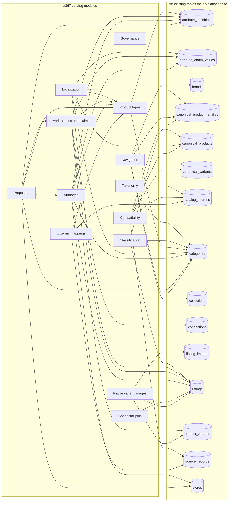

**2 foreign keys point the other way** — from a table outside the epic into
one the epic added. They are the edges that make an epic table impossible to drop quietly:

- `catalog_merge_conflicts.collapsing_relation_id` → `generic_compatibility_relations` (`ON DELETE restrict`)
- `listings.product_type_definition_id` → `product_type_definitions` (`ON DELETE restrict`)

## 2. Write ownership

Measured, not asserted. Every edge below is a `.insert(…)`, `.update(…)` or `.delete(…)` against
the table's drizzle symbol, or a raw-SQL write naming it, found in a non-test module under
`packages/backend/src`. The node on the left is the **directory** the writing module sits in.

**13 modules**, **13 writing directories**,
**4 tables written from more than one directory** and
**4 written by no application code at all**. The exceptions are drawn by name,
because they are the whole reason to look at this graph: `catalog-table-ownership.md` opens with
"one module owns a table", and these are the places where more than one directory issues the
statements.

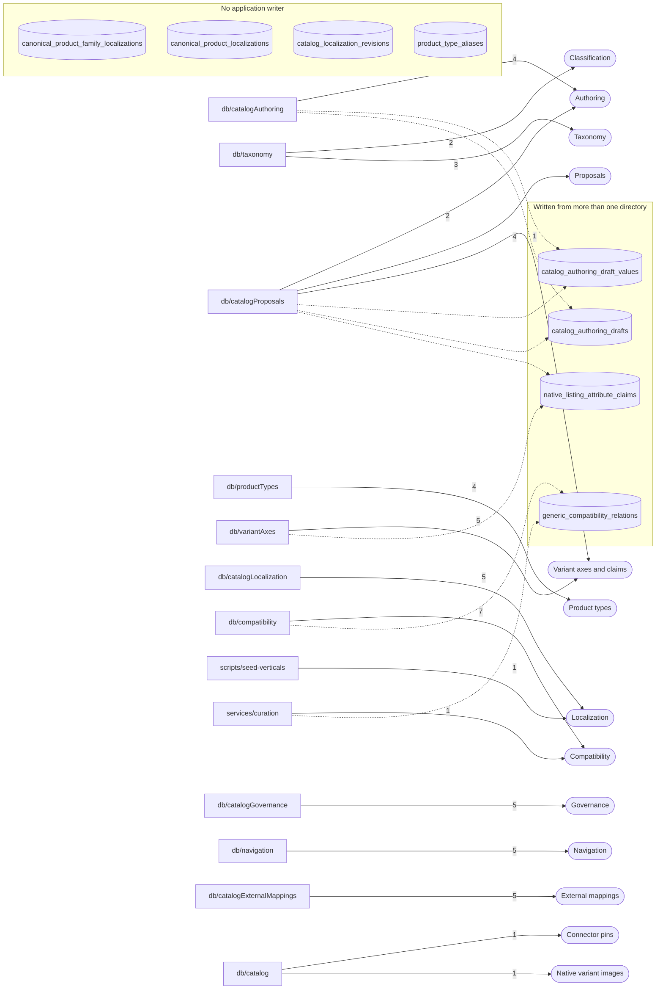

### Tables written from more than one directory

Each of these is a real production call site, not a scanning artefact — the gate binds every
entry to a file it actually read.

| Table | Owning module | Writing directories |
|---|---|---|
| `catalog_authoring_draft_values` | Authoring | `db/catalogAuthoring/draftRepository.ts` (delete/insert/update) `db/catalogProposals/backfillRepository.ts` (update) |
| `catalog_authoring_drafts` | Authoring | `db/catalogAuthoring/draftRepository.ts` (insert/update) `db/catalogProposals/backfillRepository.ts` (update) |
| `generic_compatibility_relations` | Compatibility | `db/compatibility/compatibilityRelationRepository.ts` (insert/update) `services/curation/merge-conflicts.ts` (update) |
| `native_listing_attribute_claims` | Variant axes and claims | `db/catalogProposals/backfillRepository.ts` (update) `db/variantAxes/attributeClaimRepository.ts` (insert/update) |

### Tables no application code writes

Not a gap in the map — a fact about it. A table nothing writes is the one most likely to
acquire a writer nobody argues about, so it is named here rather than left as an absence.

| Table | Owning module | Written by |
|---|---|---|
| `canonical_product_family_localizations` | Localization | a database trigger, or nothing yet |
| `canonical_product_localizations` | Localization | a database trigger, or nothing yet |
| `catalog_localization_revisions` | Localization | a database trigger, or nothing yet |
| `product_type_aliases` | Product types | a database trigger, or nothing yet |

**What this scan cannot see**, stated so an empty result is never read as proof of absence: a
write assembled from a table name held in a variable, a write through an aliased import (the
gate fails the build if one appears), and any statement issued from outside
`packages/backend/src`. `catalog-table-ownership.md` §"Who may write, per subject" carries the
HTTP-reachability half, which no source scan can answer.

## 3. Cardinality, by module

All 56 tables created by a migration at or after `0088`
appear below exactly once, each under the module that owns it. Every relationship is a foreign
key drizzle will emit; the label is the child columns and the `ON DELETE` action.

### Taxonomy

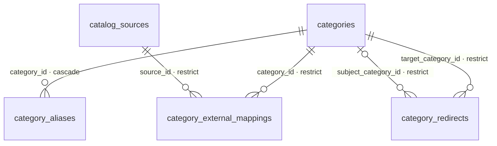

Also names, from outside the epic: `catalog_sources`, `categories`.

| Table | Created by | Written by |
|---|---|---|
| `category_aliases` | `0088` | `db/taxonomy` (delete/insert) |
| `category_redirects` | `0088` | `db/taxonomy` (insert) |
| `category_external_mappings` | `0088` | `db/taxonomy` (insert/update) |

### Classification

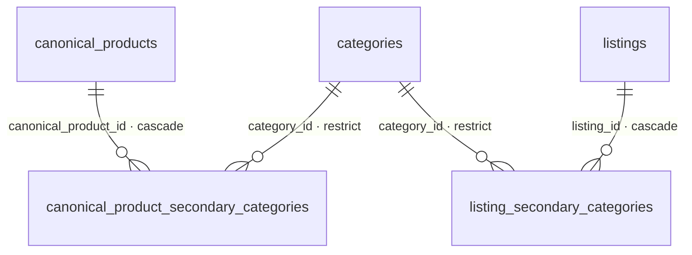

Also names, from outside the epic: `canonical_products`, `categories`, `listings`.

| Table | Created by | Written by |
|---|---|---|
| `listing_secondary_categories` | `0134` | `db/taxonomy` (insert) |
| `canonical_product_secondary_categories` | `0134` | `db/taxonomy` (insert) |

### Product types

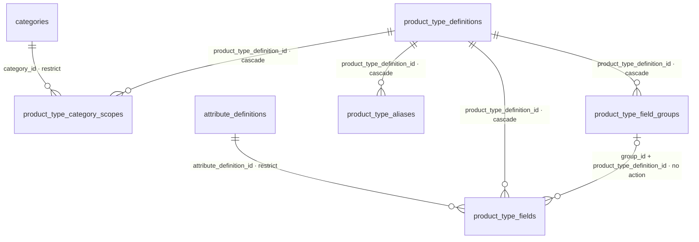

Also names, from outside the epic: `attribute_definitions`, `categories`.

| Table | Created by | Written by |
|---|---|---|
| `product_type_definitions` | `0089` | `db/productTypes` (insert/update) |
| `product_type_category_scopes` | `0089` | `db/productTypes` (insert) |
| `product_type_field_groups` | `0089` | `db/productTypes` (insert) |
| `product_type_fields` | `0089` | `db/productTypes` (delete/insert) |
| `product_type_aliases` | `0112` | — *no application writer* |

### Localization

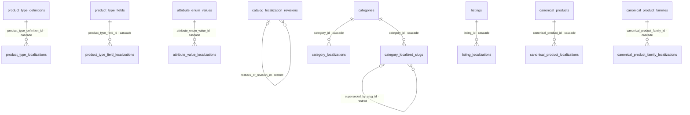

Also names, from other #367 modules: `product_type_definitions`, `product_type_fields`.

Also names, from outside the epic: `attribute_enum_values`, `canonical_product_families`, `canonical_products`, `categories`, `listings`.

| Table | Created by | Written by |
|---|---|---|
| `category_localizations` | `0091` | `db/catalogLocalization` (insert) |
| `category_localized_slugs` | `0091` | `db/catalogLocalization` (insert/update) |
| `product_type_localizations` | `0091` | `db/catalogLocalization` (insert) |
| `product_type_field_localizations` | `0112` | `db/catalogLocalization` (insert) |
| `attribute_value_localizations` | `0091` | `scripts/seed-verticals` (insert) |
| `listing_localizations` | `0130` | `db/catalogLocalization` (delete/insert) |
| `canonical_product_localizations` | `0120` | — *no application writer* |
| `canonical_product_family_localizations` | `0120` | — *no application writer* |
| `catalog_localization_revisions` | `0118` | — *no application writer* |

### Variant axes and claims

```mermaid
erDiagram
    native_listing_variant_axes {
    }
    native_variant_axis_assignments {
    }
    native_variant_signatures {
    }
    native_listing_attribute_claims {
    }
    native_variant_attribute_claims {
    }
    attribute_definitions |o--o{ native_listing_attribute_claims : "attribute_definition_id · restrict"
    attribute_enum_values |o--o{ native_listing_attribute_claims : "enum_value_id · restrict"
    connections |o--o{ native_listing_attribute_claims : "source_connection_id · restrict"
    listings ||--o{ native_listing_attribute_claims : "listing_id · cascade"
    attribute_definitions ||--o{ native_listing_variant_axes : "attribute_definition_id · restrict"
    listings ||--o{ native_listing_variant_axes : "listing_id · cascade"
    product_type_definitions |o--o{ native_listing_variant_axes : "product_type_definition_id · restrict"
    attribute_definitions |o--o{ native_variant_attribute_claims : "attribute_definition_id · restrict"
    attribute_enum_values |o--o{ native_variant_attribute_claims : "enum_value_id · restrict"
    connections |o--o{ native_variant_attribute_claims : "source_connection_id · restrict"
    product_variants ||--o{ native_variant_attribute_claims : "variant_id · cascade"
    attribute_definitions ||--o{ native_variant_axis_assignments : "attribute_definition_id · restrict"
    attribute_enum_values |o--o{ native_variant_axis_assignments : "enum_value_id · restrict"
    native_listing_variant_axes ||--o{ native_variant_axis_assignments : "axis_id · cascade"
    product_variants ||--o{ native_variant_axis_assignments : "variant_id · cascade"
    listings ||--o{ native_variant_signatures : "listing_id · cascade"
    product_variants ||--o| native_variant_signatures : "variant_id · cascade"
```

Also names, from other #367 modules: `product_type_definitions`.

Also names, from outside the epic: `attribute_definitions`, `attribute_enum_values`, `connections`, `listings`, `product_variants`.

| Table | Created by | Written by |
|---|---|---|
| `native_listing_variant_axes` | `0097` | `db/variantAxes` (delete/insert) |
| `native_variant_axis_assignments` | `0097` | `db/variantAxes` (delete/insert) |
| `native_variant_signatures` | `0097` | `db/variantAxes` (insert) |
| `native_listing_attribute_claims` | `0097` | `db/catalogProposals` (update) `db/variantAxes` (insert/update) |
| `native_variant_attribute_claims` | `0097` | `db/variantAxes` (insert/update) |

### Authoring

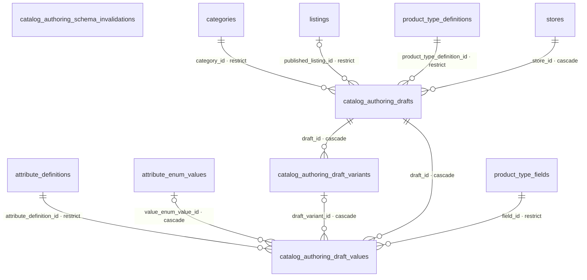

Also names, from other #367 modules: `product_type_definitions`, `product_type_fields`.

Also names, from outside the epic: `attribute_definitions`, `attribute_enum_values`, `categories`, `listings`, `stores`.

| Table | Created by | Written by |
|---|---|---|
| `catalog_authoring_drafts` | `0098` | `db/catalogAuthoring` (insert/update) `db/catalogProposals` (update) |
| `catalog_authoring_draft_variants` | `0098` | `db/catalogAuthoring` (delete/insert/update) |
| `catalog_authoring_draft_values` | `0098` | `db/catalogAuthoring` (delete/insert/update) `db/catalogProposals` (update) |
| `catalog_authoring_schema_invalidations` | `0098` | `db/catalogAuthoring` (insert) |

### Proposals

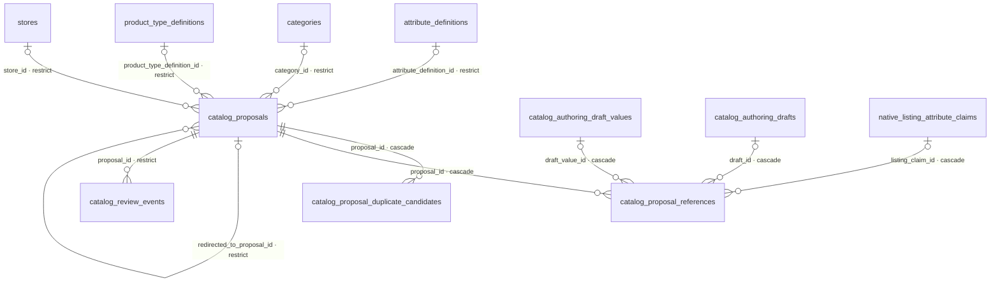

Also names, from other #367 modules: `catalog_authoring_draft_values`, `catalog_authoring_drafts`, `native_listing_attribute_claims`, `product_type_definitions`.

Also names, from outside the epic: `attribute_definitions`, `categories`, `stores`.

| Table | Created by | Written by |
|---|---|---|
| `catalog_proposals` | `0100` | `db/catalogProposals` (insert/update) |
| `catalog_proposal_duplicate_candidates` | `0100` | `db/catalogProposals` (insert) |
| `catalog_proposal_references` | `0100` | `db/catalogProposals` (insert/update) |
| `catalog_review_events` | `0100` | `db/catalogProposals` (insert) |

### Governance

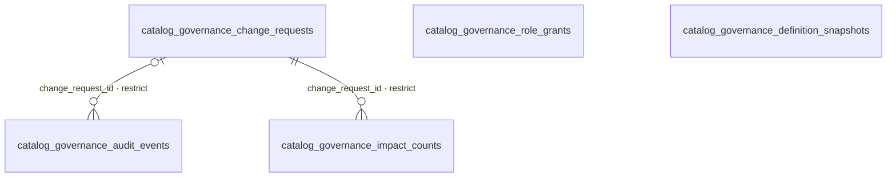

| Table | Created by | Written by |
|---|---|---|
| `catalog_governance_change_requests` | `0102` | `db/catalogGovernance` (insert/update) |
| `catalog_governance_impact_counts` | `0102` | `db/catalogGovernance` (insert) |
| `catalog_governance_audit_events` | `0102` | `db/catalogGovernance` (insert) |
| `catalog_governance_role_grants` | `0102` | `db/catalogGovernance` (insert/update) |
| `catalog_governance_definition_snapshots` | `0102` | `db/catalogGovernance` (insert) |

### Navigation

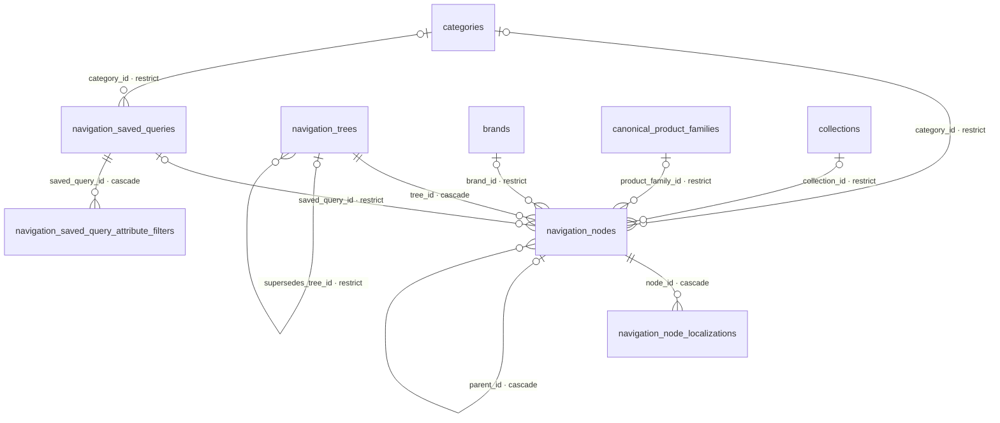

Also names, from outside the epic: `brands`, `canonical_product_families`, `categories`, `collections`.

| Table | Created by | Written by |
|---|---|---|
| `navigation_saved_queries` | `0090` | `db/navigation` (insert) |
| `navigation_saved_query_attribute_filters` | `0090` | `db/navigation` (insert) |
| `navigation_trees` | `0090` | `db/navigation` (delete/insert/update) |
| `navigation_nodes` | `0090` | `db/navigation` (delete/insert) |
| `navigation_node_localizations` | `0090` | `db/navigation` (insert) |

### Compatibility

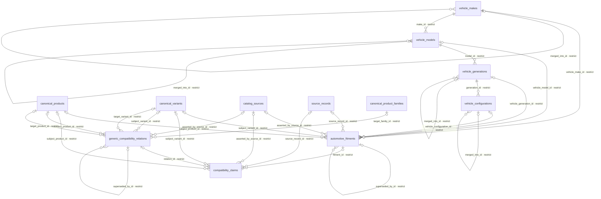

Also names, from outside the epic: `canonical_product_families`, `canonical_products`, `canonical_variants`, `catalog_sources`, `source_records`.

| Table | Created by | Written by |
|---|---|---|
| `generic_compatibility_relations` | `0093` | `db/compatibility` (insert/update) `services/curation` (update) |
| `vehicle_makes` | `0093` | `db/compatibility` (insert) |
| `vehicle_models` | `0093` | `db/compatibility` (insert) |
| `vehicle_generations` | `0093` | `db/compatibility` (insert) |
| `vehicle_configurations` | `0093` | `db/compatibility` (insert) |
| `automotive_fitments` | `0093` | `db/compatibility` (insert/update) |
| `compatibility_claims` | `0093` | `db/compatibility` (insert/update) |

### External mappings

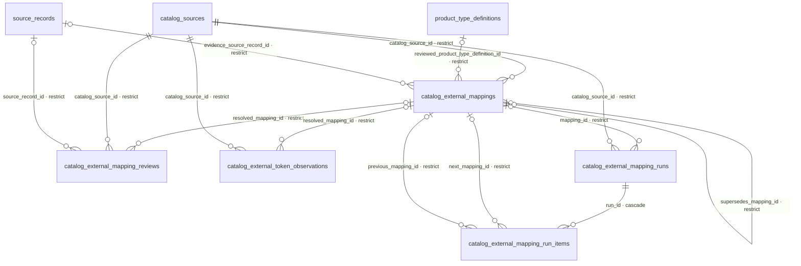

Also names, from other #367 modules: `product_type_definitions`.

Also names, from outside the epic: `catalog_sources`, `source_records`.

| Table | Created by | Written by |
|---|---|---|
| `catalog_external_mappings` | `0094` | `db/catalogExternalMappings` (insert/update) |
| `catalog_external_mapping_reviews` | `0094` | `db/catalogExternalMappings` (insert/update) |
| `catalog_external_token_observations` | `0094` | `db/catalogExternalMappings` (insert/update) |
| `catalog_external_mapping_runs` | `0094` | `db/catalogExternalMappings` (insert/update) |
| `catalog_external_mapping_run_items` | `0094` | `db/catalogExternalMappings` (insert) |

### Connector pins

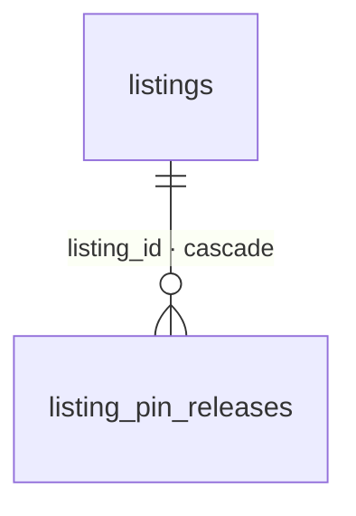

Also names, from outside the epic: `listings`.

| Table | Created by | Written by |
|---|---|---|
| `listing_pin_releases` | `0099` | `db/catalog` (insert) |

### Native variant images

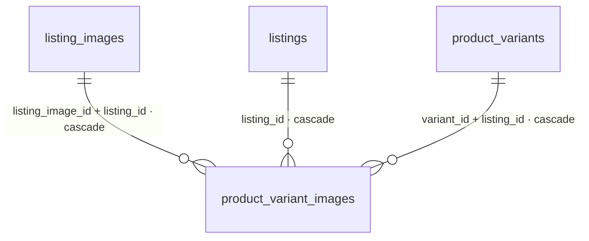

Also names, from outside the epic: `listing_images`, `listings`, `product_variants`.

| Table | Created by | Written by |
|---|---|---|
| `product_variant_images` | `0133` | `db/catalog` (delete/insert) |

## 4. What the derivation found

Counts, so that a diagram that quietly stopped measuring anything is visible as a number that
moved. Every one of these is re-derived on each run and floored by the gate.

| Fact | Value |
|---|---|
| Tables in the population | 56 |
| Modules they are grouped into | 13 |
| Foreign keys out of an epic table | 124 |
| Foreign keys into one, from outside the epic | 2 |
| Pre-existing tables the epic attaches to | 15 |
| Relationships the schema proves are 1:1 | 1 |
| Relationships whose parent is optional (nullable FK) | 66 |
| Directories that write an epic table | 13 |
| Tables written from more than one directory | 4 |
| Tables no application code writes | 4 |

`ON DELETE` across those 124 foreign keys: **41** `cascade`, **1** `no action`, **82** `restrict`.

### The relationships the schema proves are 1:1

- `product_variants` → `native_variant_signatures` on `variant_id`, because a unique constraint covers those columns.
