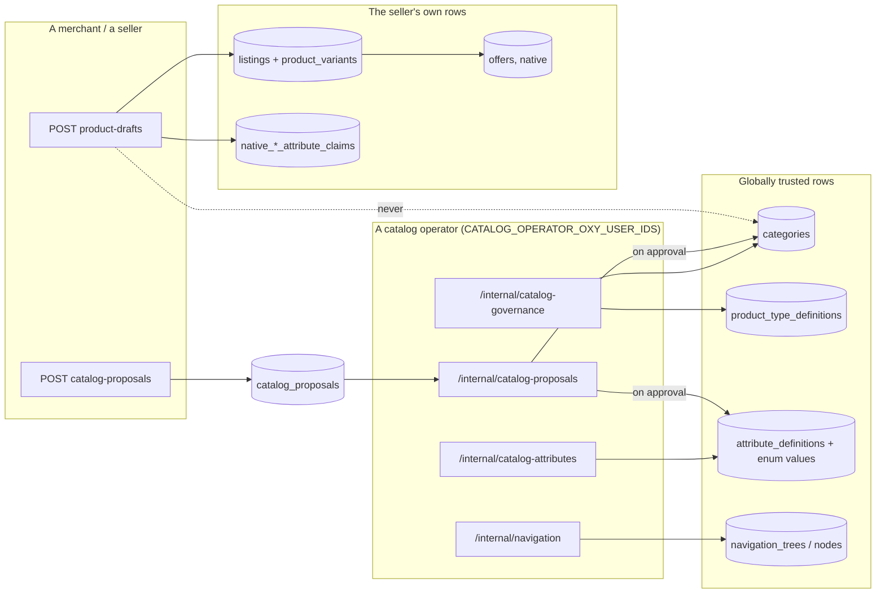

# The catalog glossary, and the diagrams that go with it

> #367 Workstream 19. The epic's "Canonical vocabulary" table, bound to the code
> that actually holds each concept. Binding decisions:
> [ADR 0007](adr/0007-universal-catalog-taxonomy-and-authoring.md).
>
> **This document holds the MEANINGS; ADR 0007 D16 holds the term set and each
> term's home.** Two facts, deliberately not two copies — and the one they share,
> the list of terms, is bound in both directions by
> `db/__tests__/catalog-vocabulary-census.test.ts`, so the two cannot disagree
> about what the vocabulary is.
>
> **Every row cites a table or a type.** A glossary whose terms are defined only
> in prose is a second description of the schema, and two descriptions of one
> fact come to disagree. Where a term has no home in the code, the row says so
> rather than describing an intention.
>
> **No row cites a LINE.** It used to, and by the time anything read them
> twelve of the twenty-two had rotted — `inventory_levels` by two hundred and
> ten lines. A line number is a fact about a file's current shape with no owner
> and no gate, and it goes wrong on an edit nobody made to this document. What
> replaces it is strictly better information: the table name and the file, both
> of which [ADR 0007](adr/0007-universal-catalog-taxonomy-and-authoring.md) D16's
> census resolves against the live schema, so a row that names the wrong file
> now fails the build.

## The nineteen terms

| Term | It is | Where it lives |
|---|---|---|
| **Taxonomy category** | The stable classification node a product is filed under. One tree, shared by browse, search, authoring and connectors. | `categories`, `db/schema/catalog.ts` |
| **Navigation node** | A storefront presentation entry pointing at *one* of a category, saved query, product type, brand, family, collection or campaign URL. | `navigation_nodes`, `db/schema/navigation.ts`; the tree is `navigation_trees` |
| **Merchandising collection** | A curated or rule-driven group. Not a category, and membership is never a product fact. | `collections`, `db/schema/merchandising.ts` |
| **Product type / profile** | The versioned schema saying which fields and behaviours apply. The one entity #367 added. | `product_type_definitions`, `db/schema/productTypes.ts` |
| **Brand** | Commercial identity. Predates #367 and was not re-modelled. | `brands`, `db/schema/organizations.ts` |
| **Product family** | A product line, where one is useful for navigation and matching. | `canonical_product_families`, `db/schema/canonicalCatalog.ts` |
| **Canonical product** | The seller-independent model. | `canonical_products`, `db/schema/canonicalCatalog.ts` |
| **Canonical variant** | The exact buyable configuration. | `canonical_variants`, `db/schema/canonicalCatalog.ts` |
| **Variant axis** | The attribute that differentiates variants *for one product*. A reference into the registry, never a string. | `native_listing_variant_axes`, `db/schema/variantAxes.ts`; the per-variant values are `native_variant_axis_assignments` |
| **Attribute** | A typed fact, versioned, with a unit family where it measures something. | `attribute_definitions`, `db/schema/attributeRegistry.ts` |
| **Controlled value** | A stable enum member of an attribute, with aliases and localizations. | `attribute_enum_values`, `db/schema/attributeRegistry.ts`; aliases `attribute_value_aliases`; localizations `attribute_value_localizations`, `db/schema/catalogLocalization.ts` |
| **Entity reference** | A typed link to another canonical entity, used where a fact *is* another entity. | no table of its own — a SHAPE, modelled per relationship; see compatibility below and `commerce-graph.md` for #55's relationship rows |
| **Compatibility / fitment** | An applicability relationship. Never a variant axis. | `generic_compatibility_relations`, `db/schema/compatibility.ts`; automotive `automotive_fitments` |
| **Native listing** | One store's or one person's presentation and sale record. | `listings`, `db/schema/catalog.ts`; its variants `product_variants` |
| **Offer** | The exact commercial terms one seller publishes on one channel. | `offers`, `db/schema/offers.ts` |
| **Inventory** | Stock state per location and channel. | `inventory_levels`, `db/schema/catalog.ts` |
| **Claim** | A merchant's or a source's assertion, retained verbatim with its provenance, whether or not it was selected. | `native_listing_attribute_claims`, `db/schema/variantAxes.ts`; `native_variant_attribute_claims` |
| **Selected canonical fact** | The value the graph decided to publish, distinct from every claim behind it. | `canonical_attribute_values`, `db/schema/canonicalCatalog.ts` |
| **Proposal** | An untrusted request for a missing canonical concept. Never trusted by being submitted. | `catalog_proposals`, `db/schema/catalogProposals.ts` |

Nineteen rows for the epic's eighteen concepts, and the difference is two
decisions rather than one.

**Entity reference has a row and no table.** It is a SHAPE — a foreign key to a
canonical entity — which is what "never a display string" means in practice, so
the row exists to say that, and the census admits it as a term with a written
disposition rather than an omission. (An earlier version of this paragraph said
two terms had no row of their own. Entity reference has one — what it lacks is a
table. Corrected here because a document that contradicts its own table is the
shape a reader argues with rather than fixes.)

**Selected canonical fact is the nineteenth term and is not in the epic's
table.** It was added because the epic names "claim" without naming its
counterpart, and a claim only means something beside the thing it is not.

## Identity: two identifiers, and a rule about the third

Every concept in the table above carries an opaque `id` and — for the ones a
seed, a fixture or an external mapping has to name — a stable machine `key`
(ADR 0007 D1). **A name, label, description or slug is presentation.**

Measured across the whole schema, not asserted, and stated as the shape rather
than as a tally: **every single-column `.references()` in `db/schema/*.ts`
targets `id`, save exactly one that targets a machine key**
(`entitlement_definitions.capability_key`, `db/schema/merchantPlans.ts`); the
composite `foreignColumns` entries target ids or stable keys; and **none targets
a `name`, `slug`, `label`, `title` or `description`.**

The figures themselves are deliberately not written down here.
`db/__tests__/catalog-identity-isolation.test.ts` PRINTS them on every successful
run — schema files walked, single-column foreign keys, composite target columns,
how many target `id` — so the current numbers are one command away and can never
be stale. The four that used to sit in this paragraph all were: measured again on
2026-08-23 against the same gate, every one had moved, in six days, upward and
invisibly, because a floor is what the gate asserts and a floor cannot notice
growth. That is PR #857's finding a second time — a count in prose is a fact with
no owner — and the remedy is the same one: delete it rather than correct it,
since a corrected count rots exactly as the original did.

What the walk is worth knowing for survives without the numbers: it reflects the
drizzle schema rather than grepping it, and `grep` is line-based, so a
`.references(` whose arrow target sits on the next line is invisible to a shell
pass — which therefore undercounts and reads as a complete census.

That is a property rather than a census:
`db/__tests__/catalog-identity-isolation.test.ts` fails the build on a foreign
key pointed at a presentation column. It is the gate ADR 0007 D1 named and, until
this doc landed, did not have.

## Cardinality

A curated subset — the edges worth knowing before you read anything else. The
complete set, every table and every foreign key, is
[`catalog-architecture-diagrams.md`](catalog-architecture-diagrams.md).

**Both are gated against the same derivation.** Every edge below is checked to be
a real foreign key carrying exactly the cardinality the schema proves, by
`packages/backend/scripts/architecture/__tests__/catalog-architecture-diagrams.test.ts`.
Read `|o` as *optional parent* — the foreign-key column is nullable — and `||` as
*mandatory*. The distinction is not decoration: this diagram carried `||` on eight
edges whose columns are nullable, because it used no optional marker anywhere,
and the most misleading of them said every listing has a category.

```mermaid
erDiagram
    categories |o--o{ categories : "parent_id, nullable at a root"
    categories ||--o{ category_localizations : "one per locale"
    categories ||--o{ category_localized_slugs : "one per locale"
    categories ||--o{ category_aliases : "search-time, never a name"
    categories ||--o{ category_redirects : "append-only, target_category_id"
    categories ||--o{ product_type_category_scopes : "eligibility"

    product_type_definitions ||--o{ product_type_category_scopes : ""
    product_type_definitions ||--o{ product_type_field_groups : "ordered"
    product_type_definitions ||--o{ product_type_fields : "cites an attribute VERSION"
    product_type_definitions ||--o{ product_type_localizations : ""

    attribute_definitions ||--o{ product_type_fields : "referenced, never restated"
    attribute_definitions ||--o{ attribute_enum_values : "controlled values"
    attribute_enum_values ||--o{ attribute_value_localizations : ""

    canonical_product_families |o--o{ canonical_products : "family_id, nullable"
    canonical_products ||--o{ canonical_variants : ""
    canonical_products |o--o{ canonical_attribute_values : "SELECTED facts, product grain"
    canonical_variants |o--o{ canonical_attribute_values : "variant grain"

    listings ||--o{ product_variants : ""
    listings }o--o| categories : "category_id, NULLABLE, restrict"
    listings ||--o{ native_listing_variant_axes : "declared axes + product type"
    listings ||--o{ native_listing_attribute_claims : "retained verbatim"
    product_variants ||--o{ native_variant_axis_assignments : ""
    product_variants ||--o{ native_variant_attribute_claims : ""
    product_variants |o--o{ offers : "native offers"
    product_variants ||--o{ inventory_levels : "per location"

    canonical_variants ||--o{ offers : "one seller, one channel, one variant"

    canonical_products |o--o{ generic_compatibility_relations : "applicability"
    vehicle_configurations |o--o{ automotive_fitments : ""
```

Three edges are worth reading twice.

**A listing need not have a category.** `listings.category_id` is nullable and has
been since `0000`, so `}o--o|` rather than `}o--||`: any read that assumes a
category is present is assuming something the schema does not enforce.

**`canonical_attribute_values` hangs off a product OR a variant**, and both
columns are nullable — that is what makes one table able to carry a fact at two
grains, and why neither edge may claim a mandatory parent.

**`offers` hangs off both a native `product_variants` row and a
`canonical_variants` row**, and that is the join a comparison surface is built
on: an offer names the exact configuration it sells, so "the same phone from
eleven sellers" is eleven offer rows under one canonical variant.

**A listing's product type is pinned in THREE places, and they are not gated
against each other.** `listings.product_type_definition_id` (the pin, landed by
merge-order step 5), `native_listing_variant_axes.product_type_definition_id`
(the version each declared axis was made under) and the draft
(`catalogAuthoring.ts`). See the collision below — and the residual under it.

## Write ownership

Who may write a table is not a convention here; it is the thing the operator
allow-lists, the store-permission middleware and the write chokepoints exist to
decide. Read down the arrows: a merchant reaches nothing on the right-hand side
except through a proposal.

The dotted edge is the invariant: authoring writes a seller's rows and a
proposal, and reaches globally trusted rows only through an operator decision.
What holds it is listed per subject in
[`catalog-table-ownership.md`](catalog-table-ownership.md), including the places
where it is a convention rather than a gate — `brands`, `canonical_products` and
`attribute_definitions`, named there rather than counted here. This sentence said
"the two places" until 2026-08-23; the cited document's own add-direction-gate
column answers **two gated of five, therefore three conventions**, and "two" was
the gated half read onto the ungated one. A number in one document about another
document's table has no owner in either.

## Two things in this repository that share a name

**`listings.product_type` is NOT a product type.** In `db/schema/catalog.ts` it
is a bare nullable `text()` column: the free-text `product_type` string a Shopify
or WooCommerce import carries, indexed for store browse
(`listings_store_id_product_type_idx`) and accepted on the v1 listing contracts
as `productType: z.string()` (`middleware/schemas.ts`, three of them). #367's
product type is
`product_type_definitions`, cited by id from
`listings.product_type_definition_id` in the SAME table — a nullable foreign key
with a partial index and the `mercaria_listing_product_type_pin_not_cleared`
trigger, gated by `db/__tests__/listing-product-type-pin.realdb.test.ts`. A
version is also cited by each declared axis
(`native_listing_variant_axes.product_type_definition_id`) and by the draft
(`db/schema/catalogAuthoring.ts`).

**Residual, measured rather than assumed:** nothing compares the axis citation
against the listing's own pin. `mercaria_native_variant_axis_citation`
(`drizzle/0097_uneven_hedge_knight.sql:178`) checks the attribute definition and
the product-type field and stops there, so an axis may cite one product type
version while the listing it belongs to is pinned to another. The axis
docblock (`db/schema/variantAxes.ts`) names that clause as the change owed
"when step 5 lands `listings.product_type_definition_id`"; step 5 has landed and
the clause has not.

So "this listing's product type" has two answers with different meanings, and
only one of them is versioned. `catalog-concept-distinctness.test.ts` freezes
that pair: `listings.product_type` is a declared, untyped near-name, and a THIRD
untyped concept-named column on a concept's own row fails the build. When you read `productType` in this repository,
check which table it came from before you use it.

**"Report" is two unrelated things** — sales analytics and abuse reports — and
that one is in `AGENTS.md` because it predates this epic.

## Where the rest of it is written down

| Question | Doc |
|---|---|
| Which module owns which table, and how migrations are serialized | [catalog-table-ownership.md](catalog-table-ownership.md) |
| `AuthoringSchema` and every DTO the epic added | [catalog-contracts.md](catalog-contracts.md) |
| Adding a category, a product type version, an attribute or a controlled value | [catalog-cookbook.md](catalog-cookbook.md) |
| Taxonomy identity, lifecycle, aliases, redirects | [taxonomy.md](taxonomy.md) |
| Localization, fallback, the review workflow | [catalog-localization.md](catalog-localization.md) |
| Product types and their specification layout | [product-types.md](product-types.md) |
| Variant axes and the legacy option claims | [variant-axes.md](variant-axes.md) |
| Compatibility and automotive fitment | [compatibility.md](compatibility.md) |
| Proposals and operator review | [catalog-proposals.md](catalog-proposals.md) |
| External taxonomy, attribute and value mappings | [catalog-external-mappings.md](catalog-external-mappings.md) |
| Facets, filters, same-variant and same-offer semantics | [facets.md](facets.md) |
