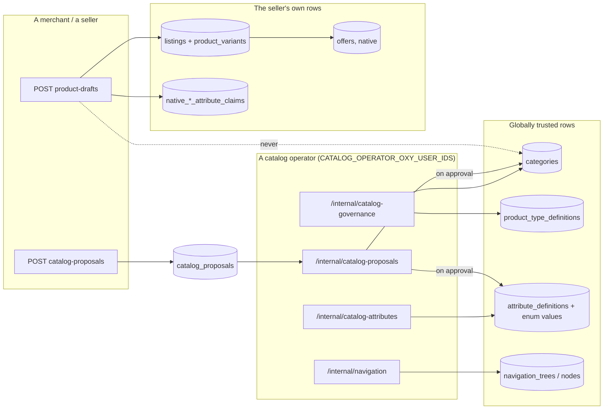

# The catalog glossary, and the diagrams that go with it

> #367 Workstream 19. The epic's "Canonical vocabulary" table, bound to the code
> that actually holds each concept. Binding decisions:
> [ADR 0007](adr/0007-universal-catalog-taxonomy-and-authoring.md).
>
> **Every row cites a table or a type.** A glossary whose terms are defined only
> in prose is a second description of the schema, and two descriptions of one
> fact come to disagree. Where a term has no home in the code, the row says so
> rather than describing an intention.

## The nineteen terms

| Term | It is | Where it lives |
|---|---|---|
| **Taxonomy category** | The stable classification node a product is filed under. One tree, shared by browse, search, authoring and connectors. | `categories`, `db/schema/catalog.ts:128` |
| **Navigation node** | A storefront presentation entry pointing at *one* of a category, saved query, product type, brand, family, collection or campaign URL. | `navigation_nodes`, `db/schema/navigation.ts:392`; the tree is `navigation_trees`, `:300` |
| **Merchandising collection** | A curated or rule-driven group. Not a category, and membership is never a product fact. | `collections`, `db/schema/merchandising.ts:108` |
| **Product type / profile** | The versioned schema saying which fields and behaviours apply. The one entity #367 added. | `product_type_definitions`, `db/schema/productTypes.ts:108` |
| **Brand** | Commercial identity. Predates #367 and was not re-modelled. | `brands`, `db/schema/organizations.ts:121` |
| **Product family** | A product line, where one is useful for navigation and matching. | `canonical_product_families`, `db/schema/canonicalCatalog.ts:125` |
| **Canonical product** | The seller-independent model. | `canonical_products`, `db/schema/canonicalCatalog.ts:290` |
| **Canonical variant** | The exact buyable configuration. | `canonical_variants`, `db/schema/canonicalCatalog.ts:504` |
| **Variant axis** | The attribute that differentiates variants *for one product*. A reference into the registry, never a string. | `native_listing_variant_axes`, `db/schema/variantAxes.ts:135`; the per-variant values are `native_variant_axis_assignments`, `:229` |
| **Attribute** | A typed fact, versioned, with a unit family where it measures something. | `attribute_definitions`, `db/schema/attributeRegistry.ts:105` |
| **Controlled value** | A stable enum member of an attribute, with aliases and localizations. | `attribute_enum_values`, `db/schema/attributeRegistry.ts:340`; aliases `:381`; localizations `catalogLocalization.ts:374` |
| **Entity reference** | A typed link to another canonical entity, used where a fact *is* another entity. | modelled per relationship; see compatibility below and `commerce-graph.md` for #55's relationship rows |
| **Compatibility / fitment** | An applicability relationship. Never a variant axis. | `generic_compatibility_relations`, `db/schema/compatibility.ts:160`; automotive `automotive_fitments`, `:747` |
| **Native listing** | One store's or one person's presentation and sale record. | `listings`, `db/schema/catalog.ts:246`; its variants `product_variants`, `:697` |
| **Offer** | The exact commercial terms one seller publishes on one channel. | `offers`, `db/schema/offers.ts:139` |
| **Inventory** | Stock state per location and channel. | `inventory_levels`, `db/schema/catalog.ts:850` |
| **Claim** | A merchant's or a source's assertion, retained verbatim with its provenance, whether or not it was selected. | `native_listing_attribute_claims`, `db/schema/variantAxes.ts:573`; `native_variant_attribute_claims`, `:666` |
| **Selected canonical fact** | The value the graph decided to publish, distinct from every claim behind it. | `canonical_attribute_values`, `db/schema/canonicalCatalog.ts:803` |
| **Proposal** | An untrusted request for a missing canonical concept. Never trusted by being submitted. | `catalog_proposals`, `db/schema/catalogProposals.ts:120` |

Two terms in the epic's table have no row of their own and that is deliberate:
**entity reference** is a shape rather than a table (a foreign key to a canonical
entity, which is what "never a display string" means in practice), and
**selected canonical fact** was added to the list here because the epic names
"claim" without naming its counterpart, and a claim only means something beside
the thing it is not.

## Identity: two identifiers, and a rule about the third

Every concept in the table above carries an opaque `id` and — for the ones a
seed, a fixture or an external mapping has to name — a stable machine `key`
(ADR 0007 D1). **A name, label, description or slug is presentation.**

Measured across the whole schema, not asserted: **791** foreign-key target
columns in `db/schema/*.ts` — 770 single-column `.references()` plus 21
composite `foreignColumns` entries, over 82 files. **769 of the 770 target
`id`**; the composite entries target ids or stable keys; exactly **one**
single-column key targets a machine key
(`entitlement_definitions.capability_key`, `db/schema/merchantPlans.ts:717`).
**None targets a `name`, `slug`, `label`, `title` or `description`.**

Those counts come from the gate's own walk and not from a shell census, and the
difference is worth knowing: `grep` is line-based, so a `.references(` whose
arrow target sits on the next line is invisible to it. A shell pass over the same
82 files reports 769 and 18 — a clean-looking undercount of one foreign key and
three composite members.

That is now a property rather than a census:
`db/__tests__/catalog-identity-isolation.test.ts` fails the build on a foreign
key pointed at a presentation column. It is the gate ADR 0007 D1 named and, until
this doc landed, did not have.

## Cardinality

```mermaid
erDiagram
    categories ||--o{ categories : "parent_id + ancestor_ids"
    categories ||--o{ category_localizations : "one per locale"
    categories ||--o{ category_localized_slugs : "one per locale"
    categories ||--o{ category_aliases : "search-time, never a name"
    categories ||--o{ category_redirects : "append-only"
    categories ||--o{ product_type_category_scopes : "eligibility"

    product_type_definitions ||--o{ product_type_category_scopes : ""
    product_type_definitions ||--o{ product_type_field_groups : "ordered"
    product_type_definitions ||--o{ product_type_fields : "cites an attribute VERSION"
    product_type_definitions ||--o{ product_type_localizations : ""

    attribute_definitions ||--o{ product_type_fields : "referenced, never restated"
    attribute_definitions ||--o{ attribute_enum_values : "controlled values"
    attribute_enum_values ||--o{ attribute_value_localizations : ""

    canonical_product_families ||--o{ canonical_products : ""
    canonical_products ||--o{ canonical_variants : ""
    canonical_products ||--o{ canonical_attribute_values : "SELECTED facts"
    canonical_variants ||--o{ canonical_attribute_values : "variant grain"

    listings ||--o{ product_variants : ""
    listings }o--|| categories : "category_id, restrict"
    listings ||--o{ native_listing_variant_axes : "declared axes + product type"
    listings ||--o{ native_listing_attribute_claims : "retained verbatim"
    product_variants ||--o{ native_variant_axis_assignments : ""
    product_variants ||--o{ native_variant_attribute_claims : ""
    product_variants ||--o{ offers : "native offers"
    product_variants ||--o{ inventory_levels : "per location"

    canonical_variants ||--o{ offers : "one seller, one channel, one variant"

    canonical_products ||--o{ generic_compatibility_relations : "applicability"
    vehicle_configurations ||--o{ automotive_fitments : ""
```

Two edges are worth reading twice.

**`offers` hangs off both a native `product_variants` row and a
`canonical_variants` row**, and that is the join a comparison surface is built
on: an offer names the exact configuration it sells, so "the same phone from
eleven sellers" is eleven offer rows under one canonical variant.

**`native_listing_variant_axes` is where a published listing's product type
lives.** `listings` itself carries no `product_type_definition_id` — see the
collision below.

## Write ownership

Who may write a table is not a convention here; it is the thing the operator
allow-lists, the store-permission middleware and the write chokepoints exist to
decide. Read down the arrows: a merchant reaches nothing on the right-hand side
except through a proposal.

The dotted edge is the invariant: authoring writes a seller's rows and a
proposal, and reaches globally trusted rows only through an operator decision.
What holds it is listed per subject in
[`catalog-table-ownership.md`](catalog-table-ownership.md), including the two
places where it is a convention rather than a gate.

## Two things in this repository that share a name

**`listings.product_type` is NOT a product type.** `db/schema/catalog.ts:368` is
a bare nullable `text()` column: the free-text `product_type` string a Shopify or
WooCommerce import carries, indexed for store browse
(`listings_store_id_product_type_idx`, `catalog.ts:552`) and accepted on the v1
listing contracts as `productType: z.string()`
(`middleware/schemas.ts:173`, `:229`, `:1275`). #367's product type is
`product_type_definitions`, cited by id — and a listing carries **no**
`product_type_definition_id` column at all. The pin lives on
`native_listing_variant_axes.product_type_definition_id`
(`db/schema/variantAxes.ts:159`) and on the draft
(`db/schema/catalogAuthoring.ts:136`).

So "this listing's product type" has two answers with different meanings, and
only one of them is versioned. When you read `productType` in this repository,
check which table it came from before you use it.

**"Report" is two unrelated things** — sales analytics and abuse reports — and
that one is in `AGENTS.md` because it predates this epic.

## Where the rest of it is written down

| Question | Doc |
|---|---|
| Which module owns which table, and how migrations are serialized | [catalog-table-ownership.md](catalog-table-ownership.md) |
| `AuthoringSchema` and every DTO the epic added | [catalog-contracts.md](catalog-contracts.md) |
| Adding a category, a product type version, an attribute or a controlled value | [catalog-cookbook.md](catalog-cookbook.md) |
| Taxonomy identity, lifecycle, aliases, redirects | [taxonomy.md](taxonomy.md) |
| Localization, fallback, the review workflow | [catalog-localization.md](catalog-localization.md) |
| Product types and their specification layout | [product-types.md](product-types.md) |
| Variant axes and the legacy option claims | [variant-axes.md](variant-axes.md) |
| Compatibility and automotive fitment | [compatibility.md](compatibility.md) |
| Proposals and operator review | [catalog-proposals.md](catalog-proposals.md) |
| External taxonomy, attribute and value mappings | [catalog-external-mappings.md](catalog-external-mappings.md) |
| Facets, filters, same-variant and same-offer semantics | [facets.md](facets.md) |
