# Payments and the internal ledger

The provider-neutral payment domain: what the models are, what holds each
invariant, what is retained and for how long, and where the boundaries between
this domain and the rest of Mercaria fall.

Binding context lives in [ADR 0001](./adr/0001-stripe-connect-architecture.md) —
separate charges and transfers, Mercaria as merchant of record, one charge per
checkout group. This document describes what was BUILT for it (issue #45); the
ADR describes why, and where the two disagree the ADR wins and this file is
wrong.

FairCoin is not a payment method in this roadmap — if it is introduced it arrives
through OxyPay, the Oxy gateway that accepts FairCoin, under its own ADR, and
nothing here anticipates it. Stripe is complete end to end: #48 built the
event ingress, #46 the connected accounts and the readiness gate, #47 the
checkout and the per-seller settlement, #49 the money coming back — refunds,
transfer reversals, disputes and payout health — and #50 the reconciliation,
observability and operator recovery that make the rest operable. Nothing here is
a placeholder: the domain is complete on its own terms and each rail arrives as
an adapter behind one interface.

---

## Why the ledger is load-bearing on day one

ADR 0001 D3 chooses separate charges and transfers, which means Mercaria's
commission is **not** an `application_fee_amount` — that mechanism does not exist
for this charge model. The commission is the difference between what the buyer
paid and the sum of what the sellers were paid, and that quantity exists in
exactly one place: `ledger_transactions` and `ledger_entries` in this database.
Stripe's fee reporting is deliberately given up.

So the ledger is not accounting hygiene to be added once revenue matters. It is
the only record of revenue there will ever be, which is why it landed before a
single real charge could be created.

---

## Models

Thirteen tables, all Postgres-native — none has a Mongoose ancestor.

| Table | What it is |
|---|---|
| `provider_accounts` | One seller's standing with one rail: their connected account, its capabilities, and the single readiness verdict checkout gates on. |
| `payments` | The durable payment aggregate. One per funded checkout group for native rails; one per imported order for `external`. |
| `disputes` | A card network reversing a charge: its deadline, its evidence, its outcome and its ledger life (#49). |
| `payment_attempts` | One row per provider authorization or confirmation Mercaria asked for. Append-mostly evidence. |
| `payment_provider_events` | The immutable envelope of everything a provider has told Mercaria. Receipt is separate from processing. |
| `transfers` | Mercaria paying ONE seller order out of a settled charge (ADR D3). |
| `payouts` | The provider moving a seller's own balance to their bank. Recorded for health and support; books nothing. |
| `payment_outboxes` | The durable promise that a payment's consequences will happen. |
| `ledger_transactions` | One balanced set of entries, and what caused it. |
| `ledger_entries` | One signed movement against one account in one currency. |
| `payment_discrepancies` | One disagreement reconciliation has noticed between Mercaria and the rail, or within the ledger (#50). |
| `payment_repairs` | Every operator action against the payment domain, applied or refused. Append-only (#50). |
| `reconciliation_cursors` | Where each sweep had got to, and which task is running it (#50). |

They replace the four `orders.payment_*` fields, which had to be a state machine,
an audit trail, an idempotency key and a provider reference at once, and the four
`settlement_*` columns retired with them (a shop→FAIR snapshot from the model in
which FAIR was the mandatory settlement currency).

The order keeps only a POINTER and the coarse state:
`{status, provider?, paidAt?, reference?, paymentId?}`. Nothing mutable is copied
onto it, so a payment moving through its lifecycle can never leave an order
holding a stale figure.

### The chart of accounts

Seven accounts. `LedgerAccount` in `@mercaria/shared-types` carries the same
table with the per-account meaning of a positive entry.

| Account | Normal balance | What it holds |
|---|---|---|
| `provider_clearing` | debit | Funds on the platform balance |
| `merchant_payable` | credit | What Mercaria owes a seller, per order |
| `commission_revenue` | credit | Mercaria's commission — the charge minus the sellers' nets |
| `processor_expense` | debit | Provider fees, borne by Mercaria (ADR D5) |
| `refunds` | debit | Money returned to buyers |
| `disputes` | debit | Disputed principal, held until the outcome is known |
| `reserves` | debit | Funds withheld from a seller |

There is deliberately no buyer-funds account: Mercaria is the merchant of record
(D1) and never holds a buyer balance. Money arrives already captured, which
`provider_clearing` is the name for.

`merchant_payable` is the only account carried per owner (`ownerType` +
`ownerId`, plus the order). The rest are platform-wide.

### The sign convention

`ledger_entries.amount_minor` is **SIGNED**: positive is a DEBIT, negative is a
CREDIT, and the entries of one transaction sum to exactly **zero per currency**.

There is no `direction` column beside it. Two representations of one fact can
disagree — `direction: 'credit'` next to a positive amount is a row nobody can
interpret — and nothing in a schema can stop it being written.

Per CURRENCY, not overall: a cross-currency movement books both legs in their own
currencies at a captured rate (ADR D8), and adding a EUR amount to a USD one to
reach zero would be arithmetic on two different things.

### The one deviation from the money convention

`CONVENTIONS.md` makes every money column `bigint({ mode: 'number' })`, so it maps
to the `number` that `Money.amount` already is. `ledger_entries.amount_minor` is
`bigint({ mode: 'bigint' })` instead. A ledger entry is not a `Money`: it never
ships to a client, it is never rendered, and it is summed across arbitrarily many
rows by the one part of the system whose job is to be exactly right. The bound
that applies is the column's own int8 range, asserted by `assertSafeLedgerAmount`
at every posting builder.

---

## Invariants, and what holds each one

### Balance — three layers, none of which is a convention

1. **The repository.** `db/payments/ledgerRepository.ts` exports exactly ONE
   write, `insertLedgerTransaction(tx, entries)`, which takes a whole transaction
   with all of its legs and refuses it before issuing any SQL if it has fewer
   than two entries, carries a zero or an out-of-range amount, or does not sum to
   zero per currency. An API that let a caller insert a single entry would make
   "unbalanced" a reachable state for as long as the caller took to add the next
   one.
2. **The database.** A `BEFORE UPDATE OR DELETE` trigger on both tables raises
   `check_violation` with a message naming the reversal that should have been
   used instead. It is a trigger and not a convention because a backfill script,
   an operator at a `psql` prompt and a future service all reach these tables
   without passing that function.
3. **Randomized property tests.** `db/payments/__tests__/ledger.realdb.test.ts`
   generates balanced and unbalanced entry sets across mixed currencies from a
   seeded PRNG (the seed is printed on every run; replay with
   `LEDGER_TEST_SEED=…`). Balanced sets insert, unbalanced ones are refused,
   UPDATE and DELETE are refused against both tables, and a correction is
   asserted to be a reversing transaction that leaves BOTH rows in the book.

The trigger assertions were mutation-tested: with the two `CREATE TRIGGER`
statements removed from the migration, five of those tests go red naming the
missing trigger; with them restored, all ten pass.

### Corrections

A mistake becomes a NEW transaction whose entries are the negatives of the wrong
ones. There is no other mechanism, and deliberately no `reverseTransaction(id)`
helper: it would have to READ the ledger to build its entries, making a
correction a function of what is stored rather than of what an operator decided,
and it would quietly become the way history gets rewritten one approved reversal
at a time.

### Idempotency

| Layer | Mechanism |
|---|---|
| Payment per checkout group | Partial unique index on `checkout_group_id WHERE provider <> 'external'` |
| Payment per imported order | Partial unique index on `order_id WHERE provider = 'external'` |
| Provider events | `UNIQUE(provider, provider_account_id, provider_event_id) NULLS NOT DISTINCT` |
| Status transitions | A compare-and-swap from an allowed source status |
| Transfers | `UNIQUE(payment_id, order_id)` |
| Payouts | `UNIQUE(provider, provider_object_id)` |
| Outbox rows | A deterministic primary key, inserted `on conflict do nothing` |

Two of those need their reasons stated, because the obvious version is wrong:

**`NULLS NOT DISTINCT` on the event key.** `provider_account_id` is NULL for
platform-scope events, and Postgres treats NULLs as DISTINCT by default — so the
plain constraint would dedupe connect-scope events and silently accept every
redelivery of a platform-scope one, which is the majority of them. Coalescing to
`''` would also work and is worse: an empty string is a VALUE, so it collides for
real the day a provider reports an empty account.

**External payments are unique per ORDER, not per group.** A connector's
checkout group is a synthetic `ext:<provider>:<externalId>`, and two connected
shops can legitimately import orders carrying the same external id — so their
group ids collide. Uniqueness on the group would make the second shop's import
fail.

### Provider ids are never primary keys

Every `provider_object_id` is a plain, indexed, nullable column. A provider's key
space is not Mercaria's: it changes between test and live mode, it is absent
until the provider has answered, and two providers may mint the same string.

### Payment success cannot be asserted by a client

A payment reaches `succeeded` only through `applyPaymentStatus`, reached either
from a verified provider EVENT (`applyProviderEvent`, whose envelope came from an
adapter's `verifyEvent`) or from a synchronous provider response over an
authenticated server-to-server channel. A client callback is UX; a `return_url`
proves nothing.

---

## Service boundaries

```
checkout.service.ts ─────────────┐        routes / #48 webhook ingress
   (no Stripe import, ever)      │               │  verified envelope
                                 ▼               ▼
services/payments/checkout-payment.service.ts   payment.service.ts
   rail choice, currency gate, handoff       ← the ONLY status transitions
                                 │               │
                                 │               ├── ledger-postings.ts   ← pure; ADR's table
                                 │               ├── settlement-shares.ts ← pure; ONE split
                                 │               ├── payment-outbox.service.ts
                                 │               │      └── outbox-handlers.ts
                                 │               │             └── settlement.service.ts
                                 │               └── order-linkage.ts     ← the ONE seam onto orders
                                 ▼               ▼
                          registry.ts → provider.ts  ← the seam every rail plugs into
                                          ├── synthetic-provider.ts (id: `mock`)
                                          └── stripe/stripe-provider.ts (id: `stripe`)
```

- **`provider.ts`** names no provider's vocabulary. No `PaymentIntent`, no
  `transfer_group`. The day one appears, the seam has failed.
- **Three modules talk to an adapter, and no others.** `payment.service` (status
  transitions and the sweep's cancellation), `checkout-payment.service` (opening
  the payment a checkout funds) and `settlement.service` (the transfers). Each
  reaches its rail through `registry.ts`, so "which adapter serves which rail"
  is answered in one place and a rail that is not configured resolves to
  `undefined` rather than throwing inside a request.
- **`payment.service.ts`** owns the state machine, the ledger postings and the
  outbox writes, in ONE Postgres transaction per status change. If the
  compare-and-swap matches nothing — a duplicate `succeeded`, an out-of-order
  `processing` after it — nothing downstream runs. That single fact is what makes
  duplicate and out-of-order events converge.
- **`order-linkage.ts`** is the only module that touches orders, reading them
  through a projection it owns rather than reaching into the order repository from
  five places. The payment and the order transition still do not commit together —
  the transition runs from the outbox handler, a separate transaction — so the
  outbox remains the reconciliation path.
- **`tracePayment`** is service-level and #50 exposes it over HTTP at
  `GET /internal/payments/trace`, behind the operator allow-list — everything it
  returns is merchant and operator financial detail.
- **`services/payments/reconciliation/`** is the only module that WRITES a
  discrepancy or runs a repair, and it reaches the domain through the same public
  functions everything else does: `applyPaymentStatus` for a convergence,
  `settlePaymentTransfers` for a withheld transfer, `executeRefundAtProvider` for
  a refund, `insertLedgerTransaction` for a correction. It adds no second write
  path, which is what makes an operator surface safe to expose at all.

### Payment state and order state may differ, briefly

A payment reaching `succeeded` commits in Postgres with its ledger postings and
its outbox row. The orders it funds move to `paid` afterwards, from the outbox
handler. The window is normally milliseconds — `applyPaymentStatus` drains the
row it just wrote, inline, claiming the same lease the poller would — but it is
real, and a task dying mid-window changes only how long it lasts.

Collapsing the two into one transaction is not simply a matter of both living in
Postgres now: the same handler is run by `applyPaymentStatus`'s inline drain AND
by the poller, and the poller has no payment transaction to join. Leaving the
window explicit is what keeps the reconciliation path real.

---

## The outbox

The moderation outbox's semantics, ported to Postgres, deliberately down to the
column names so the two claim queries are the same query.

- **Deterministic ids.** `payment:payment_succeeded:<paymentId>`,
  `payment:payment_failed:<paymentId>:<providerEventId>`,
  `payment:payment_refunded:<refundId>`, and so on. Where a fact can legitimately
  happen more than once — a payment failing, being retried and failing again —
  the id carries what distinguishes the occurrences.
- **The row IS the job.** No queue, no detached promise. Both evaporate on a
  restart, and payment consequences that evaporate do so silently.
- **The enqueue is a genuine no-op on a repeat.** `on conflict (id) do nothing`.
  A `do update` would reintroduce the exact bug the Mongo version needed
  `timestamps: false` to avoid: a write nobody needed, contending with the
  dispatcher's live lease on the same row.
- **Claims are leases with an owner check.** `FOR UPDATE SKIP LOCKED`, so N tasks
  drain concurrently without contending, and a dead task's lease is reclaimed
  rather than stranding the row.
- **Backoff is exponential, capped at six hours**, and after 25 attempts (or on a
  non-retryable failure) the row becomes a VISIBLE `dead_letter` rather than
  accumulating attempts nobody reads.
- **The LOOP is gated, never the record.** Rows are written whatever
  `PAYMENT_OUTBOX_ENABLED` says, so switching the dispatcher off during an
  incident parks work and switching it on delivers the backlog.

An event type this version does not handle THROWS rather than completing as if
handled, so during a rolling deploy the task running the newer code claims it.
As of #49 every declared type has a handler, so that branch is reachable only by
a row a NEWER image wrote — which is exactly the case it exists for.

---

## The Stripe event ingress (#48)

Two endpoints, mounted in `app.ts` BEFORE `express.json()` beside the CrowdSource
and connector webhooks, because Stripe signs the exact bytes it sent:

| Path | Scope | Secret | Subscribes to |
|---|---|---|---|
| `POST /webhooks/stripe` | platform (`connect=false`) | `STRIPE_WEBHOOK_SECRET` | `payment_intent.*`, `charge.*`, `charge.dispute.*`, `transfer.*` |
| `POST /webhooks/stripe/connect` | connect (`connect=true`) | `STRIPE_CONNECT_WEBHOOK_SECRET` | `account.*`, `payout.paid`, `payout.failed` |

The exact lists are ADR 0001's and are pinned by
`services/payments/stripe/__tests__/event-scopes.test.ts`, which transcribes them
from the ADR by hand so changing the source alone breaks the test. Both endpoints
answer **404 when `STRIPE_ENABLED` is off** — the MOUNT is gated, not just the
handler, because a deployment with no secret cannot tell a real delivery from a
forged one, so there is nothing to park.

### The order of the ingress, and what each step may leave behind

1. **Verify** over the raw bytes, trying the current secret then the previous one
   (the rotation window). Failure → **400, nothing persisted**. Storing an
   unverified body would put an attacker's chosen `(provider, account, event id)`
   into the dedupe key, after which the real event carrying that id is silently
   swallowed as a duplicate.
2. **Filter on `livemode`.** A production URL receives test events too. Mismatch
   → **200 `livemode_mismatch`, nothing persisted**; 200 because Stripe must stop
   retrying something that will never be accepted.
3. **Refuse the other endpoint's scope** → **400 `wrong_scope`**. A type in
   NEITHER list is accepted and stored, following #45's rule that an
   uninterpretable event is evidence rather than a dropped request.
4. **Store the envelope**, redacted through `redactProviderPayload`. The insert
   IS the dedupe claim; a redelivery loses to the unique index, answers 200 and
   has no side effects.
5. **Process**, inline, through the same durable claim the poller uses.

**A 200 means STORED, never PROCESSED.** Processing failing never changes the
answer: the row is durable, so it is retried with backoff and eventually
dead-lettered, whereas a 500 would ask Stripe to redeliver an event Mercaria
already has.

### The event row is the job — there is no second queue

`payment_provider_events` gained `next_attempt_at`, `lease_owner`, `lease_until`
and `processing_note`, so claiming one is the same `FOR UPDATE SKIP LOCKED` claim
`payment_outboxes` uses. Writing an outbox row that says "please interpret the
event row I just wrote" was rejected: it makes one delivery into two durable
records that can disagree, it puts inbound ingress into a table whose event types
are Mercaria's own domain CONSEQUENCES, and the retentions differ on purpose —
outbox rows are swept at 14 days, events at 90, and a dead-lettered event must
stay replayable across a dispute window.

`replayProviderEvent(eventId)` reopens a `failed` or `dead_letter` row and runs it
again. It resets only WHEN the row may be claimed — never `attempts`, never the
envelope — so the trace still shows how often it had been tried. #50 exposes it
at `POST /internal/payments/events/:id/replay`; `stripeWebhookStats()` is on
`GET /health` under `payments.webhooks` and again, unreduced, on
`GET /internal/payments/metrics`.

### Convergence needs no new mechanism, and one new rule

Duplicates and reordering converge on `applyPaymentStatus`'s compare-and-swap,
exactly as #45 designed. The one addition is the **stale-delivery rule**: before
applying, the router asks `canTransitionPaymentStatus(current, mapped)`, and if
the answer is no it re-reads the PaymentIntent from Stripe and applies THAT.
"Is this delivery stale" and "can this be applied" turn out to be the same
question, and only the second has an answer that does not require knowing which
other events exist.

One case survives the re-read: Stripe says `succeeded`, Mercaria says `canceled`
— a capture for a payment whose reservation timed out and whose orders were
released. Nothing is committed, booked or fulfilled (re-committing stock would
oversell it; booking with no orders left would credit `commission_revenue` with
the whole gross), and the condition becomes one deterministic
`payment_succeeded_after_release` outbox row whose handler logs at `error` and
changes nothing. It surfaces on `GET /internal/payments/exceptions` and there is
deliberately NO repair action for it — see the Operations runbook §14, where both
answers are commerce decisions with a customer on the other end of them.

### Seams are visible in the trace, never fake handling

A subscribed type whose consumer has not shipped arrives TODAY, because an
endpoint must be registered with its full list before any of them ships. Such a
handler marks the event `processed` **and writes `deferred: #NN` into
`processing_note`** — a deferral that said nothing would be indistinguishable
from real handling, and the first person to notice would be a seller asking why
their account never went live.

**As of #49 nothing is deferred**: every type ADR 0001 subscribes to is applied
(see §"Refunds, disputes and payouts" for the current table). The mechanism stays
because the next subscribed type will need it — a trace that could not express
the distinction would make the next seam invisible.

### No rate limiter, deliberately

The webhook paths are mounted before the global limiter and add none of their
own. `makeRateLimiter` keys anonymous callers by IP, and every Stripe delivery
arrives from a small pool of Stripe's own addresses — so a per-IP bucket is ONE
bucket for the whole provider, and a legitimate burst would trip it and be
retried into the same bucket until Stripe disabled the endpoint. What bounds the
work instead is real: `express.raw`'s 1 MB limit, refusal before any database
access, and a duplicate costing one conflicting indexed insert. A test fires 60
deliveries and asserts none is answered 429.

### `constructEventAsync`, never `constructEvent`

`stripe`'s package exports declare a `bun` condition pointing at the WORKER
build, whose crypto provider throws from every SYNCHRONOUS entry point
(`CryptoProviderOnlySupportsAsyncError`). Production runs Node and `bun run dev`
runs Bun, so a synchronous `constructEvent` verifies every delivery in production
and throws on every delivery in development — the worst possible split. Measured
on stripe@22.4.0; it applies to `generateTestHeaderString` in tests too.

---

## Connected accounts and payment readiness (#46)

`provider_accounts` is the record ADR 0001 D9 calls for: one row per seller per
rail, carrying the connected account and the verdict that decides whether their
listings can be bought.

### One account per owner, and the index that enforces it

`UNIQUE(provider, owner_type, owner_id)`. That constraint is the whole reason the
owner is ONE polymorphic column rather than the mutually-exclusive pair `orders`
uses — the pair cannot express this uniqueness in a single index at all, and this
is the constraint that stops a seller attaching a second connected account, or
somebody else's.

Creation is idempotent on both sides of the boundary, and the two halves protect
different things:

- **In Mercaria**, an existing row short-circuits before any Stripe call, and a
  concurrent second caller converges through `on conflict do nothing` plus a
  re-read.
- **At Stripe**, the idempotency key is derived from the OWNER
  (`acct:<ownerType>:<ownerId>`), so two racing callers send the same key and
  Stripe answers both with one account. This is the half that matters: a Mercaria
  row can be deduplicated after the fact, and a Stripe account cannot be
  un-created. A key derived from a freshly-minted row id would differ between the
  two racers and defeat itself.

### Readiness is ONE stored verdict

ADR 0001 D9's conjunction — payouts enabled, `transfers` active, nothing
currently due or past due, no disabling reason — is evaluated at synchronisation
and collapsed into `onboarding_state`. There is deliberately no `ready` boolean
beside it: two representations of one fact can disagree, and the one place that
must not happen is a checkout gate admitting a seller because a flag was stale.

`charges_enabled` is recorded and NOT a conjunct. Under separate charges and
transfers the connected account never charges a card, so a seller whose account
cannot charge is not thereby unable to sell.

The state derivation is ordered, and the order is the decision:

| Order | Condition | State |
|---|---|---|
| 1 | the platform's authorisation was revoked | `disabled` |
| 2 | a `rejected.*` reason, or `listed` / `platform_paused` / `other` | `disabled` |
| 3 | anything `past_due` | `restricted` |
| 4 | the D9 conjunction holds | `ready` |
| 5 | `under_review` / `pending_verification`, or nothing due and `transfers` pending | `under_review` |
| 6 | otherwise | `action_required` |

`restricted` and `disabled` are distinct because one is recoverable by the seller
and one is not; collapsing them either tells someone their business is over when
it is not, or sends them round a hosted flow that cannot help them.
`rejected.*` is matched by PREFIX so a rejection Stripe adds later lands on the
safe side.

### Requirements are COUNTS, and that is structural

`requirement_collection = stripe` (D2) means Stripe holds the identity data.
Mercaria stores four integers, a deadline and a filtered reason code — as REAL
COLUMNS, not a summary object, precisely so the safe subset cannot be violated by
a careless write: an integer column cannot hold `individual.verification.document`.
Reason codes are additionally shape-checked (`^[a-z][a-z0-9_]*(\.[a-z0-9_]+)*$`)
and replaced with `other` if they are anything a sentence or a name could fit in.

### Three writers, one path

`account.updated`, `account.external_account.updated` and the reconciliation
sweep all end at `syncAccountState`, which RE-READS the account from Stripe and
applies what it finds. No handler applies a webhook payload: an account's
requirements are the most volatile thing Stripe reports, deliveries are
unordered, and a retry hours later would otherwise restore requirements the
seller has since satisfied.

`account.application.deauthorized` is the one exception and must not re-read —
the platform's access is gone, so the retrieve would fail, and a retryable
failure would dead-letter the event while leaving a seller Mercaria cannot pay
marked as active.

Ordering between the three is a compare-and-swap on `last_synced_at`: the
freshest observation wins whichever write lands first, so no caller needs to know
another exists. Revocation deliberately bypasses that guard — it is not an
observation a later read supersedes.

### The account sweep

`startStripeAccountReconciler` re-reads accounts whose `last_synced_at` is older
than `STRIPE_ACCOUNT_SYNC_STALE_AFTER_MS` (6 hours), oldest first, never-synced
ahead of everything, revoked accounts excluded. A missed `account.updated` is
silent by construction — nothing here knows about an event it never received — so
a sweep that does not depend on having been told is the only thing that can
notice.

It needs no lease, unlike the outbox dispatcher: an outbox row is WORK and doing
it twice does the thing twice, while a sync is an OBSERVATION and the
compare-and-swap keeps the freshest one whichever task wrote it.

The full reconciliation framework — drift reports, dead-letter replay,
ledger-versus-Stripe comparison — is #50's, and it REUSES this loop rather than
replacing it: `reconcileStaleAccounts` now reports which accounts failed and
which DRIFTED, and #50's `account_readiness` job turns both into discrepancy
rows. Building a fraction of that here would have left two half-frameworks to
merge; duplicating the sweep there would have been two loops racing to re-read
the same accounts.

### The checkout gate

`assertSellerGroupsPaymentReady` runs in `checkout.service` after the seller
groups are built and BEFORE any inventory is reserved (ADR 0001 D4). Refusing
after a reservation would hold somebody else's stock for the length of a rollback
on a question that needed no stock to answer. The refusal names the seller keys,
so a buyer can deselect that group through the existing partial-checkout
mechanism without a second round trip.

It lives in `services/payments/provider-account.service.ts`, which knows what a
seller key is and what `ready` means and NOTHING about Stripe — because
`checkout.service` importing a Stripe module would make the card rail structural
to placing an order.

**When `STRIPE_ENABLED` is off the gate returns before touching Postgres**, so a
deployment without Stripe behaves exactly as it did before #46. Both branches are
pinned: the off branch in `checkout.service.test.ts`
(`expect(findProviderAccountByOwner).not.toHaveBeenCalled()`), the on branch in
`checkout.payment-gate.test.ts`, which also asserts `reserve` was never called.

### Hosted onboarding, and what a redirect proves

Account Links are single-use and expire in minutes, so they are minted on demand
and never stored. Both URLs point back at this API, not at an app: the round trip
is authenticated by a signed, expiring `state` token (HMAC-SHA256, constant-time
comparison, 30 minutes) because the seller arrives from stripe.com with no
session and no credential.

`refresh` re-mints and bounces the seller straight back to Stripe. It will not
CREATE an account, ever — creation stays behind the authenticated,
permission-checked routes, so the worst a captured state can reach is an
onboarding flow for an account that already exists, never a new account attached
to someone else's store. The token is not single-use (that needs server-side
state, the same limitation the connector OAuth state carries) and this is what
bounds it instead.

`return` re-READS the account from Stripe before redirecting — an authoritative
call, not a belief in the redirect — purely so the dashboard the seller lands on
is current. Readiness still comes only from `account.updated` and the sweep; if
the read fails the redirect happens anyway.

A tampered or expired state is answered **400, never a redirect**: the only
destination available at that point would be one derived from an unverified
parameter, which is how a signed-state check becomes an open redirect.

### Routes and permissions

| Route | Who |
|---|---|
| `GET /admin/stores/:storeId/payments/account` | store member with `store:manage` |
| `POST /admin/stores/:storeId/payments/account/onboarding-link` | store member with `store:manage` |
| `GET /seller/payments/account` | the P2P seller themself |
| `POST /seller/payments/account/onboarding-link` | the P2P seller themself |
| `GET /stripe/onboarding/refresh?state=…` | nobody — signed state only |
| `GET /stripe/onboarding/return?state=…` | nobody — signed state only |

`store:manage` and not `settings:write`: the latter belongs to `admin` and
`staff` and opens the return policy, while this decides where a store's money is
settled and starts an identity flow in the store's name. `store:manage` is the
one permission `admin` does not hold.

The P2P routes have no permission check and none is missing — the owner is
derived from `getRequiredOxyUserId`, so the surface can only ever reach the
caller's own account. Neither surface reads an identifier a client could choose,
which closes "one owner attaches another owner's connected account" at the route
rather than at the service.

Link minting is metered on a dedicated `payments` rate-limit scope, because every
mint is a Stripe API call and the create path behind it can bring an account into
existence.

### What the API returns, and what it never returns

`SellerPaymentSettings` = the account status, `onboardingAvailable` (can this
deployment onboard anyone at all), and `supportedCountries`. The status carries
the state, the readiness boolean, the capability flags, the requirement COUNTS,
the payout currency and schedule, and the filtered reason codes.

It never carries the connected-account id, the raw requirements, any part of the
provider payload, or any credential. The projection names every field explicitly
rather than spreading the row, so a column added later cannot ride along; a test
asserts both the absent key and the absent VALUE, since the second is what a
spread would produce.

Account ids are redacted to their last four characters in logs
(`acct_…IjK`). Not a secret, and still redacted: a full id in an aggregated log
store is a durable, greppable link between that store and one merchant's
finances, and nothing an operator does needs more than enough to tell two
accounts apart.

### The audit trail

Account creation, every state transition and every revocation write a
`provider_account_changed` row to `payment_outboxes` — the same durable
at-least-once delivery every other payment consequence gets, rather than a second
audit table with a second retention policy. The payload is ids and the two states
it moved between; the handler logs at a level that reflects the transition
(losing readiness is a `warn`, because it stops that seller selling). #50's
operator surface reads these and #108 will carry the seller notification; both
attach here rather than to the Stripe webhook, so neither ever receives provider
detail.

---

## Checkout and the Stripe rail (#47)

The path from a full cart to a paid order and a settled seller. Everything below
is ADR 0001 D3/D4/D8/D11 in code; the ADR is the decision, this is where it lives.

```mermaid
sequenceDiagram
    participant B as Buyer (Expo app)
    participant API as Mercaria API
    participant S as Stripe
    B->>API: POST /checkout (Idempotency-Key, paymentMethod?)
    API->>API: reprice cart · refuse unready sellers · refuse ineligible currency
    API->>API: reserve ALL groups (all-or-nothing) · one order per seller
    API->>API: Payment record (UNIQUE checkout_group_id)
    API->>S: PaymentIntent.create (pi:<paymentId>, transfer_group, metadata)
    S-->>API: client_secret
    API->>API: empty the cart (AFTER the payment, so a retry can work)
    API-->>B: orders + {clientSecret, publishableKey, paymentId, amount}
    B->>S: PaymentSheet / Payment Element (card data never reaches Mercaria)
    S-->>B: sheet result — UX only, NOT authority
    B->>API: GET /checkout/:groupId/payment-status (poll)
    S->>API: webhook payment_intent.succeeded (signed)
    API->>API: read charge's balance transaction (platform amount + fee)
    API->>API: CAS to succeeded · ledger charge_succeeded · outbox
    API->>API: orders → paid · inventory committed
    loop per seller order
        API->>S: Transfer.create (tr:<paymentId>:<orderId>, source_transaction, EUR)
        API->>API: transfers row + ledger transfer_created
    end
    API-->>B: payment-status now `succeeded`
```



### The two currencies, and why the ledger changes currency at success

The buyer is charged in their PRESENTMENT currency (EUR or USD at launch,
`STRIPE_PRESENTMENT_CURRENCIES`). The platform settles in ONE currency
(`STRIPE_PLATFORM_CURRENCY`, EUR), and a transfer's currency must match the
charge's balance-transaction currency — so every seller transfer is in EUR
whatever the buyer paid in.

That forces where the conversion is captured. On `payment_intent.succeeded` the
event handler reads the charge's BALANCE TRANSACTION, which is the only place
Stripe states what the charge became in the platform's currency and what it kept
in fees. Both are passed into the status change, so `payment.platform_*` and its
rate snapshot are written inside the same compare-and-swap that books the charge.

The ledger then books that whole charge in the PLATFORM currency: that is where
the money is, and it is what lets the transfers close the payable. Booking the
payable in USD and paying it in EUR would leave `merchant_payable` holding a debt
that says it was both owed and paid and never nets to zero.

An unavailable balance transaction is RETRYABLE, never assumed. Guessing a 1:1
conversion would book dollars as euros; defaulting the fee to zero would
understate `processor_expense` permanently. For a card charge Stripe creates it
with the charge, and the asynchronous methods that leave it pending are excluded
from the launch (D3) precisely because their money moves later than their events.

### One net, three readers

`seller-net-shares.ts` is the ONLY definition of what a seller is owed: the
exact gross split (`settlement-shares.ts`, largest remainder, weighted by the
orders' own totals) MINUS each order's immutable marketplace-fee snapshot
(#88, below). The ledger credits each order a payable when the charge succeeds,
the settlement step transfers that same figure, and the refund execution
prorates the seller's liability off it; computed a fourth way they would
eventually disagree, and the symptom would be an account that never returns to
zero for an order somebody is looking at.

Converting each order independently is the tempting alternative and leaks: ADR
0001 D3 defines the commission as gross minus the sum of the nets, so any
rounding residue would be reported as commission revenue from nowhere. With the
fee snapshots in, that residual is EXACTLY the sum of the per-order fees —
`Σnets + Σfees = gross`, pinned by a randomized reconciliation test — so
`commission_revenue` receives what the schedule charged and not one unit more.
There is still no commission arithmetic in `settlement-shares.ts` itself, and
no rate anywhere in the settlement path: the fee is read off the snapshot, and
the snapshot alone.

### Idempotency: four layers, one charge

| Layer | Mechanism | What a replay does |
|---|---|---|
| Checkout | `Idempotency-Key` → Redis claim (best effort) | returns the original group |
| Orders | `orders_idempotency_key_key` per `<key>:<sellerKey>` | loser rolls back its reservations, converges on the winner's group |
| Payment | `UNIQUE(payments.checkout_group_id)` | one payment record per group |
| PaymentIntent | Stripe key `pi:<paymentId>` | Stripe returns the intent it already made |
| Transfer | `UNIQUE(transfers.payment_id, order_id)` + `tr:<paymentId>:<orderId>` | one movement per seller order |

The chain only holds because each key is derived from the one above it: the
payment id comes from a unique index, the Stripe key comes from the payment id.
A key invented per request would make a retry a second charge.

**Once Mercaria has recorded the intent's id, that intent is READ rather than
re-created.** Stripe's idempotency keys expire after 24 hours, so a buyer
returning to an unpaid checkout the next day would otherwise be handed a second
charge object for orders the first one can still fund.

**The cart is emptied AFTER the payment is opened.** If opening it fails, the
orders exist and the cart still holds its lines, so re-submitting the same
`Idempotency-Key` reprices, loses to the order unique index, releases the
reservations that second attempt took and converges on the group already created
— which re-opens the same payment. Emptying the cart first would answer that
retry with "Cart is empty" and the error message would be telling the buyer to do
something that cannot work.

### Reservation TTL vs checkout idempotency TTL

Two independent clocks, and they always were:
`RESERVATION_TTL_MS` (15 minutes) is how long stock is held for an unpaid
order; `CHECKOUT_IDEMPOTENCY_TTL_MS` (10 minutes) is how long Redis remembers a
checkout key. Neither derives from the other and neither should.

- A `pending_payment` order with an open intent is released by the existing sweep
  when its TTL expires. The sweep cancels the ORDERS first (stock back), then
  cancels the PaymentIntent — stock never waits on a network call to a third
  party.
- **Payment retries do not extend the reservation.** The clock is the ORDER's
  creation time, which nothing in the payment path writes.
- A declined confirmation leaves Stripe's intent reusable, so the buyer retries
  on the SAME intent with another card: one charge object, more than one attempt.
  A CANCELLED intent cannot be reused, and the sweep that cancels one has already
  cancelled the orders it funded, so there is nothing to retry — the buyer starts
  a new checkout.
- The sweep's cancellation is best effort and its FAILURE is information. Stripe
  refuses to cancel an intent it has already captured, which means the money beat
  the sweep; Mercaria marks the payment `canceled` locally anyway (it is true —
  the goods were released), and the succeeded event that follows finds a status it
  cannot legally reach and raises `payment_succeeded_after_release` for an
  operator. Nothing is re-committed: re-committing would oversell whatever has
  been bought since, booking the charge would credit commission with the entire
  gross, and refunding without a person is a policy decision the payment domain
  does not get to take.

### The withheld transfer

A seller can lose payment readiness between the buyer paying and the transfer
executing. ADR 0001 D4 calls this Mercaria's controlled analog of Stripe's
skipped transfer on a destination charge, and it is the one place the settlement
loop deliberately continues past a failure:

- the buyer's order stays `paid` — the goods are theirs, and un-paying it because
  its seller cannot be paid would punish the wrong person;
- the sibling orders settle normally;
- the transfer row stays `pending` (Mercaria still intends to make it) and a
  `transfer_withheld` outbox row records the reason, per ORDER, because that is
  the grain a resolution acts on;
- the seller's payable stays OPEN in the ledger, which is exactly what "Mercaria
  owes them" means in accounts.

A retryable rail failure is different: it is rethrown, the outbox retries the
whole settlement with backoff, and the orders already settled are skipped.

### Client integration

The storefront's payment step is platform-split, following the app's existing
`.native.tsx` convention:

| Platform | Package | Surface |
|---|---|---|
| iOS, Android | `@stripe/stripe-react-native` | PaymentSheet (`CardPaymentStep.native.tsx`) |
| Web | `@stripe/stripe-js` + `@stripe/react-stripe-js` | Payment Element (`CardPaymentStep.tsx`) |

Both are Stripe's own UI and neither exposes a card field to Mercaria — the web
element renders in a cross-origin iframe, the native sheet is Stripe's native
view. There is no `<Input>` in `components/payment/`, and the checkout request
schema is `.strict()`, so a client that tried to send a card field is refused
rather than silently stripped.

`onCompleted` means the buyer reached the end of the sheet, NOT that they paid.
The screen responds by polling `GET /checkout/:groupId/payment-status`, which
answers from the payment aggregate — a value only a verified webhook moves. The
states rendered are the honest ones: paying, confirming, succeeded, cancelled and
failed, with `requires_action` and `processing` shown as one sentence because
from the buyer's side both mean the bank has not finished.

`EXPO_PUBLIC_STRIPE_PUBLISHABLE_KEY` is the app's fallback key. The server's
`STRIPE_PUBLISHABLE_KEY`, returned in the handoff, wins: it belongs to the
account that created the payment, and two independently-configured values can
silently disagree.

The `@stripe/stripe-react-native` config plugin is in `app.json` with a
`merchantIdentifier` — Apple Pay needs one registered in the Apple Developer
account before a native build ships, and without it the wallet is simply
unavailable while cards keep working. A native build is required after adding it
(the SDK has native code); the web app needs no rebuild step of its own.

### Feature flags, honestly

Issue #47's acceptance criterion 8 asks for enabling Stripe "by environment,
country and seller cohort". Two of those three already exist and the third is
deliberately not built:

- **Environment** — `STRIPE_ENABLED`. Off means no rail: checkout behaves exactly
  as it did before any of this, and the webhook routes are not even mounted.
- **Country and cohort** — the seller-side readiness gate IS the cohort. A seller
  can only be sold through once their connected account reaches `ready`, and
  `STRIPE_SELLER_COUNTRIES` bounds which countries may onboard at all. Buyer-side,
  `STRIPE_PRESENTMENT_CURRENCIES` bounds which carts are chargeable.

A separate cohort system would be a second, drifting answer to a question those
two already answer, for a rollout nobody has planned yet.

### What has NOT been rehearsed here

- **Anything against live Stripe.** Every test uses a fake client; signatures are
  real, the API is not.
- **Whether Stripe caps a `source_transaction` transfer at the charge's GROSS or
  its NET.** Mercaria bears the processing fee itself (ADR 0001 D5), so under a
  zero-fee schedule (or none active) a transfer for the whole of a small charge
  could be refused if the cap is the net. That refusal is not silent — it
  becomes a `transfer_withheld` exception with the rail's own message — and a
  real fee schedule (#88) shrinks every transfer below the gross anyway, but it
  must still be verified once a test-mode charge can actually be settled.
- **Apple Pay and Google Pay**, which need a device, a merchant identifier and a
  native build.

---

## Marketplace fees (#88)

How Mercaria's commission is DECIDED. ADR 0001 D3 already decided where it
LIVES (the ledger's residual, `gross − Σnets`); this domain is what makes the
nets smaller than the gross. Code: `services/fees/` (pure calculation +
selection + snapshot planning), `db/fees/` (repositories),
`db/schema/fees.ts` (four tables), `services/payments/seller-net-shares.ts`
(the settlement seam). Schema decisions: `db/schema/CONVENTIONS.md` §"The fee
domain".

### The commercial-mode boundary, snapshotted

Every checkout order snapshots its commercial mode BEFORE fee calculation, so a
later catalog or link change cannot reclassify it:

| Mode | Marketplace fee |
|---|---|
| `connected_marketplace` | calculated from the fee schedule (every native checkout today) |
| `external_referral` | structurally not applicable — affiliate economics are #67's, never this schedule |
| `mercaria_retail` | structurally not applicable — #116/#120's zero-markup channel; NEVER posts `commission_revenue` |
| `informational` | no transaction, no fee |

"Not applicable" is a NULL fee, never a zero: the snapshot CHECKs make a
`mercaria_retail` row carrying any fee amount unrepresentable, so it can never
be read back as a zero-rate schedule outcome.

### Versioned, immutable schedules

`fee_schedules` holds one row per VERSION: key + version, name and merchant
summary, effective window, scope (`eligible_seller_type`, `eligible_currency` —
the COMPLETE scope set; buyer authentication state, guest origin, claim status,
payment-method identity and contact data have no column and never will),
percentage in basis points, optional fixed component and min/max clamps (all
three pin `eligible_currency`, so a fee never mixes currencies), tax-treatment
metadata, the refund policy (`proportional` is the only value that exists),
status (`draft → active → superseded | retired`), terms version, and the
creator/approver audit. A version is editable only as a draft — a database
trigger freezes every economic column from `active` on and refuses DELETE
outright — and a partial unique index allows ONE active version per key, so
activation supersedes atomically. Policy changes are new versions, always.

Operators manage schedules at `/internal/payments/fee-schedules*` (same gate as
the repair surface; nothing there moves money). Merchants read, accept and
preview at `/admin/stores/:storeId/fees/*` behind `store:manage` — the
onboarding permission, because agreeing to what a store pays Mercaria is the
owner's decision.

### The calculation, and the snapshot it becomes

At authoritative pricing time checkout loads the active schedules ONCE (one
instant for the whole group), selects per order on the two scope facts, and
refuses an AMBIGUOUS configuration (two matches) before anything is reserved.
No active schedule is a fine answer: the fee is a real zero, recorded as
`no_active_schedule` so it cannot be confused with a schedule that calculated
zero.

The fee base is EXPLICIT: `discounted_item_subtotal` — presentment-side line
totals minus their item-level discount allocations. Tax, delivery and
shipping-targeted discounts have no parameter, so they cannot enter. The
percentage component rounds HALF-UP once at the order level (the 0-or-1 unit
recorded as `rounding_adjustment_minor`); the fee is clamped by the schedule's
min/max and capped at its own basis; line allocations split the rounded fee by
the settlement domain's own largest-remainder rule and reconcile to it exactly.

The result is written to `order_fee_snapshots` (+ `_lines`) IN THE SAME
TRANSACTION as the order, append-only by trigger: mode, result, schedule
key/version, basis, components, fee, rounding adjustment, the seller's accepted
terms version, the scope facts used, and the calculation time. NOT stored, by
construction: buyer contact, guest tokens, provider customer/Link identity,
payment credentials. Guest and authenticated checkouts with the same commercial
facts produce identical snapshots because no fee signature takes a buyer — and
a later Oxy claim changes nothing, because nothing can change the snapshot.

### Where the fee meets the money

`deriveSellerNetShares` (the "one net, three readers" section above) subtracts
each order's snapshot fee from its gross share. On a converted charge the fee
converts at the charge's OWN captured ratio (`fee × platformGross ÷
presentmentGross`, floored) — deterministic in the payment row, no live FX, so
a retry, the settlement and a refund all derive the identical figure. The
commission is still never passed anywhere: `chargeSucceeded` books the residual,
which now equals the sum of the snapshot fees exactly. The provider's
processing fee stays a separate `processor_expense` — the two are different
facts and never net.

Refunds implement the schedule's `proportional` policy with NO fee-specific
code path: the seller's cumulative liability prorates their NET share, so
Mercaria's commission on the refunded amount comes back through the refund
posting's residual — all of it on a full refund, pro-rata on a partial one.

### What #88 deliberately defers

POS and connector-imported orders carry NO snapshot (no explicitly selected
channel policy exists for them yet — an absent snapshot reads as zero fee,
exactly like a pre-#88 order). The P2P seller acceptance surface, merchant
notifications of future schedule changes, downloadable breakdowns and the
checkout-time acceptance GATE belong to merchant activation (#85); the snapshot
already records the accepted terms version when one exists.

---

## Refunds, disputes and payouts (#49)

The money coming BACK. ADR 0001 D7 in code, and one deliberate departure from its
sequence diagram, stated below.

```mermaid
sequenceDiagram
    participant M as Merchant (dashboard)
    participant API as Mercaria API
    participant S as Stripe
    M->>API: POST …/orders/:id/refunds (refunds:write)
    API->>API: per-line quantities · discounted net · restock ONCE
    API->>API: ONE txn: refund row (provider_state=pending) + payment_refunded outbox row
    API-->>M: 201 — recorded, money not moved yet
    API->>API: drain the outbox row inline (same lease the poller would take)
    API->>S: Refund.create on the GROUP charge (re:<refundId>, presentment amount)
    S-->>API: refund + balance transaction (what the PLATFORM balance lost)
    API->>API: CAS provider_refund_id · ledger `refund` · payment → partially_refunded
    API->>S: Transfer.reversal (trr:<refundId>:<orderId>, PLATFORM amount)
    API->>API: CAS provider_reversal_id · ledger `transfer_reversal`
    Note over API,S: a reversal the rail refuses → reversal_failed exception;<br/>the buyer's refund is NOT undone (D7)
```

### The commerce decision commits before the money moves

`refund.service.process` is unchanged in what it decides: per-line quantities
against the DISCOUNTED net, the cumulative over-refund guard, restock exactly
once, the order's status set directly. What #49 added is that when the order was
paid through a rail that settled its seller, the refund row and a
`payment_refunded` outbox row commit in ONE transaction, and
`services/payments/refund-execution.service.ts` moves the money from that row.

The outbox is not ceremony here. A provider call living in the request that
created the refund evaporates when the task restarts, and the inventory has
ALREADY been restocked by then — what would be left is an order claiming money
went back to a buyer who never received it.

Two consequences, both deliberate:

- **A rail being slow or unreachable cannot refuse a refund a merchant
  authorised.** The record commits, the stock is back, the order has moved, and
  the money follows with retries behind it.
- **A refund is `refunded` while its money is `pending`.** Those are two
  different facts and the DTO carries both.

### Three states of one refund, and none stands in for the others

| Field | Question it answers | Reaches its end state |
|---|---|---|
| `Refund.status` | what was approved, what came back on the shelf | at commit, before any money moves |
| `Refund.providerState` | has the buyer been paid | when the rail says so |
| `Payment.status` | where the payment aggregate is | when the CHARGE is fully refunded |

**Order status moves on the COMMERCE record, not on the rail's answer** (issue
#49 invariant 3). The merchant approved the lines, the units are on the shelf,
and the order is what both parties read; a provider-pending refund does not hold
the order at `paid`. The money's own state is tracked beside it, on the refund,
and that is what a screen distinguishing pending from completed reads.

The payment aggregate's status comes from the CHARGE's cumulative
`amount_refunded`, so refunding one seller's order out of a multi-seller group
reports `partially_refunded` rather than closing the whole payment.

### The three amounts, and why none is derived from another

| Amount | Where it comes from | Currency |
|---|---|---|
| What the buyer gets back | the refund record's own presentment total — authoritative, never recomputed | presentment |
| What the platform balance lost | the rail's own balance transaction for the refund | platform settlement |
| What the seller bears | `allocateSellerShares`, prorated by how much of the order has now been refunded | platform settlement |

The seller's share reads the SAME split the ledger credited at charge time and
the settlement transferred — three readers of one definition. It is read from
`allocateSellerShares` and NOT from the transfer row, deliberately: a withheld
transfer means the seller was never paid, their receivable is still open, and the
refund must still reduce it.

**The proration is cumulative, not per refund.** Each step reverses the
difference between where the transfer should stand and where it does, so a
sequence of partial refunds sums to exactly the seller's whole share once the
order is fully refunded. Prorating each refund independently floors each one
separately and strands the last units on the seller's balance forever. The two
agree on any evenly-divisible order, which is why the test that pins this uses a
CONVERTED charge with an odd share (3,667 refunded in halves → 1,833 then 1,834).

**Mercaria's own residual is the difference between the second and the third.**
It carries the commission returned on the refunded amount (D5 — #88's
`proportional` refund policy, falling out of the seller bearing only their NET
share) AND the conversion asymmetry Mercaria bears by the same decision.
Computing it as a residual rather than from a rate is what keeps the seller's
leg exactly closable by the reversal — which is the property that makes a failed
recovery visible as an open payable instead of a rounding difference nobody can
attribute.

### Cross-currency asymmetry is recorded, not smoothed

A refund converts at the REFUND-time rate and the original conversion fee is not
returned (ADR 0001 D7). So on a converted charge the platform figure is NOT the
proportional share of what came in, and it is read from the refund's own balance
transaction rather than derived from the charge's. An unavailable balance
transaction is RETRYABLE, never assumed — guessing the charge's rate would book a
conversion that did not happen.

### The reversal-failure policy

A reversal can fail where the refund did not: an insufficient seller balance with
no reserve behind it. ADR 0001 D7 is explicit that the buyer's refund is **not**
blocked on it, so:

- the buyer keeps their money and nothing is undone;
- `reversal_state` is `failed` and a `reversal_failed` outbox row names the
  order, the amount and the rail's reason;
- **the gap is BOOKED, not hidden.** The refund posting debited the order's
  `merchant_payable` and no reversal credited it back, so that account sits in
  DEBIT by exactly what the seller owes Mercaria. The book still balances per
  currency — an honest gap, not an unbalanced one.

Recovery is a decision (wait for their next transfer, `debit_negative_balances`,
write it off), not a retry: no number of attempts creates funds on a seller's
account. Sibling orders of the same charge are untouched, which is ADR 0001 D4's
per-order divergence.

`not_required` is a real state and not a silent success: a transfer that was
never made (withheld, or the payment never settled) leaves the seller's
receivable open, and the refund posting closes it directly. There is nothing at
the rail to reverse.

### A refund made outside Mercaria

A Stripe refund with no Mercaria record behind it — made in the dashboard, or
forced by an issuer — becomes a `refund_unmatched` operator exception and creates
**no local refund**. Doing otherwise would restock goods nobody returned and
decrement a customer's lifetime spend for a decision Mercaria never took.

Correlation is by Mercaria's own `metadata.refundId` FIRST and the provider id
second, the same rule the PaymentIntent resolver follows. That is what closes the
window between the rail creating a refund object and Mercaria writing its id
back: without it, a legitimate refund would be reported as a foreign one. Nothing
else is ever consulted — a refund matched by amount is a refund matched to the
wrong one of two identical partial refunds.

### Provider outcomes never touch inventory

Issue #49 invariant 2. Restock happened once, in `refund.service`, from the lines
a merchant approved. A refund event arriving days later — a success, a failure, a
duplicate, a `charge.refunded` carrying the whole list — moves money and nothing
else. Pinned by a test that delivers three such events and asserts the available
count does not change.

### Disputes

A buyer's bank reversing a charge through the card network. Mercaria is the
merchant of record (D1), so the PLATFORM balance is debited and Mercaria answers
the network; the seller bears the principal only once the dispute is lost.

**Disputes are not CrowdSource moderation** (issue #49 scope 7) and the two never
meet. CrowdSource decides whether CONTENT breaks a rule, with a jury and a signed
decision; a dispute is decided by a card network on evidence Mercaria submits
against a deadline nobody here sets. Wiring one into the other would put a bank's
chargeback rate into a seller's reputation and a jury's verdict into a financial
ledger. Nothing in `dispute.service.ts` imports moderation, and nothing in
moderation imports it.

| Event | Ledger | Seller |
|---|---|---|
| created (real chargeback) | disputes (D) + processor expense (f), against provider clearing | untouched — a dispute is not yet a loss |
| created (INQUIRY) | **nothing** | untouched |
| closed won | provider clearing, against disputes. The FEE is not returned and no leg reverses it | untouched |
| closed lost | merchant payable, against disputes | transfer reversed (`trr:dispute:<disputeId>:<orderId>`) |

**An inquiry is distinguished by the rail's balance MOVEMENTS, not by its status
string.** Some networks raise an inquiry before a chargeback: it carries a
deadline, needs evidence, and moves no money, so `balance_transactions` is empty
and nothing may be booked. Statuses meaning "inquiry" differ by network and grow
on Stripe's schedule; an empty movement list does not.

All three `charge.dispute.*` types reach ONE entry point, because they are three
observations of one object and Stripe orders none of them — a `closed` can arrive
before a `created` Mercaria never received. The row is upserted and the two
ledger transitions are compare-and-swaps (`opened_booked_at`, `closed_at`), so
any arrival order converges.

**`order_id` is nullable and its absence is a real state.** One charge funds a
whole checkout group, and the network gives no line detail — so a dispute on a
multi-seller charge is recorded attributed to the PAYMENT only, the principal
stays in the `disputes` holding account, and an operator attributes it. Guessing
would reverse an innocent seller's transfer.

#### The one departure from ADR 0001's diagram, and why

The ADR's sequence diagram reverses the seller's transfer when the dispute OPENS
and re-transfers on a win. **That shape is not implementable against the domain
#45 built**, and the obstacle is structural rather than a preference:
"re-transfer the recovered principal to the seller" is a NEW transfer for an
order that already has one, and `UNIQUE(transfers.payment_id, order_id)` exists
precisely to make a second transfer for one order impossible — it is the
constraint standing between a settlement retry and money leaving twice.

So the recovery runs when the outcome is `lost`, which is also when the loss is
real. D7's prose — "a lost dispute stays a seller-side loss; a won dispute
reverses the recovery" — is satisfied either way; only the timing differs, and
this timing does not take a seller's money for a dispute they go on to win. The
ADR's diagram should be corrected when it is next revised.

### Payouts

The rail moving a SELLER's own balance to their bank. Mercaria is not a party to
it, and **the absence of ledger postings is the load-bearing part**: ADR 0001 D6
settled the merchant receivable when the TRANSFER was created, so a failed payout
must not reopen it or Mercaria would owe a seller twice for one order.

What #49 added was the ATTRIBUTION. `provider_accounts` (#46) maps a connected
account to a store or an Oxy user, which is what makes a payout row worth writing
at all — an unattributable payout is a row nothing could ever surface. A payout
for an account Mercaria has no row for is still RECORDED (evidence: another
environment, or a rebuilt database) but produces no domain event, because there
is no seller for a consumer to be told about.

`payouts.amount_currency` carries **no CHECK against `ALL_CURRENCY_CODES`** — the
third such exemption, beside `provider_accounts.default_currency` and
`connections.shop_currency`. A payout is denominated in the seller's own
settlement currency, which the rail chooses from the account's country; several
EEA currencies a seller may legitimately be paid in (RON, CZK, HUF, BGN) are not
in Mercaria's set, and the CHECK would have rejected the RECORD of a payout that
had already happened. Mercaria neither prices nor converts this figure.

`tracePayment` now returns payouts, which was #45's stated deferral. It returns
the recent payouts to the ACCOUNTS this payment settled to, bounded — **not "the
payouts that paid these orders"**. A payout batches many transfers and the rail
states no link between them, so the honest answer is the accounts and the window;
an unbounded version would hand an operator a seller's entire payout history
under the heading of one order.

### The restated processing fee

Stripe restates a fee occasionally and says so with `charge.updated`. #45 has
exactly one mechanism for a mistake in the book — a NEW balanced transaction —
and the `charge_succeeded` one is never touched (the append-only trigger would
refuse it anyway).

The correction is computed as a DIFFERENCE against everything already booked to
`processor_expense` for that payment, not against the last correction. That is
what makes it converge: once the sum equals what Stripe reports, a redelivery
computes a delta of zero and writes nothing. The property comes out of the
arithmetic rather than a claim on a row, so this handler needs no
compare-and-swap of its own.

The same handler flags a **destination-charge anomaly**: ADR 0001 D3 uses
separate charges and transfers exclusively, so a charge Mercaria created carries
no `transfer_data`, `transfer` or `on_behalf_of`. One that does bypassed the
per-order settlement model entirely; it cannot be repaired in a handler, so it is
logged at `error` and written into the trace.

### The event table, updated

Every type ADR 0001 subscribes to is now APPLIED. Nothing in the router is
deferred; the `deferred` outcome is kept for the next subscribed type, because a
trace that could not express the distinction would make the next seam invisible.

| Events | Today |
|---|---|
| `payment_intent.*` | applied through `applyPaymentStatus` |
| `charge.succeeded`, `charge.updated` | fee correction against what was booked, plus the destination-charge anomaly check |
| `charge.refunded`, `charge.refund.updated` | converged onto the local refund, or raised as `refund_unmatched` |
| `charge.dispute.*` | dispute row, ledger, and the recovery reversal on a loss |
| `transfer.*` | the row is refreshed and `transfer_changed` is emitted |
| `account.*` | applied — the account is re-read and readiness recomputed |
| `payout.paid`, `payout.failed` | payout row attributed via `provider_accounts`, `payout_changed` emitted |

### The three new outbox exceptions

Each is a distinct operator ACTION, which is why each is its own type rather than
a reason code on one.

| Type | Condition | Why it is not automatic |
|---|---|---|
| `refund_failed` | the rail refused or failed the BUYER's refund after Mercaria committed and restocked | re-attempting a declined refund loops; undoing the commerce record would un-restock units that may have been sold since |
| `reversal_failed` | the buyer has their money and the seller's share could not be recovered | no number of attempts creates funds on a seller's account |
| `refund_unmatched` | the rail reported a refund Mercaria never made | creating one would restock goods nobody returned |

`payment_refunded` is the one outbox type here that carries WORK rather than an
announcement — its handler is what calls the rail. That is deliberate, and the
reason is in "the commerce decision commits before the money moves" above.

### The merchant surface, and what it never carries

`Refund` gains `provider`, `providerState` and `providerFailureCode`. The
projection names every field explicitly rather than spreading the row, so a
column added later cannot ride along.

Absent by design: `providerRefundId`, `providerReversalId`, `reversalState` and
the reversal amount. A merchant needs to know whether their buyer has been paid;
whether Mercaria has finished clawing the seller's share back off a connected
account is an operator's reconciliation question, and it is answered on
`GET /internal/payments/trace` — which is where #49 said it belonged.
`providerFailureCode` is shape-checked (`^[a-z][a-z0-9_]*$`) and dropped
otherwise, so a provider message quoting a cardholder's bank or partial card
number cannot reach a merchant surface by being appended to that field later.

**There is no buyer-facing refund surface, and #49 did not build one.** The
storefront's order DTO carries no refunds today (only the `refunded` /
`partially_refunded` status), so there was nothing to extend honestly; the guest
portal (#108/#110) is where a buyer-visible refund state belongs.

### What has NOT been rehearsed

- **Anything against live Stripe.** Every test uses a fake client; the signatures
  are real, the API is not.
- **A refund that fails at the ISSUER days later.** The convergence path is
  tested from a `charge.refund.updated` carrying `failed`, but no real card has
  ever bounced one here.
- **A dispute on a multi-seller charge being attributed by an operator.** The
  unattributed state is tested, and #50 did NOT add an attribution repair: the
  closed repair set is four actions that each drive an existing idempotent path,
  and "decide which seller shipped the disputed goods" is a judgement with no
  such path behind it. It stays the manual procedure in §6 — attribute
  deliberately, then recover with `retry_transfer_reversal` and a
  `book_reconciling_entry` for whatever is left.
- **`debit_negative_balances` recovering a failed reversal**, which needs a live
  account.

---

## Reconciliation, discrepancies and operator repair (#50)

Webhooks are the normal event path. They are **not** a substitute for
reconciliation, and the reason is structural rather than a matter of reliability:
an event that was never delivered is invisible to everything that waits to be
told. Nothing in Mercaria knows about a `payment_intent.succeeded` it never
received, so the only mechanism that can notice one is a sweep that does not
depend on having been told — ADR 0001's sequence 6, generalised from accounts to
the whole payment domain.

### Three tables, and why none of them is financial history

| Table | What it is |
|---|---|
| `payment_discrepancies` | One disagreement Mercaria has noticed about itself. Deduped on `(kind, correlation_key)`. |
| `payment_repairs` | Every operator action, applied or refused. Append-only, one row per ATTEMPT. |
| `reconciliation_cursors` | Where each sweep had got to, and who is running it. One row per job. |

`ledger_transactions` and `ledger_entries` are append-only behind a trigger,
because a book somebody can edit is a book nobody can rely on. These three are a
different kind of thing and take ordinary UPDATEs: a cursor MOVES, and a
discrepancy that is still being seen on every sweep has to say so without opening
a new row per run.

The boundary is exact: **nothing in these tables is ever an input to an amount.**
A discrepancy describes a disagreement between two records that already exist,
and repairing one writes to `ledger_transactions` through the same repository
every other posting uses. Deleting every row in all three would lose Mercaria's
knowledge of its own mistakes and not a cent of its accounts.

None of them is registered in `db/expiryTargets.ts` and none carries an
`expires_at`, deliberately — sweeping an audit trail on a timer is the one thing
that registry must not be used for.

### The four jobs

Each is bounded to one page per tick, resumable from its cursor and idempotent on
a replayed page. Those last two are the same property from two sides: the cursor
advances only after a page is FULLY handled, so an interrupted run replays that
page — and every finding it re-derives lands on the `(kind, correlation_key)`
upsert, which bumps `occurrences` and creates nothing.

| Job | Question | Cursor |
|---|---|---|
| `open_payments` | What does the rail say about payments whose outcome Mercaria never recorded? | the last payment id read (uuid v7, so id order IS time order) |
| `provider_objects` | Does Mercaria have a row for every movement on the platform balance? | Stripe's own `starting_after` |
| `ledger_audit` | Is the book complete, balanced, and explained? | the last payment id checked |
| `account_readiness` | Which connected accounts has nobody re-read lately? | none — #46's `last_synced_at` IS the cursor |

`account_readiness` REUSES `reconcileStaleAccounts` rather than sweeping accounts
a second time. What #50 changed there was the return: it now reports which
accounts FAILED and which DRIFTED, so both can become discrepancy rows. A second
loop would have been two sweeps racing to re-read the same accounts, each halving
the other's usefulness.

Runs are LEASED per job (`for update skip locked` on the cursor row), which is
stricter than the account sweep next door and deliberately so. A connected-account
sync is an OBSERVATION and the freshest one wins whichever task wrote it; these
sweeps page through a provider list with a SHARED cursor, and two tasks advancing
one cursor would each skip the pages the other consumed — a gap that produces no
error and is invisible until the discrepancy nobody detected turns up in a
month-end.

### The one thing a sweep may do on its own

`open_payments` CONVERGES a payment onto what the rail currently says, through
`applyPaymentStatus` — the same function a webhook uses, so the compare-and-swap,
the ledger postings, the outbox row and the settlement that follows are the
webhook path exactly.

That is not a violation of "never auto-repair". A live `paymentIntents.retrieve`
IS verified provider evidence — the same fact a webhook would have carried, read
from the same account with the same key, minus the delivery — and applying it
APPENDS the accounting that should already exist rather than removing any. Issue
#50's jobs 8 forbids auto-deleting or rewriting history to HIDE a mismatch, which
is the opposite operation.

**The reverse direction is never automatic.** Mercaria saying paid while the rail
says otherwise means orders have been marked paid, inventory committed and
sellers possibly transferred; un-paying that would be a second wrong on top of the
first. It becomes `payment_local_paid_provider_unpaid`, `critical`, and waits for
a person.

### The fourteen discrepancy kinds

Each names a distinct operator ACTION — the same test `PaymentOutboxEventType`'s
exceptions are chosen by. Severity is a property of the KIND, decided once in
`discrepancy.service.ts`, so a detector cannot get it wrong because it is never
asked.

| Kind | Severity | Condition |
|---|---|---|
| `payment_provider_paid_local_unpaid` | critical | the rail is ahead; converged, and the row records the lost webhook |
| `payment_local_paid_provider_unpaid` | critical | Mercaria is ahead; NOTHING automatic |
| `payment_missing_locally` | critical | a charge on the platform balance with no Mercaria payment |
| `payment_amount_mismatch` | critical | the rail's amount is not the one Mercaria recorded |
| `transfer_missing_locally` | warning | a Stripe transfer with no `transfers` row |
| `transfer_amount_mismatch` | critical | a transfer's amount disagrees with the local row |
| `refund_missing_locally` | warning | a Stripe refund with no Mercaria refund record |
| `refund_amount_mismatch` | critical | what the refund took off the balance is not what the ledger booked |
| `payout_missing_locally` | info | a payout with no `payouts` row |
| `ledger_transaction_missing` | critical | a succeeded payment with no `charge_succeeded` |
| `ledger_unbalanced` | critical | a currency's entries do not sum to zero globally |
| `merchant_payable_unexplained` | warning | an open payable with no exception accounting for it |
| `account_state_drift` | warning | a re-read MOVED the stored state — a lost `account.updated` |
| `account_sync_failed` | warning | the rail would not return a connected account |

`payout_missing_locally` is `info` and that is not an arbitrary ranking: ADR 0001
D6 makes a payout something Mercaria is not a party to and books nothing for, so
a missing row costs a dashboard line and no money at all.

**`refund_missing_locally` and #49's `refund_unmatched` are both kept**, and they
are not duplicates: the event-driven one can only ever fire for a refund whose
event was delivered, while the sweep finds a refund nothing told Mercaria about
at all.

### The amount comparison is against the BALANCE TRANSACTION, not the object

The `provider_objects` sweep pages one list — `balanceTransactions.list` with
`expand: ['data.source']` — rather than four object lists. Two reasons, and the
second is the load-bearing one:

- four lists would be four cursors, four windows and four ways to be half done;
- the balance transaction is the only place Stripe states a movement in the
  PLATFORM's settlement currency (ADR 0001 D8, fact 5), which is the currency
  Mercaria's transfers and refund ledger legs are denominated in. Comparing
  against a charge object's presentment `amount` would compare two different
  quantities and report a discrepancy on every cross-currency charge.

Stripe SIGNS a balance transaction by direction (a refund and a transfer are
negative because they leave the platform balance); Mercaria stores magnitudes, so
the comparison is against the absolute value and the direction is carried by the
type.

`transfer_reversal` movements are deliberately NOT checked. A reversal has no
Mercaria row of its own — it is a column on the refund or dispute that caused it
plus a `reversed_amount` on the transfer — and the quantity that matters is
already covered by the transfer's own comparison.

### Operator surface

`/internal/payments/*`, mounted OUTSIDE `/admin`.

| Route | What it does |
|---|---|
| `GET /trace?orderNumber=\|orderId=\|checkoutGroupId=\|paymentId=\|providerObjectId=` | the whole record: payment, attempts, events, transfers, payouts, refunds, disputes, ledger, discrepancies, repairs |
| `GET /exceptions` | open discrepancies + the five outbox exception types, filterable |
| `GET /metrics` | the fuller counts `/health` only summarises |
| `POST /events/:id/replay` | #48's `replayProviderEvent` |
| `POST /refetch` | re-read one payment from the rail — the sweep's single-item path |
| `POST /repairs` | one of the four named repairs |
| `POST /discrepancies/:id/resolve` | close an investigation with an actor and a reason |

**Authorization is an ALLOW-LIST, `PAYMENT_OPERATOR_OXY_USER_IDS`, and this is
interim.** Mercaria has exactly one authorization vocabulary — store permissions
— and it is scoped to a STORE by construction: `requireStorePermission` reads
`req.storeMembership`, which `loadStore` put there after checking membership of
THAT store. This surface reads across every store and every P2P seller, so there
is no store whose membership could authorize it, and no store permission could
express "may see all stores' money" without becoming one a store owner could
grant themselves.

Inventing a platform-wide role would mean inventing its grant surface, its audit
and its recovery path — a second identity system beside Oxy's, in the repository
that must not have one. **When Oxy grows a platform-level operator role,
`resolvePaymentOperatorIds` and `requirePaymentOperator` are the two places that
change and the variable goes away.** It is a stand-in for a claim on a
credential, not a design to keep.

An EMPTY allow-list does not mount the router at all, so every path answers 404 —
`STRIPE_ENABLED`'s rule rather than the outbox's, because a 401 would tell an
unauthenticated caller that an operator surface exists on this deployment. A
real, authenticated Oxy user who is not on the list gets 403 and a `warn` line
naming them.

**A trace can be opened from five handles and no others.** There is no `email`,
no phone, no card fingerprint and no Stripe Customer — none of them can
authenticate a Mercaria buyer or claim a Mercaria order (#45 buyer boundaries,
#48 identity boundaries), and a resolver able to reach them is the surface where
they would eventually be used. `tracePayment`'s own signature has that property;
the `.strict()` query schema is what stops an HTTP caller getting around it.

### The four repairs, and the rule none of them may break

A CLOSED set. Every action is a named path through code that already exists and
is already idempotent, so this surface adds a TRIGGER and no new way to move
money. An endpoint taking a table, a row and a patch would be a second,
unreviewed write path into the financial record.

| Action | What it does | Where its idempotency comes from |
|---|---|---|
| `retry_withheld_transfer` | re-reads the account FROM THE RAIL, then runs the real settlement | `UNIQUE(payment_id, order_id)` + `tr:<paymentId>:<orderId>` |
| `retry_transfer_reversal` | re-attempts the seller-side recovery of a refund or a lost dispute | `trr:<refundId>:<orderId>` / `trr:dispute:<disputeId>:<orderId>` |
| `retry_provider_refund` | re-opens a rail-refused refund and re-issues it | `re:<refundId>` |
| `book_reconciling_entry` | books a balanced `adjustment`, with a mandatory reason and discrepancy | a PARTIAL UNIQUE INDEX on `payment_repairs` |

**Acceptance 5 — no repair may mark a payment successful without verified
provider evidence — is structural.** Nothing in `repairs.service.ts` calls
`applyPaymentStatus`. The three retries reach a payment's status only through a
service that calls it after a live provider RESPONSE, and the fourth never
touches a status at all. Two of them additionally refuse outright unless the
payment is already settled: a seller cannot be settled out of a charge the
platform has not received.

**Only `book_reconciling_entry` records a claim, and only it needs one.** The
three retries derive their provider keys from Mercaria's durable ids (ADR 0001
D11), so a second attempt converges on the movement the first made — recording a
claim for them would REFUSE the legitimate second attempt after a failure, which
is exactly the case an operator reaches for a repair in. A correcting ledger
transaction has no such key, so its claim lives in the index and is taken in the
same transaction as the posting it guards.

**Every attempt is recorded, including refusals** (#50, repair invariant 9).
Declining to act on somebody's money is an action, so a 409 an operator sees
always has a `payment_repairs` row behind it with the actor and the reason.

The reason is MANDATORY and its minimum length is real: an operator typing `x` to
satisfy a validator produces an audit trail recording that they typed `x`.

### Metrics

`GET /internal/payments/metrics`, operator-gated, plus a coarse summary on
`/health` under `payments.discrepancies` (open, critical, oldest — three integers
and an instant, which carry no personal data by construction).

No metrics infrastructure, deliberately: no prometheus client, no exporter, no
registry. Mercaria's ECS tasks sit behind an ALB with no scrape path; every number
is an aggregate over a table already indexed for it, so a counter library would
be a second in-memory copy of facts the database holds authoritatively, and the
two would disagree after every restart with the in-memory one being wrong.
**Scraping and alerting wiring belongs to `oxy-infra`**, not here.

The one number that cannot come from a table is **`ledgerImbalanceAttempts`, and
it must stay ZERO.** It counts refusals by `insertLedgerTransaction`, which is a
write that ROLLS BACK — so a row recording it would be lost exactly when it
fired. It is process-local and per task, and that is stated rather than hidden: a
non-zero value is unambiguous anyway, because the condition is impossible in
normal operation, so one is as alarming as a thousand.

### What has NOT been rehearsed

- **Anything against live Stripe.** Every test uses a fake client.
- **A `balanceTransactions.list` page against real Stripe pagination.** The fake
  reproduces `starting_after` semantics exactly, which is what makes the
  resumability test meaningful, but no real page has ever been walked.
- **The money-moving arms of `retry_transfer_reversal` and
  `retry_provider_refund`.** Their GUARDS are tested (each refuses the wrong
  state and records the refusal); the movements themselves run through #49's
  executor, which has its own real-database suite, and re-driving that fixture
  here would have been a second copy of it rather than a second check.
- **A discrepancy queue at production volume.** The dedupe index bounds it by
  construction, but nobody has watched it under a real incident.

---

## Retention

Postgres has no TTL index. `db/expiryTargets.ts` is the registry
`sweepAllExpiredRows` reads; a table with an `expires_at` and no entry there grows
forever with no error and no failing test.

| Table | Retention | Measured from | Why that long |
|---|---|---|---|
| `payment_outboxes` | 14 days | Enqueue | A job stuck for a fortnight will not succeed on day fifteen. The payment stays visible in `payments.status`, which is where a stalled dispatcher must be noticed. |
| `payment_provider_events` | 90 days | Receipt | Past every provider's redelivery schedule and past the dispute windows these events describe. After it, a re-arriving event is genuinely new — and re-processing it is a no-op anyway, because the status CAS finds nothing to change. |

Everything else is permanent. `payments`, `payment_attempts`, `transfers`,
`payouts` and both ledger tables are the financial record: buyer access
revocation never deletes or hides them (#45 invariant 12).

---

## Providers

`PAYMENT_PROVIDER_IDS` in `@mercaria/shared-types` is the closed set, and it is
short on purpose — a provider is added together with its adapter and its
migration widening the CHECK, never in advance. A value the database accepts but
no adapter can produce is an invitation to write a row nothing can reconcile.

| Provider | Adapter | Books ledger entries | Semantics |
|---|---|---|---|
| `external` | none | **No** | Captured on Shopify/WooCommerce. Recorded so the order is explicable; no Mercaria money moved (ADR D12). |
| `manual_pos` | none | **No** | Cash or a card terminal at a register. The money is in the merchant's drawer and never passes through Mercaria. |
| `mock` | `SyntheticPaymentProvider` | Yes | The dev seam and the contract suite's subject. Hard-gated by `config.orders.mockPayEnabled`, off in production. |
| `stripe` | `StripePaymentProvider` (#47); event side #48 | Yes | The card rail. Mercaria is merchant of record (ADR D1), so money arrives on the platform balance and each seller's share is a payable. |

`external` and `manual_pos` having no adapter is the distinction the set encodes:
they are payments Mercaria RECORDS, not payments Mercaria makes. Nothing is
authorized, captured or refunded through them. `PROVIDER_BOOKS_LEDGER` in
`payment.service.ts` is an explicit table rather than a `provider === 'external'`
test, because the question is not "is it external" but "did Mercaria receive and
owe this money", and those come apart the moment a third non-booking rail
appears.

**A store-side cash view for POS is a later product decision.** If it is ever
wanted it is a STORE's ledger, not Mercaria's — booking register cash into
Mercaria's accounts would put money there that Mercaria does not have, and the
ledger's whole value is that it contains no figures like that.

### The contract suite

`services/payments/__tests__/provider-contract.ts` exports
`runPaymentProviderContract`, which every rail runs. It pins the properties the
service relies on and therefore cannot verify for itself, because it has one code
path for all of them: the authorize → capture → refund happy path, a partial
refund landing on `partially_refunded`, idempotency under a repeated key, a
failure at each stage arriving as a `PaymentProviderError` with a `retryable`
flag, a bad signature refused non-retryably, and duplicate/out-of-order events
converging.

Failure injection and event signing are OPTIONAL capabilities — a live Stripe
sandbox can do neither on demand, so those arms skip rather than fail.

Two more options exist because the suite has to fit a rail that does NOT hold
funds. `settle` drives a payment to `succeeded` however that rail does it,
defaulting to `capture` (so the synthetic rail's run is unchanged); the Stripe
one makes its fake intent succeed, which is what a buyer confirming actually
does. `unsupported` declares the operations a rail structurally lacks — and it
INVERTS the check rather than skipping it: the suite asserts each rejects
non-retryably with the declared reason. A rail that quietly returned a plausible
result from an operation it never performed would pass a skipped test and fail a
real customer, and the two most likely to be faked that way, capture and refund,
are the two that move money.

---

## Redaction and logging

`services/payments/redact.ts` reduces a provider payload to the ids, amounts,
currencies, statuses and timestamps Mercaria may keep. It is an **allow-list**,
and it has to be: a deny-list of known-sensitive keys is correct only until the
provider adds a field, which they do without telling anyone and which is exactly
when a new sensitive field appears. The allow-list fails the other way — a useful
new field is dropped until someone adds it — which is a missing column in an
operator view rather than a disclosure.

`redactProviderMessage` is the second line for error strings, scrubbing email
addresses and long digit runs that a provider quoted back. The first line is not
putting personal data into a provider request at all: metadata carries only
minimal stable Mercaria ids (#45 buyer boundaries 7), never an email, a phone
number or a session token.

Structured logs carry `paymentId`, `eventId` and `ledgerTransactionId`. They
never carry a payload or a secret.

---

## Configuration

```
PAYMENT_OUTBOX_ENABLED=true            # gates the LOOP, never the durable record
PAYMENT_OUTBOX_BATCH_SIZE=50
PAYMENT_OUTBOX_POLL_INTERVAL_MS=5000
PAYMENT_OUTBOX_LEASE_MS=60000

STRIPE_ENABLED=false                   # gates the MOUNT — 404 when off, not 401
STRIPE_SECRET_KEY=                     # sk_test_… or sk_live_…; its prefix decides livemode
STRIPE_WEBHOOK_SECRET=                 # platform-scope endpoint
STRIPE_WEBHOOK_SECRET_PREVIOUS=        # rotation window
STRIPE_CONNECT_WEBHOOK_SECRET=         # connect-scope endpoint
STRIPE_CONNECT_WEBHOOK_SECRET_PREVIOUS=
STRIPE_SELLER_COUNTRIES=ES             # onboarding allow-list (#46)
STRIPE_PLATFORM_CURRENCY=EUR           # what the platform settles in (#47, D8)
STRIPE_PRESENTMENT_CURRENCIES=EUR,USD  # what a card checkout may be priced in
STRIPE_PUBLISHABLE_KEY=                # pk_test_…/pk_live_…; PUBLIC, optional
STRIPE_EVENT_MAX_ATTEMPTS=8            # then dead_letter, awaiting a replay
STRIPE_EVENT_BATCH_SIZE=50
STRIPE_EVENT_POLL_INTERVAL_MS=5000
STRIPE_EVENT_LEASE_MS=60000

STRIPE_ONBOARDING_BASE_URL=            # THIS API's public origin (#46)
STRIPE_ONBOARDING_RETURN_URL=          # where the seller lands afterwards — the dashboard
STRIPE_ONBOARDING_STATE_SECRET=        # HMAC key for the signed round-trip state
STRIPE_ACCOUNT_SYNC_STALE_AFTER_MS=21600000   # 6 hours
STRIPE_ACCOUNT_SYNC_BATCH_SIZE=25
STRIPE_ACCOUNT_SYNC_INTERVAL_MS=900000        # 15 minutes

PAYMENT_RECONCILIATION_ENABLED=true           # gates the LOOP, never the findings (#50)
PAYMENT_RECONCILIATION_INTERVAL_MS=300000     # 5 minutes
PAYMENT_RECONCILIATION_BATCH_SIZE=100
PAYMENT_RECONCILIATION_OPEN_PAYMENT_MIN_AGE_MS=600000   # 10 minutes
PAYMENT_RECONCILIATION_LOOKBACK_MS=604800000            # 7 days, first pass only

PAYMENT_OPERATOR_OXY_USER_IDS=                # comma-separated; EMPTY = no surface
```

`PAYMENT_RECONCILIATION_*` values bound WORK rather than correctness, which is
why none of them joins a required set the way the webhook secrets do: a sweep
that runs less often, in smaller pages, over a shorter window still detects the
same discrepancies, just later. A misconfigured reconciliation job is slow; a
missing webhook secret is silent.

`PAYMENT_RECONCILIATION_OPEN_PAYMENT_MIN_AGE_MS` is the one with a real
constraint on it, and it is a relationship rather than a value: it must stay
comfortably BELOW `RESERVATION_TTL_MS` (15 minutes). The sweep has to be able to
notice a missed success before the reservation sweep cancels the orders, because
after that the same condition becomes the much worse
`payment_succeeded_after_release`, which no repair can fix.

`PAYMENT_RECONCILIATION_LOOKBACK_MS` seeds `window_start_at` on a job that has
never completed a pass, and is not read again afterwards — the cursor row carries
the real boundary. Seven days is past every provider's own redelivery schedule, so
a discrepancy older than that was never going to be found by a webhook anyway. It
IS read again after a database restore, which is why §17 says to widen it.

`PAYMENT_OPERATOR_OXY_USER_IDS` is the operator surface's whole authorization,
and an EMPTY value does not mount the router at all — 404 rather than 401, so an
unauthenticated caller cannot learn that an operator surface exists on this
deployment. `operatorSurfaceEnabled` is DERIVED from the list being non-empty
rather than configured beside it, for the reason `stripe.livemode` is derived
from the key prefix: a separate flag could only ever disagree, and the
disagreement that matters is `enabled: true` with nobody on the list — a surface
reachable by no one, which reads as a permission bug for as long as it takes
someone to find the empty variable.

`STRIPE_ENABLED=true` requires the key AND BOTH webhook secrets; half-configured
logs once at boot and stays OFF, the `CROWDSOURCE_ENABLED` rule. There is no
`STRIPE_ACCOUNT_ID` (the platform account is implied by the key) and no API
version variable — that is a code constant, `STRIPE_API_VERSION`, so an event
payload's shape stays a property of the code that parses it.

**The three onboarding values do NOT join that check**, and the difference is the
failure mode rather than the importance. The webhook-secret rule exists for a
SILENT failure: a deployment missing the Connect secret verifies charges and
drops every `account.updated`, so sellers stop becoming ready with nothing to
see. Missing onboarding configuration is the opposite — the onboarding route
fails immediately, naming the variable, while the already-shipped webhook ingress
keeps working. Turning the whole rail off for it would take payments down to fix
an onboarding typo. `stripeOnboardingConfig()` is the single reader and names
every missing variable at once; `isStripeOnboardingConfigured()` is the predicate
the dashboard reads so it can disable its connect action rather than offer a
button that answers with an error.

`STRIPE_PLATFORM_CURRENCY` and `STRIPE_PRESENTMENT_CURRENCIES` are validated
against Mercaria's own `ALL_CURRENCY_CODES`, unlike `STRIPE_SELLER_COUNTRIES`
which is not. The asymmetry is deliberate: a country is Stripe's vocabulary and
changes on their schedule, while a currency code has to exist in Mercaria's
closed set or nothing downstream can price, convert or store it — a typo would
otherwise become a checkout that refuses every cart naming a currency that does
not exist. An unrecognised platform currency falls back to EUR rather than being
dropped, because every transfer and every card ledger leg is denominated in it.

`STRIPE_PUBLISHABLE_KEY` does not join `STRIPE_ENABLED`'s required set either.
Its absence has a clean fallback — the app's own
`EXPO_PUBLIC_STRIPE_PUBLISHABLE_KEY` — so a missing value costs nothing, while
turning the rail off for it would take payments down over a client-side default.

`STRIPE_ONBOARDING_BASE_URL` is this API's public origin, configured rather than
derived from the request: a `Host` header behind an ALB is attacker-controlled,
and a redirect built from one is an open redirect with a Stripe-branded first hop.

`STRIPE_EVENT_MAX_ATTEMPTS` is 8 against the outbox's 25, on purpose: an outbox
row is Mercaria's own consequence and the only way it will ever happen, while an
event Mercaria cannot interpret is one Stripe is also retrying and whose object
can be re-read at any time.

`DATABASE_URL` is now **required** to boot. The payment domain is Postgres-native,
and a task serving checkout without it would take a POS sale, fail to record the
payment and answer 500 from inside a completed transaction — which reads as an
outage of the register rather than as the misconfiguration it is. `src/index.ts`
fails at boot instead, where an operator can act on it.

---

## Testing

The suite needs a real Postgres server. `vitest.config.ts` lists one global
setup: a throwaway PostgreSQL database created, migrated and dropped per run by
`vitest.pg.globalSetup.ts`. Locally,
`docker compose -f docker-compose.postgres.yml up -d postgres` at the repo root
and `TEST_DATABASE_URL` pointed at it; CI runs a `postgis/postgis:17-3.5` service
pinned to the same image.

`TEST_DATABASE_URL` names the SERVER, never the database the tests use — the
harness creates its own and never writes to the one in the URL.

**`*.realdb.test.ts` files share ONE throwaway database and run in parallel**, so
none of them may TRUNCATE a table another one uses. That is not hypothetical: the
first version of the ledger tests truncated `payments` and made the POS sale's
payment vanish mid-transaction in another file, a failure that reproduced only
under concurrency and looked exactly like a bug in whichever file lost the race.
Every assertion is scoped to rows the test itself wrote — which is the stronger
form anyway, since a count over a whole table passes for the wrong reason as soon
as a fixture is added elsewhere.

---

## Runbook: Stripe test mode, webhooks, and account troubleshooting

Everything below is TEST MODE. Nothing here has been exercised against a live
Stripe account — the platform legal entity is still an open item in ADR 0001, and
the live key must not be issued before it is settled.

### 1. Bring up a test-mode deployment

1. In the Stripe dashboard, switch to **test mode** and copy the secret key
   (`sk_test_…`). Its prefix is what sets `livemode` — there is no variable for
   that, so a test key can only ever see test objects.
2. Create the **two webhook endpoints**, both with the API version pinned in
   `STRIPE_API_VERSION` (`2026-07-29.dahlia`). Selecting "latest" instead is the
   drift ADR 0001 forbids: an event whose shape changed would arrive against
   fixtures nobody re-verified.

   | Endpoint | Scope | URL | Events |
   |---|---|---|---|
   | Platform | `connect = false` | `https://<api>/webhooks/stripe` | the `payment_intent.*`, `charge.*`, `transfer.*` list in ADR 0001 |
   | Connect | `connect = true` | `https://<api>/webhooks/stripe/connect` | `account.updated`, `account.application.deauthorized`, `account.external_account.updated`, `payout.paid`, `payout.failed` |

3. Set the environment (see Configuration above). `STRIPE_ENABLED=true` needs the
   key and BOTH signing secrets, or the rail stays off and says so once at boot.
   Set the three `STRIPE_ONBOARDING_*` values too — the rail will come up without
   them and no seller will be able to onboard.
4. Confirm the mount: `GET /` lists `/stripe/onboarding`, and
   `POST /webhooks/stripe` answers 400 (bad signature) rather than 404. A 404
   means `STRIPE_ENABLED` did not resolve true — check the boot log for the
   `[Stripe] STRIPE_ENABLED is set but the integration is incomplete` line, which
   names the missing variables.

### 2. Take a test store from not connected to payment ready

1. Sign in to the dashboard as a store **owner** (`store:manage`; an `admin` is
   deliberately refused) and open **Settings → Payments & payouts**.
2. Press *Set up payouts*. That creates the connected account and opens Stripe's
   hosted onboarding **in the system browser**. It will not work in an embedded
   webview.
3. Complete the flow with Stripe's test values — `000 000 000` for a Spanish tax
   id, `SSN 000-00-0000`, and the test IBAN for the account's country from
   Stripe's testing docs. Use the "skip this step" affordances Stripe offers in
   test mode to jump straight to a fully-verified account.
4. On return, the screen refetches. It may still say *A few details are still
   needed* for a few seconds: readiness comes from `account.updated`, not from
   the browser coming back. When Stripe has finished, the row flips to `ready`
   and the screen says *Ready to be paid*.
5. Verify from the API rather than the UI:
   `GET /admin/stores/:storeId/payments/account` →
   `data.account.onboardingState === 'ready'` and `data.account.paymentReady === true`.

**Reopening the flow never creates a second account.** Pressing the button again
mints a fresh Account Link against the same connected account — that is what the
owner-derived Stripe idempotency key and `UNIQUE(provider, owner_type, owner_id)`
between them guarantee. If you ever see two accounts for one owner, both of those
have failed and it is a bug, not a configuration problem.

### 3. Local development without a public URL

Stripe cannot reach `localhost`, and hosted onboarding cannot redirect to it
either.

```
stripe listen --forward-to localhost:4160/webhooks/stripe
stripe listen --forward-connect-to localhost:4160/webhooks/stripe/connect
```

Each prints its own `whsec_…`; they are DIFFERENT secrets and must go in
`STRIPE_WEBHOOK_SECRET` and `STRIPE_CONNECT_WEBHOOK_SECRET` respectively.
Swapping them makes every delivery fail signature verification, which looks
exactly like a compromised endpoint.

For the onboarding round trip, `STRIPE_ONBOARDING_BASE_URL` must be a URL Stripe
can redirect a browser to — a tunnel (`stripe listen` does not provide one). The
redirect is a browser hop, not a server call, so the tunnel only has to be
reachable from the machine running the browser.

### 4. Troubleshooting an account

Start from the row, not from Stripe:

```sql
select id, owner_type, owner_id, onboarding_state, payouts_enabled,
       transfers_capability, requirements_currently_due, requirements_past_due,
       requirements_deadline_at, disabled_reason_codes, last_synced_at,
       activated_at, revoked_at
from provider_accounts
where provider = 'stripe' and owner_id = '<store id or oxy user id>';
```

| Symptom | Most likely cause | What to do |
|---|---|---|
| Seller says they finished onboarding, row still `action_required` | `account.updated` was never delivered, or the Connect endpoint's secret is wrong | Check the Stripe dashboard's webhook delivery log for that endpoint. Then wait for the sweep (≤ 6 hours) or restart a task to run it sooner — it converges on the same answer either way. |
| Row `restricted`, seller says nothing is outstanding | Stripe's own state moved and Mercaria has not re-read it | Compare `last_synced_at` against the change; the sweep will pick it up. |
| Checkout refuses a seller who looks fine in the dashboard | The dashboard is reading a stale query cache, or the gate is reading a different owner | Confirm `onboardingState` from the API, and confirm the checkout error names the same seller key. |
| No `provider_accounts` row at all, but Stripe shows an account | The account was created and the insert did not land, or the row was created in another environment | Do NOT insert a row by hand. The account id is in Stripe's metadata (`ownerType`, `ownerId`); decide deliberately whether to adopt or abandon it. |
| Every onboarding request 400s naming a variable | `STRIPE_ONBOARDING_*` is unset | Set the three values. The rail itself is unaffected and charges keep working. |
| `account.updated` events sit `failed` in `payment_provider_events` | The account row is missing, or Stripe is refusing the retrieve | Read `last_error` on the row. An account Mercaria has no row for is marked `processed` with a note, never `failed` — a `failed` one is a real error. |

Useful correlations:

- inbound deliveries for one account —
  `select type, status, processing_note, received_at from payment_provider_events
   where provider_account_id = '<acct_…>' order by received_at desc limit 20;`
- the audit trail of one seller's transitions —
  `select id, payload, created_at from payment_outboxes
   where event_type = 'provider_account_changed' order by created_at desc limit 20;`

### 5. A refund that did not land

Start from the refund row, not from Stripe:

```sql
select id, order_id, payment_id, status, provider, provider_state,
       provider_refund_id, provider_failure_code, reversal_state,
       provider_reversal_id, reversal_amount_amount, total_refunded_presentment_amount,
       created_at
from refunds
where order_id = '<order id>' order by created_at desc;
```

| Symptom | Most likely cause | What to do |
|---|---|---|
| `provider_state = 'pending'` and it is not moving | the `payment_refunded` outbox row is failing or parked | `select status, attempts, last_error from payment_outboxes where id = 'payment:payment_refunded:<refundId>';` — a `dead_letter` needs a person, a `pending` with a future `available_at` is just backoff |
| `provider_state = 'failed'` | the rail refused the buyer's refund AFTER Mercaria committed and restocked | The commerce record and the money disagree. Decide ONE of: re-issue the refund at the rail by hand and reconcile with an `adjustment`, or reverse the commerce record. Read `provider_failure_code` first — `charge_already_refunded` means somebody refunded it in the dashboard, which is the `refund_unmatched` case below |
| `reversal_state = 'failed'` | the seller's balance could not cover the recovery | The buyer is fine and must not be touched. The order's `merchant_payable` is in DEBIT by what the seller owes — recover it from a future transfer, from `debit_negative_balances`, or write it off with an `adjustment` |
| `reversal_state = 'not_required'` | the seller was never paid for that order | Correct and needs nothing. Confirm with `select status, provider_object_id from transfers where order_id = '<order id>';` — a `pending` row with a NULL provider object is a withheld transfer (#47) |
| a `refund_unmatched` row | somebody refunded in the Stripe dashboard, or an issuer forced one | Mercaria created NO refund and restocked NOTHING, so its order, inventory and ledger disagree with Stripe by that amount. Reconcile deliberately: either process the matching Mercaria refund (which will try to refund AGAIN at the rail — do not, unless the amount is genuinely additional) or book an `adjustment` and leave the commerce record alone |

The operator queue for all three:

```sql
select id, event_type, status, attempts, payload, created_at
from payment_outboxes
where event_type in ('refund_failed', 'reversal_failed', 'refund_unmatched')
order by created_at desc limit 50;
```

### 6. A dispute, from the deadline to the outcome

```sql
select id, provider_dispute_id, payment_id, order_id, status, outcome,
       amount_amount, fee_amount, reason, evidence_due_by, opened_booked_at,
       recovery_state, closed_at
from disputes
where closed_at is null
order by evidence_due_by asc nulls last;
```

- **Evidence is submitted in the Stripe dashboard**, not here. Mercaria records
  the deadline and the outcome; it does not hold the evidence, and #111's
  retention policy is why it should not start to.
- `status = 'warning'` with `opened_booked_at` NULL is an INQUIRY: money has not
  moved, the ledger is deliberately untouched, and the deadline is still real.
  If it escalates, the SAME row gains an amount and is booked then.
- `order_id` NULL on a closed-lost dispute is the multi-seller case. The
  principal is sitting in the `disputes` account. Attribute it deliberately —
  the seller who shipped the disputed goods — and then recover from that seller
  with an `adjustment` plus a manual reversal; there is no automatic path,
  because guessing would have reversed an innocent seller's transfer.
- `recovery_state = 'failed'` on a lost dispute is the same condition as a failed
  refund reversal and appears in the same `reversal_failed` queue above.

Correlate one dispute end to end:

```sql
select t.kind, t.description, e.account, e.currency, e.amount_minor, e.order_id
from ledger_entries e
join ledger_transactions t on t.id = e.transaction_id
where t.dispute_ref = '<dp_…>' order by e.created_at;
```

A won dispute leaves `disputes` at zero and `processor_expense` holding the fee —
the fee is NOT returned, deliberately (ADR 0001 D5). A lost one leaves `disputes`
at zero and, once recovered, `merchant_payable` at zero for that order.

### 7. A payout that failed

```sql
select p.id, p.provider_object_id, p.status, p.amount_amount, p.amount_currency,
       p.failure_code, p.arrival_at, a.owner_type, a.owner_id
from payouts p
left join provider_accounts a
  on a.provider = p.provider and a.provider_account_id = p.provider_account_ref
where p.status = 'failed' order by p.created_at desc limit 50;
```

The seller's Mercaria receivable is **not** reopened and must not be: it was
settled when the transfer was created (ADR 0001 D6), and the money is on their
own Stripe balance. A failed payout is between them and Stripe — the usual causes
are `account_closed`, `no_account` and `debit_not_authorized`, all fixed by the
seller updating their bank details in the Express dashboard, after which Stripe
retries on its own schedule.

What Mercaria owes here is an explanation, not a movement. If a payout row is
missing entirely for a payout the seller can see, the Connect endpoint's secret
is the first thing to check — the same failure mode as a missing
`account.updated`.

### 8. Rotating the webhook secrets

Set the new secret in Stripe, put the OLD one in `STRIPE_WEBHOOK_SECRET_PREVIOUS`
(or `STRIPE_CONNECT_WEBHOOK_SECRET_PREVIOUS`) and the new one in the primary
variable, deploy, then remove the previous after Stripe has stopped retrying
anything signed with it. Both are accepted during the window, so no delivery is
lost.

---

## Operations (#50)

Everything above this line is a rail-by-rail runbook. This section is the
INCIDENT one: what to do when the rail and Mercaria disagree, who is allowed to
do it, and what to check before any of it is pointed at live money.

Every action here needs the operator surface, which needs
`PAYMENT_OPERATOR_OXY_USER_IDS` to name you. Nothing below can be done from the
merchant dashboard, by design.

### 9. Environment separation: test and live are the SAME code and different keys

There is no `STRIPE_MODE` and there must not be one. `livemode` is DERIVED from
the secret key's prefix (`config.payments.stripe.livemode`), because it is not an
independent fact — an `sk_test_` key can only ever see test objects, so a
variable able to disagree with it could only ever be wrong.

What that means operationally:

- **A production deployment receives test events too**, and drops them with a
  200 and `livemode_mismatch`. That is correct and is not a failure to
  investigate; the `payment_provider_events` table records nothing for them.
- **Test and live must be different DEPLOYMENTS**, not one deployment with a
  switch, because the database is what tells the two apart and nothing merges
  them. A `pi_…` from test mode does not exist in live mode, so a payment row
  copied between environments becomes a permanent
  `payment_missing_locally` on one side and an unreadable trace on the other.
- **`STRIPE_ONBOARDING_BASE_URL` must be the API origin of the environment it is
  in.** Pointing a test deployment's onboarding at the live API sends a seller
  through a hosted flow whose `state` the receiving side cannot verify — a 400
  and a seller who cannot onboard, with nothing in either environment's logs
  saying why.

### 10. Rotating secrets

**Webhook signing secrets** — the procedure is §8 above and it is unchanged: set
the new secret in Stripe, put the OLD one in `STRIPE_WEBHOOK_SECRET_PREVIOUS` (or
`STRIPE_CONNECT_WEBHOOK_SECRET_PREVIOUS`) and the new one in the primary
variable, deploy, then remove the previous once Stripe has stopped retrying
anything signed with it. Both are accepted during the window, so no delivery is
lost.

**The API secret key** (`STRIPE_SECRET_KEY`) has no rotation window and needs
none: it authenticates Mercaria TO Stripe rather than Stripe to Mercaria, so
there is no in-flight delivery to be signed with the old one. Create the new
restricted key, deploy, then revoke the old one in the Stripe dashboard. Watch
`GET /internal/payments/metrics` for `webhooks.failed` climbing — a key revoked
before the deploy landed shows up as every event handler failing its re-read,
which is the one visible symptom.

**The onboarding state secret** (`STRIPE_ONBOARDING_STATE_SECRET`) rotates with
no window either, and the cost is bounded: every in-flight hosted-onboarding
round trip 400s and the seller starts again from the dashboard. Do it out of
business hours rather than building a rotation window for a 30-minute token.

**`PAYMENT_OPERATOR_OXY_USER_IDS`** is a deploy-time change and an audit event in
its own right. Removing somebody takes effect on the next task rollout, not
immediately — so for an urgent revocation, empty the variable entirely (which
un-mounts the surface) rather than editing one id out of it.

### 11. Replaying a failed event

```sql
select id, provider_event_id, type, status, attempts, last_error, received_at
from payment_provider_events
where status in ('failed', 'dead_letter')
order by received_at desc limit 50;
```

Then `POST /internal/payments/events/:id/replay` with the row's `id` (Mercaria's,
not Stripe's).

Replay is safe to reach for during an incident, and the reason is worth
understanding rather than trusting: nothing about the stored event changes. The
same `(provider, account, event id)` row is reused, `attempts` keeps counting,
and every effect still runs through the same compare-and-swap — so replaying an
event whose work already landed is a no-op. What it resets is only WHEN the row
may be claimed.

A replay that answers `replayed: false` means the row was not in a replayable
state: already processed, or claimed by a live task. Neither needs action.

### 12. The rail says paid and Mercaria does not

The commonest real incident, and the one the sweeps handle without you.

1. `GET /internal/payments/trace?paymentId=…` (or `?orderNumber=…`, which is what
   a buyer will quote).
2. If `payment.status` is not `succeeded` and the buyer says it is, run
   `POST /internal/payments/refetch` with the payment id. That reads the
   PaymentIntent live and applies what it says through the ordinary path —
   booking the ledger, marking the orders paid and settling the sellers.
3. If it answers `converged: true`, the incident is over. The trace will show a
   `payment_provider_paid_local_unpaid` discrepancy already RESOLVED with
   `resolvedBy: system:reconciliation` — that row is the record that a webhook
   was lost, not an outstanding task.
4. If it answers `converged: false` with a note about a status that cannot be
   reached, see §14: this is the released-reservation case.

`open_payments` would have done all of this within `PAYMENT_RECONCILIATION_INTERVAL_MS`
anyway. `refetch` exists so an operator on a support call does not have to wait
for the tick.

**Do not create the missing rows by hand.** A `charge_succeeded` transaction
written at a `psql` prompt gets the commission split wrong the moment the group
has more than one seller, and the append-only trigger means it cannot be
corrected — only offset.

### 13. Mercaria says paid and the rail does not

The dangerous direction, and NOTHING automatic touches it. The sweep records
`payment_local_paid_provider_unpaid` and stops.

By the time you see it: orders have been marked paid, inventory has been
committed, and the sellers may already have been transferred. There is no safe
generic answer, so work it in this order:

1. **Confirm which is wrong.** `GET /internal/payments/trace` gives the
   `payment_attempts` sequence and every event received; the Stripe dashboard
   gives the intent's own history. A refunded-then-reopened intent and a payment
   applied from a forged source look different there and identical in the
   discrepancy row.
2. **If the rail is right** (no money arrived), the sellers were paid out of
   Mercaria's own balance. Recover with `retry_transfer_reversal` where a
   transfer exists, and `book_reconciling_entry` for whatever cannot be
   recovered. Do NOT try to un-pay the order — the inventory is gone and the
   buyer may have received the goods.
3. **If Mercaria is right** (money did arrive, under a different object), the
   correlation is broken rather than the payment. Fix the correlation; the
   discrepancy resolves on the next sweep.

### 14. A stuck reservation, and money that arrived after it

`RESERVATION_TTL_MS` (15 minutes) releases an unpaid order's stock and cancels
its PaymentIntent. When a capture beat the sweep, the intent cannot be cancelled
and the succeeded event finds a `canceled` payment — which raises
`payment_succeeded_after_release`.

```sql
select id, payload, status, attempts, created_at
from payment_outboxes
where event_type = 'payment_succeeded_after_release'
order by created_at desc limit 50;
```

Nothing was committed, booked or fulfilled, and that is deliberate:
re-committing stock would oversell whatever has been bought since, and booking
the charge would credit `commission_revenue` with the whole gross because the
orders no longer exist. So the decision is yours, and there are two:

- **Refund the buyer** in the Stripe dashboard. Mercaria created no refund
  record, so this will surface as `refund_missing_locally` on the next sweep —
  resolve that discrepancy with a note pointing at this one.
- **Re-create the order** as a new checkout, if the stock is still there and the
  buyer still wants it, and refund the original charge.

There is no repair action for this, deliberately. Both answers are commerce
decisions with a customer on the other end of them.

### 15. A restricted connected account

§4 covers reading the row. What #50 adds is that a seller whose readiness lagged
now leaves a trace: `account_state_drift` means the sweep re-read the account and
found a state no `account.updated` had delivered. It is raised and resolved in one
call — the state is already correct — so a growing `occurrences` on ONE row is
the signal, not a growing queue.

`account_sync_failed` is different and stays open: the rail would not return the
account at all. Read `detail.error`; a `permission_error` means the seller
deauthorized the platform and the row should have been revoked instead.

When a seller recovers a restricted account, their withheld transfers do not
retry on their own — see §16.

### 16. A withheld transfer, a failed refund, a failed payout

The three exception queues, all readable from
`GET /internal/payments/exceptions` and all with the same shape: a durable outbox
row naming a condition only a person can close.

| Condition | Repair | Detail |
|---|---|---|
| `transfer_withheld` | `retry_withheld_transfer` | §4 above for why the account was unready. The repair RE-READS the account from the rail first, so a stale local row cannot make it refuse or misfire. |
| `refund_failed` | `retry_provider_refund` | Read `provider_failure_code` FIRST. `charge_already_refunded` means somebody refunded in the dashboard — re-issuing would refund the buyer twice. |
| `reversal_failed` | `retry_transfer_reversal` | The buyer is fine and must not be touched. If the seller's balance still cannot cover it, `book_reconciling_entry` is how the gap is written off. |
| `payout.failed` | none | Between the seller and Stripe (§7). Mercaria's receivable is NOT reopened and must not be. |

A repair that answers `no_op` means the condition had already resolved. A 409
means the state refused it, and the message names why — those are the two
outcomes to expect; a 500 is a bug.

### 17. Disaster recovery: what to VERIFY after a restore

Postgres point-in-time recovery is `oxy-infra`'s, and this section deliberately
does not describe it. What belongs here is the payment domain's own
post-restore checklist, because a restored database is CONSISTENT and not
necessarily CURRENT — every event between the restore point and now is one
Mercaria has forgotten it received.

Run these four, in order, before letting the task serve traffic:

1. **The ledger balances.** `GET /internal/payments/metrics` →
   `reconciliation.openByKind.ledger_unbalanced` must be absent, and
   `ledgerImbalanceAttempts` must be 0. If a currency does not net to zero, the
   restore is torn — stop and go back to infra.
2. **A full discrepancy sweep has run.** Force one by restarting a task
   (`PAYMENT_RECONCILIATION_ENABLED=true`) and watch
   `reconciliation.cursors[].lastCompletedAt` advance for all four jobs. The
   `provider_objects` window must be widened for this pass — set
   `PAYMENT_RECONCILIATION_LOOKBACK_MS` past the restore gap, since the cursor
   row's own `window_start_at` was restored with everything else and would skip
   exactly the period you need.
3. **An event-store gap check against Stripe.** Mercaria's
   `payment_provider_events` is now missing everything after the restore point.
   List Stripe's own events for that window
   (`stripe events list --created[gte]=…`) and compare against:
   ```sql
   select provider_event_id from payment_provider_events
   where received_at >= '<restore point>';
   ```
   Anything Stripe has and Mercaria does not is not replayable from here —
   Stripe's `events` API is the only copy. The `provider_objects` sweep will find
   the money movements regardless, which is why it runs before this step; this
   step is what tells you whether anything NON-financial was lost.
4. **Outbox backlog.** Rows written before the restore point that had not been
   delivered will deliver again. Every handler is idempotent, so that is safe —
   but `payment_outboxes` is swept at 14 days, so a restore from further back
   than that has silently lost work with no error anywhere. Check
   `outbox` counts in the metrics against what you expect.

### 18. Production-readiness checklist

Every line is a thing to CHECK, not a thing to have intended. Nothing below has
been done against live Stripe — the platform legal entity is still an open item
in ADR 0001 — so this list is also the record of what "live" will require.

**Secrets**

- [ ] `STRIPE_SECRET_KEY` is an `sk_live_` key, in GitHub repo secrets → SSM
      `/oxy/mercaria/*`, never a placeholder (`-`, empty, `TODO`).
- [ ] `STRIPE_WEBHOOK_SECRET` and `STRIPE_CONNECT_WEBHOOK_SECRET` are set and are
      DIFFERENT from each other. Swapping them makes every delivery fail
      verification, which looks exactly like a compromised endpoint.
- [ ] `STRIPE_ONBOARDING_STATE_SECRET` is set and is not shared with any other
      environment.
- [ ] `PAYMENT_OPERATOR_OXY_USER_IDS` names real people, and the list has been
      read by somebody other than whoever wrote it.
- [ ] The boot log carries no
      `[Stripe] STRIPE_ENABLED is set but the integration is incomplete` line.

**Webhooks**

- [ ] Both endpoints registered, at the API's live origin, with the API version
      PINNED to `STRIPE_API_VERSION` (`2026-07-29.dahlia`) — not "latest", which
      is the drift ADR 0001 forbids.
- [ ] The platform endpoint subscribes to ADR 0001's `payment_intent.*`,
      `charge.*`, `charge.dispute.*` and `transfer.*` list; the connect endpoint
      to `account.*` and `payout.*`. `event-scopes.test.ts` transcribes both from
      the ADR by hand — compare against it, not against memory.
- [ ] `POST /webhooks/stripe` answers 400 (bad signature), not 404. A 404 means
      `STRIPE_ENABLED` did not resolve true.

**Monitoring**

- [ ] `GET /health` is scraped and its `payments.webhooks.deadLetter` and
      `payments.discrepancies.critical` are ALERTED on, not merely collected.
- [ ] `GET /internal/payments/metrics` is reachable by the operators on the
      allow-list.
- [ ] `ledgerImbalanceAttempts` has an alert at **any** non-zero value.
- [ ] Log-based alerts exist for `[PaymentOutbox] event dead-lettered`,
      `[Stripe] event dead-lettered` and `[Reconciliation] discrepancy detected`
      at `error` level.
- [ ] Scrape/alert WIRING is tracked in `oxy-infra`, which owns it — this
      repository emits the numbers and does not route them.

**Reconciliation**

- [ ] `PAYMENT_RECONCILIATION_ENABLED` is true and all four cursors show a
      `lastCompletedAt` within the last hour.
- [ ] `PAYMENT_RECONCILIATION_OPEN_PAYMENT_MIN_AGE_MS` is comfortably below
      `RESERVATION_TTL_MS` (default 10 minutes against 15), so a missed success
      is converged BEFORE the reservation sweep releases the stock.
- [ ] A deliberate discrepancy has been created and resolved end to end, so the
      queue, the surface and the audit trail are known to work before an incident
      needs them.

**Test transactions**

- [ ] A single-seller checkout, paid with a real card, reaching `paid` with a
      transfer and a balanced ledger transaction.
- [ ] A multi-seller checkout, one charge, one transfer per order.
- [ ] A partial refund, with its transfer reversal.
- [ ] A withheld transfer (onboard a seller, take the payment, restrict them at
      the rail before settlement), then `retry_withheld_transfer` to clear it.
- [ ] A dispute raised through Stripe's test card, closed both won and lost.
- [ ] `stripe events resend` on a `payment_intent.succeeded`, confirming the
      redelivery is a no-op.

### 19. What has NOT been rehearsed

- Anything in live mode, including the `debit_negative_balances` default that ADR
  0001 lists and this implementation deliberately does not send (with
  `losses.payments = application` it is not an independent setting; sending a
  redundant field on a path that cannot be exercised without a live account is a
  deploy-time failure for no gain — verify it once a live account exists).
- A seller in a country other than the configured one, since
  `STRIPE_SELLER_COUNTRIES` defaults to `ES` alone.
- Recovery from `disabled`, which needs Stripe support rather than a runbook step.
- Every refund, dispute and payout path in §5–§7: the state machines and the
  ledger are exercised against a real Postgres and a fake Stripe, and no real
  card has ever been refunded or disputed here.
